> [English Version](/posts/atomic-design)

[[toc]]

L'interface utilisateur est souvent la couche la plus maltraitée d'une application. On y livre vite, sous pression, en dupliquant un bloc de markup « juste pour cette page », en ajoutant une classe utilitaire « juste pour ce cas ». Six mois plus tard, l'équipe design demande de changer le rayon de bordure des boutons. On découvre alors qu'il existe quatorze implémentations différentes du bouton primaire, réparties dans vingt-trois fichiers, avec sept nuances de bleu légèrement distinctes.

C'est le symptôme d'une interface **sans architecture**. Exactement le même problème que le code métier couplé à son framework, mais transposé à la couche de présentation.

C'est ici qu'intervient **l'Atomic Design**. Formalisé par Brad Frost en 2013, puis développé dans son ouvrage éponyme en 2016, ce modèle propose de penser une interface non pas comme une collection de pages, mais comme un **système de composants** hiérarchisés, réutilisables et testables en isolation.

Dans cet article, nous allons comprendre pourquoi l'approche « page par page » pose problème, explorer en détail les cinq niveaux de l'Atomic Design, et les mettre en pratique en parallèle sur deux stacks très différentes — **Symfony UX Twig Components** côté serveur et **Vue 3** côté client — pour démontrer que le modèle est bien agnostique de la technologie.

---

## 1. Le Constat de départ – L'Interface Copier-Coller (Legacy Pain)

Pour comprendre l'intérêt de l'Atomic Design, analysons un exemple typique de vue héritée. Imaginons une page listant des produits, écrite d'un seul tenant.

Voici le genre de gabarit que l'on retrouve fréquemment dans de nombreux projets :

```twig
{# templates/catalog/list.html.twig #}
<section class="py-8 px-6">
    <h2 style="font-size: 24px; font-weight: 700; color: #1a1a1a; margin-bottom: 24px;">
        Nos produits
    </h2>

    <div class="grid grid-cols-3 gap-6">
        
            <article class="border border-gray-200 rounded-lg p-4 shadow-sm">
                

                <h3 style="font-size: 18px; font-weight: 600; margin-top: 12px;">
                    {{ product.name }}
                </h3>

                <p style="color: #6b7280; font-size: 14px; margin-top: 4px;">
                    {{ product.description|slice(0, 80) }}…
                </p>

                {# Formatage du prix dupliqué dans 6 autres templates #}
                <p style="font-size: 20px; font-weight: 700; color: #2563eb; margin-top: 8px;">
                    {{ (product.priceCents / 100)|number_format(2, ',', ' ') }} €
                </p>

                
                    <span style="background: #dcfce7; color: #166534; padding: 2px 8px; border-radius: 9999px; font-size: 12px;">
                        En stock
                    </span>
                
                    <span style="background: #fee2e2; color: #991b1b; padding: 2px 8px; border-radius: 9999px; font-size: 12px;">
                        Rupture
                    </span>
                

                {# Le "bouton primaire", réécrit à la main pour la 14e fois #}
                <button
                    onclick="fetch('/api/cart/add', { method: 'POST', body: JSON.stringify({ id: {{ product.id }} }) }).then(() => location.reload())"
                    style="background: #2563eb; color: white; padding: 8px 16px; border-radius: 6px; border: none; width: 100%; margin-top: 16px; cursor: pointer;"
                    disabled style="opacity: 0.5"
                >
                    Ajouter au panier
                </button>
            </article>
        
    </div>
</section>
```

### Pourquoi ce code est fragile et problématique ?

À première vue, ce gabarit fonctionne parfaitement. Il affiche une grille de produits, gère l'état du stock et permet l'ajout au panier. Un designer regardant la page en production n'y verrait rien à redire.

Pourtant, d'un point de vue architectural, c'est une dette qui s'accumule à intérêts composés. Voici pourquoi :

#### 1. Absence de source unique de vérité (Single Source of Truth)

Le bleu `#2563eb`, le rayon `6px`, l'espacement `8px 16px` sont écrits **en dur**, ici et dans treize autres fichiers. Il n'existe aucun endroit où « le bouton primaire » est défini. Le changer signifie une recherche/remplacement global, avec la certitude d'en oublier et d'introduire une dérive visuelle silencieuse.

La conséquence est mesurable : l'écart entre la maquette Figma et la production grandit à chaque sprint, jusqu'à ce que plus personne ne fasse confiance à l'une ou à l'autre.

#### 2. Duplication de la logique de présentation

Le formatage du prix (`priceCents / 100`, séparateur français, symbole €) est répété partout où un prix s'affiche. Le jour où l'on ajoute le multi-devise ou la TVA affichée, il faut retrouver toutes les occurrences. Ce n'est pas de la logique métier — c'est de la **logique de présentation**, et elle mérite le même soin.

#### 3. Un rendu impossible à tester ou documenter en isolation

Pour voir à quoi ressemble un bouton désactivé, il faut : démarrer l'application, se connecter, naviguer jusqu'au catalogue, et trouver un produit en rupture de stock. Il n'existe aucun moyen de rendre **uniquement** le bouton, dans ses six variantes, en une seconde.

Résultat : les états rares (erreur, chargement, texte très long, liste vide) ne sont jamais vus avant d'exploser en production.

#### 4. Couplage du visuel au métier et au transport

Le bouton connaît l'URL `/api/cart/add`, la structure du payload JSON, et décide de recharger la page. Un composant visuel a hérité de responsabilités réseau. Il est impossible de réutiliser ce bouton ailleurs sans traîner le panier avec lui.

#### 5. Pas de langage commun entre design et développement

Le designer parle de « la carte produit » et de « la puce de statut ». Le code, lui, ne connaît que `templates/catalog/list.html.twig`. Cette absence de vocabulaire partagé transforme chaque revue de design en séance de traduction.

> [!NOTE]
> Ces cinq symptômes sont l'exact pendant, côté interface, de ce que l'on reproche à un contrôleur monolithique côté serveur : responsabilités mélangées, duplication, impossibilité de tester en isolation. Si vous connaissez [l'architecture hexagonale](/posts/hexagonal-architecture-fr), vous allez retrouver les mêmes réflexes.

---

## 2. Qu'est-ce que l'Atomic Design ?

L'objectif de l'Atomic Design est simple : **cesser de concevoir des pages, commencer à concevoir un système**. Une page n'est plus une unité de conception, mais le **résultat** de l'assemblage de composants plus petits, eux-mêmes assemblés à partir de composants encore plus petits.

Brad Frost emprunte sa métaphore à la chimie : la matière est composée d'atomes, qui se lient en molécules, qui forment des organismes. Aucun de ces niveaux n'est arbitraire — chacun décrit un degré différent de complexité et de spécificité.

### Les 5 Niveaux de l'Atomic Design

```mermaid
graph LR
    %% Styling
    classDef atom fill:#efa9f9,stroke:#333,stroke-width:2px;
    classDef molecule fill:#a9cbf9,stroke:#333,stroke-width:2px;
    classDef organism fill:#a9f9bf,stroke:#333,stroke-width:2px;
    classDef template fill:#f9efa9,stroke:#333,stroke-width:2px;
    classDef page fill:#f9c9a9,stroke:#333,stroke-width:2px;

    Atoms["<b>Atomes</b><br/>Button, Input, Label<br/>Icon, Badge, Heading"]
    Molecules["<b>Molécules</b><br/>SearchField, FormField<br/>PriceTag, StockBadge"]
    Organisms["<b>Organismes</b><br/>ProductCard, SiteHeader<br/>ProductGrid, CartSummary"]
    Templates["<b>Templates</b><br/>Squelette de mise en page<br/>Données factices"]
    Pages["<b>Pages</b><br/>Template + données réelles<br/>Route, SEO, état"]

    Atoms --> Molecules --> Organisms --> Templates --> Pages

    class Atoms atom;
    class Molecules molecule;
    class Organisms organism;
    class Templates template;
    class Pages page;
```



#### 1. Les Atomes

Ce sont les briques indivisibles de l'interface : un bouton, un champ de saisie, une étiquette, une icône, un titre. Un atome n'a **aucun sens fonctionnel isolé** — un champ de saisie sans étiquette ne sert à rien — mais il porte l'intégralité de l'identité visuelle du produit.

- Ils ne contiennent **aucune logique métier**.
- Ils ne connaissent ni l'API, ni le store, ni la route courante.
- Ils sont entièrement pilotés par leurs propriétés (props/attributs).

#### 2. Les Molécules

Une molécule est un assemblage d'atomes qui, ensemble, accomplissent **une seule tâche** cohérente. Une étiquette + un champ + un message d'erreur forment un `FormField`. Un champ + un bouton forment un `SearchField`.

C'est le premier niveau où l'interface devient *utilisable*. Une molécule peut porter un état d'interface local (ouvert/fermé, survolé), mais toujours pas de logique métier.

#### 3. Les Organismes

Un organisme est une section relativement complexe et autonome de l'interface : un en-tête de site, une carte produit, une grille de résultats, un formulaire complet. Il combine molécules et atomes.

C'est ici que le **vocabulaire métier** apparaît légitimement : un organisme peut s'appeler `ProductCard` et recevoir un objet `Product`. Il est spécifique au produit, mais reste réutilisable d'une page à l'autre.

#### 4. Les Templates

Un template est un squelette de page : il définit la **mise en page** et l'emplacement des organismes, sans données réelles. C'est l'équivalent du wireframe, mais en code.

Son rôle est de valider la structure, la densité et le comportement responsive indépendamment du contenu.

#### 5. Les Pages

Une page est l'instance concrète d'un template, alimentée par des **données réelles**. C'est le seul niveau connecté au monde extérieur : routage, appels de données, gestion des métadonnées SEO, état global.

C'est aussi le niveau où l'on teste la robustesse du système : que se passe-t-il avec un nom de produit de 200 caractères ? avec une liste vide ? avec une image manquante ?

---

### Le Secret : La Loi de Dépendance Descendante

Si l'architecture hexagonale tient tout entière dans le principe d'inversion de dépendance, l'Atomic Design tient dans une règle tout aussi simple, et tout aussi souvent violée :

> [!IMPORTANT]
> **Un composant ne peut composer que des composants de niveau strictement inférieur, et ne doit jamais rien savoir de son contexte d'utilisation.**

Deux conséquences pratiques en découlent, et ce sont elles qui font toute la valeur du modèle :

**1. Les dépendances ne pointent que vers le bas.** Un atome ne connaît aucune molécule. Une molécule ne connaît aucun organisme. Un organisme n'importe jamais une page. Cette règle est vérifiable statiquement, exactement comme les règles de couches d'un hexagone (nous verrons comment l'automatiser plus loin).

**2. La pureté augmente en descendant.** Plus on descend dans la hiérarchie, plus le composant est générique, stable et réutilisable. Plus on monte, plus il est spécifique, volatile et connecté.

| Niveau | Logique métier | Accès aux données | Réutilisabilité | Fréquence de changement |
|---|---|---|---|---|
| Atomes | ❌ Jamais | ❌ Jamais | Universelle | Très rare |
| Molécules | ❌ Jamais | ❌ Jamais | Élevée | Rare |
| Organismes | ⚠️ Présentation métier | ⚠️ Via props de préférence | Moyenne | Régulière |
| Templates | ❌ Jamais | ❌ Données factices | Faible | Régulière |
| Pages | ✅ Orchestration | ✅ Oui | Nulle | Fréquente |

C'est exactement le même mouvement que dans un hexagone : **on isole ce qui est stable de ce qui est volatile**. Le cœur applicatif protège les règles métier des détails techniques ; les atomes protègent l'identité visuelle des aléas des pages.

> [!NOTE]
> Brad Frost insiste sur un point souvent oublié : l'Atomic Design **n'est pas un processus linéaire**. On ne conçoit pas d'abord tous les atomes, puis toutes les molécules. On navigue en permanence entre les niveaux, en partant souvent d'une maquette de page pour en extraire les composants. Le modèle est une grille de lecture, pas une méthodologie séquentielle.

Dans la suite de cet article, nous allons refactoriser notre gabarit spaghetti en un système propre, en implémentant chaque niveau **en parallèle** dans deux technologies radicalement différentes.

---

## 3. Le Niveau Zéro : Les Design Tokens

Avant même de parler d'atomes, il faut parler de ce dont ils sont faits. Un bouton bleu qui code `#2563eb` en dur n'est pas un atome : c'est une valeur magique déguisée en composant.

Les **design tokens** sont les particules subatomiques du système : les valeurs nommées de couleur, d'espacement, de typographie, de rayon et d'ombre. Ils constituent le contrat entre le design et le code.

#### En CSS natif (utilisable par Twig comme par Vue)

```css
/* assets/styles/tokens.css */
:root {
    /* Couleurs sémantiques — jamais de nom de couleur brut dans les composants */
    --color-brand: #2563eb;
    --color-brand-hover: #1d4ed8;
    --color-surface: #ffffff;
    --color-text: #1a1a1a;
    --color-text-muted: #6b7280;
    --color-success-bg: #dcfce7;
    --color-success-text: #166534;
    --color-danger-bg: #fee2e2;
    --color-danger-text: #991b1b;

    /* Échelle d'espacement — pas de valeur arbitraire */
    --space-1: 0.25rem;
    --space-2: 0.5rem;
    --space-3: 0.75rem;
    --space-4: 1rem;
    --space-6: 1.5rem;

    /* Typographie */
    --font-size-sm: 0.875rem;
    --font-size-base: 1rem;
    --font-size-lg: 1.125rem;
    --font-size-xl: 1.5rem;

    /* Formes */
    --radius-md: 0.375rem;
    --radius-full: 9999px;
}

[data-theme="dark"] {
    --color-surface: #111827;
    --color-text: #f9fafb;
    --color-text-muted: #9ca3af;
}
```

#### En UnoCSS (côté Vue)

```ts
// unocss.config.ts
import { defineConfig } from 'unocss'

export default defineConfig({
  theme: {
    colors: {
      brand: {
        DEFAULT: 'var(--color-brand)',
        hover: 'var(--color-brand-hover)',
      },
      surface: 'var(--color-surface)',
    },
  },
})
```

> [!TIP]
> Le test décisif d'un bon système de tokens : **rechercher `#` dans le dossier des composants ne doit remonter aucun résultat**. Toute couleur littérale trouvée dans un atome est un token qui n'a pas encore été nommé. C'est une règle de lint triviale à écrire et étonnamment efficace.

Une nuance importante : nommez vos tokens par leur **rôle** (`--color-danger-bg`), jamais par leur apparence (`--color-red-100`). Sinon le jour où le rouge devient orange, vous vous retrouvez avec un token nommé `red` qui vaut `#f97316`.

---

## 4. La Pratique : Les Atomes

Attaquons le refactoring. Notre bouton primaire, réécrit quatorze fois, va devenir un atome unique.

### Règles de conception d'un atome

Un atome **doit** :
- N'exposer que des propriétés décrivant son **apparence** et son **état**, jamais son contexte.
- Consommer exclusivement des design tokens.
- Émettre des événements plutôt que d'agir (`click`, pas `addToCart`).

Un atome **ne doit jamais** :
- Contenir de marge externe (`margin`) — le positionnement appartient au parent.
- Accéder à un store, une route, ou une API.
- Porter un nom métier (`CheckoutButton` est un mauvais nom d'atome).

> [!IMPORTANT]
> La règle de la **marge externe interdite** est la plus souvent violée, et la plus coûteuse. Un atome qui déclare `margin-bottom: 16px` impose sa mise en page à tous ses parents. Le jour où vous le placez dans une barre horizontale, vous vous battez avec des `margin-bottom: 0 !important`. Le padding *interne* appartient à l'atome ; l'espacement *entre* les éléments appartient au conteneur (via `gap`, idéalement).

### Implémentation Symfony : le composant Twig anonyme

Symfony UX Twig Components permet de déclarer un composant sans aucune classe PHP tant qu'il n'a pas de logique. C'est exactement le cas d'un atome.

```twig
{# templates/components/Atom/Button.html.twig #}






<button
    type="{{ type }}"
    {{ disabled ? 'disabled' : '' }}
    {{ attributes.defaults({
        class: 'inline-flex items-center justify-center gap-2 rounded-md font-medium
                transition-colors disabled:opacity-50 disabled:cursor-not-allowed
                focus-visible:outline-2 focus-visible:outline-offset-2 focus-visible:outline-brand
                ' ~ variants[variant] ~ ' ' ~ sizes[size]
    }) }}
>
    
</button>
```

Utilisation :

```twig
<twig:Atom:Button variant="secondary" size="sm">Annuler</twig:Atom:Button>
<twig:Atom:Button type="submit">Valider</twig:Atom:Button>
```

Notez `{{ attributes.defaults({...}) }}` : c'est le mécanisme qui permet au parent de passer `data-*`, `aria-*` ou des attributs Stimulus sans que l'atome ait besoin de les connaître. C'est un point crucial d'extensibilité — sans lui, chaque nouveau besoin ajouterait une prop à l'atome.

### Implémentation Vue 3 : le même atome en SFC

```vue
<!-- src/components/atoms/AButton.vue -->
<script setup lang="ts">
interface Props {
  variant?: 'primary' | 'secondary' | 'ghost'
  size?: 'sm' | 'md' | 'lg'
  disabled?: boolean
}

const { variant = 'primary', size = 'md', disabled = false } = defineProps<Props>()

const variants = {
  primary: 'bg-brand text-white hover:bg-brand-hover',
  secondary: 'bg-transparent text-brand border border-brand hover:bg-brand/5',
  ghost: 'bg-transparent text-muted hover:bg-black/5',
} as const

const sizes = {
  sm: 'text-sm px-3 py-1.5',
  md: 'text-base px-4 py-2',
  lg: 'text-lg px-6 py-3',
} as const
</script>

<template>
  <button
    :disabled="disabled"
    class="inline-flex items-center justify-center gap-2 rounded-md font-medium
           transition-colors disabled:opacity-50 disabled:cursor-not-allowed
           focus-visible:outline-2 focus-visible:outline-offset-2 focus-visible:outline-brand"
    :class="[variants[variant], sizes[size]]"
  >
    <slot />
  </button>
</template>
```

Utilisation :

```vue
<AButton variant="secondary" size="sm">Annuler</AButton>
<AButton @click="submit">Valider</AButton>
```

> [!NOTE]
> Observez que les deux implémentations sont **structurellement identiques** : mêmes props, mêmes variantes, mêmes classes, même slot. Seule la syntaxe diffère. C'est la preuve que l'Atomic Design décrit une architecture, pas une technologie. Une équipe qui migre de Twig vers Vue (ou l'inverse) migre composant par composant sans repenser le système.

### Un second atome : le Badge

```twig
{# templates/components/Atom/Badge.html.twig #}




<span class="inline-block px-2 py-0.5 rounded-full text-xs font-medium {{ tones[tone] }}">
    
</span>
```

```vue
<!-- src/components/atoms/ABadge.vue -->
<script setup lang="ts">
const { tone = 'neutral' } = defineProps<{
  tone?: 'neutral' | 'success' | 'danger'
}>()

const tones = {
  neutral: 'bg-gray-100 text-gray-700',
  success: 'bg-success-bg text-success-text',
  danger: 'bg-danger-bg text-danger-text',
} as const
</script>

<template>
  <span class="inline-block px-2 py-0.5 rounded-full text-xs font-medium" :class="tones[tone]">
    <slot />
  </span>
</template>
```

Remarquez le nommage : `tone="danger"`, pas `color="red"`. L'atome expose une **intention sémantique**, pas une valeur visuelle. Le jour où le design décide que « danger » devient orange, aucun appelant ne change.

---

## 5. Les Molécules : Assembler pour une tâche

Une molécule combine des atomes pour accomplir **une seule chose**. C'est le test le plus fiable pour distinguer une molécule d'un organisme : si vous ne pouvez pas décrire son rôle en une phrase sans utiliser « et », c'est probablement un organisme.

### Le `StockBadge` : de la donnée brute à l'intention visuelle

Notre gabarit legacy contenait un `if/else` sur le stock, dupliqué partout. C'est une molécule : elle traduit une donnée en une représentation visuelle.

```twig
{# templates/components/Molecule/StockBadge.html.twig #}



    <twig:Atom:Badge tone="success">En stock</twig:Atom:Badge>

    <twig:Atom:Badge tone="neutral">Plus que {{ stock }}</twig:Atom:Badge>

    <twig:Atom:Badge tone="danger">Rupture</twig:Atom:Badge>

```

```vue
<!-- src/components/molecules/MStockBadge.vue -->
<script setup lang="ts">
const { stock } = defineProps<{ stock: number }>()
</script>

<template>
  <ABadge v-if="stock > 10" tone="success">En stock</ABadge>
  <ABadge v-else-if="stock > 0" tone="neutral">Plus que {{ stock }}</ABadge>
  <ABadge v-else tone="danger">Rupture</ABadge>
</template>
```

> [!TIP]
> Le seuil `> 10` est une **règle métier** qui s'est glissée dans une molécule. Dans un système rigoureux, ce calcul appartient au domaine, et la molécule devrait recevoir un statut déjà déterminé (`status: 'in_stock' | 'low' | 'out'`). C'est un arbitrage pragmatique très courant : tolérable pour une règle d'affichage triviale, à refuser dès que le seuil devient configurable ou dépend du client.

### Le `PriceTag` : centraliser le formatage

```twig
{# templates/components/Molecule/PriceTag.html.twig #}




<p class="font-bold text-brand {{ sizes[size] }}">
    {{ (amountCents / 100)|format_currency(currency) }}
</p>
```

```vue
<!-- src/components/molecules/MPriceTag.vue -->
<script setup lang="ts">
const { amountCents, currency = 'EUR', size = 'md' } = defineProps<{
  amountCents: number
  currency?: string
  size?: 'sm' | 'md' | 'lg'
}>()

const sizes = { sm: 'text-sm', md: 'text-xl', lg: 'text-3xl' } as const

const formatted = computed(() =>
  new Intl.NumberFormat('fr-FR', { style: 'currency', currency }).format(amountCents / 100),
)
</script>

<template>
  <p class="font-bold text-brand" :class="sizes[size]">{{ formatted }}</p>
</template>
```

Le formatage monétaire existe désormais **à un seul endroit** par stack. Ajouter une devise, changer la locale ou afficher « HT/TTC » se fait dans un fichier.

### Le `FormField` : le cas d'école

```vue
<!-- src/components/molecules/MFormField.vue -->
<script setup lang="ts">
const { label, error, hint, required = false } = defineProps<{
  label: string
  error?: string
  hint?: string
  required?: boolean
}>()

const id = useId()
const describedBy = computed(() =>
  [error && `${id}-error`, hint && `${id}-hint`].filter(Boolean).join(' ') || undefined,
)
</script>

<template>
  <div class="flex flex-col gap-1">
    <ALabel :for="id" :required="required">{{ label }}</ALabel>

    <slot :id="id" :described-by="describedBy" :invalid="!!error" />

    <p v-if="hint && !error" :id="`${id}-hint`" class="text-sm text-muted">
      {{ hint }}
    </p>
    <p v-if="error" :id="`${id}-error`" class="text-sm text-danger-text" role="alert">
      {{ error }}
    </p>
  </div>
</template>
```

Cette molécule illustre une responsabilité que seul ce niveau peut porter : **l'accessibilité relationnelle**. Le lien entre l'étiquette et le champ (`for`/`id`), et entre le champ et son message d'erreur (`aria-describedby`), n'existe qu'au moment de l'assemblage. Aucun atome ne peut le gérer seul.

C'est un argument souvent sous-estimé en faveur de l'Atomic Design : une accessibilité correcte est **structurellement impossible** à garantir dans un système où chaque page réassemble ses champs à la main. Centralisée dans une molécule, elle est acquise une fois pour toutes.

---

## 6. Les Organismes : Le Métier entre en scène

Un organisme est une section autonome de l'interface. C'est le premier niveau autorisé à connaître la **forme** des données métier.

### La `ProductCard`

```twig
{# templates/components/Organism/ProductCard.html.twig #}


<article class="flex flex-col gap-3 rounded-lg border border-gray-200 bg-surface p-4 shadow-sm">
    

    <div class="flex items-start justify-between gap-2">
        <h3 class="text-lg font-semibold">{{ product.name }}</h3>
        <twig:Molecule:StockBadge :stock="product.stock" />
    </div>

    <p class="text-sm text-muted">{{ product.description|u.truncate(80, '…') }}</p>

    <twig:Molecule:PriceTag :amountCents="product.priceCents" />

    <twig:Atom:Button
        class="mt-auto w-full"
        :disabled="product.stock == 0"
        data-action="cart#add"
        data-cart-product-id-param="{{ product.id }}"
    >
        Ajouter au panier
    </twig:Atom:Button>
</article>
```

```vue
<!-- src/components/organisms/OProductCard.vue -->
<script setup lang="ts">
import type { Product } from '~/types/catalog'

const { product } = defineProps<{ product: Product }>()
const emit = defineEmits<{ addToCart: [productId: string] }>()
</script>

<template>
  <article class="flex flex-col gap-3 rounded-lg border border-gray-200 bg-surface p-4 shadow-sm">
    

    <div class="flex items-start justify-between gap-2">
      <h3 class="text-lg font-semibold">{{ product.name }}</h3>
      <MStockBadge :stock="product.stock" />
    </div>

    <p class="text-sm text-muted line-clamp-2">{{ product.description }}</p>

    <MPriceTag :amount-cents="product.priceCents" />

    <AButton
      class="mt-auto w-full"
      :disabled="product.stock === 0"
      @click="emit('addToCart', product.id)"
    >
      Ajouter au panier
    </AButton>
  </article>
</template>
```

Deux détails architecturaux méritent l'attention :

**1. L'organisme ne déclenche pas l'action, il la signale.** Côté Vue, il émet `addToCart` ; côté Twig, il délègue à un contrôleur Stimulus via des attributs. Dans les deux cas, l'organisme ignore totalement l'existence de `/api/cart/add`. Il reste rendable dans une documentation, un test, ou une maquette sans qu'aucun backend ne tourne.

C'est très exactement l'inversion de dépendance de l'hexagone, transposée à l'interface : **le composant déclare ce dont il a besoin, l'appelant fournit l'implémentation.**

**2. Le seul `margin` du fichier est `mt-auto` sur le bouton** — et il est légitime, car c'est le parent (la carte) qui décide de pousser son bouton en bas. La règle « pas de marge externe » s'applique au composant vis-à-vis de *son* parent, pas à l'intérieur de son propre périmètre.

### La `ProductGrid`

```vue
<!-- src/components/organisms/OProductGrid.vue -->
<script setup lang="ts">
import type { Product } from '~/types/catalog'

const { products, loading = false } = defineProps<{
  products: Product[]
  loading?: boolean
}>()
defineEmits<{ addToCart: [productId: string] }>()
</script>

<template>
  <div v-if="loading" class="grid gap-6 sm:grid-cols-2 lg:grid-cols-3">
    <MCardSkeleton v-for="i in 6" :key="i" />
  </div>

  <MEmptyState
    v-else-if="products.length === 0"
    title="Aucun produit"
    description="Essayez d'élargir vos critères de recherche."
  />

  <div v-else class="grid gap-6 sm:grid-cols-2 lg:grid-cols-3">
    <OProductCard
      v-for="product in products"
      :key="product.id"
      :product="product"
      @add-to-cart="$emit('addToCart', $event)"
    />
  </div>
</template>
```

Cet organisme porte une responsabilité que la page ne devrait pas avoir à répéter : **les trois états d'une collection** (chargement, vide, peuplé). Dans le code legacy, l'état vide et l'état de chargement n'existaient tout simplement pas — ils apparaissaient comme une page blanche. En les inscrivant dans l'organisme, ils deviennent impossibles à oublier.

---

## 7. Templates et Pages : Structure puis Données

### Le Template : la mise en page sans le contenu

```vue
<!-- src/components/templates/TCatalogLayout.vue -->
<template>
  <div class="mx-auto grid max-w-7xl gap-8 px-6 py-8 lg:grid-cols-[16rem_1fr]">
    <aside class="hidden lg:block">
      <slot name="filters" />
    </aside>

    <main class="flex flex-col gap-6">
      <header class="flex flex-wrap items-center justify-between gap-4">
        <slot name="title" />
        <slot name="toolbar" />
      </header>

      <slot name="results" />

      <footer class="flex justify-center">
        <slot name="pagination" />
      </footer>
    </main>
  </div>
</template>
```

Ce fichier ne contient **aucune donnée, aucune importation, aucune logique**. Il ne décrit que des zones et leur comportement responsive. On peut le valider avec des blocs gris avant même que le premier organisme n'existe.

L'équivalent Twig repose sur les blocs, mécanisme natif du langage :

```twig
{# templates/components/Template/CatalogLayout.html.twig #}
<div class="mx-auto grid max-w-7xl gap-8 px-6 py-8 lg:grid-cols-[16rem_1fr]">
    <aside class="hidden lg:block">
        
    </aside>

    <main class="flex flex-col gap-6">
        <header class="flex flex-wrap items-center justify-between gap-4">
            
            
        </header>

        

        <footer class="flex justify-center">
            
        </footer>
    </main>
</div>
```

### La Page : le seul point de contact avec le monde extérieur

```vue
<!-- pages/catalog.vue -->
<script setup lang="ts">
const { products, loading, filters } = useCatalog()
const cart = useCartStore()

useHead({ title: 'Catalogue — Nos produits' })
</script>

<template>
  <TCatalogLayout>
    <template #filters>
      <OFilterPanel v-model="filters" />
    </template>

    <template #title>
      <AHeading level="1">Nos produits</AHeading>
    </template>

    <template #toolbar>
      <MSortSelect v-model="filters.sort" />
    </template>

    <template #results>
      <OProductGrid
        :products="products"
        :loading="loading"
        @add-to-cart="cart.add"
      />
    </template>

    <template #pagination>
      <MPagination v-model="filters.page" :total="products.length" />
    </template>
  </TCatalogLayout>
</template>
```

La page est devenue un **fichier de câblage**. Elle ne contient plus une seule classe CSS, plus un seul `if`, plus un seul formatage. Elle se contente de brancher des données réelles sur une structure existante — exactement comme un contrôleur d'infrastructure branche une requête HTTP sur un cas d'utilisation.

Comparez avec le gabarit du chapitre 1 : nous sommes passés de 45 lignes mêlant styles inline, formatage, logique conditionnelle et appels réseau, à une déclaration lisible en un coup d'œil.

---

## 8. Mise en Pratique : Arborescence et Conventions

### Structure des Dossiers

#### Côté Symfony

```text
templates/
├── components/
│   ├── Atom/
│   │   ├── Button.html.twig
│   │   ├── Badge.html.twig
│   │   ├── Input.html.twig
│   │   └── Label.html.twig
│   ├── Molecule/
│   │   ├── StockBadge.html.twig
│   │   ├── PriceTag.html.twig
│   │   └── FormField.html.twig
│   ├── Organism/
│   │   ├── ProductCard.html.twig
│   │   └── SiteHeader.html.twig
│   └── Template/
│       └── CatalogLayout.html.twig
└── pages/
    └── catalog/
        └── list.html.twig

src/Twig/Components/          <-- Uniquement les composants nécessitant de la logique
├── Molecule/
│   └── SearchField.php
└── Organism/
    └── CartSummary.php       <-- Live Component (état côté serveur)
```

#### Côté Vue

```text
src/components/
├── atoms/
│   ├── AButton.vue
│   ├── ABadge.vue
│   └── AInput.vue
├── molecules/
│   ├── MStockBadge.vue
│   ├── MPriceTag.vue
│   └── MFormField.vue
├── organisms/
│   ├── OProductCard.vue
│   └── OProductGrid.vue
└── templates/
    └── TCatalogLayout.vue

pages/
└── catalog.vue               <-- Le niveau "Page", géré par le routeur
```

Le préfixe d'une lettre (`A`/`M`/`O`/`T`) est une convention discutée. Son avantage décisif : **le niveau d'un composant est visible sur son site d'utilisation**, sans ouvrir de fichier. Lire `<OProductCard>` à l'intérieur d'un `AButton.vue` signale immédiatement une violation, à l'œil nu, en revue de code.

Son inconvénient : renommer un composant qui change de niveau touche tous les appelants. C'est précisément ce que l'on veut — un changement de niveau *est* un changement d'architecture, il mérite d'être visible.

### Les conventions de nommage

| Niveau | Nommé par | Exemples valides | Exemples invalides |
|---|---|---|---|
| Atome | Sa forme | `Button`, `Input`, `Icon` | `CheckoutButton`, `UserAvatar` |
| Molécule | Sa tâche | `SearchField`, `PriceTag` | `ProductThing`, `Wrapper` |
| Organisme | Son concept métier | `ProductCard`, `SiteHeader` | `Section2`, `BigBox` |
| Template | Sa mise en page | `CatalogLayout`, `ArticleLayout` | `Page1`, `MainTemplate` |

La règle sous-jacente : **le nom d'un composant doit refléter son niveau d'abstraction**. Un atome nommé `CheckoutButton` est un aveu qu'il connaît son contexte, donc qu'il n'est pas réutilisable, donc que ce n'est pas un atome.

---

## 9. Maîtriser l'Atomic Design (Concepts Avancés)

Une fois les fondations posées, le modèle libère son potentiel à travers des pratiques qui garantissent l'intégrité du système sur le long terme.

### Tester les composants en isolation

Découpler les composants de leur contexte rend possible ce qui était impossible au chapitre 1 : les tester **sans démarrer l'application**.

#### Côté Vue : Vitest + Testing Library

```ts
// src/components/molecules/MStockBadge.test.ts
import { render, screen } from '@testing-library/vue'
import { describe, expect, it } from 'vitest'
import MStockBadge from './MStockBadge.vue'

describe('mStockBadge', () => {
  it('signale la disponibilité au-delà de 10 unités', () => {
    render(MStockBadge, { props: { stock: 42 } })
    expect(screen.getByText('En stock')).toBeTruthy()
  })

  it('alerte sur le stock faible', () => {
    render(MStockBadge, { props: { stock: 3 } })
    expect(screen.getByText('Plus que 3')).toBeTruthy()
  })

  it('signale la rupture à zéro', () => {
    render(MStockBadge, { props: { stock: 0 } })
    expect(screen.getByText('Rupture')).toBeTruthy()
  })
})
```

#### Côté Symfony : `InteractsWithTwigComponents`

Symfony UX fournit un trait dédié au rendu d'un composant isolé dans un test :

```php
<?php

declare(strict_types=1);

namespace App\Tests\Twig\Components;

use Symfony\Bundle\FrameworkBundle\Test\KernelTestCase;
use Symfony\UX\TwigComponent\Test\InteractsWithTwigComponents;

final class ButtonTest extends KernelTestCase
{
    use InteractsWithTwigComponents;

    public function testRendersPrimaryVariantByDefault(): void
    {
        $rendered = $this->renderTwigComponent('Atom:Button', ['type' => 'submit']);

        self::assertStringContainsString('bg-brand', (string) $rendered);
        self::assertStringContainsString('type="submit"', (string) $rendered);
    }

    public function testDisabledStateIsExposedToAssistiveTechnology(): void
    {
        $rendered = $this->renderTwigComponent('Atom:Button', ['disabled' => true]);

        self::assertStringContainsString('disabled', (string) $rendered);
    }
}
```

> [!TIP]
> Ces tests s'exécutent en quelques millisecondes et ne nécessitent ni base de données, ni navigateur, ni session authentifiée. Sur un système de cinquante composants, la suite complète tourne en moins de trois secondes — la boucle de rétroaction nécessaire pour refactoriser sereinement.

### Documenter : la vitrine du système

Un design system que personne ne consulte est réinventé à chaque sprint. Deux approches selon la stack :

**Côté Vue**, Storybook (ou Histoire) rend chaque composant dans toutes ses variantes :

```ts
// src/components/atoms/AButton.stories.ts
import type { Meta, StoryObj } from '@storybook/vue3'
import AButton from './AButton.vue'

const meta = {
  title: 'Atoms/Button',
  component: AButton,
  argTypes: {
    variant: { control: 'select', options: ['primary', 'secondary', 'ghost'] },
    size: { control: 'select', options: ['sm', 'md', 'lg'] },
  },
} satisfies Meta<typeof AButton>

export default meta

export const Primary: StoryObj<typeof meta> = {
  args: { variant: 'primary' },
  render: args => ({
    components: { AButton },
    setup: () => ({ args }),
    template: '<AButton v-bind="args">Ajouter au panier</AButton>',
  }),
}

export const Disabled: StoryObj<typeof meta> = { args: { disabled: true } }
```

**Côté Symfony**, l'intégration de Storybook est possible mais lourde. Une approche nettement plus pragmatique consiste à exposer une route de vitrine, réservée à l'environnement de développement :

```php
<?php

declare(strict_types=1);

namespace App\Controller;

use Symfony\Bundle\FrameworkBundle\Controller\AbstractController;
use Symfony\Component\HttpFoundation\Response;
use Symfony\Component\Routing\Attribute\Route;

final class DesignSystemController extends AbstractController
{
    #[Route('/_design-system', name: 'design_system', env: 'dev')]
    public function index(): Response
    {
        return $this->render('design_system/index.html.twig');
    }
}
```

Le gabarit associé rend chaque atome dans toutes ses combinaisons. C'est moins riche que Storybook, mais cela coûte une heure à mettre en place, ne rajoute aucune dépendance de build, et suffit à couvrir 90 % du besoin : **voir tous les états d'un coup d'œil**.

### Contrôler l'Architecture automatiquement

La loi de dépendance descendante ne survit pas à la pression de livraison si elle n'est vérifiée que par la revue de code. Comme pour un hexagone, il faut la rendre **bloquante en CI**.

#### Côté TypeScript : `eslint-plugin-boundaries`

```js
// eslint.config.js
import boundaries from 'eslint-plugin-boundaries'

export default [
  {
    plugins: { boundaries },
    settings: {
      'boundaries/elements': [
        { type: 'atoms', pattern: 'src/components/atoms/*' },
        { type: 'molecules', pattern: 'src/components/molecules/*' },
        { type: 'organisms', pattern: 'src/components/organisms/*' },
        { type: 'templates', pattern: 'src/components/templates/*' },
        { type: 'pages', pattern: 'pages/*' },
      ],
    },
    rules: {
      'boundaries/element-types': ['error', {
        default: 'disallow',
        rules: [
          // Un atome ne compose rien : il est terminal.
          { from: 'atoms', allow: [] },
          { from: 'molecules', allow: ['atoms'] },
          { from: 'organisms', allow: ['atoms', 'molecules'] },
          { from: 'templates', allow: [] },
          { from: 'pages', allow: ['atoms', 'molecules', 'organisms', 'templates'] },
        ],
      }],
    },
  },
]
```

Toute tentative d'importer un organisme depuis un atome fait désormais échouer le lint, donc la CI.

#### Côté PHP : Deptrac, avec une réserve importante

Deptrac raisonne sur les **espaces de noms PHP**. Il couvre donc parfaitement les composants dotés d'une classe :

```yaml
# deptrac.yaml
deptrac:
  paths:
    - src/Twig/Components/
  layers:
    - name: Atom
      collectors:
        - { type: directory, value: src/Twig/Components/Atom/.* }
    - name: Molecule
      collectors:
        - { type: directory, value: src/Twig/Components/Molecule/.* }
    - name: Organism
      collectors:
        - { type: directory, value: src/Twig/Components/Organism/.* }
  ruleset:
    Atom: ~              # Un atome ne dépend d'aucun autre composant
    Molecule:
      - Atom
    Organism:
      - Atom
      - Molecule
```

> [!WARNING]
> **La limite à connaître :** un composant Twig *anonyme* n'a pas de classe PHP. Sa dépendance vit dans la balise `<twig:Organism:ProductCard />` à l'intérieur d'un fichier `.twig`, totalement invisible pour Deptrac. Or ce sont précisément les atomes et molécules — les plus critiques à protéger — qui sont le plus souvent anonymes.

Un contrôle complémentaire, trivial mais efficace, comble le trou :

```bash
#!/usr/bin/env bash
# bin/check-atomic-boundaries.sh
set -euo pipefail

status=0

# Un atome ne doit référencer aucun composant d'un niveau supérieur.
if grep -rlE '<twig:(Molecule|Organism|Template):' templates/components/Atom/ 2>/dev/null; then
    echo "❌ Un atome compose un composant de niveau supérieur." >&2
    status=1
fi

# Une molécule ne doit référencer ni organisme ni template.
if grep -rlE '<twig:(Organism|Template):' templates/components/Molecule/ 2>/dev/null; then
    echo "❌ Une molécule compose un composant de niveau supérieur." >&2
    status=1
fi

# Aucune couleur littérale ne doit subsister dans les composants.
if grep -rnE '#[0-9a-fA-F]{3,8}\b' templates/components/ 2>/dev/null; then
    echo "❌ Couleur littérale détectée : utilisez un design token." >&2
    status=1
fi

exit $status
```

Vingt lignes de shell branchées sur la CI valent mieux qu'une convention que tout le monde connaît et que personne n'applique.

### Les Anti-patterns les plus coûteux

#### 1. La paralysie taxonomique

Le symptôme : une équipe débat trente minutes pour savoir si `UserAvatar` est une molécule ou un organisme.

C'est le piège le plus fréquent, et le plus stérile. Brad Frost lui-même le répète : la taxonomie est un **outil de communication**, pas une science. Adoptez une règle de désescalade : au-delà de deux minutes de débat, placez le composant au niveau supérieur et passez à la suite. Un composant mal classé coûte un déplacement de fichier ; une réunion hebdomadaire de classification coûte un projet.

#### 2. L'atome omniscient

```vue
<!-- ❌ Vingt-trois props booléennes : ce bouton a absorbé tous les cas particuliers -->
<AButton
  :is-loading="true" :is-icon-only="false" :is-full-width="true"
  :has-badge="true" :badge-count="3" :is-dropdown-trigger="false"
  :show-spinner-left="true" ...
/>
```

Chaque cas particulier a ajouté une prop, jusqu'à ce que l'atome devienne illisible et intestable — 2²³ combinaisons théoriques. Le remède est la **composition plutôt que la configuration** : un jeu réduit de variantes sémantiques, et des slots pour tout le reste.

```vue
<!-- ✅ La variation passe par le contenu, pas par les props -->
<AButton variant="primary" size="lg" class="w-full">
  <ASpinner v-if="pending" />
  <IconCart v-else />
  Ajouter au panier
</AButton>
```

#### 3. La molécule fantôme

Un fichier `MButtonWrapper.vue` dont le contenu est `<AButton><slot /></AButton>`. Il n'apporte rien, ajoute un niveau d'indirection à la navigation, et brouille l'arbre de composants. Si un composant n'ajoute ni structure, ni comportement, ni sémantique, il ne doit pas exister.

#### 4. Le prop drilling à travers les niveaux

Passer `currentUser` de la page jusqu'à un atome, à travers quatre niveaux, indique que le découpage est mauvais — ou qu'il faut un mécanisme de contexte (`provide`/`inject` en Vue, variables globales de contexte en Twig). Un atome qui a besoin de connaître l'utilisateur courant n'est, par définition, pas un atome.

#### 5. Le nommage métier prématuré

`<CheckoutSubmitButton>` placé dans `atoms/`. Le nom trahit la violation : cet atome connaît le tunnel de commande. La bonne forme est un `<AButton>` générique, utilisé par un organisme `<OCheckoutForm>` qui, lui, porte légitimement le vocabulaire métier.

### Liens avec d'autres approches

L'Atomic Design coexiste avec plusieurs modèles voisins, et il est utile de savoir lequel répond à quelle question.

**Feature-Sliced Design (FSD)** organise le code par *fonctionnalité* plutôt que par niveau d'abstraction. Les deux ne s'opposent pas : dans les grosses applications, on voit fréquemment un design system atomique **transverse** (les `shared/ui` de FSD sont littéralement des atomes et molécules), et un découpage par feature au-dessus. C'est probablement la combinaison la plus solide pour une application de grande taille.

**ITCSS** répond à la même intuition côté CSS : organiser par spécificité croissante, du générique au spécifique. Avec un moteur atomique comme UnoCSS ou Tailwind, la question perd largement de sa pertinence — les tokens et les variantes de composants remplacent la cascade.

**Les systèmes à trois niveaux.** Beaucoup d'équipes matures aplatissent le modèle en `primitives / components / features`, en fusionnant atomes et molécules d'un côté, organismes et templates de l'autre. C'est un choix parfaitement défendable : la valeur du modèle réside dans la **loi de dépendance descendante**, pas dans le nombre exact d'étages. Cinq niveaux sur un projet de trente composants relève de la cérémonie.

---

### Compromis : Quand l'adopter et quand l'éviter ?

Aucune architecture n'est une solution miracle. L'Atomic Design apporte de grands bénéfices mais introduit une complexité accidentelle réelle.

#### Avantages

* **Cohérence visuelle garantie par construction** : un bouton n'a qu'une seule définition, donc qu'un seul aspect possible.
* **Vélocité croissante** : les premières pages sont plus lentes à produire, les suivantes de plus en plus rapides, car le vocabulaire existe déjà.
* **Langage commun design/développement** : le designer et le développeur nomment la même chose de la même façon, ce qui supprime une couche entière de malentendus.
* **Testabilité et documentation** : chaque composant est rendable en isolation, dans tous ses états, sans démarrer l'application.
* **Accessibilité mutualisée** : les relations ARIA, la gestion du focus et les états sont résolus une fois, dans les molécules, plutôt que réinventés page par page.

#### Inconvénients

* **Surcoût initial** : un système même modeste représente plusieurs dizaines de fichiers avant que la première page ne s'affiche.
* **Coût de l'indirection** : comprendre le rendu d'une page demande d'ouvrir quatre ou cinq fichiers. Le lecteur perd la vue d'ensemble que donnait le gabarit monolithique.
* **Risque de sur-abstraction** : la tentation d'anticiper des variantes qui ne serviront jamais est forte, et coûte cher.
* **Discipline continue requise** : sans contrôle automatisé, la loi de dépendance descendante se dégrade en quelques mois.

#### Quand l'utiliser ?

* Applications avec de nombreux écrans partageant un vocabulaire visuel commun (SaaS, back-office, e-commerce).
* Projets impliquant plusieurs développeurs front, ou plusieurs équipes sur un même produit.
* Produits destinés à durer plusieurs années, où le design évoluera par refontes successives.
* Contextes où la cohérence visuelle est contractuelle ou réglementaire — une charte de marque stricte, ou un logiciel médical où l'ergonomie fait partie de l'analyse de risque.

#### Quand l'éviter ?

* **Site vitrine de quelques pages** : le système coûterait plus cher que les pages qu'il sert.
* **Prototype ou MVP jetable** : privilégiez la vitesse, quitte à extraire un système une fois le modèle validé.
* **Design system tiers déjà en place** : si vous utilisez Vuetify, Bootstrap ou une bibliothèque de composants maison, vos atomes existent déjà. Démarrez directement au niveau molécule — recréer un `<AButton>` par-dessus un composant tiers est de la ré-abstraction pure.
* **Interface unique et fortement spécialisée** : un tableau de bord temps réel d'un seul écran n'a rien à mutualiser.

---

## Conclusion et Comparatif

En hiérarchisant l'interface en niveaux de spécificité croissante, et en imposant que les dépendances ne pointent que vers le bas, nous avons obtenu :

1. **Une source unique de vérité** : le bouton primaire existe en un seul exemplaire. Changer son rayon de bordure, c'est modifier un fichier, pas vingt-trois.
2. **Des composants testables et documentables** : chaque niveau se rend en isolation, en quelques millisecondes, sans base de données ni navigateur.
3. **Une indépendance technologique** : nous avons implémenté le même système en Twig et en Vue avec une structure identique. Le modèle décrit une architecture, pas un framework.
4. **Un langage commun** : designers et développeurs désignent enfin les mêmes objets par les mêmes noms.

Reprenons le chemin parcouru :

| | Avant (page monolithique) | Après (Atomic Design) |
|---|---|---|
| Changer la couleur de marque | Recherche/remplacement sur 23 fichiers | Un token |
| Voir un bouton désactivé | Démarrer l'app, trouver un produit en rupture | Une story, une seconde |
| Formatage des prix | Dupliqué 7 fois | Une molécule |
| État vide d'une liste | Inexistant (page blanche) | Inscrit dans l'organisme |
| Accessibilité des formulaires | À refaire à chaque champ | Acquise dans `FormField` |
| Ajouter une page similaire | Copier-coller 200 lignes | Assembler 6 organismes |
| Vérifier l'architecture | Revue de code, à l'œil | Lint bloquant en CI |

L'Atomic Design demande plus de fichiers et une discipline supérieure au départ. En retour, il transforme une interface — l'actif logiciel qui se dégrade traditionnellement le plus vite — en un système dont la valeur s'accumule au lieu de s'éroder.

Et si le raisonnement vous a paru familier, ce n'est pas un hasard : c'est le même que celui de [l'architecture hexagonale](/posts/hexagonal-architecture-fr). Identifier ce qui est stable, l'isoler de ce qui est volatile, et faire pointer les dépendances vers le stable. Les atomes sont au design ce que le domaine est au métier.
