> [English Version](/posts/atomic-design) · [Version Française](/posts/atomic-design-fr)

> スライド： [SPA](https://slides.alexvolkihar.ovh/2026/atomic-design/)（フランス<ruby>語<rt>ご</rt></ruby>のみ）
>
> <Slidev class="inline"/> [**Slidev**](https://github.com/slidevjs/slidev) で<ruby>作成<rt>さくせい</rt></ruby> - presentation slides for developers.

[[toc]]

UIは、アプリケーションの<ruby>中<rt>なか</rt></ruby>で<ruby>最<rt>もっと</rt></ruby>も<ruby>雑<rt>ざつ</rt></ruby>に<ruby>扱<rt>あつか</rt></ruby>われがちなレイヤーだ。<ruby>納期<rt>のうき</rt></ruby>に<ruby>追<rt>お</rt></ruby>われながら「このページだけ」マークアップのブロックを<ruby>複製<rt>ふくせい</rt></ruby>し、「この<ruby>場合<rt>ばあい</rt></ruby>だけ」ユーティリティクラスを<ruby>追加<rt>ついか</rt></ruby>する。<ruby>半年<rt>はんとし</rt></ruby><ruby>後<rt>ご</rt></ruby>、デザインチームからボタンの<ruby>角丸<rt>かどまる</rt></ruby>を<ruby>変<rt>か</rt></ruby>えてほしいと<ruby>言<rt>い</rt></ruby>われて<ruby>初<rt>はじ</rt></ruby>めて<ruby>気<rt>き</rt></ruby>づく。プライマリボタンの<ruby>実装<rt>じっそう</rt></ruby>が14<ruby>通<rt>とお</rt></ruby>りも<ruby>存在<rt>そんざい</rt></ruby>し、23<ruby>個<rt>こ</rt></ruby>のファイルに<ruby>散<rt>ち</rt></ruby>らばり、<ruby>微妙<rt>びみょう</rt></ruby>に<ruby>違<rt>ちが</rt></ruby>う<ruby>青<rt>あお</rt></ruby>が7<ruby>色<rt>しょく</rt></ruby>もあることに。

これは**アーキテクチャを<ruby>持<rt>も</rt></ruby>たないインターフェース**の<ruby>症状<rt>しょうじょう</rt></ruby>だ。フレームワークに<ruby>密<rt>みつ</rt></ruby><ruby>結合<rt>けつごう</rt></ruby>したビジネスコードとまったく<ruby>同<rt>おな</rt></ruby>じ<ruby>問題<rt>もんだい</rt></ruby>が、プレゼンテーション<ruby>層<rt>そう</rt></ruby>に<ruby>形<rt>かたち</rt></ruby>を<ruby>変<rt>か</rt></ruby>えて<ruby>現<rt>あらわ</rt></ruby>れているにすぎない。

ここで<ruby>登場<rt>とうじょう</rt></ruby>するのが**Atomic Design**である。Brad Frostが2013<ruby>年<rt>ねん</rt></ruby>に<ruby>提唱<rt>ていしょう</rt></ruby>し、2016<ruby>年<rt>ねん</rt></ruby>の<ruby>同名<rt>どうめい</rt></ruby>の<ruby>著書<rt>ちょしょ</rt></ruby>で<ruby>発展<rt>はってん</rt></ruby>させたこのモデルは、インターフェースをページの<ruby>集合<rt>しゅうごう</rt></ruby>としてではなく、**<ruby>階層<rt>かいそう</rt></ruby><ruby>化<rt>か</rt></ruby>され、<ruby>再<rt>さい</rt></ruby><ruby>利用<rt>りよう</rt></ruby><ruby>可能<rt>かのう</rt></ruby>で、<ruby>単体<rt>たんたい</rt></ruby>でテストできるコンポーネントのシステム**として<ruby>捉<rt>とら</rt></ruby>えることを<ruby>提案<rt>ていあん</rt></ruby>する。

この<ruby>記事<rt>きじ</rt></ruby>は、そういう<ruby>種類<rt>しゅるい</rt></ruby>のページから<ruby>出発<rt>しゅっぱつ</rt></ruby>し、モデルの5つのレベルを<ruby>一通<rt>ひととお</rt></ruby>り<ruby>見<rt>み</rt></ruby>たうえで、<ruby>同<rt>おな</rt></ruby>じシステムを2<ruby>回<rt>かい</rt></ruby><ruby>作<rt>つく</rt></ruby>る。1<ruby>回<rt>かい</rt></ruby>はサーバー<ruby>側<rt>がわ</rt></ruby>の**Symfony UX Twig Components**で、もう1<ruby>回<rt>かい</rt></ruby>はクライアント<ruby>側<rt>がわ</rt></ruby>の**Vue 3**で。あえて2<ruby>回<rt>かい</rt></ruby><ruby>作<rt>つく</rt></ruby>るのがポイントだ。このモデルがどちらのフレームワークにも<ruby>依存<rt>いぞん</rt></ruby>しないことを<ruby>示<rt>しめ</rt></ruby>すためである。

---

## 1. <ruby>出発<rt>しゅっぱつ</rt></ruby><ruby>点<rt>てん</rt></ruby>：コピペで<ruby>作<rt>つく</rt></ruby>られたインターフェース

まずは、ひとかたまりで<ruby>書<rt>か</rt></ruby>かれた<ruby>商品<rt>しょうひん</rt></ruby><ruby>一覧<rt>いちらん</rt></ruby>を<ruby>見<rt>み</rt></ruby>てみよう。<ruby>特<rt>とく</rt></ruby>に<ruby>変<rt>か</rt></ruby>わったところはない。

```twig
{# templates/catalog/list.html.twig #}
<section class="py-8 px-6">
    <h2 style="font-size: 24px; font-weight: 700; color: #1a1a1a; margin-bottom: 24px;">
        Our products
    </h2>

    <div class="grid grid-cols-3 gap-6">
        
            <article class="border border-gray-200 rounded-lg p-4 shadow-sm">
                

                <h3 style="font-size: 18px; font-weight: 600; margin-top: 12px;">
                    {{ product.name }}
                </h3>

                <p style="color: #6b7280; font-size: 14px; margin-top: 4px;">
                    {{ product.description|slice(0, 80) }}…
                </p>

                {# Price formatting duplicated across 6 other templates #}
                <p style="font-size: 20px; font-weight: 700; color: #2563eb; margin-top: 8px;">
                    ${{ (product.priceCents / 100)|number_format(2) }}
                </p>

                
                    <span style="background: #dcfce7; color: #166534; padding: 2px 8px; border-radius: 9999px; font-size: 12px;">
                        In stock
                    </span>
                
                    <span style="background: #fee2e2; color: #991b1b; padding: 2px 8px; border-radius: 9999px; font-size: 12px;">
                        Out of stock
                    </span>
                

                {# The "primary button", hand-written for the 14th time #}
                <button
                    onclick="fetch('/api/cart/add', { method: 'POST', body: JSON.stringify({ id: {{ product.id }} }) }).then(() => location.reload())"
                    style="background: #2563eb; color: white; padding: 8px 16px; border-radius: 6px; border: none; width: 100%; margin-top: 16px; cursor: pointer;"
                    disabled style="opacity: 0.5"
                >
                    Add to cart
                </button>
            </article>
        
    </div>
</section>
```

### このテンプレートが<ruby>脆弱<rt>ぜいじゃく</rt></ruby>な<ruby>理由<rt>りゆう</rt></ruby>

これは<ruby>一応<rt>いちおう</rt></ruby><ruby>動<rt>うご</rt></ruby>く。グリッドを<ruby>描画<rt>びょうが</rt></ruby>し、<ruby>在庫<rt>ざいこ</rt></ruby><ruby>状態<rt>じょうたい</rt></ruby>を<ruby>扱<rt>あつか</rt></ruby>い、カートに<ruby>追加<rt>ついか</rt></ruby>もできる。<ruby>本番<rt>ほんばん</rt></ruby><ruby>環境<rt>かんきょう</rt></ruby>のこのページを<ruby>見<rt>み</rt></ruby>たデザイナーは、<ruby>特<rt>とく</rt></ruby>に<ruby>文句<rt>もんく</rt></ruby>を<ruby>言<rt>い</rt></ruby>わないだろう。

しかしこれは、5つの<ruby>独立<rt>どくりつ</rt></ruby>した<ruby>理由<rt>りゆう</rt></ruby>から、<ruby>複利<rt>ふくり</rt></ruby>で<ruby>膨<rt>ふく</rt></ruby>らんでいく<ruby>負債<rt>ふさい</rt></ruby>でもある。

#### 1. <ruby>唯一<rt>ゆいいつ</rt></ruby>の<ruby>正解<rt>せいかい</rt></ruby>となる<ruby>情報<rt>じょうほう</rt></ruby><ruby>源<rt>げん</rt></ruby>がない

<ruby>青<rt>あお</rt></ruby>の`#2563eb`、<ruby>角丸<rt>かどまる</rt></ruby>の`6px`、<ruby>余白<rt>よはく</rt></ruby>の`8px 16px`は、ここと<ruby>他<rt>た</rt></ruby>の13<ruby>個<rt>こ</rt></ruby>のファイルに**べた<ruby>書<rt>が</rt></ruby>き**されている。「プライマリボタン」の<ruby>定義<rt>ていぎ</rt></ruby>がどこにも<ruby>存在<rt>そんざい</rt></ruby>しない。<ruby>変更<rt>へんこう</rt></ruby>するには<ruby>全文<rt>ぜんぶん</rt></ruby><ruby>検索<rt>けんさく</rt></ruby>・<ruby>置換<rt>ちかん</rt></ruby>をするしかなく、<ruby>必<rt>かなら</rt></ruby>ずどこかで<ruby>見落<rt>みお</rt></ruby>として、<ruby>静<rt>しず</rt></ruby>かな<ruby>見<rt>み</rt></ruby>た<ruby>目<rt>め</rt></ruby>のずれが<ruby>生<rt>う</rt></ruby>まれる。

その<ruby>結果<rt>けっか</rt></ruby>は<ruby>測定<rt>そくてい</rt></ruby><ruby>可能<rt>かのう</rt></ruby>だ。Figmaのモックアップと<ruby>本番<rt>ほんばん</rt></ruby>の<ruby>乖離<rt>かいり</rt></ruby>はスプリントを<ruby>重<rt>かさ</rt></ruby>ねるごとに<ruby>広<rt>ひろ</rt></ruby>がり、やがて<ruby>誰<rt>だれ</rt></ruby>もどちらも<ruby>信用<rt>しんよう</rt></ruby>しなくなる。

#### 2. <ruby>表示<rt>ひょうじ</rt></ruby>ロジックの<ruby>重複<rt>じゅうふく</rt></ruby>

<ruby>価格<rt>かかく</rt></ruby>のフォーマット（`priceCents / 100`、<ruby>桁<rt>けた</rt></ruby><ruby>区切<rt>くぎ</rt></ruby>り、<ruby>通貨<rt>つうか</rt></ruby><ruby>記号<rt>きごう</rt></ruby>）は、<ruby>価格<rt>かかく</rt></ruby>が<ruby>表示<rt>ひょうじ</rt></ruby>される<ruby>場所<rt>ばしょ</rt></ruby>すべてで<ruby>繰<rt>く</rt></ruby>り<ruby>返<rt>かえ</rt></ruby>されている。<ruby>多<rt>た</rt></ruby><ruby>通貨<rt>つうか</rt></ruby><ruby>対応<rt>たいおう</rt></ruby>や<ruby>税込<rt>ぜいこみ</rt></ruby><ruby>表示<rt>ひょうじ</rt></ruby>を<ruby>追加<rt>ついか</rt></ruby>する<ruby>日<rt>ひ</rt></ruby>には、すべての<ruby>出現<rt>しゅつげん</rt></ruby><ruby>箇所<rt>かしょ</rt></ruby>を<ruby>探<rt>さが</rt></ruby>し<ruby>出<rt>だ</rt></ruby>す<ruby>必要<rt>ひつよう</rt></ruby>がある。これはビジネスロジックではなく<ruby>表示<rt>ひょうじ</rt></ruby>ロジックであり、<ruby>同<rt>おな</rt></ruby>じだけの<ruby>配慮<rt>はいりょ</rt></ruby>に<ruby>値<rt>あたい</rt></ruby>する。

#### 3. <ruby>単体<rt>たんたい</rt></ruby>でテストも<ruby>文書<rt>ぶんしょ</rt></ruby><ruby>化<rt>か</rt></ruby>もできない<ruby>描画<rt>びょうが</rt></ruby>

<ruby>無効<rt>むこう</rt></ruby><ruby>化<rt>か</rt></ruby>されたボタンの<ruby>見<rt>み</rt></ruby>た<ruby>目<rt>め</rt></ruby>を<ruby>確認<rt>かくにん</rt></ruby>するには、アプリケーションを<ruby>起動<rt>きどう</rt></ruby>し、ログインし、カタログまで<ruby>移動<rt>いどう</rt></ruby>し、<ruby>在庫<rt>ざいこ</rt></ruby><ruby>切<rt>ぎ</rt></ruby>れの<ruby>商品<rt>しょうひん</rt></ruby>を<ruby>探<rt>さが</rt></ruby>す<ruby>必要<rt>ひつよう</rt></ruby>がある。ボタンだけを、その6<ruby>通<rt>とお</rt></ruby>りのバリエーションを、1<ruby>秒<rt>びょう</rt></ruby>で<ruby>描画<rt>びょうが</rt></ruby>する<ruby>方法<rt>ほうほう</rt></ruby>は<ruby>存在<rt>そんざい</rt></ruby>しない。

<ruby>結果<rt>けっか</rt></ruby>として、レアケース（エラー、ローディング、<ruby>非常<rt>ひじょう</rt></ruby>に<ruby>長<rt>なが</rt></ruby>いテキスト、<ruby>空<rt>そら</rt></ruby>リスト）は<ruby>本番<rt>ほんばん</rt></ruby>で<ruby>爆発<rt>ばくはつ</rt></ruby>するまで<ruby>誰<rt>だれ</rt></ruby>の<ruby>目<rt>め</rt></ruby>にも<ruby>触<rt>ふ</rt></ruby>れない。

#### 4. ビジネスロジックと<ruby>通信<rt>つうしん</rt></ruby>への<ruby>視覚<rt>しかく</rt></ruby>コンポーネントの<ruby>結合<rt>けつごう</rt></ruby>

このボタンは`/api/cart/add`というURLを<ruby>知<rt>し</rt></ruby>っていて、JSONペイロードの<ruby>形<rt>かたち</rt></ruby>も<ruby>把握<rt>はあく</rt></ruby>し、ページをリロードすることまで<ruby>決<rt>き</rt></ruby>めている。<ruby>視覚<rt>しかく</rt></ruby><ruby>的<rt>てき</rt></ruby>なコンポーネントがネットワークの<ruby>責務<rt>せきむ</rt></ruby>を<ruby>背負<rt>せお</rt></ruby>ってしまっている。このボタンをカートごと<ruby>引<rt>ひ</rt></ruby>きずらずに<ruby>他<rt>た</rt></ruby>の<ruby>場所<rt>ばしょ</rt></ruby>で<ruby>再<rt>さい</rt></ruby><ruby>利用<rt>りよう</rt></ruby>することは<ruby>不可能<rt>ふかのう</rt></ruby>だ。

#### 5. デザインと<ruby>開発<rt>かいはつ</rt></ruby>の<ruby>間<rt>ま</rt></ruby>に<ruby>共通<rt>きょうつう</rt></ruby><ruby>言語<rt>げんご</rt></ruby>がない

デザイナーは「<ruby>商品<rt>しょうひん</rt></ruby>カード」や「ステータスチップ」という<ruby>言葉<rt>ことば</rt></ruby>を<ruby>使<rt>つか</rt></ruby>う。コードが<ruby>知<rt>し</rt></ruby>っているのは`templates/catalog/list.html.twig`だけだ。この<ruby>共有<rt>きょうゆう</rt></ruby><ruby>語彙<rt>ごい</rt></ruby>の<ruby>欠如<rt>けつじょ</rt></ruby>が、デザインレビューのたびに<ruby>翻訳<rt>ほんやく</rt></ruby><ruby>作業<rt>さぎょう</rt></ruby>を<ruby>発生<rt>はっせい</rt></ruby>させる。

> [!NOTE]
> この5つの<ruby>症状<rt>しょうじょう</rt></ruby>は、サーバー<ruby>側<rt>がわ</rt></ruby>のモノリシックなコントローラーで<ruby>批判<rt>ひはん</rt></ruby>されるものと、まったく<ruby>同<rt>おな</rt></ruby>じものがUI<ruby>側<rt>がわ</rt></ruby>に<ruby>現<rt>あらわ</rt></ruby>れているにすぎない。<ruby>混在<rt>こんざい</rt></ruby>した<ruby>責務<rt>せきむ</rt></ruby>、<ruby>重複<rt>じゅうふく</rt></ruby>、<ruby>単体<rt>たんたい</rt></ruby>テストの<ruby>不可能<rt>ふかのう</rt></ruby><ruby>性<rt>せい</rt></ruby>。[ヘキサゴナルアーキテクチャ](/posts/hexagonal-architecture-ja)を<ruby>知<rt>し</rt></ruby>っている<ruby>人<rt>ひと</rt></ruby>なら、<ruby>同<rt>おな</rt></ruby>じ<ruby>既視感<rt>きしかん</rt></ruby>を<ruby>覚<rt>おぼ</rt></ruby>えるはずだ。

---

## 2. Atomic Designとは<ruby>何<rt>なに</rt></ruby>か

<ruby>目指<rt>めざ</rt></ruby>すのは、ページを<ruby>設計<rt>せっけい</rt></ruby>することをやめて、システムを<ruby>設計<rt>せっけい</rt></ruby>し<ruby>始<rt>はじ</rt></ruby>めることだ。ページは<ruby>設計<rt>せっけい</rt></ruby>の<ruby>単位<rt>たんい</rt></ruby>であることをやめ、より<ruby>小<rt>ちい</rt></ruby>さなコンポーネントを<ruby>組<rt>く</rt></ruby>み<ruby>立<rt>た</rt></ruby>てた<ruby>結果<rt>けっか</rt></ruby>になる。そのコンポーネントもまた、さらに<ruby>小<rt>ちい</rt></ruby>さなコンポーネントから<ruby>組<rt>く</rt></ruby>み<ruby>立<rt>た</rt></ruby>てられている。

Brad Frostは<ruby>化学<rt>かがく</rt></ruby>のメタファーを<ruby>借<rt>か</rt></ruby>りている。<ruby>物質<rt>ぶっしつ</rt></ruby>は<ruby>原子<rt>げんし</rt></ruby>（atom）でできていて、<ruby>原子<rt>げんし</rt></ruby>は<ruby>結合<rt>けつごう</rt></ruby>して<ruby>分子<rt>ぶんし</rt></ruby>（molecule）になり、<ruby>分子<rt>ぶんし</rt></ruby>は<ruby>有機<rt>ゆうき</rt></ruby><ruby>体<rt>たい</rt></ruby>（organism）を<ruby>形作<rt>かたちづく</rt></ruby>る。どのレベルも<ruby>恣意<rt>しい</rt></ruby><ruby>的<rt>てき</rt></ruby>なものではない。それぞれが<ruby>複雑<rt>ふくざつ</rt></ruby>さと<ruby>具体<rt>ぐたい</rt></ruby><ruby>性<rt>せい</rt></ruby>の<ruby>異<rt>こと</rt></ruby>なる<ruby>度合<rt>どあ</rt></ruby>いを<ruby>表<rt>あらわ</rt></ruby>している。

### 5つのレベル

```mermaid
graph LR
    %% Styling
    classDef atom fill:#efa9f9,stroke:#333,stroke-width:2px;
    classDef molecule fill:#a9cbf9,stroke:#333,stroke-width:2px;
    classDef organism fill:#a9f9bf,stroke:#333,stroke-width:2px;
    classDef template fill:#f9efa9,stroke:#333,stroke-width:2px;
    classDef page fill:#f9c9a9,stroke:#333,stroke-width:2px;

    Atoms["<b>アトム</b><br/>Button, Input, Label<br/>Icon, Badge, Heading"]
    Molecules["<b>分子</b><br/>SearchField, FormField<br/>PriceTag, StockBadge"]
    Organisms["<b>有機体</b><br/>ProductCard, SiteHeader<br/>ProductGrid, CartSummary"]
    Templates["<b>テンプレート</b><br/>レイアウトの骨組み<br/>仮のコンテンツ"]
    Pages["<b>ページ</b><br/>テンプレート＋実データ<br/>ルート、SEO、状態"]

    Atoms --> Molecules --> Organisms --> Templates --> Pages

    class Atoms atom;
    class Molecules molecule;
    class Organisms organism;
    class Templates template;
    class Pages page;
```



#### 1. アトム（<ruby>原子<rt>げんし</rt></ruby>）

ボタン、<ruby>入力<rt>にゅうりょく</rt></ruby><ruby>欄<rt>らん</rt></ruby>、ラベル、アイコン、<ruby>見出<rt>みだ</rt></ruby>しといった、それ<ruby>以上<rt>いじょう</rt></ruby><ruby>分割<rt>ぶんかつ</rt></ruby>できない<ruby>構成<rt>こうせい</rt></ruby><ruby>要素<rt>ようそ</rt></ruby>。アトム<ruby>単体<rt>たんたい</rt></ruby>には<ruby>機能<rt>きのう</rt></ruby><ruby>的<rt>てき</rt></ruby>な<ruby>意味<rt>いみ</rt></ruby>がない（ラベルのない<ruby>入力<rt>にゅうりょく</rt></ruby><ruby>欄<rt>らん</rt></ruby>は<ruby>役<rt>やく</rt></ruby>に<ruby>立<rt>た</rt></ruby>たない）が、それでもプロダクトの<ruby>視覚<rt>しかく</rt></ruby><ruby>的<rt>てき</rt></ruby>アイデンティティをまるごと<ruby>担<rt>にな</rt></ruby>っている。

- ビジネスロジックを<ruby>一切<rt>いっさい</rt></ruby><ruby>含<rt>ふく</rt></ruby>まない。
- APIも、ストアも、<ruby>現在<rt>げんざい</rt></ruby>のルートも<ruby>知<rt>し</rt></ruby>らない。
- <ruby>完全<rt>かんぜん</rt></ruby>にpropsや<ruby>属性<rt>ぞくせい</rt></ruby>によって<ruby>駆動<rt>くどう</rt></ruby>される。

#### 2. <ruby>分子<rt>ぶんし</rt></ruby>（Molecule）

<ruby>分子<rt>ぶんし</rt></ruby>は、**ひとつのまとまったタスク**を<ruby>成<rt>な</rt></ruby>し<ruby>遂<rt>と</rt></ruby>げるためにアトムを<ruby>組<rt>く</rt></ruby>み<ruby>合<rt>あ</rt></ruby>わせたものだ。ラベル＋<ruby>入力<rt>にゅうりょく</rt></ruby><ruby>欄<rt>らん</rt></ruby>＋エラーメッセージで`FormField`になる。<ruby>入力<rt>にゅうりょく</rt></ruby><ruby>欄<rt>らん</rt></ruby>＋ボタンで`SearchField`になる。

これはインターフェースが<ruby>初<rt>はじ</rt></ruby>めて*<ruby>使<rt>つか</rt></ruby>える*ものになるレベルだ。<ruby>分子<rt>ぶんし</rt></ruby>はローカルなUI<ruby>状態<rt>じょうたい</rt></ruby>（<ruby>開閉<rt>かいへい</rt></ruby>、ホバー）を<ruby>持<rt>も</rt></ruby>つことはあっても、ビジネスロジックはまだ<ruby>持<rt>も</rt></ruby>たない。

#### 3. <ruby>有<rt>ゆう</rt></ruby><ruby>機体<rt>きたい</rt></ruby>（Organism）

<ruby>有<rt>ゆう</rt></ruby><ruby>機体<rt>きたい</rt></ruby>は、<ruby>比較的<rt>ひかくてき</rt></ruby><ruby>複雑<rt>ふくざつ</rt></ruby>で<ruby>自己<rt>じこ</rt></ruby><ruby>完結<rt>かんけつ</rt></ruby>したインターフェースの<ruby>一<rt>いち</rt></ruby><ruby>区画<rt>くかく</rt></ruby>だ。サイトヘッダー、<ruby>商品<rt>しょうひん</rt></ruby>カード、<ruby>結果<rt>けっか</rt></ruby><ruby>一覧<rt>いちらん</rt></ruby>グリッド、<ruby>完成<rt>かんせい</rt></ruby>したフォームなど。<ruby>分子<rt>ぶんし</rt></ruby>とアトムを<ruby>組<rt>く</rt></ruby>み<ruby>合<rt>あ</rt></ruby>わせて<ruby>構成<rt>こうせい</rt></ruby>される。

**ビジネス<ruby>語彙<rt>ごい</rt></ruby>**が<ruby>正当<rt>せいとう</rt></ruby>に<ruby>登場<rt>とうじょう</rt></ruby>し<ruby>始<rt>はじ</rt></ruby>めるのはここからだ。<ruby>有<rt>ゆう</rt></ruby><ruby>機体<rt>きたい</rt></ruby>は`ProductCard`と<ruby>名付<rt>なづ</rt></ruby>けられ、`Product`オブジェクトを<ruby>受<rt>う</rt></ruby>け<ruby>取<rt>と</rt></ruby>ることができる。プロダクト<ruby>固有<rt>こゆう</rt></ruby>ではあるが、ページをまたいで<ruby>再<rt>さい</rt></ruby><ruby>利用<rt>りよう</rt></ruby><ruby>可能<rt>かのう</rt></ruby>な<ruby>状態<rt>じょうたい</rt></ruby>は<ruby>保<rt>たも</rt></ruby>っている。

#### 4. テンプレート（Template）

テンプレートはページの<ruby>骨組<rt>ほねぐ</rt></ruby>みであり、<ruby>実<rt>じつ</rt></ruby>データを<ruby>持<rt>も</rt></ruby>たずに**レイアウト**と<ruby>有機<rt>ゆうき</rt></ruby><ruby>体<rt>たい</rt></ruby>の<ruby>配置<rt>はいち</rt></ruby>を<ruby>定義<rt>ていぎ</rt></ruby>する。ワイヤーフレームのコード<ruby>版<rt>ばん</rt></ruby>と<ruby>言<rt>い</rt></ruby>っていい。

その<ruby>役割<rt>やくわり</rt></ruby>は、コンテンツとは<ruby>独立<rt>どくりつ</rt></ruby>に、<ruby>構造<rt>こうぞう</rt></ruby>・<ruby>密度<rt>みつど</rt></ruby>・レスポンシブ<ruby>挙動<rt>きょどう</rt></ruby>を<ruby>検証<rt>けんしょう</rt></ruby>することだ。

#### 5. ページ（Page）

ページはテンプレートの<ruby>具体<rt>ぐたい</rt></ruby><ruby>的<rt>てき</rt></ruby>なインスタンスであり、**<ruby>実<rt>じつ</rt></ruby>データ**によって<ruby>満<rt>み</rt></ruby>たされる。<ruby>外<rt>そと</rt></ruby>の<ruby>世界<rt>せかい</rt></ruby>と<ruby>接続<rt>せつぞく</rt></ruby>する<ruby>唯一<rt>ゆいいつ</rt></ruby>のレベルだ。ルーティング、データ<ruby>取得<rt>しゅとく</rt></ruby>、SEOメタデータ、グローバルな<ruby>状態<rt>じょうたい</rt></ruby>。

システムの<ruby>堅牢<rt>けんろう</rt></ruby><ruby>性<rt>せい</rt></ruby>が<ruby>試<rt>ため</rt></ruby>されるのもこのレベルだ。<ruby>商品<rt>しょうひん</rt></ruby><ruby>名<rt>めい</rt></ruby>が200<ruby>文字<rt>もじ</rt></ruby>だったら？リストが<ruby>空<rt>そら</rt></ruby>だったら？<ruby>画像<rt>がぞう</rt></ruby>が<ruby>見<rt>み</rt></ruby>つからなかったら？

---

### <ruby>依存<rt>いぞん</rt></ruby>は<ruby>下<rt>しも</rt></ruby><ruby>方向<rt>ほうこう</rt></ruby>にしか<ruby>向<rt>む</rt></ruby>かないという<ruby>法則<rt>ほうそく</rt></ruby>

ヘキサゴナルアーキテクチャは<ruby>依存<rt>いぞん</rt></ruby><ruby>性<rt>せい</rt></ruby><ruby>逆転<rt>ぎゃくてん</rt></ruby>の<ruby>原則<rt>げんそく</rt></ruby>の<ruby>上<rt>うえ</rt></ruby>に<ruby>成<rt>な</rt></ruby>り<ruby>立<rt>た</rt></ruby>っている。Atomic Designも<ruby>同<rt>おな</rt></ruby>じくらい<ruby>短<rt>みじか</rt></ruby>く、<ruby>同<rt>おな</rt></ruby>じくらい<ruby>頻繁<rt>ひんぱん</rt></ruby>に<ruby>破<rt>やぶ</rt></ruby>られるルールの<ruby>上<rt>うえ</rt></ruby>に<ruby>成<rt>な</rt></ruby>り<ruby>立<rt>た</rt></ruby>っている。

> [!IMPORTANT]
> **コンポーネントは<ruby>厳密<rt>げんみつ</rt></ruby>に<ruby>下位<rt>かい</rt></ruby>のレベルのコンポーネントしか<ruby>組<rt>く</rt></ruby>み<ruby>合<rt>あ</rt></ruby>わせてはならず、<ruby>自分<rt>じぶん</rt></ruby>がどこで<ruby>使<rt>つか</rt></ruby>われるかを<ruby>一切<rt>いっさい</rt></ruby><ruby>知<rt>し</rt></ruby>ってはならない。**

ここから<ruby>実務<rt>じつむ</rt></ruby><ruby>上<rt>じょう</rt></ruby>の<ruby>帰結<rt>きけつ</rt></ruby>が2つ<ruby>導<rt>みちび</rt></ruby>かれ、それこそがこのモデルの<ruby>価値<rt>かち</rt></ruby>のすべてだと<ruby>言<rt>い</rt></ruby>っていい。

**1. <ruby>依存<rt>いぞん</rt></ruby>は<ruby>下<rt>しも</rt></ruby><ruby>方向<rt>ほうこう</rt></ruby>にしか<ruby>向<rt>む</rt></ruby>かない。** アトムはどの<ruby>分子<rt>ぶんし</rt></ruby>も<ruby>知<rt>し</rt></ruby>らない。<ruby>分子<rt>ぶんし</rt></ruby>はどの<ruby>有機<rt>ゆうき</rt></ruby><ruby>体<rt>たい</rt></ruby>も<ruby>知<rt>し</rt></ruby>らない。<ruby>有<rt>ゆう</rt></ruby><ruby>機体<rt>きたい</rt></ruby>がページをインポートすることはない。このルールは<ruby>静的<rt>せいてき</rt></ruby>に<ruby>検証<rt>けんしょう</rt></ruby><ruby>可能<rt>かのう</rt></ruby>であり、ヘキサゴンにおけるレイヤールールとまったく<ruby>同<rt>おな</rt></ruby>じだ（<ruby>自動<rt>じどう</rt></ruby><ruby>化<rt>か</rt></ruby>の<ruby>方法<rt>ほうほう</rt></ruby>は<ruby>後述<rt>こうじゅつ</rt></ruby>する）。

**2. <ruby>下<rt>した</rt></ruby>に<ruby>行<rt>い</rt></ruby>くほど<ruby>純度<rt>じゅんど</rt></ruby>が<ruby>上<rt>あ</rt></ruby>がる。** <ruby>階層<rt>かいそう</rt></ruby>の<ruby>下<rt>した</rt></ruby>にいるコンポーネントほど、より<ruby>汎用<rt>はんよう</rt></ruby><ruby>的<rt>てき</rt></ruby>で、<ruby>安定<rt>あんてい</rt></ruby>していて、<ruby>再<rt>さい</rt></ruby><ruby>利用<rt>りよう</rt></ruby>しやすい。<ruby>上<rt>うえ</rt></ruby>にいくほど、より<ruby>特化<rt>とっか</rt></ruby>していて、<ruby>揮発<rt>きはつ</rt></ruby><ruby>性<rt>せい</rt></ruby>が<ruby>高<rt>たか</rt></ruby>く、<ruby>外部<rt>がいぶ</rt></ruby>と<ruby>接続<rt>せつぞく</rt></ruby>している。

| レベル | ビジネスロジック | データアクセス | <ruby>再<rt>さい</rt></ruby><ruby>利用<rt>りよう</rt></ruby><ruby>性<rt>せい</rt></ruby> | <ruby>変更<rt>へんこう</rt></ruby><ruby>頻度<rt>ひんど</rt></ruby> |
|---|---|---|---|---|
| アトム | ❌ なし | ❌ なし | <ruby>万能<rt>ばんのう</rt></ruby> | <ruby>極<rt>きわ</rt></ruby>めて<ruby>稀<rt>まれ</rt></ruby> |
| <ruby>分子<rt>ぶんし</rt></ruby> | ❌ なし | ❌ なし | <ruby>高<rt>たか</rt></ruby>い | <ruby>稀<rt>まれ</rt></ruby> |
| <ruby>有<rt>ゆう</rt></ruby><ruby>機体<rt>きたい</rt></ruby> | ⚠️ <ruby>表示<rt>ひょうじ</rt></ruby>レベルのみ | ⚠️ できればpropsで | <ruby>中<rt>ちゅう</rt></ruby><ruby>程度<rt>ていど</rt></ruby> | <ruby>定期<rt>ていき</rt></ruby><ruby>的<rt>てき</rt></ruby> |
| テンプレート | ❌ なし | ❌ <ruby>仮<rt>かり</rt></ruby>データのみ | <ruby>低<rt>ひく</rt></ruby>い | <ruby>定期<rt>ていき</rt></ruby><ruby>的<rt>てき</rt></ruby> |
| ページ | ✅ オーケストレーション | ✅ あり | なし | <ruby>頻繁<rt>ひんぱん</rt></ruby> |

これはヘキサゴンとまったく<ruby>同<rt>おな</rt></ruby>じ<ruby>動<rt>うご</rt></ruby>きだ。**<ruby>安定<rt>あんてい</rt></ruby>しているものを、<ruby>揮発<rt>きはつ</rt></ruby><ruby>性<rt>せい</rt></ruby>のあるものから<ruby>切<rt>き</rt></ruby>り<ruby>離<rt>はな</rt></ruby>す。** アプリケーションコアがビジネスルールを<ruby>技術<rt>ぎじゅつ</rt></ruby><ruby>的<rt>てき</rt></ruby>な<ruby>詳細<rt>しょうさい</rt></ruby>から<ruby>守<rt>まも</rt></ruby>るように、アトムはページの<ruby>気<rt>き</rt></ruby>まぐれから<ruby>視覚<rt>しかく</rt></ruby><ruby>的<rt>てき</rt></ruby>アイデンティティを<ruby>守<rt>まも</rt></ruby>る。

> [!NOTE]
> Brad Frostは、<ruby>忘<rt>わす</rt></ruby>れられがちな<ruby>点<rt>てん</rt></ruby>を<ruby>強調<rt>きょうちょう</rt></ruby>している。Atomic Designは**<ruby>直線<rt>ちょくせん</rt></ruby><ruby>的<rt>てき</rt></ruby>なプロセスではない**。まずすべてのアトムを<ruby>設計<rt>せっけい</rt></ruby>し、<ruby>次<rt>つぎ</rt></ruby>にすべての<ruby>分子<rt>ぶんし</rt></ruby>を<ruby>設計<rt>せっけい</rt></ruby>する、というものではない。ページのモックアップから<ruby>出発<rt>しゅっぱつ</rt></ruby>してコンポーネントを<ruby>抽出<rt>ちゅうしゅつ</rt></ruby>するなど、レベル<ruby>間<rt>かん</rt></ruby>を<ruby>絶<rt>た</rt></ruby>えず<ruby>行<rt>い</rt></ruby>き<ruby>来<rt>き</rt></ruby>する。このモデルはレンズであって、<ruby>順序<rt>じゅんじょ</rt></ruby><ruby>立<rt>た</rt></ruby>った<ruby>方法<rt>ほうほう</rt></ruby><ruby>論<rt>ろん</rt></ruby>ではない。

<ruby>以降<rt>いこう</rt></ruby>の<ruby>記事<rt>きじ</rt></ruby>では、このスパゲッティ<ruby>状<rt>じょう</rt></ruby>のテンプレートをシステムへと<ruby>作<rt>つく</rt></ruby>り<ruby>直<rt>なお</rt></ruby>し、<ruby>両方<rt>りょうほう</rt></ruby>の<ruby>技術<rt>ぎじゅつ</rt></ruby>で<ruby>各<rt>かく</rt></ruby>レベルを<ruby>並行<rt>へいこう</rt></ruby>して<ruby>構築<rt>こうちく</rt></ruby>していく。

---

## 3. レベルゼロ：デザイントークン

アトムより<ruby>前<rt>まえ</rt></ruby>に、アトムが<ruby>何<rt>なん</rt></ruby>でできているかを<ruby>決<rt>き</rt></ruby>めておく<ruby>必要<rt>ひつよう</rt></ruby>がある。`#2563eb`をべた<ruby>書<rt>が</rt></ruby>きした<ruby>青<rt>あお</rt></ruby>いボタンはアトムではなく、<ruby>姿<rt>すがた</rt></ruby>を<ruby>変<rt>か</rt></ruby>えたマジックナンバーにすぎない。

デザイントークンとは、<ruby>色<rt>いろ</rt></ruby>・<ruby>余白<rt>よはく</rt></ruby>・タイポグラフィ・<ruby>角丸<rt>かどまる</rt></ruby>・<ruby>影<rt>かげ</rt></ruby>に<ruby>名前<rt>なまえ</rt></ruby>を<ruby>付<rt>つ</rt></ruby>けた<ruby>値<rt>ね</rt></ruby>のことだ。デザインとコードの<ruby>間<rt>ま</rt></ruby>の<ruby>契約<rt>けいやく</rt></ruby>と<ruby>言<rt>い</rt></ruby>える。

#### <ruby>素<rt>もと</rt></ruby>のCSSで、TwigからもVueからも<ruby>使<rt>つか</rt></ruby>える

```css
/* assets/styles/tokens.css */
:root {
    /* Semantic colors — never a raw color name inside components */
    --color-brand: #2563eb;
    --color-brand-hover: #1d4ed8;
    --color-surface: #ffffff;
    --color-text: #1a1a1a;
    --color-text-muted: #6b7280;
    --color-success-bg: #dcfce7;
    --color-success-text: #166534;
    --color-danger-bg: #fee2e2;
    --color-danger-text: #991b1b;

    /* Spacing scale — no arbitrary values */
    --space-1: 0.25rem;
    --space-2: 0.5rem;
    --space-3: 0.75rem;
    --space-4: 1rem;
    --space-6: 1.5rem;

    /* Typography */
    --font-size-sm: 0.875rem;
    --font-size-base: 1rem;
    --font-size-lg: 1.125rem;
    --font-size-xl: 1.5rem;

    /* Shapes */
    --radius-md: 0.375rem;
    --radius-full: 9999px;
}

[data-theme="dark"] {
    --color-surface: #111827;
    --color-text: #f9fafb;
    --color-text-muted: #9ca3af;
}
```

#### Vue<ruby>側<rt>がわ</rt></ruby>では、UnoCSSで

```ts
// unocss.config.ts
import { defineConfig } from 'unocss'

export default defineConfig({
  theme: {
    colors: {
      brand: {
        DEFAULT: 'var(--color-brand)',
        hover: 'var(--color-brand-hover)',
      },
      surface: 'var(--color-surface)',
    },
  },
})
```

> [!TIP]
> <ruby>良<rt>よ</rt></ruby>いトークンシステムの<ruby>決定的<rt>けっていてき</rt></ruby>なテストがある。コンポーネントのフォルダ<ruby>内<rt>ない</rt></ruby>で`#`を<ruby>検索<rt>けんさく</rt></ruby>して、<ruby>何<rt>なに</rt></ruby>もヒットしないこと。アトムの<ruby>中<rt>なか</rt></ruby>に<ruby>見<rt>み</rt></ruby>つかったリテラルな<ruby>色<rt>いろ</rt></ruby>は、まだ<ruby>名前<rt>なまえ</rt></ruby>を<ruby>付<rt>つ</rt></ruby>けられていないトークンだ。<ruby>書<rt>か</rt></ruby>くのは<ruby>些細<rt>ささい</rt></ruby>だが、<ruby>驚<rt>おどろ</rt></ruby>くほど<ruby>効果<rt>こうか</rt></ruby><ruby>的<rt>てき</rt></ruby>なlintルールになる。

<ruby>一<rt>ひと</rt></ruby>つ<ruby>大事<rt>だいじ</rt></ruby>なニュアンスとして、トークンには**<ruby>役割<rt>やくわり</rt></ruby>**で<ruby>名前<rt>なまえ</rt></ruby>を<ruby>付<rt>つ</rt></ruby>けること（`--color-danger-bg`）。<ruby>見<rt>み</rt></ruby>た<ruby>目<rt>め</rt></ruby>で<ruby>名前<rt>なまえ</rt></ruby>を<ruby>付<rt>つ</rt></ruby>けてはいけない（`--color-red-100`）。そうしないと、<ruby>赤<rt>あか</rt></ruby>がオレンジになった<ruby>日<rt>ひ</rt></ruby>に、`red`という<ruby>名前<rt>なまえ</rt></ruby>のトークンが`#f97316`を<ruby>保持<rt>ほじ</rt></ruby>しているという<ruby>事態<rt>じたい</rt></ruby>になる。

---

## 4. <ruby>実践<rt>じっせん</rt></ruby><ruby>編<rt>へん</rt></ruby>：アトム

いよいよリファクタリングだ。14<ruby>回<rt>かい</rt></ruby><ruby>書<rt>か</rt></ruby>き<ruby>直<rt>なお</rt></ruby>されたあのプライマリボタンを、ひとつのアトムにする。

### アトムを<ruby>設計<rt>せっけい</rt></ruby>する<ruby>際<rt>さい</rt></ruby>のルール

アトムは<ruby>見<rt>み</rt></ruby>た<ruby>目<rt>め</rt></ruby>と<ruby>状態<rt>じょうたい</rt></ruby>を<ruby>記述<rt>きじゅつ</rt></ruby>するプロパティしか<ruby>公開<rt>こうかい</rt></ruby>してはならず、<ruby>自分<rt>じぶん</rt></ruby>の<ruby>使<rt>つか</rt></ruby>われる<ruby>文脈<rt>ぶんみゃく</rt></ruby>を<ruby>公開<rt>こうかい</rt></ruby>してはならない。<ruby>消費<rt>しょうひ</rt></ruby>するのはデザイントークンだけであり、それ<ruby>以外<rt>いがい</rt></ruby>は<ruby>何<rt>なに</rt></ruby>もない。そして<ruby>能動<rt>のうどう</rt></ruby><ruby>的<rt>てき</rt></ruby>に<ruby>何<rt>なに</rt></ruby>かをするのではなく、イベントを<ruby>発行<rt>はっこう</rt></ruby>する。`addToCart`ではなく`click`だ。

アトムは<ruby>外部<rt>がいぶ</rt></ruby>マージンを<ruby>一切<rt>いっさい</rt></ruby><ruby>持<rt>も</rt></ruby>たず、ストアにもルートにもAPIにも<ruby>触<rt>ふ</rt></ruby>れず、ビジネス<ruby>由来<rt>ゆらい</rt></ruby>の<ruby>名前<rt>なまえ</rt></ruby>も<ruby>持<rt>も</rt></ruby>たない。`CheckoutButton`は<ruby>悪<rt>わる</rt></ruby>いアトム<ruby>名<rt>めい</rt></ruby>の<ruby>典型<rt>てんけい</rt></ruby>だ。

> [!IMPORTANT]
> <ruby>外部<rt>がいぶ</rt></ruby>マージン<ruby>禁止<rt>きんし</rt></ruby>のルールは、<ruby>最<rt>もっと</rt></ruby>も<ruby>頻繁<rt>ひんぱん</rt></ruby>に<ruby>破<rt>やぶ</rt></ruby>られ、<ruby>最<rt>もっと</rt></ruby>もコストがかかるものだ。`margin-bottom: 16px`を<ruby>宣言<rt>せんげん</rt></ruby>したアトムは、そのレイアウトをすべての<ruby>親<rt>おや</rt></ruby>に<ruby>押<rt>お</rt></ruby>し<ruby>付<rt>つ</rt></ruby>けることになる。<ruby>水平<rt>すいへい</rt></ruby><ruby>方向<rt>ほうこう</rt></ruby>のツールバーに<ruby>配置<rt>はいち</rt></ruby>した<ruby>日<rt>ひ</rt></ruby>には、`margin-bottom: 0 !important`との<ruby>戦<rt>たたか</rt></ruby>いが<ruby>始<rt>はじ</rt></ruby>まる。アトムに<ruby>属<rt>ぞく</rt></ruby>するのは*<ruby>内<rt>ない</rt></ruby><ruby>側<rt>がわ</rt></ruby>*のpaddingであり、<ruby>要素<rt>ようそ</rt></ruby>*<ruby>間<rt>かん</rt></ruby>*の<ruby>余白<rt>よはく</rt></ruby>はコンテナ<ruby>側<rt>がわ</rt></ruby>の<ruby>責任<rt>せきにん</rt></ruby>であって、<ruby>理想<rt>りそう</rt></ruby><ruby>的<rt>てき</rt></ruby>には`gap`で<ruby>表現<rt>ひょうげん</rt></ruby>する。

### Symfony<ruby>側<rt>がわ</rt></ruby>：<ruby>無名<rt>むめい</rt></ruby>のTwigコンポーネント

Symfony UX Twig Componentsでは、ロジックさえなければPHPクラスを<ruby>一切<rt>いっさい</rt></ruby><ruby>書<rt>か</rt></ruby>かずにコンポーネントを<ruby>宣言<rt>せんげん</rt></ruby>できる。それはまさにアトムの<ruby>状況<rt>じょうきょう</rt></ruby>そのものだ。

```twig
{# templates/components/Atom/Button.html.twig #}






<button
    type="{{ type }}"
    {{ disabled ? 'disabled' : '' }}
    {{ attributes.defaults({
        class: 'inline-flex items-center justify-center gap-2 rounded-md font-medium
                transition-colors disabled:opacity-50 disabled:cursor-not-allowed
                focus-visible:outline-2 focus-visible:outline-offset-2 focus-visible:outline-brand
                ' ~ variants[variant] ~ ' ' ~ sizes[size]
    }) }}
>
    
</button>
```

<ruby>使<rt>つか</rt></ruby>い<ruby>方<rt>かた</rt></ruby>：

```twig
<twig:Atom:Button variant="secondary" size="sm">Cancel</twig:Atom:Button>
<twig:Atom:Button type="submit">Confirm</twig:Atom:Button>
```

`{{ attributes.defaults({...}) }}`に<ruby>注目<rt>ちゅうもく</rt></ruby>してほしい。これのおかげで、<ruby>呼<rt>よ</rt></ruby>び<ruby>出<rt>だ</rt></ruby>し<ruby>側<rt>がわ</rt></ruby>は`data-*`、`aria-*`、Stimulusの<ruby>属性<rt>ぞくせい</rt></ruby>などを、アトム<ruby>側<rt>がわ</rt></ruby>がその<ruby>存在<rt>そんざい</rt></ruby>を<ruby>知<rt>し</rt></ruby>ることなく<ruby>渡<rt>わた</rt></ruby>せる。これがなければ、<ruby>新<rt>あたら</rt></ruby>しい<ruby>要件<rt>ようけん</rt></ruby>が<ruby>出<rt>で</rt></ruby>るたびにアトムへpropを<ruby>追加<rt>ついか</rt></ruby>することになる。

### Vue 3：<ruby>同<rt>おな</rt></ruby>じアトムをSFCとして

```vue
<!-- src/components/atoms/AButton.vue -->
<script setup lang="ts">
interface Props {
  variant?: 'primary' | 'secondary' | 'ghost'
  size?: 'sm' | 'md' | 'lg'
  disabled?: boolean
}

const { variant = 'primary', size = 'md', disabled = false } = defineProps<Props>()

const variants = {
  primary: 'bg-brand text-white hover:bg-brand-hover',
  secondary: 'bg-transparent text-brand border border-brand hover:bg-brand/5',
  ghost: 'bg-transparent text-muted hover:bg-black/5',
} as const

const sizes = {
  sm: 'text-sm px-3 py-1.5',
  md: 'text-base px-4 py-2',
  lg: 'text-lg px-6 py-3',
} as const
</script>

<template>
  <button
    :disabled="disabled"
    class="inline-flex items-center justify-center gap-2 rounded-md font-medium
           transition-colors disabled:opacity-50 disabled:cursor-not-allowed
           focus-visible:outline-2 focus-visible:outline-offset-2 focus-visible:outline-brand"
    :class="[variants[variant], sizes[size]]"
  >
    <slot />
  </button>
</template>
```

<ruby>使<rt>つか</rt></ruby>い<ruby>方<rt>かた</rt></ruby>：

```vue
<AButton variant="secondary" size="sm">Cancel</AButton>
<AButton @click="submit">Confirm</AButton>
```

> [!NOTE]
> 2つの<ruby>実装<rt>じっそう</rt></ruby>は<ruby>構造<rt>こうぞう</rt></ruby><ruby>的<rt>てき</rt></ruby>にまったく<ruby>同一<rt>どういつ</rt></ruby>だ。propsも<ruby>同<rt>おな</rt></ruby>じ、バリアントも<ruby>同<rt>おな</rt></ruby>じ、クラスも<ruby>同<rt>おな</rt></ruby>じ、スロットも<ruby>同<rt>おな</rt></ruby>じ。<ruby>違<rt>ちが</rt></ruby>うのは<ruby>構文<rt>こうぶん</rt></ruby>だけ。Atomic Designが<ruby>記述<rt>きじゅつ</rt></ruby>しているのはアーキテクチャであってテクノロジーではない。だからこそ、TwigからVueへ<ruby>移行<rt>いこう</rt></ruby>するチームは、システム<ruby>全体<rt>ぜんたい</rt></ruby>を<ruby>考<rt>かんが</rt></ruby>え<ruby>直<rt>なお</rt></ruby>すことなく、コンポーネント<ruby>単位<rt>たんい</rt></ruby>で<ruby>移行<rt>いこう</rt></ruby>できる。

### 2つ<ruby>目<rt>め</rt></ruby>のアトム：バッジ

```twig
{# templates/components/Atom/Badge.html.twig #}




<span class="inline-block px-2 py-0.5 rounded-full text-xs font-medium {{ tones[tone] }}">
    
</span>
```

```vue
<!-- src/components/atoms/ABadge.vue -->
<script setup lang="ts">
const { tone = 'neutral' } = defineProps<{
  tone?: 'neutral' | 'success' | 'danger'
}>()

const tones = {
  neutral: 'bg-gray-100 text-gray-700',
  success: 'bg-success-bg text-success-text',
  danger: 'bg-danger-bg text-danger-text',
} as const
</script>

<template>
  <span class="inline-block px-2 py-0.5 rounded-full text-xs font-medium" :class="tones[tone]">
    <slot />
  </span>
</template>
```

<ruby>命名<rt>めいめい</rt></ruby>に<ruby>注目<rt>ちゅうもく</rt></ruby>してほしい。`tone="danger"`であって`color="red"`ではない。アトムが<ruby>公開<rt>こうかい</rt></ruby>しているのは<ruby>意図<rt>いと</rt></ruby>であって、<ruby>視覚<rt>しかく</rt></ruby><ruby>的<rt>てき</rt></ruby>な<ruby>値<rt>ね</rt></ruby>ではない。デザインが「danger」をオレンジにすると<ruby>決<rt>き</rt></ruby>めた<ruby>日<rt>ひ</rt></ruby>、<ruby>呼<rt>よ</rt></ruby>び<ruby>出<rt>だ</rt></ruby>し<ruby>側<rt>がわ</rt></ruby>は<ruby>何<rt>なに</rt></ruby>も<ruby>変<rt>か</rt></ruby>える<ruby>必要<rt>ひつよう</rt></ruby>がない。

---

## 5. <ruby>分子<rt>ぶんし</rt></ruby>：ひとつのタスクのために<ruby>組<rt>く</rt></ruby>み<ruby>立<rt>た</rt></ruby>てる

<ruby>分子<rt>ぶんし</rt></ruby>はアトムを<ruby>組<rt>く</rt></ruby>み<ruby>合<rt>あ</rt></ruby>わせて、ひとつのことを<ruby>成<rt>な</rt></ruby>し<ruby>遂<rt>と</rt></ruby>げる。これは<ruby>分子<rt>ぶんし</rt></ruby>と<ruby>有機<rt>ゆうき</rt></ruby><ruby>体<rt>たい</rt></ruby>を<ruby>見分<rt>みわ</rt></ruby>ける<ruby>最<rt>もっと</rt></ruby>も<ruby>信頼<rt>しんらい</rt></ruby>できるテストでもある。「〜と〜」と<ruby>言<rt>い</rt></ruby>わずにその<ruby>役割<rt>やくわり</rt></ruby>を<ruby>一文<rt>いちぶん</rt></ruby>で<ruby>説明<rt>せつめい</rt></ruby>できないなら、それはおそらく<ruby>有<rt>ゆう</rt></ruby><ruby>機体<rt>きたい</rt></ruby>だ。

### `StockBadge`：<ruby>生<rt>なま</rt></ruby>データから<ruby>視覚<rt>しかく</rt></ruby><ruby>的<rt>てき</rt></ruby>な<ruby>意図<rt>いと</rt></ruby>へ

legacyなテンプレートには、<ruby>在庫<rt>ざいこ</rt></ruby>に<ruby>関<rt>かん</rt></ruby>する`if/else`があちこちに<ruby>重複<rt>じゅうふく</rt></ruby>していた。これはまさに<ruby>分子<rt>ぶんし</rt></ruby>だ。データを<ruby>視覚<rt>しかく</rt></ruby><ruby>表現<rt>ひょうげん</rt></ruby>に<ruby>変換<rt>へんかん</rt></ruby>する。

```twig
{# templates/components/Molecule/StockBadge.html.twig #}



    <twig:Atom:Badge tone="success">In stock</twig:Atom:Badge>

    <twig:Atom:Badge tone="neutral">Only {{ stock }} left</twig:Atom:Badge>

    <twig:Atom:Badge tone="danger">Out of stock</twig:Atom:Badge>

```

```vue
<!-- src/components/molecules/MStockBadge.vue -->
<script setup lang="ts">
const { stock } = defineProps<{ stock: number }>()
</script>

<template>
  <ABadge v-if="stock > 10" tone="success">In stock</ABadge>
  <ABadge v-else-if="stock > 0" tone="neutral">Only {{ stock }} left</ABadge>
  <ABadge v-else tone="danger">Out of stock</ABadge>
</template>
```

> [!TIP]
> `> 10`というしきい<ruby>値<rt>ち</rt></ruby>は、<ruby>分子<rt>ぶんし</rt></ruby>に<ruby>紛<rt>まぎ</rt></ruby>れ<ruby>込<rt>こ</rt></ruby>んでしまったビジネスルールだ。<ruby>厳密<rt>げんみつ</rt></ruby>に<ruby>言<rt>い</rt></ruby>えば、この<ruby>計算<rt>けいさん</rt></ruby>はドメイン<ruby>側<rt>がわ</rt></ruby>に<ruby>属<rt>ぞく</rt></ruby>するべきであり、<ruby>分子<rt>ぶんし</rt></ruby>はすでに<ruby>決定<rt>けってい</rt></ruby><ruby>済<rt>ず</rt></ruby>みのステータス（`status: 'in_stock' | 'low' | 'out'`）を<ruby>受<rt>う</rt></ruby>け<ruby>取<rt>と</rt></ruby>るべきだ。これはよくある<ruby>現実<rt>げんじつ</rt></ruby><ruby>的<rt>てき</rt></ruby>な<ruby>妥協<rt>だきょう</rt></ruby><ruby>点<rt>てん</rt></ruby>だ。<ruby>表示<rt>ひょうじ</rt></ruby>ルールが<ruby>些細<rt>ささい</rt></ruby>なものであれば<ruby>許容<rt>きょよう</rt></ruby>できるが、しきい<ruby>値<rt>ね</rt></ruby>が<ruby>設定<rt>せってい</rt></ruby><ruby>可能<rt>かのう</rt></ruby>になったり<ruby>顧客<rt>こきゃく</rt></ruby><ruby>依存<rt>いぞん</rt></ruby>になったりした<ruby>瞬間<rt>しゅんかん</rt></ruby>に<ruby>拒否<rt>きょひ</rt></ruby>すべきものになる。

### `PriceTag`：フォーマットを<ruby>一<rt>いち</rt></ruby><ruby>箇所<rt>かしょ</rt></ruby>に<ruby>集約<rt>しゅうやく</rt></ruby>する

```twig
{# templates/components/Molecule/PriceTag.html.twig #}




<p class="font-bold text-brand {{ sizes[size] }}">
    {{ (amountCents / 100)|format_currency(currency) }}
</p>
```

```vue
<!-- src/components/molecules/MPriceTag.vue -->
<script setup lang="ts">
const { amountCents, currency = 'USD', size = 'md' } = defineProps<{
  amountCents: number
  currency?: string
  size?: 'sm' | 'md' | 'lg'
}>()

const sizes = { sm: 'text-sm', md: 'text-xl', lg: 'text-3xl' } as const

const formatted = computed(() =>
  new Intl.NumberFormat('en-US', { style: 'currency', currency }).format(amountCents / 100),
)
</script>

<template>
  <p class="font-bold text-brand" :class="sizes[size]">{{ formatted }}</p>
</template>
```

<ruby>通貨<rt>つうか</rt></ruby>のフォーマットは、スタックごとにちょうど1<ruby>箇所<rt>かしょ</rt></ruby>だけに<ruby>存在<rt>そんざい</rt></ruby>するようになった。<ruby>通貨<rt>つうか</rt></ruby>を<ruby>追加<rt>ついか</rt></ruby>する、ロケールを<ruby>変<rt>か</rt></ruby>える、「<ruby>税抜<rt>ぜいぬき</rt></ruby>/<ruby>税込<rt>ぜいこみ</rt></ruby>」を<ruby>表示<rt>ひょうじ</rt></ruby>する、いずれも1ファイルで<ruby>完結<rt>かんけつ</rt></ruby>する。

### `FormField`：<ruby>教科書<rt>きょうかしょ</rt></ruby><ruby>的<rt>てき</rt></ruby>な<ruby>事例<rt>じれい</rt></ruby>

```vue
<!-- src/components/molecules/MFormField.vue -->
<script setup lang="ts">
const { label, error, hint, required = false } = defineProps<{
  label: string
  error?: string
  hint?: string
  required?: boolean
}>()

const id = useId()
const describedBy = computed(() =>
  [error && `${id}-error`, hint && `${id}-hint`].filter(Boolean).join(' ') || undefined,
)
</script>

<template>
  <div class="flex flex-col gap-1">
    <ALabel :for="id" :required="required">{{ label }}</ALabel>

    <slot :id="id" :described-by="describedBy" :invalid="!!error" />

    <p v-if="hint && !error" :id="`${id}-hint`" class="text-sm text-muted">
      {{ hint }}
    </p>
    <p v-if="error" :id="`${id}-error`" class="text-sm text-danger-text" role="alert">
      {{ error }}
    </p>
  </div>
</template>
```

この<ruby>分子<rt>ぶんし</rt></ruby>は、このレベルでしか<ruby>担<rt>にな</rt></ruby>えない<ruby>責務<rt>せきむ</rt></ruby>を<ruby>持<rt>も</rt></ruby>っている。<ruby>関係<rt>かんけい</rt></ruby><ruby>性<rt>せい</rt></ruby>としてのアクセシビリティだ。ラベルとフィールドの<ruby>結<rt>むす</rt></ruby>びつき（`for`/`id`）、フィールドとエラーメッセージの<ruby>結<rt>むす</rt></ruby>びつき（`aria-describedby`）は、<ruby>組<rt>く</rt></ruby>み<ruby>立<rt>た</rt></ruby>て<ruby>時<rt>じ</rt></ruby>にしか<ruby>存在<rt>そんざい</rt></ruby>し<ruby>得<rt>え</rt></ruby>ない。どのアトムも<ruby>単独<rt>たんどく</rt></ruby>でこれを<ruby>扱<rt>あつか</rt></ruby>うことはできない。

これはこのモデル<ruby>全体<rt>ぜんたい</rt></ruby>にとって<ruby>過小<rt>かしょう</rt></ruby><ruby>評価<rt>ひょうか</rt></ruby>されている<ruby>論点<rt>ろんてん</rt></ruby>だ。すべてのページが<ruby>手作業<rt>てさぎょう</rt></ruby>でフィールドを<ruby>組<rt>く</rt></ruby>み<ruby>立<rt>たて</rt></ruby>て<ruby>直<rt>なお</rt></ruby>すシステムにおいて、<ruby>正<rt>ただ</rt></ruby>しいアクセシビリティを<ruby>保証<rt>ほしょう</rt></ruby>することは<ruby>構造<rt>こうぞう</rt></ruby><ruby>的<rt>てき</rt></ruby>に<ruby>不可能<rt>ふかのう</rt></ruby>だ。<ruby>分子<rt>ぶんし</rt></ruby>に<ruby>集約<rt>しゅうやく</rt></ruby>すれば、<ruby>一度<rt>いちど</rt></ruby><ruby>手<rt>て</rt></ruby>に<ruby>入<rt>い</rt></ruby>れればそれで<ruby>済<rt>す</rt></ruby>む。

---

## 6. <ruby>有<rt>ゆう</rt></ruby><ruby>機体<rt>きたい</rt></ruby>：ビジネスの<ruby>登場<rt>とうじょう</rt></ruby>

<ruby>有<rt>ゆう</rt></ruby><ruby>機体<rt>きたい</rt></ruby>はインターフェースの<ruby>自己<rt>じこ</rt></ruby><ruby>完結<rt>かんけつ</rt></ruby>した<ruby>一<rt>いち</rt></ruby><ruby>区画<rt>くかく</rt></ruby>だ。ビジネスデータの<ruby>形<rt>かたち</rt></ruby>を<ruby>知<rt>し</rt></ruby>ることが<ruby>許<rt>ゆる</rt></ruby>される<ruby>最初<rt>さいしょ</rt></ruby>のレベルである。

### `ProductCard`

```twig
{# templates/components/Organism/ProductCard.html.twig #}


<article class="flex flex-col gap-3 rounded-lg border border-gray-200 bg-surface p-4 shadow-sm">
    

    <div class="flex items-start justify-between gap-2">
        <h3 class="text-lg font-semibold">{{ product.name }}</h3>
        <twig:Molecule:StockBadge :stock="product.stock" />
    </div>

    <p class="text-sm text-muted">{{ product.description|u.truncate(80, '…') }}</p>

    <twig:Molecule:PriceTag :amountCents="product.priceCents" />

    <twig:Atom:Button
        class="mt-auto w-full"
        :disabled="product.stock == 0"
        data-action="cart#add"
        data-cart-product-id-param="{{ product.id }}"
    >
        Add to cart
    </twig:Atom:Button>
</article>
```

```vue
<!-- src/components/organisms/OProductCard.vue -->
<script setup lang="ts">
import type { Product } from '~/types/catalog'

const { product } = defineProps<{ product: Product }>()
const emit = defineEmits<{ addToCart: [productId: string] }>()
</script>

<template>
  <article class="flex flex-col gap-3 rounded-lg border border-gray-200 bg-surface p-4 shadow-sm">
    

    <div class="flex items-start justify-between gap-2">
      <h3 class="text-lg font-semibold">{{ product.name }}</h3>
      <MStockBadge :stock="product.stock" />
    </div>

    <p class="text-sm text-muted line-clamp-2">{{ product.description }}</p>

    <MPriceTag :amount-cents="product.priceCents" />

    <AButton
      class="mt-auto w-full"
      :disabled="product.stock === 0"
      @click="emit('addToCart', product.id)"
    >
      Add to cart
    </AButton>
  </article>
</template>
```

ここで<ruby>立<rt>た</rt></ruby>ち<ruby>止<rt>ど</rt></ruby>まる<ruby>価値<rt>かち</rt></ruby>のある<ruby>点<rt>てん</rt></ruby>が2つある。

<ruby>有<rt>ゆう</rt></ruby><ruby>機体<rt>きたい</rt></ruby>はアクションを<ruby>実行<rt>じっこう</rt></ruby>するのではなく、シグナルとして<ruby>知<rt>し</rt></ruby>らせるだけだ。Vue<ruby>側<rt>がわ</rt></ruby>では`addToCart`をemitし、Twig<ruby>側<rt>がわ</rt></ruby>ではStimulusコントローラーに<ruby>属性<rt>ぞくせい</rt></ruby><ruby>経由<rt>けいゆ</rt></ruby>で<ruby>処理<rt>しょり</rt></ruby>を<ruby>委譲<rt>いじょう</rt></ruby>する。どちらの<ruby>場合<rt>ばあい</rt></ruby>も、<ruby>有<rt>ゆう</rt></ruby><ruby>機体<rt>きたい</rt></ruby>は`/api/cart/add`が<ruby>存在<rt>そんざい</rt></ruby>することすら<ruby>知<rt>し</rt></ruby>らない。そのおかげで、バックエンドが<ruby>一切<rt>いっさい</rt></ruby><ruby>動<rt>うご</rt></ruby>いていないドキュメントやテストやモックアップの<ruby>中<rt>なか</rt></ruby>でも<ruby>描画<rt>びょうが</rt></ruby><ruby>可能<rt>かのう</rt></ruby>な<ruby>状態<rt>じょうたい</rt></ruby>を<ruby>保<rt>たも</rt></ruby>っている。これはヘキサゴンにおける<ruby>依存<rt>いぞん</rt></ruby><ruby>性<rt>せい</rt></ruby><ruby>逆転<rt>ぎゃくてん</rt></ruby>が、インターフェース<ruby>側<rt>がわ</rt></ruby>に<ruby>移<rt>うつ</rt></ruby>ってきたものだ。コンポーネントは<ruby>必要<rt>ひつよう</rt></ruby>とするものを<ruby>宣言<rt>せんげん</rt></ruby>し、<ruby>呼<rt>よ</rt></ruby>び<ruby>出<rt>だ</rt></ruby>し<ruby>側<rt>がわ</rt></ruby>がその<ruby>実装<rt>じっそう</rt></ruby>を<ruby>供給<rt>きょうきゅう</rt></ruby>する。

このファイル<ruby>内<rt>ない</rt></ruby>で<ruby>唯一<rt>ゆいいつ</rt></ruby>の`margin`はボタンの`mt-auto`だが、これは<ruby>正当<rt>せいとう</rt></ruby>なものだ。カード<ruby>自身<rt>じしん</rt></ruby>が<ruby>親<rt>おや</rt></ruby>として、<ruby>自分<rt>じぶん</rt></ruby>のボタンを<ruby>下端<rt>かたん</rt></ruby>に<ruby>押<rt>お</rt></ruby>しやると<ruby>決<rt>き</rt></ruby>めているからだ。<ruby>外部<rt>がいぶ</rt></ruby>マージン<ruby>禁止<rt>きんし</rt></ruby>のルールが<ruby>規定<rt>きてい</rt></ruby>しているのは、コンポーネントと*その<ruby>親<rt>おや</rt></ruby>*との<ruby>関係<rt>かんけい</rt></ruby>であって、<ruby>自分<rt>じぶん</rt></ruby><ruby>自身<rt>じしん</rt></ruby>の<ruby>境界<rt>きょうかい</rt></ruby>の<ruby>内側<rt>うちがわ</rt></ruby>で<ruby>起<rt>お</rt></ruby>きることではない。

### `ProductGrid`

```vue
<!-- src/components/organisms/OProductGrid.vue -->
<script setup lang="ts">
import type { Product } from '~/types/catalog'

const { products, loading = false } = defineProps<{
  products: Product[]
  loading?: boolean
}>()
defineEmits<{ addToCart: [productId: string] }>()
</script>

<template>
  <div v-if="loading" class="grid gap-6 sm:grid-cols-2 lg:grid-cols-3">
    <MCardSkeleton v-for="i in 6" :key="i" />
  </div>

  <MEmptyState
    v-else-if="products.length === 0"
    title="No products"
    description="Try widening your search criteria."
  />

  <div v-else class="grid gap-6 sm:grid-cols-2 lg:grid-cols-3">
    <OProductCard
      v-for="product in products"
      :key="product.id"
      :product="product"
      @add-to-cart="$emit('addToCart', $event)"
    />
  </div>
</template>
```

この<ruby>有機<rt>ゆうき</rt></ruby><ruby>体<rt>たい</rt></ruby>は、ページ<ruby>側<rt>がわ</rt></ruby>で<ruby>繰<rt>く</rt></ruby>り<ruby>返<rt>かえ</rt></ruby>すべきではないものを<ruby>担<rt>にな</rt></ruby>っている。コレクションの3つの<ruby>状態<rt>じょうたい</rt></ruby>、ローディング、<ruby>空<rt>そら</rt></ruby>、データありだ。legacyなコードでは、<ruby>空<rt>そら</rt></ruby><ruby>状態<rt>じょうたい</rt></ruby>とローディング<ruby>状態<rt>じょうたい</rt></ruby>はそもそも<ruby>存在<rt>そんざい</rt></ruby>しなかった。<ruby>単<rt>たん</rt></ruby>に<ruby>白紙<rt>はくし</rt></ruby>のページとして<ruby>現<rt>あらわ</rt></ruby>れるだけだった。<ruby>有<rt>ゆう</rt></ruby><ruby>機体<rt>きたい</rt></ruby>に<ruby>組<rt>く</rt></ruby>み<ruby>込<rt>こ</rt></ruby>まれることで、<ruby>忘<rt>わす</rt></ruby>れることが<ruby>構造<rt>こうぞう</rt></ruby><ruby>的<rt>てき</rt></ruby>に<ruby>不可能<rt>ふかのう</rt></ruby>になる。

---

## 7. テンプレートとページ：まず<ruby>構造<rt>こうぞう</rt></ruby>、それからデータ

### テンプレート：コンテンツなしのレイアウト

```vue
<!-- src/components/templates/TCatalogLayout.vue -->
<template>
  <div class="mx-auto grid max-w-7xl gap-8 px-6 py-8 lg:grid-cols-[16rem_1fr]">
    <aside class="hidden lg:block">
      <slot name="filters" />
    </aside>

    <main class="flex flex-col gap-6">
      <header class="flex flex-wrap items-center justify-between gap-4">
        <slot name="title" />
        <slot name="toolbar" />
      </header>

      <slot name="results" />

      <footer class="flex justify-center">
        <slot name="pagination" />
      </footer>
    </main>
  </div>
</template>
```

このファイルにはデータも、インポートも、ロジックも<ruby>一切<rt>いっさい</rt></ruby><ruby>含<rt>ふく</rt></ruby>まれていない。<ruby>区画<rt>くかく</rt></ruby>とそのレスポンシブな<ruby>挙動<rt>きょどう</rt></ruby>を<ruby>記述<rt>きじゅつ</rt></ruby>するだけだ。<ruby>最初<rt>さいしょ</rt></ruby>の<ruby>有<rt>ゆう</rt></ruby><ruby>機体<rt>きたい</rt></ruby>すら<ruby>存在<rt>そんざい</rt></ruby>しない<ruby>段階<rt>だんかい</rt></ruby>で、<ruby>灰色<rt>はいいろ</rt></ruby>のブロックでこれを<ruby>検証<rt>けんしょう</rt></ruby>できる。

Twig<ruby>版<rt>ばん</rt></ruby>は、<ruby>言語<rt>げんご</rt></ruby>がすでに<ruby>用意<rt>ようい</rt></ruby>しているブロック<ruby>機能<rt>きのう</rt></ruby>を<ruby>使<rt>つか</rt></ruby>う。

```twig
{# templates/components/Template/CatalogLayout.html.twig #}
<div class="mx-auto grid max-w-7xl gap-8 px-6 py-8 lg:grid-cols-[16rem_1fr]">
    <aside class="hidden lg:block">
        
    </aside>

    <main class="flex flex-col gap-6">
        <header class="flex flex-wrap items-center justify-between gap-4">
            
            
        </header>

        

        <footer class="flex justify-center">
            
        </footer>
    </main>
</div>
```

### ページ：<ruby>外<rt>そと</rt></ruby>の<ruby>世界<rt>せかい</rt></ruby>との<ruby>唯一<rt>ゆいいつ</rt></ruby>の<ruby>接点<rt>せってん</rt></ruby>

```vue
<!-- pages/catalog.vue -->
<script setup lang="ts">
const { products, loading, filters } = useCatalog()
const cart = useCartStore()

useHead({ title: 'Catalog — Our products' })
</script>

<template>
  <TCatalogLayout>
    <template #filters>
      <OFilterPanel v-model="filters" />
    </template>

    <template #title>
      <AHeading level="1">Our products</AHeading>
    </template>

    <template #toolbar>
      <MSortSelect v-model="filters.sort" />
    </template>

    <template #results>
      <OProductGrid
        :products="products"
        :loading="loading"
        @add-to-cart="cart.add"
      />
    </template>

    <template #pagination>
      <MPagination v-model="filters.page" :total="products.length" />
    </template>
  </TCatalogLayout>
</template>
```

ページは<ruby>配線<rt>はいせん</rt></ruby>ファイルになった。CSSクラスも、`if`も、フォーマット<ruby>処理<rt>しょり</rt></ruby>も、もう<ruby>一<rt>ひと</rt></ruby>つもない。インフラのコントローラーがHTTPリクエストをユースケースに<ruby>接続<rt>せつぞく</rt></ruby>するのとまったく<ruby>同<rt>おな</rt></ruby>じように、<ruby>実<rt>じつ</rt></ruby>データを<ruby>既存<rt>きそん</rt></ruby>の<ruby>構造<rt>こうぞう</rt></ruby>につなぎ<ruby>込<rt>こ</rt></ruby>むだけだ。

<ruby>第<rt>だい</rt></ruby>1<ruby>章<rt>しょう</rt></ruby>のテンプレートと<ruby>比<rt>くら</rt></ruby>べてみてほしい。インラインスタイル、フォーマット、<ruby>条件<rt>じょうけん</rt></ruby><ruby>分岐<rt>ぶんき</rt></ruby>、ネットワーク<ruby>呼<rt>よ</rt></ruby>び<ruby>出<rt>だ</rt></ruby>しにまみれた45<ruby>行<rt>こう</rt></ruby>が、<ruby>一目<rt>いちもく</rt></ruby>で<ruby>読<rt>よ</rt></ruby>める<ruby>宣言<rt>せんげん</rt></ruby>に<ruby>変<rt>か</rt></ruby>わった。

---

## 8. ディレクトリ<ruby>構成<rt>こうせい</rt></ruby>と<ruby>命名<rt>めいめい</rt></ruby><ruby>規則<rt>きそく</rt></ruby>

### ディレクトリ<ruby>構成<rt>こうせい</rt></ruby>

#### Symfony<ruby>側<rt>がわ</rt></ruby>

```text
templates/
├── components/
│   ├── Atom/
│   │   ├── Button.html.twig
│   │   ├── Badge.html.twig
│   │   ├── Input.html.twig
│   │   └── Label.html.twig
│   ├── Molecule/
│   │   ├── StockBadge.html.twig
│   │   ├── PriceTag.html.twig
│   │   └── FormField.html.twig
│   ├── Organism/
│   │   ├── ProductCard.html.twig
│   │   └── SiteHeader.html.twig
│   └── Template/
│       └── CatalogLayout.html.twig
└── pages/
    └── catalog/
        └── list.html.twig

src/Twig/Components/          <-- Only components that need logic
├── Molecule/
│   └── SearchField.php
└── Organism/
    └── CartSummary.php       <-- Live Component (server-side state)
```

#### Vue<ruby>側<rt>がわ</rt></ruby>

```text
src/components/
├── atoms/
│   ├── AButton.vue
│   ├── ABadge.vue
│   └── AInput.vue
├── molecules/
│   ├── MStockBadge.vue
│   ├── MPriceTag.vue
│   └── MFormField.vue
├── organisms/
│   ├── OProductCard.vue
│   └── OProductGrid.vue
└── templates/
    └── TCatalogLayout.vue

pages/
└── catalog.vue               <-- The "Page" level, handled by the router
```

<ruby>一文字<rt>ひともじ</rt></ruby>の<ruby>接頭<rt>せっとう</rt></ruby><ruby>辞<rt>じ</rt></ruby>（`A`/`M`/`O`/`T`）は<ruby>賛否<rt>さんぴ</rt></ruby>の<ruby>分<rt>わ</rt></ruby>かれる<ruby>慣習<rt>かんしゅう</rt></ruby>だ。<ruby>利点<rt>りてん</rt></ruby>は、コンポーネントのレベルが、それを<ruby>使<rt>つか</rt></ruby>う<ruby>場所<rt>ばしょ</rt></ruby>でファイルを<ruby>開<rt>ひら</rt></ruby>かずとも<ruby>一目<rt>いちもく</rt></ruby>でわかること。`AButton.vue`の<ruby>中<rt>なか</rt></ruby>に`<OProductCard>`が<ruby>書<rt>か</rt></ruby>かれていれば、レビューの<ruby>場<rt>ば</rt></ruby>で<ruby>違反<rt>いはん</rt></ruby>を<ruby>目<rt>め</rt></ruby>で<ruby>見<rt>み</rt></ruby>て<ruby>発見<rt>はっけん</rt></ruby>できる。

<ruby>欠点<rt>けってん</rt></ruby>は、レベルが<ruby>変<rt>か</rt></ruby>わったコンポーネントをリネームすると、すべての<ruby>呼<rt>よ</rt></ruby>び<ruby>出<rt>だ</rt></ruby>し<ruby>元<rt>もと</rt></ruby>に<ruby>手<rt>て</rt></ruby>を<ruby>入<rt>い</rt></ruby>れることになる<ruby>点<rt>てん</rt></ruby>だ。しかしそれこそがまさに<ruby>望<rt>のぞ</rt></ruby>ましいことでもある。レベルの<ruby>変更<rt>へんこう</rt></ruby>は*アーキテクチャの<ruby>変更<rt>へんこう</rt></ruby>*そのものであり、<ruby>目<rt>め</rt></ruby>に<ruby>見<rt>み</rt></ruby>える<ruby>形<rt>かたち</rt></ruby>になって<ruby>然<rt>しか</rt></ruby>るべきだ。

### <ruby>命名<rt>めいめい</rt></ruby><ruby>規則<rt>きそく</rt></ruby>

| レベル | <ruby>名前<rt>なまえ</rt></ruby>の<ruby>由来<rt>ゆらい</rt></ruby> | <ruby>良<rt>よ</rt></ruby>い<ruby>例<rt>れい</rt></ruby> | <ruby>悪<rt>わる</rt></ruby>い<ruby>例<rt>れい</rt></ruby> |
|---|---|---|---|
| アトム | その<ruby>形<rt>かたち</rt></ruby> | `Button`, `Input`, `Icon` | `CheckoutButton`, `UserAvatar` |
| <ruby>分子<rt>ぶんし</rt></ruby> | そのタスク | `SearchField`, `PriceTag` | `ProductThing`, `Wrapper` |
| <ruby>有<rt>ゆう</rt></ruby><ruby>機体<rt>きたい</rt></ruby> | そのビジネス<ruby>概念<rt>がいねん</rt></ruby> | `ProductCard`, `SiteHeader` | `Section2`, `BigBox` |
| テンプレート | そのレイアウト | `CatalogLayout`, `ArticleLayout` | `Page1`, `MainTemplate` |

<ruby>根底<rt>こんてい</rt></ruby>にあるルールは、コンポーネントの<ruby>名前<rt>なまえ</rt></ruby>がその<ruby>抽象<rt>ちゅうしょう</rt></ruby><ruby>度<rt>ど</rt></ruby>のレベルを<ruby>反映<rt>はんえい</rt></ruby>していなければならないということだ。`CheckoutButton`という<ruby>名前<rt>なまえ</rt></ruby>のアトムは、それが<ruby>自分<rt>じぶん</rt></ruby>の<ruby>文脈<rt>ぶんみゃく</rt></ruby>を<ruby>知<rt>し</rt></ruby>っているという<ruby>告白<rt>こくはく</rt></ruby>であり、つまり<ruby>再<rt>さい</rt></ruby><ruby>利用<rt>りよう</rt></ruby><ruby>不可能<rt>ふかのう</rt></ruby>であり、つまりそれはアトムではないということになる。

---

## 9. さらに<ruby>深<rt>ふか</rt></ruby>く

### コンポーネントを<ruby>単体<rt>たんたい</rt></ruby>でテストする

コンポーネントを<ruby>文脈<rt>ぶんみゃく</rt></ruby>から<ruby>切<rt>き</rt></ruby>り<ruby>離<rt>はな</rt></ruby>すことで、<ruby>第<rt>だい</rt></ruby>1<ruby>章<rt>しょう</rt></ruby>では<ruby>不可能<rt>ふかのう</rt></ruby>だったことが<ruby>可能<rt>かのう</rt></ruby>になる。アプリケーションを<ruby>起動<rt>きどう</rt></ruby>せずにテストすることだ。

#### Vue<ruby>側<rt>がわ</rt></ruby>：VitestとTesting Library

```ts
// src/components/molecules/MStockBadge.test.ts
import { render, screen } from '@testing-library/vue'
import { describe, expect, it } from 'vitest'
import MStockBadge from './MStockBadge.vue'

describe('mStockBadge', () => {
  it('signals availability above 10 units', () => {
    render(MStockBadge, { props: { stock: 42 } })
    expect(screen.getByText('In stock')).toBeTruthy()
  })

  it('warns on low stock', () => {
    render(MStockBadge, { props: { stock: 3 } })
    expect(screen.getByText('Only 3 left')).toBeTruthy()
  })

  it('signals depletion at zero', () => {
    render(MStockBadge, { props: { stock: 0 } })
    expect(screen.getByText('Out of stock')).toBeTruthy()
  })
})
```

#### Symfony<ruby>側<rt>がわ</rt></ruby>：`InteractsWithTwigComponents`

Symfony UXは、コンポーネントをテスト<ruby>内<rt>ない</rt></ruby>で<ruby>単体<rt>たんたい</rt></ruby><ruby>描画<rt>びょうが</rt></ruby>するための<ruby>専用<rt>せんよう</rt></ruby>traitを<ruby>提供<rt>ていきょう</rt></ruby>している。

```php
<?php

declare(strict_types=1);

namespace App\Tests\Twig\Components;

use Symfony\Bundle\FrameworkBundle\Test\KernelTestCase;
use Symfony\UX\TwigComponent\Test\InteractsWithTwigComponents;

final class ButtonTest extends KernelTestCase
{
    use InteractsWithTwigComponents;

    public function testRendersPrimaryVariantByDefault(): void
    {
        $rendered = $this->renderTwigComponent('Atom:Button', ['type' => 'submit']);

        self::assertStringContainsString('bg-brand', (string) $rendered);
        self::assertStringContainsString('type="submit"', (string) $rendered);
    }

    public function testDisabledStateIsExposedToAssistiveTechnology(): void
    {
        $rendered = $this->renderTwigComponent('Atom:Button', ['disabled' => true]);

        self::assertStringContainsString('disabled', (string) $rendered);
    }
}
```

> [!TIP]
> こうしたテストは<ruby>数<rt>すう</rt></ruby>ミリ<ruby>秒<rt>びょう</rt></ruby>で<ruby>完了<rt>かんりょう</rt></ruby>し、データベースもブラウザも<ruby>認証<rt>にんしょう</rt></ruby><ruby>済<rt>ず</rt></ruby>みセッションも<ruby>必要<rt>ひつよう</rt></ruby>としない。50<ruby>個<rt>こ</rt></ruby>のコンポーネントからなるシステムでも、フルスイートが3<ruby>秒<rt>びょう</rt></ruby><ruby>未満<rt>みまん</rt></ruby>で<ruby>終<rt>お</rt></ruby>わる。これこそが、<ruby>恐<rt>おそ</rt></ruby>れずにリファクタリングするために<ruby>必要<rt>ひつよう</rt></ruby>なフィードバックループだ。

### ドキュメント<ruby>化<rt>か</rt></ruby>：システムのショールーム

<ruby>誰<rt>だれ</rt></ruby>も<ruby>参照<rt>さんしょう</rt></ruby>しないデザインシステムは、スプリントのたびに<ruby>再<rt>さい</rt></ruby><ruby>発明<rt>はつめい</rt></ruby>される。スタックによって2つのアプローチがある。

Vue<ruby>側<rt>がわ</rt></ruby>では、Storybook（またはHistoire）が<ruby>各<rt>かく</rt></ruby>コンポーネントをあらゆるバリエーションで<ruby>描画<rt>びょうが</rt></ruby>してくれる。

```ts
// src/components/atoms/AButton.stories.ts
import type { Meta, StoryObj } from '@storybook/vue3'
import AButton from './AButton.vue'

const meta = {
  title: 'Atoms/Button',
  component: AButton,
  argTypes: {
    variant: { control: 'select', options: ['primary', 'secondary', 'ghost'] },
    size: { control: 'select', options: ['sm', 'md', 'lg'] },
  },
} satisfies Meta<typeof AButton>

export default meta

export const Primary: StoryObj<typeof meta> = {
  args: { variant: 'primary' },
  render: args => ({
    components: { AButton },
    setup: () => ({ args }),
    template: '<AButton v-bind="args">Add to cart</AButton>',
  }),
}

export const Disabled: StoryObj<typeof meta> = { args: { disabled: true } }
```

Symfony<ruby>側<rt>がわ</rt></ruby>では、Storybookを<ruby>統合<rt>とうごう</rt></ruby>すること<ruby>自体<rt>じたい</rt></ruby>は<ruby>可能<rt>かのう</rt></ruby>だが、コストが<ruby>重<rt>おも</rt></ruby>い。<ruby>開発<rt>かいはつ</rt></ruby><ruby>環境<rt>かんきょう</rt></ruby><ruby>限定<rt>げんてい</rt></ruby>のショールーム<ruby>用<rt>よう</rt></ruby>ルートを1<ruby>本<rt>ほん</rt></ruby><ruby>用意<rt>ようい</rt></ruby>するほうがはるかに<ruby>安上<rt>やすあ</rt></ruby>がりだ。

```php
<?php

declare(strict_types=1);

namespace App\Controller;

use Symfony\Bundle\FrameworkBundle\Controller\AbstractController;
use Symfony\Component\HttpFoundation\Response;
use Symfony\Component\Routing\Attribute\Route;

final class DesignSystemController extends AbstractController
{
    #[Route('/_design-system', name: 'design_system', env: 'dev')]
    public function index(): Response
    {
        return $this->render('design_system/index.html.twig');
    }
}
```

<ruby>対応<rt>たいおう</rt></ruby>するテンプレートは、すべてのアトムをあらゆる<ruby>組<rt>く</rt></ruby>み<ruby>合<rt>あ</rt></ruby>わせで<ruby>描画<rt>びょうが</rt></ruby>する。Storybookよりは<ruby>貧弱<rt>ひんじゃく</rt></ruby>だが、<ruby>構築<rt>こうちく</rt></ruby>には1<ruby>時間<rt>じかん</rt></ruby>もかからず、ビルドの<ruby>依存<rt>いぞん</rt></ruby>も<ruby>増<rt>ふ</rt></ruby>えず、<ruby>必要<rt>ひつよう</rt></ruby>の9<ruby>割<rt>わり</rt></ruby>はこれでカバーできる。すべての<ruby>状態<rt>じょうたい</rt></ruby>を<ruby>一目<rt>いちもく</rt></ruby>で<ruby>確認<rt>かくにん</rt></ruby>できることだ。

### アーキテクチャを<ruby>自動的<rt>じどうてき</rt></ruby>に<ruby>強制<rt>きょうせい</rt></ruby>する

<ruby>下<rt>しも</rt></ruby><ruby>方向<rt>ほうこう</rt></ruby><ruby>依存<rt>いぞん</rt></ruby>の<ruby>法則<rt>ほうそく</rt></ruby>は、コードレビューだけが<ruby>唯一<rt>ゆいいつ</rt></ruby>のチェック<ruby>手段<rt>しゅだん</rt></ruby>だと、<ruby>納期<rt>のうき</rt></ruby>のプレッシャーの<ruby>前<rt>まえ</rt></ruby>では<ruby>生<rt>い</rt></ruby>き<ruby>残<rt>のこ</rt></ruby>れない。ヘキサゴンのときと<ruby>同<rt>おな</rt></ruby>じで、CIでブロッキングにする<ruby>必要<rt>ひつよう</rt></ruby>がある。

#### TypeScript<ruby>側<rt>がわ</rt></ruby>：`eslint-plugin-boundaries`

```js
// eslint.config.js
import boundaries from 'eslint-plugin-boundaries'

export default [
  {
    plugins: { boundaries },
    settings: {
      'boundaries/elements': [
        { type: 'atoms', pattern: 'src/components/atoms/*' },
        { type: 'molecules', pattern: 'src/components/molecules/*' },
        { type: 'organisms', pattern: 'src/components/organisms/*' },
        { type: 'templates', pattern: 'src/components/templates/*' },
        { type: 'pages', pattern: 'pages/*' },
      ],
    },
    rules: {
      'boundaries/element-types': ['error', {
        default: 'disallow',
        rules: [
          // An atom composes nothing: it is terminal.
          { from: 'atoms', allow: [] },
          { from: 'molecules', allow: ['atoms'] },
          { from: 'organisms', allow: ['atoms', 'molecules'] },
          { from: 'templates', allow: [] },
          { from: 'pages', allow: ['atoms', 'molecules', 'organisms', 'templates'] },
        ],
      }],
    },
  },
]
```

アトムから<ruby>有機<rt>ゆうき</rt></ruby><ruby>体<rt>たい</rt></ruby>をインポートしようとすると、これ<ruby>以降<rt>いこう</rt></ruby>はlintが、つまりCIが<ruby>失敗<rt>しっぱい</rt></ruby>するようになる。

#### PHP<ruby>側<rt>がわ</rt></ruby>：Deptrac、ただし<ruby>重要<rt>じゅうよう</rt></ruby>な<ruby>注意<rt>ちゅうい</rt></ruby><ruby>点<rt>てん</rt></ruby>あり

DeptracはPHPの<ruby>名前<rt>なまえ</rt></ruby><ruby>空間<rt>くうかん</rt></ruby>を<ruby>対象<rt>たいしょう</rt></ruby>に<ruby>判定<rt>はんてい</rt></ruby>するため、クラスを<ruby>持<rt>も</rt></ruby>つコンポーネントは<ruby>完璧<rt>かんぺき</rt></ruby>にカバーできる。

```yaml
# deptrac.yaml
deptrac:
  paths:
    - src/Twig/Components/
  layers:
    - name: Atom
      collectors:
        - { type: directory, value: src/Twig/Components/Atom/.* }
    - name: Molecule
      collectors:
        - { type: directory, value: src/Twig/Components/Molecule/.* }
    - name: Organism
      collectors:
        - { type: directory, value: src/Twig/Components/Organism/.* }
  ruleset:
    Atom: ~              # An atom depends on no other component
    Molecule:
      - Atom
    Organism:
      - Atom
      - Molecule
```

> [!WARNING]
> **<ruby>知<rt>し</rt></ruby>っておくべき<ruby>制約<rt>せいやく</rt></ruby>：** *<ruby>無名<rt>むめい</rt></ruby>*のTwigコンポーネントにはPHPクラスが<ruby>存在<rt>そんざい</rt></ruby>しない。その<ruby>依存<rt>いぞん</rt></ruby><ruby>関係<rt>かんけい</rt></ruby>は`.twig`ファイル<ruby>内<rt>ない</rt></ruby>の`<twig:Organism:ProductCard />`というタグの<ruby>中<rt>なか</rt></ruby>に<ruby>存在<rt>そんざい</rt></ruby>するだけで、Deptracからは<ruby>完全<rt>かんぜん</rt></ruby>に<ruby>見<rt>み</rt></ruby>えない。そして、<ruby>最<rt>もっと</rt></ruby>も<ruby>守<rt>まも</rt></ruby>るべきアトムや<ruby>分子<rt>ぶんし</rt></ruby>こそが、<ruby>最<rt>もっと</rt></ruby>も<ruby>無名<rt>むめい</rt></ruby>コンポーネントになりがちなのだ。

これを<ruby>補<rt>おぎな</rt></ruby>う、<ruby>些細<rt>ささい</rt></ruby>だが<ruby>効果<rt>こうか</rt></ruby><ruby>的<rt>てき</rt></ruby>なチェックがこのギャップを<ruby>埋<rt>う</rt></ruby>める。

```bash
#!/usr/bin/env bash
# bin/check-atomic-boundaries.sh
set -euo pipefail

status=0

# An atom must not reference any higher-level component.
if grep -rlE '<twig:(Molecule|Organism|Template):' templates/components/Atom/ 2>/dev/null; then
    echo "❌ An atom composes a higher-level component." >&2
    status=1
fi

# A molecule must reference neither organisms nor templates.
if grep -rlE '<twig:(Organism|Template):' templates/components/Molecule/ 2>/dev/null; then
    echo "❌ A molecule composes a higher-level component." >&2
    status=1
fi

# No literal color may remain inside components.
if grep -rnE '#[0-9a-fA-F]{3,8}\b' templates/components/ 2>/dev/null; then
    echo "❌ Literal color detected: use a design token." >&2
    status=1
fi

exit $status
```

CIに<ruby>組<rt>く</rt></ruby>み<ruby>込<rt>こ</rt></ruby>まれた20<ruby>行<rt>こう</rt></ruby>のシェルスクリプトは、<ruby>誰<rt>だれ</rt></ruby>もが<ruby>知<rt>し</rt></ruby>っていて<ruby>誰<rt>だれ</rt></ruby>も<ruby>守<rt>まも</rt></ruby>らない<ruby>規約<rt>きやく</rt></ruby>より<ruby>役<rt>やく</rt></ruby>に<ruby>立<rt>た</rt></ruby>つ。

### <ruby>最<rt>もっと</rt></ruby>もコストの<ruby>高<rt>たか</rt></ruby>いアンチパターン

#### 1. <ruby>分類<rt>ぶんるい</rt></ruby><ruby>学<rt>がく</rt></ruby><ruby>的<rt>てき</rt></ruby><ruby>麻痺<rt>まひ</rt></ruby>

<ruby>症状<rt>しょうじょう</rt></ruby>：`UserAvatar`は<ruby>分子<rt>ぶんし</rt></ruby>なのか<ruby>有<rt>ゆう</rt></ruby><ruby>機体<rt>きたい</rt></ruby>なのか、チームが30<ruby>分<rt>ふん</rt></ruby><ruby>議論<rt>ぎろん</rt></ruby>する。

これが<ruby>最<rt>もっと</rt></ruby>もありがちで、<ruby>最<rt>もっと</rt></ruby>も<ruby>不毛<rt>ふもう</rt></ruby>な<ruby>罠<rt>わな</rt></ruby>だ。Brad Frost<ruby>自身<rt>じしん</rt></ruby>が<ruby>繰<rt>く</rt></ruby>り<ruby>返<rt>かえ</rt></ruby>し<ruby>述<rt>の</rt></ruby>べている。<ruby>分類<rt>ぶんるい</rt></ruby>はコミュニケーションのための<ruby>道具<rt>どうぐ</rt></ruby>であって、<ruby>科学<rt>かがく</rt></ruby>ではない。エスカレーション<ruby>解除<rt>かいじょ</rt></ruby>ルールを<ruby>採用<rt>さいよう</rt></ruby>しよう。<ruby>議論<rt>ぎろん</rt></ruby>が2<ruby>分<rt>ふん</rt></ruby>を<ruby>超<rt>こ</rt></ruby>えたら、コンポーネントを<ruby>上位<rt>じょうい</rt></ruby>のレベルに<ruby>置<rt>お</rt></ruby>いて<ruby>先<rt>さき</rt></ruby>に<ruby>進<rt>すす</rt></ruby>む。<ruby>分類<rt>ぶんるい</rt></ruby>を<ruby>間違<rt>まちが</rt></ruby>えたコンポーネントの<ruby>代償<rt>だいしょう</rt></ruby>はファイルの<ruby>移動<rt>いどう</rt></ruby><ruby>一<rt>ひと</rt></ruby>つだが、<ruby>毎週<rt>まいしゅう</rt></ruby>の<ruby>分類<rt>ぶんるい</rt></ruby><ruby>会議<rt>かいぎ</rt></ruby>はプロジェクトそのものの<ruby>代償<rt>だいしょう</rt></ruby>になる。

#### 2. <ruby>全知全能<rt>ぜんちぜんのう</rt></ruby>のアトム

```vue
<!-- ❌ Twenty-three boolean props: this button has absorbed every edge case -->
<AButton
  :is-loading="true" :is-icon-only="false" :is-full-width="true"
  :has-badge="true" :badge-count="3" :is-dropdown-trigger="false"
  :show-spinner-left="true" ...
/>
```

エッジケースが<ruby>増<rt>ふ</rt></ruby>えるたびにpropが<ruby>追加<rt>ついか</rt></ruby>され、ついにはアトムが<ruby>読<rt>よ</rt></ruby>めもテストもできないものになり、<ruby>理論<rt>りろん</rt></ruby><ruby>上<rt>じょう</rt></ruby>2²³<ruby>通<rt>どお</rt></ruby>りの<ruby>組<rt>く</rt></ruby>み<ruby>合<rt>あ</rt></ruby>わせが<ruby>生<rt>う</rt></ruby>まれる。<ruby>処方箋<rt>しょほうせん</rt></ruby>は<ruby>設定<rt>せってい</rt></ruby>より<ruby>構成<rt>こうせい</rt></ruby>、つまり<ruby>少数<rt>しょうすう</rt></ruby>の<ruby>意味<rt>いみ</rt></ruby>のあるバリアントと、それ<ruby>以外<rt>いがい</rt></ruby>はすべてスロットに<ruby>任<rt>まか</rt></ruby>せることだ。

```vue
<!-- ✅ Variation goes through content, not props -->
<AButton variant="primary" size="lg" class="w-full">
  <ASpinner v-if="pending" />
  <IconCart v-else />
  Add to cart
</AButton>
```

#### 3. <ruby>幽霊<rt>ゆうれい</rt></ruby><ruby>分子<rt>ぶんし</rt></ruby>

`MButtonWrapper.vue`というファイルがあり、その<ruby>中身<rt>なかみ</rt></ruby>は`<AButton><slot /></AButton>`だけ。これは<ruby>何<rt>なに</rt></ruby>も<ruby>足<rt>た</rt></ruby>しておらず、ナビゲーションに<ruby>間接<rt>かんせつ</rt></ruby><ruby>参照<rt>さんしょう</rt></ruby>の<ruby>階層<rt>かいそう</rt></ruby>を<ruby>一<rt>ひと</rt></ruby>つ<ruby>増<rt>ふ</rt></ruby>やし、コンポーネントツリーを<ruby>混乱<rt>こんらん</rt></ruby>させるだけだ。<ruby>構造<rt>こうぞう</rt></ruby>も、<ruby>振<rt>ふ</rt></ruby>る<ruby>舞<rt>ま</rt></ruby>いも、<ruby>意味<rt>いみ</rt></ruby>も<ruby>追加<rt>ついか</rt></ruby>しないコンポーネントは、<ruby>存在<rt>そんざい</rt></ruby>すべきではない。

#### 4. レベルをまたぐprop drilling

`currentUser`をページから4つのレベルを<ruby>経<rt>へ</rt></ruby>てアトムまで<ruby>渡<rt>わた</rt></ruby>すということは、<ruby>分解<rt>ぶんかい</rt></ruby>の<ruby>仕方<rt>しかた</rt></ruby>が<ruby>間違<rt>まちが</rt></ruby>っているか、コンテキストの<ruby>仕組<rt>しく</rt></ruby>み（Vueの`provide`/`inject`、Twigのグローバルコンテキスト<ruby>変数<rt>へんすう</rt></ruby>）が<ruby>欠<rt>か</rt></ruby>けているかのどちらかだ。<ruby>現在<rt>げんざい</rt></ruby>のユーザーを<ruby>知<rt>し</rt></ruby>る<ruby>必要<rt>ひつよう</rt></ruby>のあるアトムは、<ruby>定義<rt>ていぎ</rt></ruby><ruby>上<rt>じょう</rt></ruby>、もはやアトムではない。

#### 5. <ruby>早<rt>はや</rt></ruby>すぎるビジネス<ruby>命名<rt>めいめい</rt></ruby>

`atoms/`の<ruby>中<rt>なか</rt></ruby>に<ruby>置<rt>お</rt></ruby>かれた`<CheckoutSubmitButton>`。この<ruby>名前<rt>なまえ</rt></ruby><ruby>自体<rt>じたい</rt></ruby>が<ruby>違反<rt>いはん</rt></ruby>を<ruby>物語<rt>ものがた</rt></ruby>っている。このアトムはチェックアウトの<ruby>流<rt>なが</rt></ruby>れを<ruby>知<rt>し</rt></ruby>ってしまっている。<ruby>正<rt>ただ</rt></ruby>しい<ruby>形<rt>かたち</rt></ruby>は、<ruby>汎用<rt>はんよう</rt></ruby><ruby>的<rt>てき</rt></ruby>な`<AButton>`であり、それをビジネス<ruby>語彙<rt>ごい</rt></ruby>を<ruby>正当<rt>せいとう</rt></ruby>に<ruby>担<rt>にな</rt></ruby>う`<OCheckoutForm>`という<ruby>有機<rt>ゆうき</rt></ruby><ruby>体<rt>たい</rt></ruby>が<ruby>使<rt>つか</rt></ruby>う、という<ruby>構図<rt>こうず</rt></ruby>だ。

### <ruby>他<rt>た</rt></ruby>のアプローチとの<ruby>関係<rt>かんけい</rt></ruby>

Atomic Designはいくつかの<ruby>近<rt>きん</rt></ruby><ruby>縁<rt>えん</rt></ruby>のモデルと<ruby>共存<rt>きょうぞん</rt></ruby>しており、どれがどの<ruby>問<rt>と</rt></ruby>いに<ruby>答<rt>こた</rt></ruby>えているのかを<ruby>知<rt>し</rt></ruby>っておくと<ruby>役<rt>やく</rt></ruby>に<ruby>立<rt>た</rt></ruby>つ。

Feature-Sliced Designは、<ruby>抽象<rt>ちゅうしょう</rt></ruby><ruby>度<rt>ど</rt></ruby>のレベルではなく*<ruby>機能<rt>きのう</rt></ruby>*<ruby>単位<rt>たんい</rt></ruby>でコードを<ruby>整理<rt>せいり</rt></ruby>する。この2つは<ruby>競合<rt>きょうごう</rt></ruby>しない。<ruby>大<rt>だい</rt></ruby><ruby>規模<rt>きぼ</rt></ruby>なアプリケーションでは、<ruby>横断<rt>おうだん</rt></ruby><ruby>的<rt>てき</rt></ruby>なアトミックデザインシステム（FSDの`shared/ui`はまさにアトムと<ruby>分子<rt>ぶんし</rt></ruby>そのものだ）の<ruby>上<rt>うえ</rt></ruby>にフィーチャー<ruby>単位<rt>たんい</rt></ruby>の<ruby>分割<rt>ぶんかつ</rt></ruby>を<ruby>重<rt>かさ</rt></ruby>ねる<ruby>構成<rt>こうせい</rt></ruby>をよく<ruby>見<rt>み</rt></ruby>かける。おそらく<ruby>大<rt>だい</rt></ruby><ruby>規模<rt>きぼ</rt></ruby>において<ruby>最<rt>もっと</rt></ruby>も<ruby>堅牢<rt>けんろう</rt></ruby>な<ruby>組<rt>く</rt></ruby>み<ruby>合<rt>あ</rt></ruby>わせだろう。

ITCSSはCSS<ruby>側<rt>がわ</rt></ruby>で<ruby>同<rt>おな</rt></ruby>じ<ruby>直感<rt>ちょっかん</rt></ruby>に<ruby>答<rt>こた</rt></ruby>えている。<ruby>汎用<rt>はんよう</rt></ruby>から<ruby>特化<rt>とっか</rt></ruby>へと、<ruby>特異<rt>とくい</rt></ruby><ruby>性<rt>せい</rt></ruby>が<ruby>増<rt>ま</rt></ruby>す<ruby>順<rt>じゅん</rt></ruby>に<ruby>整理<rt>せいり</rt></ruby>するという<ruby>考<rt>かんが</rt></ruby>え<ruby>方<rt>かた</rt></ruby>だ。UnoCSSやTailwindのようなアトミックなエンジンがあれば、この<ruby>問<rt>と</rt></ruby>いはほぼ<ruby>意味<rt>いみ</rt></ruby>を<ruby>失<rt>うしな</rt></ruby>う。トークンとコンポーネントのバリアントが、カスケードに<ruby>取<rt>と</rt></ruby>って<ruby>代<rt>か</rt></ruby>わるからだ。

そして3レベル<ruby>構成<rt>こうせい</rt></ruby>のシステムもある。<ruby>多<rt>おお</rt></ruby>くの<ruby>成熟<rt>せいじゅく</rt></ruby>したチームは、モデルを`primitives / components / features`に<ruby>平坦<rt>へいたん</rt></ruby><ruby>化<rt>か</rt></ruby>し、<ruby>片側<rt>かたがわ</rt></ruby>でアトムと<ruby>分子<rt>ぶんし</rt></ruby>を、もう<ruby>片側<rt>かたがわ</rt></ruby>で<ruby>有<rt>ゆう</rt></ruby><ruby>機体<rt>きたい</rt></ruby>とテンプレートを<ruby>統合<rt>とうごう</rt></ruby>している。これは<ruby>十分<rt>じゅうぶん</rt></ruby>に<ruby>理<rt>り</rt></ruby>にかなっている。<ruby>価値<rt>かち</rt></ruby>は<ruby>下<rt>しも</rt></ruby><ruby>方向<rt>ほうこう</rt></ruby><ruby>依存<rt>いぞん</rt></ruby>の<ruby>法則<rt>ほうそく</rt></ruby>そのものにあるのであって、<ruby>階層<rt>かいそう</rt></ruby>の<ruby>正確<rt>せいかく</rt></ruby>な<ruby>段数<rt>だんすう</rt></ruby>にあるわけではない。30<ruby>個<rt>こ</rt></ruby>のコンポーネントしかないプロジェクトで5<ruby>段階<rt>だんかい</rt></ruby>のレベルを<ruby>設<rt>もう</rt></ruby>けるのは、<ruby>単<rt>たん</rt></ruby>なる<ruby>儀式<rt>ぎしき</rt></ruby>にすぎない。

---

### いつ<ruby>採用<rt>さいよう</rt></ruby>すべきか、いつ<ruby>避<rt>さ</rt></ruby>けるべきか

<ruby>万能<rt>ばんのう</rt></ruby><ruby>薬<rt>やく</rt></ruby>になるアーキテクチャは<ruby>存在<rt>そんざい</rt></ruby>しない。Atomic Designは<ruby>実質<rt>じっしつ</rt></ruby><ruby>的<rt>てき</rt></ruby>なものを<ruby>得<rt>え</rt></ruby>る<ruby>代<rt>か</rt></ruby>わりに、<ruby>実質<rt>じっしつ</rt></ruby><ruby>的<rt>てき</rt></ruby>なコストを<ruby>払<rt>はら</rt></ruby>う。

<ruby>得<rt>え</rt></ruby>られるもの：ボタンの<ruby>定義<rt>ていぎ</rt></ruby>がひとつだけになり、<ruby>見<rt>み</rt></ruby>た<ruby>目<rt>め</rt></ruby>もひとつしかありえなくなる。<ruby>最初<rt>さいしょ</rt></ruby>は<ruby>遅<rt>おそ</rt></ruby>いが<ruby>徐々<rt>じょじょ</rt></ruby>に<ruby>上<rt>あ</rt></ruby>がっていく<ruby>速度<rt>そくど</rt></ruby>。<ruby>最初<rt>さいしょ</rt></ruby>のページを<ruby>作<rt>つく</rt></ruby>るのは<ruby>時間<rt>じかん</rt></ruby>がかかるが、<ruby>語彙<rt>ごい</rt></ruby>がすでにそろっている<ruby>分<rt>ぶん</rt></ruby>、<ruby>以降<rt>いこう</rt></ruby>のページはどんどん<ruby>速<rt>はや</rt></ruby>くなる。デザイナーと<ruby>開発<rt>かいはつ</rt></ruby><ruby>者<rt>しゃ</rt></ruby>が<ruby>同<rt>おな</rt></ruby>じものを<ruby>同<rt>おな</rt></ruby>じ<ruby>名前<rt>なまえ</rt></ruby>で<ruby>呼<rt>よ</rt></ruby>ぶようになり、<ruby>誤解<rt>ごかい</rt></ruby>の<ruby>層<rt>そう</rt></ruby>がまるごとなくなる。アプリを<ruby>起動<rt>きどう</rt></ruby>せずに、あらゆる<ruby>状態<rt>じょうたい</rt></ruby>を<ruby>単体<rt>たんたい</rt></ruby>で<ruby>描画<rt>びょうが</rt></ruby>できるコンポーネント。そして、アクセシビリティが<ruby>分子<rt>ぶんし</rt></ruby>の<ruby>中<rt>なか</rt></ruby>で<ruby>一<rt>いち</rt></ruby><ruby>度<rt>ど</rt></ruby>だけ<ruby>解決<rt>かいけつ</rt></ruby>される。ARIAの<ruby>関係<rt>かんけい</rt></ruby><ruby>性<rt>せい</rt></ruby>、フォーカス<ruby>管理<rt>かんり</rt></ruby>、<ruby>状態<rt>じょうたい</rt></ruby><ruby>管理<rt>かんり</rt></ruby>を、ページごとに<ruby>再<rt>さい</rt></ruby><ruby>発明<rt>はつめい</rt></ruby>する<ruby>必要<rt>ひつよう</rt></ruby>がなくなる。

<ruby>払<rt>はら</rt></ruby>うコスト：<ruby>最初<rt>さいしょ</rt></ruby>のページが<ruby>表示<rt>ひょうじ</rt></ruby>される<ruby>前<rt>まえ</rt></ruby>に、たとえ<ruby>控<rt>ひか</rt></ruby>えめなシステムであっても<ruby>数<rt>すう</rt></ruby><ruby>十<rt>じゅう</rt></ruby>ファイルが<ruby>必要<rt>ひつよう</rt></ruby>になる。<ruby>間接<rt>かんせつ</rt></ruby><ruby>参照<rt>さんしょう</rt></ruby>が<ruby>増<rt>ふ</rt></ruby>える。ページがどう<ruby>描画<rt>びょうが</rt></ruby>されるかを<ruby>理解<rt>りかい</rt></ruby>するには、いまや4つ5つのファイルを<ruby>開<rt>ひら</rt></ruby>く<ruby>必要<rt>ひつよう</rt></ruby>があり、<ruby>読<rt>よ</rt></ruby>み<ruby>手<rt>て</rt></ruby>はモノリシックなテンプレートが<ruby>与<rt>あた</rt></ruby>えてくれていた<ruby>全体<rt>ぜんたい</rt></ruby><ruby>像<rt>ぞう</rt></ruby>を<ruby>失<rt>うしな</rt></ruby>う。<ruby>使<rt>つか</rt></ruby>われることのないバリエーションを<ruby>先回<rt>さきまわ</rt></ruby>りして<ruby>作<rt>つく</rt></ruby>りたくなる<ruby>誘惑<rt>ゆうわく</rt></ruby>が<ruby>常<rt>つね</rt></ruby>につきまとう。そして<ruby>継続<rt>けいぞく</rt></ruby><ruby>的<rt>てき</rt></ruby>な<ruby>規律<rt>きりつ</rt></ruby>が<ruby>必要<rt>ひつよう</rt></ruby>になる。<ruby>自動<rt>じどう</rt></ruby><ruby>化<rt>か</rt></ruby>された<ruby>強制<rt>きょうせい</rt></ruby>がなければ、<ruby>下<rt>しも</rt></ruby><ruby>方向<rt>ほうこう</rt></ruby><ruby>依存<rt>いぞん</rt></ruby>の<ruby>法則<rt>ほうそく</rt></ruby>は<ruby>数<rt>すう</rt></ruby>か<ruby>月<rt>げつ</rt></ruby>で<ruby>崩<rt>くず</rt></ruby>れる。

<ruby>視覚<rt>しかく</rt></ruby><ruby>的<rt>てき</rt></ruby>な<ruby>語彙<rt>ごい</rt></ruby>を<ruby>共有<rt>きょうゆう</rt></ruby>する<ruby>画面<rt>がめん</rt></ruby>がたくさんあるアプリケーションで<ruby>採用<rt>さいよう</rt></ruby>しよう。ほとんどのSaaS、<ruby>管理<rt>かんり</rt></ruby><ruby>画面<rt>がめん</rt></ruby>、ECサイトがこれに<ruby>該当<rt>がいとう</rt></ruby>する。<ruby>複数<rt>ふくすう</rt></ruby>のフロントエンド<ruby>開発<rt>かいはつ</rt></ruby><ruby>者<rt>しゃ</rt></ruby>、あるいは<ruby>複数<rt>ふくすう</rt></ruby>のチームが1つのプロダクトに<ruby>関<rt>かか</rt></ruby>わるときに<ruby>採用<rt>さいよう</rt></ruby>しよう。デザインが<ruby>継続<rt>けいぞく</rt></ruby><ruby>的<rt>てき</rt></ruby>なリデザインを<ruby>重<rt>かさ</rt></ruby>ねながら、<ruby>何<rt>なん</rt></ruby><ruby>年<rt>ねん</rt></ruby>も<ruby>使<rt>つか</rt></ruby>われ<ruby>続<rt>つづ</rt></ruby>けるプロダクトで<ruby>採用<rt>さいよう</rt></ruby>しよう。そして、<ruby>視覚<rt>しかく</rt></ruby><ruby>的<rt>てき</rt></ruby>な<ruby>一貫<rt>いっかん</rt></ruby><ruby>性<rt>せい</rt></ruby>が<ruby>契約<rt>けいやく</rt></ruby><ruby>上<rt>じょう</rt></ruby>、あるいは<ruby>規制<rt>きせい</rt></ruby><ruby>上<rt>じょう</rt></ruby>の<ruby>要件<rt>ようけん</rt></ruby>になっている<ruby>場所<rt>ばしょ</rt></ruby>で<ruby>採用<rt>さいよう</rt></ruby>しよう。<ruby>厳格<rt>げんかく</rt></ruby>なブランドガイドライン、あるいは<ruby>操作<rt>そうさ</rt></ruby><ruby>性<rt>せい</rt></ruby>がリスク<ruby>分析<rt>ぶんせき</rt></ruby>の<ruby>一部<rt>いちぶ</rt></ruby>となる<ruby>医療<rt>いりょう</rt></ruby><ruby>系<rt>けい</rt></ruby>ソフトウェアなどだ。

<ruby>数<rt>すう</rt></ruby>ページしかないパンフレット<ruby>的<rt>てき</rt></ruby>なサイトでは<ruby>見送<rt>みおく</rt></ruby>ろう。システムのコストがそれが<ruby>支<rt>ささ</rt></ruby>えるページ<ruby>自体<rt>じたい</rt></ruby>のコストを<ruby>上回<rt>うわまわ</rt></ruby>ってしまう。<ruby>使<rt>つか</rt></ruby>い<ruby>捨<rt>す</rt></ruby>てのプロトタイプでも<ruby>見送<rt>みおく</rt></ruby>ろう。<ruby>速度<rt>そくど</rt></ruby>が<ruby>優先<rt>ゆうせん</rt></ruby>され、システムは<ruby>後<rt>ご</rt></ruby>から<ruby>抽出<rt>ちゅうしゅつ</rt></ruby>すればいい。サードパーティのデザインシステムがすでに<ruby>導入<rt>どうにゅう</rt></ruby>されているなら<ruby>見送<rt>みおく</rt></ruby>ろう。VuetifyやBootstrap、あるいは<ruby>自社<rt>じしゃ</rt></ruby>ライブラリを<ruby>使<rt>つか</rt></ruby>っているなら、アトムはすでに<ruby>存在<rt>そんざい</rt></ruby>しているので、<ruby>分子<rt>ぶんし</rt></ruby>レベルから<ruby>始<rt>はじ</rt></ruby>めればいい。サードパーティのコンポーネントの<ruby>上<rt>うえ</rt></ruby>に`<AButton>`を<ruby>再<rt>さい</rt></ruby><ruby>構築<rt>こうちく</rt></ruby>するのは、<ruby>単<rt>たん</rt></ruby>なる<ruby>再<rt>さい</rt></ruby><ruby>抽象<rt>ちゅうしょう</rt></ruby><ruby>化<rt>か</rt></ruby>にすぎない。そして、リアルタイムダッシュボードの1<ruby>画面<rt>がめん</rt></ruby>のような、<ruby>極<rt>きわ</rt></ruby>めて<ruby>特化<rt>とっか</rt></ruby>した<ruby>単一<rt>たんいつ</rt></ruby>のインターフェースでも<ruby>見送<rt>みおく</rt></ruby>ろう。<ruby>他<rt>た</rt></ruby>と<ruby>共有<rt>きょうゆう</rt></ruby>できるものが<ruby>何<rt>なに</rt></ruby>もないからだ。

---

## まとめ

インターフェースを<ruby>特異<rt>とくい</rt></ruby><ruby>性<rt>せい</rt></ruby>が<ruby>増<rt>ま</rt></ruby>していくレベルへと<ruby>階層<rt>かいそう</rt></ruby><ruby>化<rt>か</rt></ruby>し、<ruby>依存<rt>いぞん</rt></ruby>を<ruby>下<rt>しも</rt></ruby><ruby>方向<rt>ほうこう</rt></ruby>だけに<ruby>向<rt>む</rt></ruby>けさせることで、4つのものを<ruby>手<rt>て</rt></ruby>に<ruby>入<rt>い</rt></ruby>れた。

プライマリボタンはいまや<ruby>正確<rt>せいかく</rt></ruby>に1つだけ<ruby>存在<rt>そんざい</rt></ruby>するので、<ruby>角丸<rt>かどまる</rt></ruby>を<ruby>変<rt>か</rt></ruby>えるということは、23<ruby>個<rt>こ</rt></ruby>ではなく1<ruby>個<rt>こ</rt></ruby>のファイルを<ruby>編集<rt>へんしゅう</rt></ruby>することを<ruby>意味<rt>いみ</rt></ruby>する。すべてのレベルが、データベースもブラウザもなしに、ミリ<ruby>秒<rt>びょう</rt></ruby><ruby>単位<rt>たんい</rt></ruby>で<ruby>単体<rt>たんたい</rt></ruby><ruby>描画<rt>びょうが</rt></ruby>できる。<ruby>同<rt>おな</rt></ruby>じシステムを、まったく<ruby>同<rt>おな</rt></ruby>じ<ruby>構造<rt>こうぞう</rt></ruby>でTwigにもVueにも<ruby>実装<rt>じっそう</rt></ruby>できたということは、このモデルがフレームワークではなくアーキテクチャを<ruby>記述<rt>きじゅつ</rt></ruby>しているということの<ruby>証<rt>あかし</rt></ruby>だ。そしてデザイナーと<ruby>開発<rt>かいはつ</rt></ruby><ruby>者<rt>しゃ</rt></ruby>は、ついに<ruby>同<rt>おな</rt></ruby>じ<ruby>名前<rt>なまえ</rt></ruby>で<ruby>同<rt>おな</rt></ruby>じものを<ruby>指<rt>さ</rt></ruby>せるようになった。

<ruby>歩<rt>あゆ</rt></ruby>んできた<ruby>道<rt>みち</rt></ruby>を<ruby>振<rt>ふ</rt></ruby>り<ruby>返<rt>かえ</rt></ruby>ってみよう。

| | <ruby>以前<rt>いぜん</rt></ruby>（モノリシックなページ） | <ruby>以後<rt>いご</rt></ruby>（Atomic Design） |
|---|---|---|
| ブランドカラーを<ruby>変<rt>か</rt></ruby>える | 23ファイルにわたる<ruby>検索<rt>けんさく</rt></ruby>・<ruby>置換<rt>ちかん</rt></ruby> | トークン1つ |
| <ruby>無効<rt>むこう</rt></ruby><ruby>化<rt>か</rt></ruby>されたボタンを<ruby>見<rt>み</rt></ruby>る | アプリを<ruby>起動<rt>きどう</rt></ruby>し、<ruby>在庫<rt>ざいこ</rt></ruby><ruby>切<rt>ぎ</rt></ruby>れの<ruby>商品<rt>しょうひん</rt></ruby>を<ruby>探<rt>さが</rt></ruby>す | ストーリー1つ、1<ruby>秒<rt>びょう</rt></ruby> |
| <ruby>価格<rt>かかく</rt></ruby>のフォーマット | 7<ruby>回<rt>かい</rt></ruby><ruby>重複<rt>じゅうふく</rt></ruby> | <ruby>分子<rt>ぶんし</rt></ruby>1つ |
| リストの<ruby>空<rt>そら</rt></ruby><ruby>状態<rt>じょうたい</rt></ruby> | <ruby>存在<rt>そんざい</rt></ruby>しない（<ruby>白紙<rt>はくし</rt></ruby>のページ） | <ruby>有<rt>ゆう</rt></ruby><ruby>機体<rt>きたい</rt></ruby>に<ruby>組<rt>く</rt></ruby>み<ruby>込<rt>こ</rt></ruby>み<ruby>済<rt>ず</rt></ruby>み |
| フォームのアクセシビリティ | フィールドごとに<ruby>毎回<rt>まいかい</rt></ruby><ruby>作<rt>つく</rt></ruby>り<ruby>直<rt>なお</rt></ruby>し | `FormField`で<ruby>獲得<rt>かくとく</rt></ruby><ruby>済<rt>ず</rt></ruby>み |
| <ruby>似<rt>に</rt></ruby>たページを<ruby>追加<rt>ついか</rt></ruby>する | 200<ruby>行<rt>こう</rt></ruby>をコピペ | <ruby>有<rt>ゆう</rt></ruby><ruby>機体<rt>きたい</rt></ruby>を6<ruby>個<rt>こ</rt></ruby><ruby>組<rt>く</rt></ruby>み<ruby>立<rt>た</rt></ruby>てる |
| アーキテクチャを<ruby>検証<rt>けんしょう</rt></ruby>する | <ruby>目視<rt>もくし</rt></ruby>でのコードレビュー | CIでブロッキングされるlint |

Atomic Designは、<ruby>最初<rt>さいしょ</rt></ruby>により<ruby>多<rt>おお</rt></ruby>くのファイルとより<ruby>多<rt>おお</rt></ruby>くの<ruby>規律<rt>きりつ</rt></ruby>を<ruby>要求<rt>ようきゅう</rt></ruby>する。その<ruby>見返<rt>みかえ</rt></ruby>りとして、コードベースの<ruby>中<rt>なか</rt></ruby>で<ruby>伝統<rt>でんとう</rt></ruby><ruby>的<rt>てき</rt></ruby>に<ruby>最<rt>もっと</rt></ruby>も<ruby>早<rt>はや</rt></ruby>く<ruby>劣化<rt>れっか</rt></ruby>する<ruby>資産<rt>しさん</rt></ruby>であるインターフェースが、<ruby>価値<rt>かち</rt></ruby>が<ruby>摩耗<rt>まもう</rt></ruby>するのではなく<ruby>積<rt>つ</rt></ruby>み<ruby>上<rt>あ</rt></ruby>がっていくシステムに<ruby>変<rt>か</rt></ruby>わる。

この<ruby>論理<rt>ろんり</rt></ruby>がどこかで<ruby>見覚<rt>みおぼ</rt></ruby>えがあるとしたら、それは<ruby>偶然<rt>ぐうぜん</rt></ruby>ではない。[ヘキサゴナルアーキテクチャ](/posts/hexagonal-architecture-ja)とまったく<ruby>同<rt>おな</rt></ruby>じ<ruby>考<rt>かんが</rt></ruby>え<ruby>方<rt>かた</rt></ruby>だ。<ruby>安定<rt>あんてい</rt></ruby>しているものを<ruby>見極<rt>みきわ</rt></ruby>め、<ruby>揮発<rt>きはつ</rt></ruby><ruby>性<rt>せい</rt></ruby>のあるものから<ruby>切<rt>き</rt></ruby>り<ruby>離<rt>はな</rt></ruby>し、<ruby>依存<rt>いぞん</rt></ruby>を<ruby>安定<rt>あんてい</rt></ruby>した<ruby>方向<rt>ほうこう</rt></ruby>へ<ruby>向<rt>む</rt></ruby>かわせる。アトムがデザインにとって<ruby>持<rt>も</rt></ruby>つ<ruby>意味<rt>いみ</rt></ruby>は、ドメインがビジネスにとって<ruby>持<rt>も</rt></ruby>つ<ruby>意味<rt>いみ</rt></ruby>と<ruby>同<rt>おな</rt></ruby>じである。
