> [English Version](/posts/atomic-design) · [Version Française](/posts/atomic-design-fr)

> スライド： [SPA](https://slides.alexvolkihar.ovh/2026/atomic-design/)（フランス語のみ）
>
> <Slidev class="inline"/> [**Slidev**](https://github.com/slidevjs/slidev) で作成 - presentation slides for developers.

[[toc]]

UIは、アプリケーションの中で最も雑に扱われがちなレイヤーだ。納期に追われながら「このページだけ」マークアップのブロックを複製し、「この場合だけ」ユーティリティクラスを追加する。半年後、デザインチームからボタンの角丸を変えてほしいと言われて初めて気づく。プライマリボタンの実装が14通りも存在し、23個のファイルに散らばり、微妙に違う青が7色もあることに。

これは**アーキテクチャを持たないインターフェース**の症状だ。フレームワークに密結合したビジネスコードとまったく同じ問題が、プレゼンテーション層に形を変えて現れているにすぎない。

ここで登場するのが**Atomic Design**である。Brad Frostが2013年に提唱し、2016年の同名の著書で発展させたこのモデルは、インターフェースをページの集合としてではなく、**階層化され、再利用可能で、単体でテストできるコンポーネントのシステム**として捉えることを提案する。

この記事は、そういう種類のページから出発し、モデルの5つのレベルを一通り見たうえで、同じシステムを2回作る。1回はサーバー側の**Symfony UX Twig Components**で、もう1回はクライアント側の**Vue 3**で。あえて2回作るのがポイントだ。このモデルがどちらのフレームワークにも依存しないことを示すためである。

---

## 1. 出発点：コピペで作られたインターフェース

まずは、ひとかたまりで書かれた商品一覧を見てみよう。特に変わったところはない。

```twig
{# templates/catalog/list.html.twig #}
<section class="py-8 px-6">
    <h2 style="font-size: 24px; font-weight: 700; color: #1a1a1a; margin-bottom: 24px;">
        Our products
    </h2>

    <div class="grid grid-cols-3 gap-6">
        
            <article class="border border-gray-200 rounded-lg p-4 shadow-sm">
                

                <h3 style="font-size: 18px; font-weight: 600; margin-top: 12px;">
                    {{ product.name }}
                </h3>

                <p style="color: #6b7280; font-size: 14px; margin-top: 4px;">
                    {{ product.description|slice(0, 80) }}…
                </p>

                {# Price formatting duplicated across 6 other templates #}
                <p style="font-size: 20px; font-weight: 700; color: #2563eb; margin-top: 8px;">
                    ${{ (product.priceCents / 100)|number_format(2) }}
                </p>

                
                    <span style="background: #dcfce7; color: #166534; padding: 2px 8px; border-radius: 9999px; font-size: 12px;">
                        In stock
                    </span>
                
                    <span style="background: #fee2e2; color: #991b1b; padding: 2px 8px; border-radius: 9999px; font-size: 12px;">
                        Out of stock
                    </span>
                

                {# The "primary button", hand-written for the 14th time #}
                <button
                    onclick="fetch('/api/cart/add', { method: 'POST', body: JSON.stringify({ id: {{ product.id }} }) }).then(() => location.reload())"
                    style="background: #2563eb; color: white; padding: 8px 16px; border-radius: 6px; border: none; width: 100%; margin-top: 16px; cursor: pointer;"
                    disabled style="opacity: 0.5"
                >
                    Add to cart
                </button>
            </article>
        
    </div>
</section>
```

### このテンプレートが脆弱な理由

これは一応動く。グリッドを描画し、在庫状態を扱い、カートに追加もできる。本番環境のこのページを見たデザイナーは、特に文句を言わないだろう。

しかしこれは、5つの独立した理由から、複利で膨らんでいく負債でもある。

#### 1. 唯一の正解となる情報源がない

青の`#2563eb`、角丸の`6px`、余白の`8px 16px`は、ここと他の13個のファイルに**べた書き**されている。「プライマリボタン」の定義がどこにも存在しない。変更するには全文検索・置換をするしかなく、必ずどこかで見落として、静かな見た目のずれが生まれる。

その結果は測定可能だ。Figmaのモックアップと本番の乖離はスプリントを重ねるごとに広がり、やがて誰もどちらも信用しなくなる。

#### 2. 表示ロジックの重複

価格のフォーマット（`priceCents / 100`、桁区切り、通貨記号）は、価格が表示される場所すべてで繰り返されている。多通貨対応や税込表示を追加する日には、すべての出現箇所を探し出す必要がある。これはビジネスロジックではなく表示ロジックであり、同じだけの配慮に値する。

#### 3. 単体でテストも文書化もできない描画

無効化されたボタンの見た目を確認するには、アプリケーションを起動し、ログインし、カタログまで移動し、在庫切れの商品を探す必要がある。ボタンだけを、その6通りのバリエーションを、1秒で描画する方法は存在しない。

結果として、レアケース（エラー、ローディング、非常に長いテキスト、空リスト）は本番で爆発するまで誰の目にも触れない。

#### 4. ビジネスロジックと通信への視覚コンポーネントの結合

このボタンは`/api/cart/add`というURLを知っていて、JSONペイロードの形も把握し、ページをリロードすることまで決めている。視覚的なコンポーネントがネットワークの責務を背負ってしまっている。このボタンをカートごと引きずらずに他の場所で再利用することは不可能だ。

#### 5. デザインと開発の間に共通言語がない

デザイナーは「商品カード」や「ステータスチップ」という言葉を使う。コードが知っているのは`templates/catalog/list.html.twig`だけだ。この共有語彙の欠如が、デザインレビューのたびに翻訳作業を発生させる。

> [!NOTE]
> この5つの症状は、サーバー側のモノリシックなコントローラーで批判されるものと、まったく同じものがUI側に現れているにすぎない。混在した責務、重複、単体テストの不可能性。[ヘキサゴナルアーキテクチャ](/posts/hexagonal-architecture-ja)を知っている人なら、同じ既視感を覚えるはずだ。

---

## 2. Atomic Designとは何か

目指すのは、ページを設計することをやめて、システムを設計し始めることだ。ページは設計の単位であることをやめ、より小さなコンポーネントを組み立てた結果になる。そのコンポーネントもまた、さらに小さなコンポーネントから組み立てられている。

Brad Frostは化学のメタファーを借りている。物質は原子（atom）でできていて、原子は結合して分子（molecule）になり、分子は有機体（organism）を形作る。どのレベルも恣意的なものではない。それぞれが複雑さと具体性の異なる度合いを表している。

### 5つのレベル

```mermaid
graph LR
    %% Styling
    classDef atom fill:#efa9f9,stroke:#333,stroke-width:2px;
    classDef molecule fill:#a9cbf9,stroke:#333,stroke-width:2px;
    classDef organism fill:#a9f9bf,stroke:#333,stroke-width:2px;
    classDef template fill:#f9efa9,stroke:#333,stroke-width:2px;
    classDef page fill:#f9c9a9,stroke:#333,stroke-width:2px;

    Atoms["<b>アトム</b><br/>Button, Input, Label<br/>Icon, Badge, Heading"]
    Molecules["<b>分子</b><br/>SearchField, FormField<br/>PriceTag, StockBadge"]
    Organisms["<b>有機体</b><br/>ProductCard, SiteHeader<br/>ProductGrid, CartSummary"]
    Templates["<b>テンプレート</b><br/>レイアウトの骨組み<br/>仮のコンテンツ"]
    Pages["<b>ページ</b><br/>テンプレート＋実データ<br/>ルート、SEO、状態"]

    Atoms --> Molecules --> Organisms --> Templates --> Pages

    class Atoms atom;
    class Molecules molecule;
    class Organisms organism;
    class Templates template;
    class Pages page;
```



#### 1. アトム（原子）

ボタン、入力欄、ラベル、アイコン、見出しといった、それ以上分割できない構成要素。アトム単体には機能的な意味がない（ラベルのない入力欄は役に立たない）が、それでもプロダクトの視覚的アイデンティティをまるごと担っている。

- ビジネスロジックを一切含まない。
- APIも、ストアも、現在のルートも知らない。
- 完全にpropsや属性によって駆動される。

#### 2. 分子（Molecule）

分子は、**ひとつのまとまったタスク**を成し遂げるためにアトムを組み合わせたものだ。ラベル＋入力欄＋エラーメッセージで`FormField`になる。入力欄＋ボタンで`SearchField`になる。

これはインターフェースが初めて*使える*ものになるレベルだ。分子はローカルなUI状態（開閉、ホバー）を持つことはあっても、ビジネスロジックはまだ持たない。

#### 3. 有機体（Organism）

有機体は、比較的複雑で自己完結したインターフェースの一区画だ。サイトヘッダー、商品カード、結果一覧グリッド、完成したフォームなど。分子とアトムを組み合わせて構成される。

**ビジネス語彙**が正当に登場し始めるのはここからだ。有機体は`ProductCard`と名付けられ、`Product`オブジェクトを受け取ることができる。プロダクト固有ではあるが、ページをまたいで再利用可能な状態は保っている。

#### 4. テンプレート（Template）

テンプレートはページの骨組みであり、実データを持たずに**レイアウト**と有機体の配置を定義する。ワイヤーフレームのコード版と言っていい。

その役割は、コンテンツとは独立に、構造・密度・レスポンシブ挙動を検証することだ。

#### 5. ページ（Page）

ページはテンプレートの具体的なインスタンスであり、**実データ**によって満たされる。外の世界と接続する唯一のレベルだ。ルーティング、データ取得、SEOメタデータ、グローバルな状態。

システムの堅牢性が試されるのもこのレベルだ。商品名が200文字だったら？リストが空だったら？画像が見つからなかったら？

---

### 依存は下方向にしか向かないという法則

ヘキサゴナルアーキテクチャは依存性逆転の原則の上に成り立っている。Atomic Designも同じくらい短く、同じくらい頻繁に破られるルールの上に成り立っている。

> [!IMPORTANT]
> **コンポーネントは厳密に下位のレベルのコンポーネントしか組み合わせてはならず、自分がどこで使われるかを一切知ってはならない。**

ここから実務上の帰結が2つ導かれ、それこそがこのモデルの価値のすべてだと言っていい。

**1. 依存は下方向にしか向かない。** アトムはどの分子も知らない。分子はどの有機体も知らない。有機体がページをインポートすることはない。このルールは静的に検証可能であり、ヘキサゴンにおけるレイヤールールとまったく同じだ（自動化の方法は後述する）。

**2. 下に行くほど純度が上がる。** 階層の下にいるコンポーネントほど、より汎用的で、安定していて、再利用しやすい。上にいくほど、より特化していて、揮発性が高く、外部と接続している。

| レベル | ビジネスロジック | データアクセス | 再利用性 | 変更頻度 |
|---|---|---|---|---|
| アトム | ❌ なし | ❌ なし | 万能 | 極めて稀 |
| 分子 | ❌ なし | ❌ なし | 高い | 稀 |
| 有機体 | ⚠️ 表示レベルのみ | ⚠️ できればpropsで | 中程度 | 定期的 |
| テンプレート | ❌ なし | ❌ 仮データのみ | 低い | 定期的 |
| ページ | ✅ オーケストレーション | ✅ あり | なし | 頻繁 |

これはヘキサゴンとまったく同じ動きだ。**安定しているものを、揮発性のあるものから切り離す。** アプリケーションコアがビジネスルールを技術的な詳細から守るように、アトムはページの気まぐれから視覚的アイデンティティを守る。

> [!NOTE]
> Brad Frostは、忘れられがちな点を強調している。Atomic Designは**直線的なプロセスではない**。まずすべてのアトムを設計し、次にすべての分子を設計する、というものではない。ページのモックアップから出発してコンポーネントを抽出するなど、レベル間を絶えず行き来する。このモデルはレンズであって、順序立った方法論ではない。

以降の記事では、このスパゲッティ状のテンプレートをシステムへと作り直し、両方の技術で各レベルを並行して構築していく。

---

## 3. レベルゼロ：デザイントークン

アトムより前に、アトムが何でできているかを決めておく必要がある。`#2563eb`をべた書きした青いボタンはアトムではなく、姿を変えたマジックナンバーにすぎない。

デザイントークンとは、色・余白・タイポグラフィ・角丸・影に名前を付けた値のことだ。デザインとコードの間の契約と言える。

#### 素のCSSで、TwigからもVueからも使える

```css
/* assets/styles/tokens.css */
:root {
    /* Semantic colors — never a raw color name inside components */
    --color-brand: #2563eb;
    --color-brand-hover: #1d4ed8;
    --color-surface: #ffffff;
    --color-text: #1a1a1a;
    --color-text-muted: #6b7280;
    --color-success-bg: #dcfce7;
    --color-success-text: #166534;
    --color-danger-bg: #fee2e2;
    --color-danger-text: #991b1b;

    /* Spacing scale — no arbitrary values */
    --space-1: 0.25rem;
    --space-2: 0.5rem;
    --space-3: 0.75rem;
    --space-4: 1rem;
    --space-6: 1.5rem;

    /* Typography */
    --font-size-sm: 0.875rem;
    --font-size-base: 1rem;
    --font-size-lg: 1.125rem;
    --font-size-xl: 1.5rem;

    /* Shapes */
    --radius-md: 0.375rem;
    --radius-full: 9999px;
}

[data-theme="dark"] {
    --color-surface: #111827;
    --color-text: #f9fafb;
    --color-text-muted: #9ca3af;
}
```

#### Vue側では、UnoCSSで

```ts
// unocss.config.ts
import { defineConfig } from 'unocss'

export default defineConfig({
  theme: {
    colors: {
      brand: {
        DEFAULT: 'var(--color-brand)',
        hover: 'var(--color-brand-hover)',
      },
      surface: 'var(--color-surface)',
    },
  },
})
```

> [!TIP]
> 良いトークンシステムの決定的なテストがある。コンポーネントのフォルダ内で`#`を検索して、何もヒットしないこと。アトムの中に見つかったリテラルな色は、まだ名前を付けられていないトークンだ。書くのは些細だが、驚くほど効果的なlintルールになる。

一つ大事なニュアンスとして、トークンには**役割**で名前を付けること（`--color-danger-bg`）。見た目で名前を付けてはいけない（`--color-red-100`）。そうしないと、赤がオレンジになった日に、`red`という名前のトークンが`#f97316`を保持しているという事態になる。

---

## 4. 実践編：アトム

いよいよリファクタリングだ。14回書き直されたあのプライマリボタンを、ひとつのアトムにする。

### アトムを設計する際のルール

アトムは見た目と状態を記述するプロパティしか公開してはならず、自分の使われる文脈を公開してはならない。消費するのはデザイントークンだけであり、それ以外は何もない。そして能動的に何かをするのではなく、イベントを発行する。`addToCart`ではなく`click`だ。

アトムは外部マージンを一切持たず、ストアにもルートにもAPIにも触れず、ビジネス由来の名前も持たない。`CheckoutButton`は悪いアトム名の典型だ。

> [!IMPORTANT]
> 外部マージン禁止のルールは、最も頻繁に破られ、最もコストがかかるものだ。`margin-bottom: 16px`を宣言したアトムは、そのレイアウトをすべての親に押し付けることになる。水平方向のツールバーに配置した日には、`margin-bottom: 0 !important`との戦いが始まる。アトムに属するのは*内側*のpaddingであり、要素*間*の余白はコンテナ側の責任であって、理想的には`gap`で表現する。

### Symfony側：無名のTwigコンポーネント

Symfony UX Twig Componentsでは、ロジックさえなければPHPクラスを一切書かずにコンポーネントを宣言できる。それはまさにアトムの状況そのものだ。

```twig
{# templates/components/Atom/Button.html.twig #}






<button
    type="{{ type }}"
    {{ disabled ? 'disabled' : '' }}
    {{ attributes.defaults({
        class: 'inline-flex items-center justify-center gap-2 rounded-md font-medium
                transition-colors disabled:opacity-50 disabled:cursor-not-allowed
                focus-visible:outline-2 focus-visible:outline-offset-2 focus-visible:outline-brand
                ' ~ variants[variant] ~ ' ' ~ sizes[size]
    }) }}
>
    
</button>
```

使い方：

```twig
<twig:Atom:Button variant="secondary" size="sm">Cancel</twig:Atom:Button>
<twig:Atom:Button type="submit">Confirm</twig:Atom:Button>
```

`{{ attributes.defaults({...}) }}`に注目してほしい。これのおかげで、呼び出し側は`data-*`、`aria-*`、Stimulusの属性などを、アトム側がその存在を知ることなく渡せる。これがなければ、新しい要件が出るたびにアトムへpropを追加することになる。

### Vue 3：同じアトムをSFCとして

```vue
<!-- src/components/atoms/AButton.vue -->
<script setup lang="ts">
interface Props {
  variant?: 'primary' | 'secondary' | 'ghost'
  size?: 'sm' | 'md' | 'lg'
  disabled?: boolean
}

const { variant = 'primary', size = 'md', disabled = false } = defineProps<Props>()

const variants = {
  primary: 'bg-brand text-white hover:bg-brand-hover',
  secondary: 'bg-transparent text-brand border border-brand hover:bg-brand/5',
  ghost: 'bg-transparent text-muted hover:bg-black/5',
} as const

const sizes = {
  sm: 'text-sm px-3 py-1.5',
  md: 'text-base px-4 py-2',
  lg: 'text-lg px-6 py-3',
} as const
</script>

<template>
  <button
    :disabled="disabled"
    class="inline-flex items-center justify-center gap-2 rounded-md font-medium
           transition-colors disabled:opacity-50 disabled:cursor-not-allowed
           focus-visible:outline-2 focus-visible:outline-offset-2 focus-visible:outline-brand"
    :class="[variants[variant], sizes[size]]"
  >
    <slot />
  </button>
</template>
```

使い方：

```vue
<AButton variant="secondary" size="sm">Cancel</AButton>
<AButton @click="submit">Confirm</AButton>
```

> [!NOTE]
> 2つの実装は構造的にまったく同一だ。propsも同じ、バリアントも同じ、クラスも同じ、スロットも同じ。違うのは構文だけ。Atomic Designが記述しているのはアーキテクチャであってテクノロジーではない。だからこそ、TwigからVueへ移行するチームは、システム全体を考え直すことなく、コンポーネント単位で移行できる。

### 2つ目のアトム：バッジ

```twig
{# templates/components/Atom/Badge.html.twig #}




<span class="inline-block px-2 py-0.5 rounded-full text-xs font-medium {{ tones[tone] }}">
    
</span>
```

```vue
<!-- src/components/atoms/ABadge.vue -->
<script setup lang="ts">
const { tone = 'neutral' } = defineProps<{
  tone?: 'neutral' | 'success' | 'danger'
}>()

const tones = {
  neutral: 'bg-gray-100 text-gray-700',
  success: 'bg-success-bg text-success-text',
  danger: 'bg-danger-bg text-danger-text',
} as const
</script>

<template>
  <span class="inline-block px-2 py-0.5 rounded-full text-xs font-medium" :class="tones[tone]">
    <slot />
  </span>
</template>
```

命名に注目してほしい。`tone="danger"`であって`color="red"`ではない。アトムが公開しているのは意図であって、視覚的な値ではない。デザインが「danger」をオレンジにすると決めた日、呼び出し側は何も変える必要がない。

---

## 5. 分子：ひとつのタスクのために組み立てる

分子はアトムを組み合わせて、ひとつのことを成し遂げる。これは分子と有機体を見分ける最も信頼できるテストでもある。「〜と〜」と言わずにその役割を一文で説明できないなら、それはおそらく有機体だ。

### `StockBadge`：生データから視覚的な意図へ

legacyなテンプレートには、在庫に関する`if/else`があちこちに重複していた。これはまさに分子だ。データを視覚表現に変換する。

```twig
{# templates/components/Molecule/StockBadge.html.twig #}



    <twig:Atom:Badge tone="success">In stock</twig:Atom:Badge>

    <twig:Atom:Badge tone="neutral">Only {{ stock }} left</twig:Atom:Badge>

    <twig:Atom:Badge tone="danger">Out of stock</twig:Atom:Badge>

```

```vue
<!-- src/components/molecules/MStockBadge.vue -->
<script setup lang="ts">
const { stock } = defineProps<{ stock: number }>()
</script>

<template>
  <ABadge v-if="stock > 10" tone="success">In stock</ABadge>
  <ABadge v-else-if="stock > 0" tone="neutral">Only {{ stock }} left</ABadge>
  <ABadge v-else tone="danger">Out of stock</ABadge>
</template>
```

> [!TIP]
> `> 10`というしきい値は、分子に紛れ込んでしまったビジネスルールだ。厳密に言えば、この計算はドメイン側に属するべきであり、分子はすでに決定済みのステータス（`status: 'in_stock' | 'low' | 'out'`）を受け取るべきだ。これはよくある現実的な妥協点だ。表示ルールが些細なものであれば許容できるが、しきい値が設定可能になったり顧客依存になったりした瞬間に拒否すべきものになる。

### `PriceTag`：フォーマットを一箇所に集約する

```twig
{# templates/components/Molecule/PriceTag.html.twig #}




<p class="font-bold text-brand {{ sizes[size] }}">
    {{ (amountCents / 100)|format_currency(currency) }}
</p>
```

```vue
<!-- src/components/molecules/MPriceTag.vue -->
<script setup lang="ts">
const { amountCents, currency = 'USD', size = 'md' } = defineProps<{
  amountCents: number
  currency?: string
  size?: 'sm' | 'md' | 'lg'
}>()

const sizes = { sm: 'text-sm', md: 'text-xl', lg: 'text-3xl' } as const

const formatted = computed(() =>
  new Intl.NumberFormat('en-US', { style: 'currency', currency }).format(amountCents / 100),
)
</script>

<template>
  <p class="font-bold text-brand" :class="sizes[size]">{{ formatted }}</p>
</template>
```

通貨のフォーマットは、スタックごとにちょうど1箇所だけに存在するようになった。通貨を追加する、ロケールを変える、「税抜/税込」を表示する、いずれも1ファイルで完結する。

### `FormField`：教科書的な事例

```vue
<!-- src/components/molecules/MFormField.vue -->
<script setup lang="ts">
const { label, error, hint, required = false } = defineProps<{
  label: string
  error?: string
  hint?: string
  required?: boolean
}>()

const id = useId()
const describedBy = computed(() =>
  [error && `${id}-error`, hint && `${id}-hint`].filter(Boolean).join(' ') || undefined,
)
</script>

<template>
  <div class="flex flex-col gap-1">
    <ALabel :for="id" :required="required">{{ label }}</ALabel>

    <slot :id="id" :described-by="describedBy" :invalid="!!error" />

    <p v-if="hint && !error" :id="`${id}-hint`" class="text-sm text-muted">
      {{ hint }}
    </p>
    <p v-if="error" :id="`${id}-error`" class="text-sm text-danger-text" role="alert">
      {{ error }}
    </p>
  </div>
</template>
```

この分子は、このレベルでしか担えない責務を持っている。関係性としてのアクセシビリティだ。ラベルとフィールドの結びつき（`for`/`id`）、フィールドとエラーメッセージの結びつき（`aria-describedby`）は、組み立て時にしか存在し得ない。どのアトムも単独でこれを扱うことはできない。

これはこのモデル全体にとって過小評価されている論点だ。すべてのページが手作業でフィールドを組み立て直すシステムにおいて、正しいアクセシビリティを保証することは構造的に不可能だ。分子に集約すれば、一度手に入れればそれで済む。

---

## 6. 有機体：ビジネスの登場

有機体はインターフェースの自己完結した一区画だ。ビジネスデータの形を知ることが許される最初のレベルである。

### `ProductCard`

```twig
{# templates/components/Organism/ProductCard.html.twig #}


<article class="flex flex-col gap-3 rounded-lg border border-gray-200 bg-surface p-4 shadow-sm">
    

    <div class="flex items-start justify-between gap-2">
        <h3 class="text-lg font-semibold">{{ product.name }}</h3>
        <twig:Molecule:StockBadge :stock="product.stock" />
    </div>

    <p class="text-sm text-muted">{{ product.description|u.truncate(80, '…') }}</p>

    <twig:Molecule:PriceTag :amountCents="product.priceCents" />

    <twig:Atom:Button
        class="mt-auto w-full"
        :disabled="product.stock == 0"
        data-action="cart#add"
        data-cart-product-id-param="{{ product.id }}"
    >
        Add to cart
    </twig:Atom:Button>
</article>
```

```vue
<!-- src/components/organisms/OProductCard.vue -->
<script setup lang="ts">
import type { Product } from '~/types/catalog'

const { product } = defineProps<{ product: Product }>()
const emit = defineEmits<{ addToCart: [productId: string] }>()
</script>

<template>
  <article class="flex flex-col gap-3 rounded-lg border border-gray-200 bg-surface p-4 shadow-sm">
    

    <div class="flex items-start justify-between gap-2">
      <h3 class="text-lg font-semibold">{{ product.name }}</h3>
      <MStockBadge :stock="product.stock" />
    </div>

    <p class="text-sm text-muted line-clamp-2">{{ product.description }}</p>

    <MPriceTag :amount-cents="product.priceCents" />

    <AButton
      class="mt-auto w-full"
      :disabled="product.stock === 0"
      @click="emit('addToCart', product.id)"
    >
      Add to cart
    </AButton>
  </article>
</template>
```

ここで立ち止まる価値のある点が2つある。

有機体はアクションを実行するのではなく、シグナルとして知らせるだけだ。Vue側では`addToCart`をemitし、Twig側ではStimulusコントローラーに属性経由で処理を委譲する。どちらの場合も、有機体は`/api/cart/add`が存在することすら知らない。そのおかげで、バックエンドが一切動いていないドキュメントやテストやモックアップの中でも描画可能な状態を保っている。これはヘキサゴンにおける依存性逆転が、インターフェース側に移ってきたものだ。コンポーネントは必要とするものを宣言し、呼び出し側がその実装を供給する。

このファイル内で唯一の`margin`はボタンの`mt-auto`だが、これは正当なものだ。カード自身が親として、自分のボタンを下端に押しやると決めているからだ。外部マージン禁止のルールが規定しているのは、コンポーネントと*その親*との関係であって、自分自身の境界の内側で起きることではない。

### `ProductGrid`

```vue
<!-- src/components/organisms/OProductGrid.vue -->
<script setup lang="ts">
import type { Product } from '~/types/catalog'

const { products, loading = false } = defineProps<{
  products: Product[]
  loading?: boolean
}>()
defineEmits<{ addToCart: [productId: string] }>()
</script>

<template>
  <div v-if="loading" class="grid gap-6 sm:grid-cols-2 lg:grid-cols-3">
    <MCardSkeleton v-for="i in 6" :key="i" />
  </div>

  <MEmptyState
    v-else-if="products.length === 0"
    title="No products"
    description="Try widening your search criteria."
  />

  <div v-else class="grid gap-6 sm:grid-cols-2 lg:grid-cols-3">
    <OProductCard
      v-for="product in products"
      :key="product.id"
      :product="product"
      @add-to-cart="$emit('addToCart', $event)"
    />
  </div>
</template>
```

この有機体は、ページ側で繰り返すべきではないものを担っている。コレクションの3つの状態、ローディング、空、データありだ。legacyなコードでは、空状態とローディング状態はそもそも存在しなかった。単に白紙のページとして現れるだけだった。有機体に組み込まれることで、忘れることが構造的に不可能になる。

---

## 7. テンプレートとページ：まず構造、それからデータ

### テンプレート：コンテンツなしのレイアウト

```vue
<!-- src/components/templates/TCatalogLayout.vue -->
<template>
  <div class="mx-auto grid max-w-7xl gap-8 px-6 py-8 lg:grid-cols-[16rem_1fr]">
    <aside class="hidden lg:block">
      <slot name="filters" />
    </aside>

    <main class="flex flex-col gap-6">
      <header class="flex flex-wrap items-center justify-between gap-4">
        <slot name="title" />
        <slot name="toolbar" />
      </header>

      <slot name="results" />

      <footer class="flex justify-center">
        <slot name="pagination" />
      </footer>
    </main>
  </div>
</template>
```

このファイルにはデータも、インポートも、ロジックも一切含まれていない。区画とそのレスポンシブな挙動を記述するだけだ。最初の有機体すら存在しない段階で、灰色のブロックでこれを検証できる。

Twig版は、言語がすでに用意しているブロック機能を使う。

```twig
{# templates/components/Template/CatalogLayout.html.twig #}
<div class="mx-auto grid max-w-7xl gap-8 px-6 py-8 lg:grid-cols-[16rem_1fr]">
    <aside class="hidden lg:block">
        
    </aside>

    <main class="flex flex-col gap-6">
        <header class="flex flex-wrap items-center justify-between gap-4">
            
            
        </header>

        

        <footer class="flex justify-center">
            
        </footer>
    </main>
</div>
```

### ページ：外の世界との唯一の接点

```vue
<!-- pages/catalog.vue -->
<script setup lang="ts">
const { products, loading, filters } = useCatalog()
const cart = useCartStore()

useHead({ title: 'Catalog — Our products' })
</script>

<template>
  <TCatalogLayout>
    <template #filters>
      <OFilterPanel v-model="filters" />
    </template>

    <template #title>
      <AHeading level="1">Our products</AHeading>
    </template>

    <template #toolbar>
      <MSortSelect v-model="filters.sort" />
    </template>

    <template #results>
      <OProductGrid
        :products="products"
        :loading="loading"
        @add-to-cart="cart.add"
      />
    </template>

    <template #pagination>
      <MPagination v-model="filters.page" :total="products.length" />
    </template>
  </TCatalogLayout>
</template>
```

ページは配線ファイルになった。CSSクラスも、`if`も、フォーマット処理も、もう一つもない。インフラのコントローラーがHTTPリクエストをユースケースに接続するのとまったく同じように、実データを既存の構造につなぎ込むだけだ。

第1章のテンプレートと比べてみてほしい。インラインスタイル、フォーマット、条件分岐、ネットワーク呼び出しにまみれた45行が、一目で読める宣言に変わった。

---

## 8. ディレクトリ構成と命名規則

### ディレクトリ構成

#### Symfony側

```text
templates/
├── components/
│   ├── Atom/
│   │   ├── Button.html.twig
│   │   ├── Badge.html.twig
│   │   ├── Input.html.twig
│   │   └── Label.html.twig
│   ├── Molecule/
│   │   ├── StockBadge.html.twig
│   │   ├── PriceTag.html.twig
│   │   └── FormField.html.twig
│   ├── Organism/
│   │   ├── ProductCard.html.twig
│   │   └── SiteHeader.html.twig
│   └── Template/
│       └── CatalogLayout.html.twig
└── pages/
    └── catalog/
        └── list.html.twig

src/Twig/Components/          <-- Only components that need logic
├── Molecule/
│   └── SearchField.php
└── Organism/
    └── CartSummary.php       <-- Live Component (server-side state)
```

#### Vue側

```text
src/components/
├── atoms/
│   ├── AButton.vue
│   ├── ABadge.vue
│   └── AInput.vue
├── molecules/
│   ├── MStockBadge.vue
│   ├── MPriceTag.vue
│   └── MFormField.vue
├── organisms/
│   ├── OProductCard.vue
│   └── OProductGrid.vue
└── templates/
    └── TCatalogLayout.vue

pages/
└── catalog.vue               <-- The "Page" level, handled by the router
```

一文字の接頭辞（`A`/`M`/`O`/`T`）は賛否の分かれる慣習だ。利点は、コンポーネントのレベルが、それを使う場所でファイルを開かずとも一目でわかること。`AButton.vue`の中に`<OProductCard>`が書かれていれば、レビューの場で違反を目で見て発見できる。

欠点は、レベルが変わったコンポーネントをリネームすると、すべての呼び出し元に手を入れることになる点だ。しかしそれこそがまさに望ましいことでもある。レベルの変更は*アーキテクチャの変更*そのものであり、目に見える形になって然るべきだ。

### 命名規則

| レベル | 名前の由来 | 良い例 | 悪い例 |
|---|---|---|---|
| アトム | その形 | `Button`, `Input`, `Icon` | `CheckoutButton`, `UserAvatar` |
| 分子 | そのタスク | `SearchField`, `PriceTag` | `ProductThing`, `Wrapper` |
| 有機体 | そのビジネス概念 | `ProductCard`, `SiteHeader` | `Section2`, `BigBox` |
| テンプレート | そのレイアウト | `CatalogLayout`, `ArticleLayout` | `Page1`, `MainTemplate` |

根底にあるルールは、コンポーネントの名前がその抽象度のレベルを反映していなければならないということだ。`CheckoutButton`という名前のアトムは、それが自分の文脈を知っているという告白であり、つまり再利用不可能であり、つまりそれはアトムではないということになる。

---

## 9. さらに深く

### コンポーネントを単体でテストする

コンポーネントを文脈から切り離すことで、第1章では不可能だったことが可能になる。アプリケーションを起動せずにテストすることだ。

#### Vue側：VitestとTesting Library

```ts
// src/components/molecules/MStockBadge.test.ts
import { render, screen } from '@testing-library/vue'
import { describe, expect, it } from 'vitest'
import MStockBadge from './MStockBadge.vue'

describe('mStockBadge', () => {
  it('signals availability above 10 units', () => {
    render(MStockBadge, { props: { stock: 42 } })
    expect(screen.getByText('In stock')).toBeTruthy()
  })

  it('warns on low stock', () => {
    render(MStockBadge, { props: { stock: 3 } })
    expect(screen.getByText('Only 3 left')).toBeTruthy()
  })

  it('signals depletion at zero', () => {
    render(MStockBadge, { props: { stock: 0 } })
    expect(screen.getByText('Out of stock')).toBeTruthy()
  })
})
```

#### Symfony側：`InteractsWithTwigComponents`

Symfony UXは、コンポーネントをテスト内で単体描画するための専用traitを提供している。

```php
<?php

declare(strict_types=1);

namespace App\Tests\Twig\Components;

use Symfony\Bundle\FrameworkBundle\Test\KernelTestCase;
use Symfony\UX\TwigComponent\Test\InteractsWithTwigComponents;

final class ButtonTest extends KernelTestCase
{
    use InteractsWithTwigComponents;

    public function testRendersPrimaryVariantByDefault(): void
    {
        $rendered = $this->renderTwigComponent('Atom:Button', ['type' => 'submit']);

        self::assertStringContainsString('bg-brand', (string) $rendered);
        self::assertStringContainsString('type="submit"', (string) $rendered);
    }

    public function testDisabledStateIsExposedToAssistiveTechnology(): void
    {
        $rendered = $this->renderTwigComponent('Atom:Button', ['disabled' => true]);

        self::assertStringContainsString('disabled', (string) $rendered);
    }
}
```

> [!TIP]
> こうしたテストは数ミリ秒で完了し、データベースもブラウザも認証済みセッションも必要としない。50個のコンポーネントからなるシステムでも、フルスイートが3秒未満で終わる。これこそが、恐れずにリファクタリングするために必要なフィードバックループだ。

### ドキュメント化：システムのショールーム

誰も参照しないデザインシステムは、スプリントのたびに再発明される。スタックによって2つのアプローチがある。

Vue側では、Storybook（またはHistoire）が各コンポーネントをあらゆるバリエーションで描画してくれる。

```ts
// src/components/atoms/AButton.stories.ts
import type { Meta, StoryObj } from '@storybook/vue3'
import AButton from './AButton.vue'

const meta = {
  title: 'Atoms/Button',
  component: AButton,
  argTypes: {
    variant: { control: 'select', options: ['primary', 'secondary', 'ghost'] },
    size: { control: 'select', options: ['sm', 'md', 'lg'] },
  },
} satisfies Meta<typeof AButton>

export default meta

export const Primary: StoryObj<typeof meta> = {
  args: { variant: 'primary' },
  render: args => ({
    components: { AButton },
    setup: () => ({ args }),
    template: '<AButton v-bind="args">Add to cart</AButton>',
  }),
}

export const Disabled: StoryObj<typeof meta> = { args: { disabled: true } }
```

Symfony側では、Storybookを統合すること自体は可能だが、コストが重い。開発環境限定のショールーム用ルートを1本用意するほうがはるかに安上がりだ。

```php
<?php

declare(strict_types=1);

namespace App\Controller;

use Symfony\Bundle\FrameworkBundle\Controller\AbstractController;
use Symfony\Component\HttpFoundation\Response;
use Symfony\Component\Routing\Attribute\Route;

final class DesignSystemController extends AbstractController
{
    #[Route('/_design-system', name: 'design_system', env: 'dev')]
    public function index(): Response
    {
        return $this->render('design_system/index.html.twig');
    }
}
```

対応するテンプレートは、すべてのアトムをあらゆる組み合わせで描画する。Storybookよりは貧弱だが、構築には1時間もかからず、ビルドの依存も増えず、必要の9割はこれでカバーできる。すべての状態を一目で確認できることだ。

### アーキテクチャを自動的に強制する

下方向依存の法則は、コードレビューだけが唯一のチェック手段だと、納期のプレッシャーの前では生き残れない。ヘキサゴンのときと同じで、CIでブロッキングにする必要がある。

#### TypeScript側：`eslint-plugin-boundaries`

```js
// eslint.config.js
import boundaries from 'eslint-plugin-boundaries'

export default [
  {
    plugins: { boundaries },
    settings: {
      'boundaries/elements': [
        { type: 'atoms', pattern: 'src/components/atoms/*' },
        { type: 'molecules', pattern: 'src/components/molecules/*' },
        { type: 'organisms', pattern: 'src/components/organisms/*' },
        { type: 'templates', pattern: 'src/components/templates/*' },
        { type: 'pages', pattern: 'pages/*' },
      ],
    },
    rules: {
      'boundaries/element-types': ['error', {
        default: 'disallow',
        rules: [
          // An atom composes nothing: it is terminal.
          { from: 'atoms', allow: [] },
          { from: 'molecules', allow: ['atoms'] },
          { from: 'organisms', allow: ['atoms', 'molecules'] },
          { from: 'templates', allow: [] },
          { from: 'pages', allow: ['atoms', 'molecules', 'organisms', 'templates'] },
        ],
      }],
    },
  },
]
```

アトムから有機体をインポートしようとすると、これ以降はlintが、つまりCIが失敗するようになる。

#### PHP側：Deptrac、ただし重要な注意点あり

DeptracはPHPの名前空間を対象に判定するため、クラスを持つコンポーネントは完璧にカバーできる。

```yaml
# deptrac.yaml
deptrac:
  paths:
    - src/Twig/Components/
  layers:
    - name: Atom
      collectors:
        - { type: directory, value: src/Twig/Components/Atom/.* }
    - name: Molecule
      collectors:
        - { type: directory, value: src/Twig/Components/Molecule/.* }
    - name: Organism
      collectors:
        - { type: directory, value: src/Twig/Components/Organism/.* }
  ruleset:
    Atom: ~              # An atom depends on no other component
    Molecule:
      - Atom
    Organism:
      - Atom
      - Molecule
```

> [!WARNING]
> **知っておくべき制約：** *無名*のTwigコンポーネントにはPHPクラスが存在しない。その依存関係は`.twig`ファイル内の`<twig:Organism:ProductCard />`というタグの中に存在するだけで、Deptracからは完全に見えない。そして、最も守るべきアトムや分子こそが、最も無名コンポーネントになりがちなのだ。

これを補う、些細だが効果的なチェックがこのギャップを埋める。

```bash
#!/usr/bin/env bash
# bin/check-atomic-boundaries.sh
set -euo pipefail

status=0

# An atom must not reference any higher-level component.
if grep -rlE '<twig:(Molecule|Organism|Template):' templates/components/Atom/ 2>/dev/null; then
    echo "❌ An atom composes a higher-level component." >&2
    status=1
fi

# A molecule must reference neither organisms nor templates.
if grep -rlE '<twig:(Organism|Template):' templates/components/Molecule/ 2>/dev/null; then
    echo "❌ A molecule composes a higher-level component." >&2
    status=1
fi

# No literal color may remain inside components.
if grep -rnE '#[0-9a-fA-F]{3,8}\b' templates/components/ 2>/dev/null; then
    echo "❌ Literal color detected: use a design token." >&2
    status=1
fi

exit $status
```

CIに組み込まれた20行のシェルスクリプトは、誰もが知っていて誰も守らない規約より役に立つ。

### 最もコストの高いアンチパターン

#### 1. 分類学的麻痺

症状：`UserAvatar`は分子なのか有機体なのか、チームが30分議論する。

これが最もありがちで、最も不毛な罠だ。Brad Frost自身が繰り返し述べている。分類はコミュニケーションのための道具であって、科学ではない。エスカレーション解除ルールを採用しよう。議論が2分を超えたら、コンポーネントを上位のレベルに置いて先に進む。分類を間違えたコンポーネントの代償はファイルの移動一つだが、毎週の分類会議はプロジェクトそのものの代償になる。

#### 2. 全知全能のアトム

```vue
<!-- ❌ Twenty-three boolean props: this button has absorbed every edge case -->
<AButton
  :is-loading="true" :is-icon-only="false" :is-full-width="true"
  :has-badge="true" :badge-count="3" :is-dropdown-trigger="false"
  :show-spinner-left="true" ...
/>
```

エッジケースが増えるたびにpropが追加され、ついにはアトムが読めもテストもできないものになり、理論上2²³通りの組み合わせが生まれる。処方箋は設定より構成、つまり少数の意味のあるバリアントと、それ以外はすべてスロットに任せることだ。

```vue
<!-- ✅ Variation goes through content, not props -->
<AButton variant="primary" size="lg" class="w-full">
  <ASpinner v-if="pending" />
  <IconCart v-else />
  Add to cart
</AButton>
```

#### 3. 幽霊分子

`MButtonWrapper.vue`というファイルがあり、その中身は`<AButton><slot /></AButton>`だけ。これは何も足しておらず、ナビゲーションに間接参照の階層を一つ増やし、コンポーネントツリーを混乱させるだけだ。構造も、振る舞いも、意味も追加しないコンポーネントは、存在すべきではない。

#### 4. レベルをまたぐprop drilling

`currentUser`をページから4つのレベルを経てアトムまで渡すということは、分解の仕方が間違っているか、コンテキストの仕組み（Vueの`provide`/`inject`、Twigのグローバルコンテキスト変数）が欠けているかのどちらかだ。現在のユーザーを知る必要のあるアトムは、定義上、もはやアトムではない。

#### 5. 早すぎるビジネス命名

`atoms/`の中に置かれた`<CheckoutSubmitButton>`。この名前自体が違反を物語っている。このアトムはチェックアウトの流れを知ってしまっている。正しい形は、汎用的な`<AButton>`であり、それをビジネス語彙を正当に担う`<OCheckoutForm>`という有機体が使う、という構図だ。

### 他のアプローチとの関係

Atomic Designはいくつかの近縁のモデルと共存しており、どれがどの問いに答えているのかを知っておくと役に立つ。

Feature-Sliced Designは、抽象度のレベルではなく*機能*単位でコードを整理する。この2つは競合しない。大規模なアプリケーションでは、横断的なアトミックデザインシステム（FSDの`shared/ui`はまさにアトムと分子そのものだ）の上にフィーチャー単位の分割を重ねる構成をよく見かける。おそらく大規模において最も堅牢な組み合わせだろう。

ITCSSはCSS側で同じ直感に答えている。汎用から特化へと、特異性が増す順に整理するという考え方だ。UnoCSSやTailwindのようなアトミックなエンジンがあれば、この問いはほぼ意味を失う。トークンとコンポーネントのバリアントが、カスケードに取って代わるからだ。

そして3レベル構成のシステムもある。多くの成熟したチームは、モデルを`primitives / components / features`に平坦化し、片側でアトムと分子を、もう片側で有機体とテンプレートを統合している。これは十分に理にかなっている。価値は下方向依存の法則そのものにあるのであって、階層の正確な段数にあるわけではない。30個のコンポーネントしかないプロジェクトで5段階のレベルを設けるのは、単なる儀式にすぎない。

---

### いつ採用すべきか、いつ避けるべきか

万能薬になるアーキテクチャは存在しない。Atomic Designは実質的なものを得る代わりに、実質的なコストを払う。

得られるもの：ボタンの定義がひとつだけになり、見た目もひとつしかありえなくなる。最初は遅いが徐々に上がっていく速度。最初のページを作るのは時間がかかるが、語彙がすでにそろっている分、以降のページはどんどん速くなる。デザイナーと開発者が同じものを同じ名前で呼ぶようになり、誤解の層がまるごとなくなる。アプリを起動せずに、あらゆる状態を単体で描画できるコンポーネント。そして、アクセシビリティが分子の中で一度だけ解決される。ARIAの関係性、フォーカス管理、状態管理を、ページごとに再発明する必要がなくなる。

払うコスト：最初のページが表示される前に、たとえ控えめなシステムであっても数十ファイルが必要になる。間接参照が増える。ページがどう描画されるかを理解するには、いまや4つ5つのファイルを開く必要があり、読み手はモノリシックなテンプレートが与えてくれていた全体像を失う。使われることのないバリエーションを先回りして作りたくなる誘惑が常につきまとう。そして継続的な規律が必要になる。自動化された強制がなければ、下方向依存の法則は数か月で崩れる。

視覚的な語彙を共有する画面がたくさんあるアプリケーションで採用しよう。ほとんどのSaaS、管理画面、ECサイトがこれに該当する。複数のフロントエンド開発者、あるいは複数のチームが1つのプロダクトに関わるときに採用しよう。デザインが継続的なリデザインを重ねながら、何年も使われ続けるプロダクトで採用しよう。そして、視覚的な一貫性が契約上、あるいは規制上の要件になっている場所で採用しよう。厳格なブランドガイドライン、あるいは操作性がリスク分析の一部となる医療系ソフトウェアなどだ。

数ページしかないパンフレット的なサイトでは見送ろう。システムのコストがそれが支えるページ自体のコストを上回ってしまう。使い捨てのプロトタイプでも見送ろう。速度が優先され、システムは後から抽出すればいい。サードパーティのデザインシステムがすでに導入されているなら見送ろう。VuetifyやBootstrap、あるいは自社ライブラリを使っているなら、アトムはすでに存在しているので、分子レベルから始めればいい。サードパーティのコンポーネントの上に`<AButton>`を再構築するのは、単なる再抽象化にすぎない。そして、リアルタイムダッシュボードの1画面のような、極めて特化した単一のインターフェースでも見送ろう。他と共有できるものが何もないからだ。

---

## まとめ

インターフェースを特異性が増していくレベルへと階層化し、依存を下方向だけに向けさせることで、4つのものを手に入れた。

プライマリボタンはいまや正確に1つだけ存在するので、角丸を変えるということは、23個ではなく1個のファイルを編集することを意味する。すべてのレベルが、データベースもブラウザもなしに、ミリ秒単位で単体描画できる。同じシステムを、まったく同じ構造でTwigにもVueにも実装できたということは、このモデルがフレームワークではなくアーキテクチャを記述しているということの証だ。そしてデザイナーと開発者は、ついに同じ名前で同じものを指せるようになった。

歩んできた道を振り返ってみよう。

| | 以前（モノリシックなページ） | 以後（Atomic Design） |
|---|---|---|
| ブランドカラーを変える | 23ファイルにわたる検索・置換 | トークン1つ |
| 無効化されたボタンを見る | アプリを起動し、在庫切れの商品を探す | ストーリー1つ、1秒 |
| 価格のフォーマット | 7回重複 | 分子1つ |
| リストの空状態 | 存在しない（白紙のページ） | 有機体に組み込み済み |
| フォームのアクセシビリティ | フィールドごとに毎回作り直し | `FormField`で獲得済み |
| 似たページを追加する | 200行をコピペ | 有機体を6個組み立てる |
| アーキテクチャを検証する | 目視でのコードレビュー | CIでブロッキングされるlint |

Atomic Designは、最初により多くのファイルとより多くの規律を要求する。その見返りとして、コードベースの中で伝統的に最も早く劣化する資産であるインターフェースが、価値が摩耗するのではなく積み上がっていくシステムに変わる。

この論理がどこかで見覚えがあるとしたら、それは偶然ではない。[ヘキサゴナルアーキテクチャ](/posts/hexagonal-architecture-ja)とまったく同じ考え方だ。安定しているものを見極め、揮発性のあるものから切り離し、依存を安定した方向へ向かわせる。アトムがデザインにとって持つ意味は、ドメインがビジネスにとって持つ意味と同じである。
