> [Version Française](/posts/atomic-design-fr)

> Slides: [SPA](https://slides.alexvolkihar.ovh/2026/atomic-design/) (French only)
>
> Made with <Slidev class="inline"/> [**Slidev**](https://github.com/slidevjs/slidev) - presentation slides for developers.

[[toc]]

The user interface is often the most mistreated layer of an application. We ship fast, under pressure, duplicating a block of markup "just for this page", adding a utility class "just for this case". Six months later, the design team asks to change the border radius of buttons. That is when we discover there are fourteen different implementations of the primary button, spread across twenty-three files, with seven slightly distinct shades of blue.

This is the symptom of an interface **without architecture**. Exactly the same problem as business code coupled to its framework, transposed to the presentation layer.

This is where **Atomic Design** comes in. Formalized by Brad Frost in 2013 and developed in his eponymous book in 2016, this model proposes thinking of an interface not as a collection of pages, but as a **system of components** that are hierarchical, reusable, and testable in isolation.

In this article, we will understand why the "page by page" approach is problematic, explore the five levels of Atomic Design in detail, and put them into practice in parallel on two very different stacks — **Symfony UX Twig Components** on the server and **Vue 3** on the client — to demonstrate that the model really is technology-agnostic.

---

## 1. The Starting Point – The Copy-Paste Interface (Legacy Pain)

To understand the value of Atomic Design, let's analyze a typical legacy view. Imagine a page listing products, written as a single block.

Here is the kind of template frequently found in many projects:

```twig
{# templates/catalog/list.html.twig #}
<section class="py-8 px-6">
    <h2 style="font-size: 24px; font-weight: 700; color: #1a1a1a; margin-bottom: 24px;">
        Our products
    </h2>

    <div class="grid grid-cols-3 gap-6">
        
            <article class="border border-gray-200 rounded-lg p-4 shadow-sm">
                

                <h3 style="font-size: 18px; font-weight: 600; margin-top: 12px;">
                    {{ product.name }}
                </h3>

                <p style="color: #6b7280; font-size: 14px; margin-top: 4px;">
                    {{ product.description|slice(0, 80) }}…
                </p>

                {# Price formatting duplicated across 6 other templates #}
                <p style="font-size: 20px; font-weight: 700; color: #2563eb; margin-top: 8px;">
                    ${{ (product.priceCents / 100)|number_format(2) }}
                </p>

                
                    <span style="background: #dcfce7; color: #166534; padding: 2px 8px; border-radius: 9999px; font-size: 12px;">
                        In stock
                    </span>
                
                    <span style="background: #fee2e2; color: #991b1b; padding: 2px 8px; border-radius: 9999px; font-size: 12px;">
                        Out of stock
                    </span>
                

                {# The "primary button", hand-written for the 14th time #}
                <button
                    onclick="fetch('/api/cart/add', { method: 'POST', body: JSON.stringify({ id: {{ product.id }} }) }).then(() => location.reload())"
                    style="background: #2563eb; color: white; padding: 8px 16px; border-radius: 6px; border: none; width: 100%; margin-top: 16px; cursor: pointer;"
                    disabled style="opacity: 0.5"
                >
                    Add to cart
                </button>
            </article>
        
    </div>
</section>
```

### Why is this code fragile and problematic?

At first glance, this template works perfectly. It renders a product grid, handles stock state, and allows adding to the cart. A designer looking at the page in production would find nothing wrong with it.

Yet from an architectural standpoint, it is debt accruing compound interest. Here is why:

#### 1. No single source of truth

The blue `#2563eb`, the `6px` radius, the `8px 16px` spacing are **hardcoded** here and in thirteen other files. There is nowhere that "the primary button" is defined. Changing it means a global find-and-replace, with the certainty of missing some and introducing silent visual drift.

The consequence is measurable: the gap between the Figma mockup and production widens every sprint, until nobody trusts either one.

#### 2. Duplicated presentation logic

Price formatting (`priceCents / 100`, separators, currency symbol) is repeated everywhere a price appears. The day you add multi-currency or displayed tax, you have to find every occurrence. This is not business logic — it is **presentation logic**, and it deserves the same care.

#### 3. Rendering that cannot be tested or documented in isolation

To see what a disabled button looks like, you must: start the application, log in, navigate to the catalog, and find an out-of-stock product. There is no way to render **only** the button, in its six variants, in one second.

The result: rare states (error, loading, very long text, empty list) are never seen before they blow up in production.

#### 4. Visual coupled to business and transport

The button knows the `/api/cart/add` URL, the JSON payload shape, and decides to reload the page. A visual component has inherited network responsibilities. It is impossible to reuse this button elsewhere without dragging the cart along with it.

#### 5. No shared language between design and development

The designer talks about "the product card" and "the status chip". The code only knows `templates/catalog/list.html.twig`. This missing shared vocabulary turns every design review into a translation session.

> [!NOTE]
> These five symptoms are the exact interface-side counterpart of what we criticize in a monolithic controller on the server: mixed responsibilities, duplication, impossibility of testing in isolation. If you know [hexagonal architecture](/posts/hexagonal-architecture), you will recognize the same reflexes.

---

## 2. What Is Atomic Design?

The goal of Atomic Design is simple: **stop designing pages, start designing a system**. A page is no longer a unit of design, but the **result** of assembling smaller components, themselves assembled from even smaller ones.

Brad Frost borrows his metaphor from chemistry: matter is made of atoms, which bond into molecules, which form organisms. None of these levels is arbitrary — each describes a different degree of complexity and specificity.

### The 5 Levels of Atomic Design

```mermaid
graph LR
    %% Styling
    classDef atom fill:#efa9f9,stroke:#333,stroke-width:2px;
    classDef molecule fill:#a9cbf9,stroke:#333,stroke-width:2px;
    classDef organism fill:#a9f9bf,stroke:#333,stroke-width:2px;
    classDef template fill:#f9efa9,stroke:#333,stroke-width:2px;
    classDef page fill:#f9c9a9,stroke:#333,stroke-width:2px;

    Atoms["<b>Atoms</b><br/>Button, Input, Label<br/>Icon, Badge, Heading"]
    Molecules["<b>Molecules</b><br/>SearchField, FormField<br/>PriceTag, StockBadge"]
    Organisms["<b>Organisms</b><br/>ProductCard, SiteHeader<br/>ProductGrid, CartSummary"]
    Templates["<b>Templates</b><br/>Layout skeleton<br/>Placeholder content"]
    Pages["<b>Pages</b><br/>Template + real data<br/>Route, SEO, state"]

    Atoms --> Molecules --> Organisms --> Templates --> Pages

    class Atoms atom;
    class Molecules molecule;
    class Organisms organism;
    class Templates template;
    class Pages page;
```



#### 1. Atoms

These are the indivisible building blocks of the interface: a button, an input, a label, an icon, a heading. An atom has **no functional meaning on its own** — an input without a label is useless — but it carries the entire visual identity of the product.

- They contain **no business logic**.
- They know nothing of the API, the store, or the current route.
- They are entirely driven by their properties (props/attributes).

#### 2. Molecules

A molecule is an assembly of atoms that together accomplish **one single coherent task**. A label + an input + an error message form a `FormField`. An input + a button form a `SearchField`.

This is the first level where the interface becomes *usable*. A molecule may carry local UI state (open/closed, hovered), but still no business logic.

#### 3. Organisms

An organism is a relatively complex, self-contained section of the interface: a site header, a product card, a results grid, a complete form. It combines molecules and atoms.

This is where **business vocabulary** legitimately appears: an organism may be called `ProductCard` and receive a `Product` object. It is product-specific, but remains reusable across pages.

#### 4. Templates

A template is a page skeleton: it defines the **layout** and the placement of organisms, without real data. It is the wireframe equivalent, but in code.

Its role is to validate structure, density, and responsive behavior independently of content.

#### 5. Pages

A page is the concrete instance of a template, fed with **real data**. It is the only level connected to the outside world: routing, data fetching, SEO metadata, global state.

It is also where the robustness of the system gets tested: what happens with a 200-character product name? with an empty list? with a missing image?

---

### The Secret: The Downward Dependency Law

If hexagonal architecture rests entirely on the dependency inversion principle, Atomic Design rests on a rule that is just as simple, and just as frequently violated:

> [!IMPORTANT]
> **A component may only compose components of a strictly lower level, and must never know anything about its usage context.**

Two practical consequences follow, and they are what give the model its value:

**1. Dependencies only point downwards.** An atom knows no molecule. A molecule knows no organism. An organism never imports a page. This rule is statically verifiable, exactly like the layer rules of a hexagon (we will see how to automate it later).

**2. Purity increases as you descend.** The lower a component sits in the hierarchy, the more generic, stable, and reusable it is. The higher it sits, the more specific, volatile, and connected.

| Level | Business logic | Data access | Reusability | Rate of change |
|---|---|---|---|---|
| Atoms | ❌ Never | ❌ Never | Universal | Very rare |
| Molecules | ❌ Never | ❌ Never | High | Rare |
| Organisms | ⚠️ Presentation-level | ⚠️ Via props preferably | Medium | Regular |
| Templates | ❌ Never | ❌ Placeholder only | Low | Regular |
| Pages | ✅ Orchestration | ✅ Yes | None | Frequent |

This is exactly the same move as in a hexagon: **isolate what is stable from what is volatile**. The application core protects business rules from technical details; atoms protect visual identity from the whims of pages.

> [!NOTE]
> Brad Frost stresses a point that is often forgotten: Atomic Design **is not a linear process**. You do not design all the atoms first, then all the molecules. You constantly navigate between levels, often starting from a page mockup and extracting components from it. The model is a lens, not a sequential methodology.

In the rest of this article, we will refactor our spaghetti template into a clean system, implementing each level **in parallel** in two radically different technologies.

---

## 3. Level Zero: Design Tokens

Before even talking about atoms, we must talk about what they are made of. A blue button that hardcodes `#2563eb` is not an atom: it is a magic value in disguise.

**Design tokens** are the subatomic particles of the system: the named values for color, spacing, typography, radius, and shadow. They form the contract between design and code.

#### In plain CSS (usable by Twig and Vue alike)

```css
/* assets/styles/tokens.css */
:root {
    /* Semantic colors — never a raw color name inside components */
    --color-brand: #2563eb;
    --color-brand-hover: #1d4ed8;
    --color-surface: #ffffff;
    --color-text: #1a1a1a;
    --color-text-muted: #6b7280;
    --color-success-bg: #dcfce7;
    --color-success-text: #166534;
    --color-danger-bg: #fee2e2;
    --color-danger-text: #991b1b;

    /* Spacing scale — no arbitrary values */
    --space-1: 0.25rem;
    --space-2: 0.5rem;
    --space-3: 0.75rem;
    --space-4: 1rem;
    --space-6: 1.5rem;

    /* Typography */
    --font-size-sm: 0.875rem;
    --font-size-base: 1rem;
    --font-size-lg: 1.125rem;
    --font-size-xl: 1.5rem;

    /* Shapes */
    --radius-md: 0.375rem;
    --radius-full: 9999px;
}

[data-theme="dark"] {
    --color-surface: #111827;
    --color-text: #f9fafb;
    --color-text-muted: #9ca3af;
}
```

#### In UnoCSS (Vue side)

```ts
// unocss.config.ts
import { defineConfig } from 'unocss'

export default defineConfig({
  theme: {
    colors: {
      brand: {
        DEFAULT: 'var(--color-brand)',
        hover: 'var(--color-brand-hover)',
      },
      surface: 'var(--color-surface)',
    },
  },
})
```

> [!TIP]
> The decisive test of a good token system: **searching for `#` inside the components folder must return no results**. Any literal color found in an atom is a token that has not been named yet. This is a trivial lint rule to write and surprisingly effective.

One important nuance: name your tokens by their **role** (`--color-danger-bg`), never by their appearance (`--color-red-100`). Otherwise the day red becomes orange, you end up with a token named `red` holding `#f97316`.

---

## 4. In Practice: Atoms

Let's start the refactoring. Our primary button, rewritten fourteen times, is going to become a single atom.

### Rules for designing an atom

An atom **must**:
- Only expose properties describing its **appearance** and its **state**, never its context.
- Consume design tokens exclusively.
- Emit events rather than act (`click`, not `addToCart`).

An atom **must never**:
- Carry external margin — positioning belongs to the parent.
- Access a store, a route, or an API.
- Bear a business name (`CheckoutButton` is a bad atom name).

> [!IMPORTANT]
> The **no external margin** rule is the most frequently violated, and the most expensive. An atom declaring `margin-bottom: 16px` imposes its layout on every parent. The day you place it in a horizontal toolbar, you end up fighting `margin-bottom: 0 !important`. *Internal* padding belongs to the atom; spacing *between* elements belongs to the container (ideally via `gap`).

### Symfony implementation: the anonymous Twig component

Symfony UX Twig Components lets you declare a component without any PHP class as long as it has no logic. That is exactly the case for an atom.

```twig
{# templates/components/Atom/Button.html.twig #}






<button
    type="{{ type }}"
    {{ disabled ? 'disabled' : '' }}
    {{ attributes.defaults({
        class: 'inline-flex items-center justify-center gap-2 rounded-md font-medium
                transition-colors disabled:opacity-50 disabled:cursor-not-allowed
                focus-visible:outline-2 focus-visible:outline-offset-2 focus-visible:outline-brand
                ' ~ variants[variant] ~ ' ' ~ sizes[size]
    }) }}
>
    
</button>
```

Usage:

```twig
<twig:Atom:Button variant="secondary" size="sm">Cancel</twig:Atom:Button>
<twig:Atom:Button type="submit">Confirm</twig:Atom:Button>
```

Note `{{ attributes.defaults({...}) }}`: this is the mechanism that lets the parent pass `data-*`, `aria-*`, or Stimulus attributes without the atom needing to know about them. It is a crucial extensibility point — without it, every new need would add a prop to the atom.

### Vue 3 implementation: the same atom as an SFC

```vue
<!-- src/components/atoms/AButton.vue -->
<script setup lang="ts">
interface Props {
  variant?: 'primary' | 'secondary' | 'ghost'
  size?: 'sm' | 'md' | 'lg'
  disabled?: boolean
}

const { variant = 'primary', size = 'md', disabled = false } = defineProps<Props>()

const variants = {
  primary: 'bg-brand text-white hover:bg-brand-hover',
  secondary: 'bg-transparent text-brand border border-brand hover:bg-brand/5',
  ghost: 'bg-transparent text-muted hover:bg-black/5',
} as const

const sizes = {
  sm: 'text-sm px-3 py-1.5',
  md: 'text-base px-4 py-2',
  lg: 'text-lg px-6 py-3',
} as const
</script>

<template>
  <button
    :disabled="disabled"
    class="inline-flex items-center justify-center gap-2 rounded-md font-medium
           transition-colors disabled:opacity-50 disabled:cursor-not-allowed
           focus-visible:outline-2 focus-visible:outline-offset-2 focus-visible:outline-brand"
    :class="[variants[variant], sizes[size]]"
  >
    <slot />
  </button>
</template>
```

Usage:

```vue
<AButton variant="secondary" size="sm">Cancel</AButton>
<AButton @click="submit">Confirm</AButton>
```

> [!NOTE]
> Notice that both implementations are **structurally identical**: same props, same variants, same classes, same slot. Only the syntax differs. This is the proof that Atomic Design describes an architecture, not a technology. A team migrating from Twig to Vue (or the reverse) migrates component by component without rethinking the system.

### A second atom: the Badge

```twig
{# templates/components/Atom/Badge.html.twig #}




<span class="inline-block px-2 py-0.5 rounded-full text-xs font-medium {{ tones[tone] }}">
    
</span>
```

```vue
<!-- src/components/atoms/ABadge.vue -->
<script setup lang="ts">
const { tone = 'neutral' } = defineProps<{
  tone?: 'neutral' | 'success' | 'danger'
}>()

const tones = {
  neutral: 'bg-gray-100 text-gray-700',
  success: 'bg-success-bg text-success-text',
  danger: 'bg-danger-bg text-danger-text',
} as const
</script>

<template>
  <span class="inline-block px-2 py-0.5 rounded-full text-xs font-medium" :class="tones[tone]">
    <slot />
  </span>
</template>
```

Note the naming: `tone="danger"`, not `color="red"`. The atom exposes a **semantic intent**, not a visual value. The day design decides "danger" becomes orange, no caller changes.

---

## 5. Molecules: Assembling for a Task

A molecule combines atoms to accomplish **one single thing**. This is the most reliable test to distinguish a molecule from an organism: if you cannot describe its role in one sentence without using "and", it is probably an organism.

### `StockBadge`: from raw data to visual intent

Our legacy template contained an `if/else` on stock, duplicated everywhere. That is a molecule: it translates data into a visual representation.

```twig
{# templates/components/Molecule/StockBadge.html.twig #}



    <twig:Atom:Badge tone="success">In stock</twig:Atom:Badge>

    <twig:Atom:Badge tone="neutral">Only {{ stock }} left</twig:Atom:Badge>

    <twig:Atom:Badge tone="danger">Out of stock</twig:Atom:Badge>

```

```vue
<!-- src/components/molecules/MStockBadge.vue -->
<script setup lang="ts">
const { stock } = defineProps<{ stock: number }>()
</script>

<template>
  <ABadge v-if="stock > 10" tone="success">In stock</ABadge>
  <ABadge v-else-if="stock > 0" tone="neutral">Only {{ stock }} left</ABadge>
  <ABadge v-else tone="danger">Out of stock</ABadge>
</template>
```

> [!TIP]
> The `> 10` threshold is a **business rule** that has crept into a molecule. In a rigorous system, that computation belongs to the domain, and the molecule should receive an already-determined status (`status: 'in_stock' | 'low' | 'out'`). This is a very common pragmatic trade-off: tolerable for a trivial display rule, to be refused as soon as the threshold becomes configurable or customer-dependent.

### `PriceTag`: centralizing formatting

```twig
{# templates/components/Molecule/PriceTag.html.twig #}




<p class="font-bold text-brand {{ sizes[size] }}">
    {{ (amountCents / 100)|format_currency(currency) }}
</p>
```

```vue
<!-- src/components/molecules/MPriceTag.vue -->
<script setup lang="ts">
const { amountCents, currency = 'USD', size = 'md' } = defineProps<{
  amountCents: number
  currency?: string
  size?: 'sm' | 'md' | 'lg'
}>()

const sizes = { sm: 'text-sm', md: 'text-xl', lg: 'text-3xl' } as const

const formatted = computed(() =>
  new Intl.NumberFormat('en-US', { style: 'currency', currency }).format(amountCents / 100),
)
</script>

<template>
  <p class="font-bold text-brand" :class="sizes[size]">{{ formatted }}</p>
</template>
```

Currency formatting now exists **in exactly one place** per stack. Adding a currency, changing the locale, or displaying "excl./incl. tax" happens in a single file.

### `FormField`: the textbook case

```vue
<!-- src/components/molecules/MFormField.vue -->
<script setup lang="ts">
const { label, error, hint, required = false } = defineProps<{
  label: string
  error?: string
  hint?: string
  required?: boolean
}>()

const id = useId()
const describedBy = computed(() =>
  [error && `${id}-error`, hint && `${id}-hint`].filter(Boolean).join(' ') || undefined,
)
</script>

<template>
  <div class="flex flex-col gap-1">
    <ALabel :for="id" :required="required">{{ label }}</ALabel>

    <slot :id="id" :described-by="describedBy" :invalid="!!error" />

    <p v-if="hint && !error" :id="`${id}-hint`" class="text-sm text-muted">
      {{ hint }}
    </p>
    <p v-if="error" :id="`${id}-error`" class="text-sm text-danger-text" role="alert">
      {{ error }}
    </p>
  </div>
</template>
```

This molecule illustrates a responsibility only this level can carry: **relational accessibility**. The link between the label and the field (`for`/`id`), and between the field and its error message (`aria-describedby`), only exists at assembly time. No atom can handle it alone.

This is an often underrated argument in favor of Atomic Design: correct accessibility is **structurally impossible** to guarantee in a system where every page reassembles its fields by hand. Centralized in a molecule, it is earned once and for all.

---

## 6. Organisms: Business Enters the Scene

An organism is a self-contained section of the interface. It is the first level allowed to know the **shape** of business data.

### The `ProductCard`

```twig
{# templates/components/Organism/ProductCard.html.twig #}


<article class="flex flex-col gap-3 rounded-lg border border-gray-200 bg-surface p-4 shadow-sm">
    

    <div class="flex items-start justify-between gap-2">
        <h3 class="text-lg font-semibold">{{ product.name }}</h3>
        <twig:Molecule:StockBadge :stock="product.stock" />
    </div>

    <p class="text-sm text-muted">{{ product.description|u.truncate(80, '…') }}</p>

    <twig:Molecule:PriceTag :amountCents="product.priceCents" />

    <twig:Atom:Button
        class="mt-auto w-full"
        :disabled="product.stock == 0"
        data-action="cart#add"
        data-cart-product-id-param="{{ product.id }}"
    >
        Add to cart
    </twig:Atom:Button>
</article>
```

```vue
<!-- src/components/organisms/OProductCard.vue -->
<script setup lang="ts">
import type { Product } from '~/types/catalog'

const { product } = defineProps<{ product: Product }>()
const emit = defineEmits<{ addToCart: [productId: string] }>()
</script>

<template>
  <article class="flex flex-col gap-3 rounded-lg border border-gray-200 bg-surface p-4 shadow-sm">
    

    <div class="flex items-start justify-between gap-2">
      <h3 class="text-lg font-semibold">{{ product.name }}</h3>
      <MStockBadge :stock="product.stock" />
    </div>

    <p class="text-sm text-muted line-clamp-2">{{ product.description }}</p>

    <MPriceTag :amount-cents="product.priceCents" />

    <AButton
      class="mt-auto w-full"
      :disabled="product.stock === 0"
      @click="emit('addToCart', product.id)"
    >
      Add to cart
    </AButton>
  </article>
</template>
```

Two architectural details deserve attention:

**1. The organism does not trigger the action, it signals it.** On the Vue side it emits `addToCart`; on the Twig side it delegates to a Stimulus controller via attributes. In both cases, the organism is completely unaware that `/api/cart/add` exists. It stays renderable in documentation, a test, or a mockup without any backend running.

This is precisely the hexagon's dependency inversion, transposed to the interface: **the component declares what it needs, the caller supplies the implementation.**

**2. The only `margin` in the file is `mt-auto` on the button** — and it is legitimate, because it is the parent (the card) that decides to push its button to the bottom. The "no external margin" rule applies to a component with respect to *its* parent, not within its own boundaries.

### The `ProductGrid`

```vue
<!-- src/components/organisms/OProductGrid.vue -->
<script setup lang="ts">
import type { Product } from '~/types/catalog'

const { products, loading = false } = defineProps<{
  products: Product[]
  loading?: boolean
}>()
defineEmits<{ addToCart: [productId: string] }>()
</script>

<template>
  <div v-if="loading" class="grid gap-6 sm:grid-cols-2 lg:grid-cols-3">
    <MCardSkeleton v-for="i in 6" :key="i" />
  </div>

  <MEmptyState
    v-else-if="products.length === 0"
    title="No products"
    description="Try widening your search criteria."
  />

  <div v-else class="grid gap-6 sm:grid-cols-2 lg:grid-cols-3">
    <OProductCard
      v-for="product in products"
      :key="product.id"
      :product="product"
      @add-to-cart="$emit('addToCart', $event)"
    />
  </div>
</template>
```

This organism carries a responsibility the page should not have to repeat: **the three states of a collection** (loading, empty, populated). In the legacy code, the empty and loading states simply did not exist — they showed up as a blank page. By encoding them in the organism, they become impossible to forget.

---

## 7. Templates and Pages: Structure, Then Data

### The Template: layout without content

```vue
<!-- src/components/templates/TCatalogLayout.vue -->
<template>
  <div class="mx-auto grid max-w-7xl gap-8 px-6 py-8 lg:grid-cols-[16rem_1fr]">
    <aside class="hidden lg:block">
      <slot name="filters" />
    </aside>

    <main class="flex flex-col gap-6">
      <header class="flex flex-wrap items-center justify-between gap-4">
        <slot name="title" />
        <slot name="toolbar" />
      </header>

      <slot name="results" />

      <footer class="flex justify-center">
        <slot name="pagination" />
      </footer>
    </main>
  </div>
</template>
```

This file contains **no data, no imports, no logic**. It only describes zones and their responsive behavior. You can validate it with gray blocks before the first organism even exists.

The Twig equivalent relies on blocks, a native language mechanism:

```twig
{# templates/components/Template/CatalogLayout.html.twig #}
<div class="mx-auto grid max-w-7xl gap-8 px-6 py-8 lg:grid-cols-[16rem_1fr]">
    <aside class="hidden lg:block">
        
    </aside>

    <main class="flex flex-col gap-6">
        <header class="flex flex-wrap items-center justify-between gap-4">
            
            
        </header>

        

        <footer class="flex justify-center">
            
        </footer>
    </main>
</div>
```

### The Page: the only point of contact with the outside world

```vue
<!-- pages/catalog.vue -->
<script setup lang="ts">
const { products, loading, filters } = useCatalog()
const cart = useCartStore()

useHead({ title: 'Catalog — Our products' })
</script>

<template>
  <TCatalogLayout>
    <template #filters>
      <OFilterPanel v-model="filters" />
    </template>

    <template #title>
      <AHeading level="1">Our products</AHeading>
    </template>

    <template #toolbar>
      <MSortSelect v-model="filters.sort" />
    </template>

    <template #results>
      <OProductGrid
        :products="products"
        :loading="loading"
        @add-to-cart="cart.add"
      />
    </template>

    <template #pagination>
      <MPagination v-model="filters.page" :total="products.length" />
    </template>
  </TCatalogLayout>
</template>
```

The page has become a **wiring file**. It no longer contains a single CSS class, a single `if`, a single formatting call. It merely plugs real data into an existing structure — exactly like an infrastructure controller plugs an HTTP request into a use case.

Compare with the template from chapter 1: we went from 45 lines mixing inline styles, formatting, conditional logic, and network calls, to a declaration readable at a glance.

---

## 8. In Practice: Directory Structure and Conventions

### Directory Structure

#### Symfony side

```text
templates/
├── components/
│   ├── Atom/
│   │   ├── Button.html.twig
│   │   ├── Badge.html.twig
│   │   ├── Input.html.twig
│   │   └── Label.html.twig
│   ├── Molecule/
│   │   ├── StockBadge.html.twig
│   │   ├── PriceTag.html.twig
│   │   └── FormField.html.twig
│   ├── Organism/
│   │   ├── ProductCard.html.twig
│   │   └── SiteHeader.html.twig
│   └── Template/
│       └── CatalogLayout.html.twig
└── pages/
    └── catalog/
        └── list.html.twig

src/Twig/Components/          <-- Only components that need logic
├── Molecule/
│   └── SearchField.php
└── Organism/
    └── CartSummary.php       <-- Live Component (server-side state)
```

#### Vue side

```text
src/components/
├── atoms/
│   ├── AButton.vue
│   ├── ABadge.vue
│   └── AInput.vue
├── molecules/
│   ├── MStockBadge.vue
│   ├── MPriceTag.vue
│   └── MFormField.vue
├── organisms/
│   ├── OProductCard.vue
│   └── OProductGrid.vue
└── templates/
    └── TCatalogLayout.vue

pages/
└── catalog.vue               <-- The "Page" level, handled by the router
```

The single-letter prefix (`A`/`M`/`O`/`T`) is a debated convention. Its decisive advantage: **a component's level is visible at its usage site**, without opening a file. Reading `<OProductCard>` inside `AButton.vue` immediately signals a violation, by eye, in code review.

Its drawback: renaming a component that changes level touches every caller. That is precisely what you want — a level change *is* an architectural change, and it deserves to be visible.

### Naming conventions

| Level | Named after | Valid examples | Invalid examples |
|---|---|---|---|
| Atom | Its shape | `Button`, `Input`, `Icon` | `CheckoutButton`, `UserAvatar` |
| Molecule | Its task | `SearchField`, `PriceTag` | `ProductThing`, `Wrapper` |
| Organism | Its business concept | `ProductCard`, `SiteHeader` | `Section2`, `BigBox` |
| Template | Its layout | `CatalogLayout`, `ArticleLayout` | `Page1`, `MainTemplate` |

The underlying rule: **a component's name must reflect its level of abstraction**. An atom named `CheckoutButton` is an admission that it knows its context, therefore that it is not reusable, therefore that it is not an atom.

---

## 9. Mastering Atomic Design (Advanced Concepts)

Once the foundations are laid, the model unlocks its potential through practices that guarantee the integrity of the system over the long run.

### Testing components in isolation

Decoupling components from their context makes possible what was impossible in chapter 1: testing them **without starting the application**.

#### Vue side: Vitest + Testing Library

```ts
// src/components/molecules/MStockBadge.test.ts
import { render, screen } from '@testing-library/vue'
import { describe, expect, it } from 'vitest'
import MStockBadge from './MStockBadge.vue'

describe('mStockBadge', () => {
  it('signals availability above 10 units', () => {
    render(MStockBadge, { props: { stock: 42 } })
    expect(screen.getByText('In stock')).toBeTruthy()
  })

  it('warns on low stock', () => {
    render(MStockBadge, { props: { stock: 3 } })
    expect(screen.getByText('Only 3 left')).toBeTruthy()
  })

  it('signals depletion at zero', () => {
    render(MStockBadge, { props: { stock: 0 } })
    expect(screen.getByText('Out of stock')).toBeTruthy()
  })
})
```

#### Symfony side: `InteractsWithTwigComponents`

Symfony UX ships a dedicated trait for rendering a component in isolation inside a test:

```php
<?php

declare(strict_types=1);

namespace App\Tests\Twig\Components;

use Symfony\Bundle\FrameworkBundle\Test\KernelTestCase;
use Symfony\UX\TwigComponent\Test\InteractsWithTwigComponents;

final class ButtonTest extends KernelTestCase
{
    use InteractsWithTwigComponents;

    public function testRendersPrimaryVariantByDefault(): void
    {
        $rendered = $this->renderTwigComponent('Atom:Button', ['type' => 'submit']);

        self::assertStringContainsString('bg-brand', (string) $rendered);
        self::assertStringContainsString('type="submit"', (string) $rendered);
    }

    public function testDisabledStateIsExposedToAssistiveTechnology(): void
    {
        $rendered = $this->renderTwigComponent('Atom:Button', ['disabled' => true]);

        self::assertStringContainsString('disabled', (string) $rendered);
    }
}
```

> [!TIP]
> These tests run in a few milliseconds and require no database, no browser, no authenticated session. On a fifty-component system, the full suite runs in under three seconds — the feedback loop you need to refactor with confidence.

### Documenting: the system's showroom

A design system nobody consults gets reinvented every sprint. Two approaches depending on the stack:

**On the Vue side**, Storybook (or Histoire) renders each component in all its variants:

```ts
// src/components/atoms/AButton.stories.ts
import type { Meta, StoryObj } from '@storybook/vue3'
import AButton from './AButton.vue'

const meta = {
  title: 'Atoms/Button',
  component: AButton,
  argTypes: {
    variant: { control: 'select', options: ['primary', 'secondary', 'ghost'] },
    size: { control: 'select', options: ['sm', 'md', 'lg'] },
  },
} satisfies Meta<typeof AButton>

export default meta

export const Primary: StoryObj<typeof meta> = {
  args: { variant: 'primary' },
  render: args => ({
    components: { AButton },
    setup: () => ({ args }),
    template: '<AButton v-bind="args">Add to cart</AButton>',
  }),
}

export const Disabled: StoryObj<typeof meta> = { args: { disabled: true } }
```

**On the Symfony side**, integrating Storybook is possible but heavy. A far more pragmatic approach is to expose a showroom route, restricted to the development environment:

```php
<?php

declare(strict_types=1);

namespace App\Controller;

use Symfony\Bundle\FrameworkBundle\Controller\AbstractController;
use Symfony\Component\HttpFoundation\Response;
use Symfony\Component\Routing\Attribute\Route;

final class DesignSystemController extends AbstractController
{
    #[Route('/_design-system', name: 'design_system', env: 'dev')]
    public function index(): Response
    {
        return $this->render('design_system/index.html.twig');
    }
}
```

The associated template renders every atom in all its combinations. It is less rich than Storybook, but it takes an hour to set up, adds no build dependency, and covers 90% of the need: **seeing every state at a glance**.

### Enforcing the architecture automatically

The downward dependency law does not survive delivery pressure if it is only checked by code review. As with a hexagon, it must be made **blocking in CI**.

#### TypeScript side: `eslint-plugin-boundaries`

```js
// eslint.config.js
import boundaries from 'eslint-plugin-boundaries'

export default [
  {
    plugins: { boundaries },
    settings: {
      'boundaries/elements': [
        { type: 'atoms', pattern: 'src/components/atoms/*' },
        { type: 'molecules', pattern: 'src/components/molecules/*' },
        { type: 'organisms', pattern: 'src/components/organisms/*' },
        { type: 'templates', pattern: 'src/components/templates/*' },
        { type: 'pages', pattern: 'pages/*' },
      ],
    },
    rules: {
      'boundaries/element-types': ['error', {
        default: 'disallow',
        rules: [
          // An atom composes nothing: it is terminal.
          { from: 'atoms', allow: [] },
          { from: 'molecules', allow: ['atoms'] },
          { from: 'organisms', allow: ['atoms', 'molecules'] },
          { from: 'templates', allow: [] },
          { from: 'pages', allow: ['atoms', 'molecules', 'organisms', 'templates'] },
        ],
      }],
    },
  },
]
```

Any attempt to import an organism from an atom now fails the lint, and therefore the CI.

#### PHP side: Deptrac, with an important caveat

Deptrac reasons about **PHP namespaces**. It therefore covers components backed by a class perfectly:

```yaml
# deptrac.yaml
deptrac:
  paths:
    - src/Twig/Components/
  layers:
    - name: Atom
      collectors:
        - { type: directory, value: src/Twig/Components/Atom/.* }
    - name: Molecule
      collectors:
        - { type: directory, value: src/Twig/Components/Molecule/.* }
    - name: Organism
      collectors:
        - { type: directory, value: src/Twig/Components/Organism/.* }
  ruleset:
    Atom: ~              # An atom depends on no other component
    Molecule:
      - Atom
    Organism:
      - Atom
      - Molecule
```

> [!WARNING]
> **The limitation to know about:** an *anonymous* Twig component has no PHP class. Its dependency lives in the `<twig:Organism:ProductCard />` tag inside a `.twig` file, completely invisible to Deptrac. And it is precisely the atoms and molecules — the most critical to protect — that are most often anonymous.

A complementary check, trivial but effective, fills the gap:

```bash
#!/usr/bin/env bash
# bin/check-atomic-boundaries.sh
set -euo pipefail

status=0

# An atom must not reference any higher-level component.
if grep -rlE '<twig:(Molecule|Organism|Template):' templates/components/Atom/ 2>/dev/null; then
    echo "❌ An atom composes a higher-level component." >&2
    status=1
fi

# A molecule must reference neither organisms nor templates.
if grep -rlE '<twig:(Organism|Template):' templates/components/Molecule/ 2>/dev/null; then
    echo "❌ A molecule composes a higher-level component." >&2
    status=1
fi

# No literal color may remain inside components.
if grep -rnE '#[0-9a-fA-F]{3,8}\b' templates/components/ 2>/dev/null; then
    echo "❌ Literal color detected: use a design token." >&2
    status=1
fi

exit $status
```

Twenty lines of shell wired into CI beat a convention everyone knows and nobody applies.

### The most expensive anti-patterns

#### 1. Taxonomy paralysis

The symptom: a team debating for thirty minutes whether `UserAvatar` is a molecule or an organism.

This is the most frequent trap, and the most sterile. Brad Frost himself repeats it: taxonomy is a **communication tool**, not a science. Adopt a de-escalation rule: past two minutes of debate, place the component at the higher level and move on. A misclassified component costs one file move; a weekly classification meeting costs a project.

#### 2. The omniscient atom

```vue
<!-- ❌ Twenty-three boolean props: this button has absorbed every edge case -->
<AButton
  :is-loading="true" :is-icon-only="false" :is-full-width="true"
  :has-badge="true" :badge-count="3" :is-dropdown-trigger="false"
  :show-spinner-left="true" ...
/>
```

Every edge case added a prop, until the atom became unreadable and untestable — 2²³ theoretical combinations. The remedy is **composition over configuration**: a small set of semantic variants, and slots for everything else.

```vue
<!-- ✅ Variation goes through content, not props -->
<AButton variant="primary" size="lg" class="w-full">
  <ASpinner v-if="pending" />
  <IconCart v-else />
  Add to cart
</AButton>
```

#### 3. The ghost molecule

A file `MButtonWrapper.vue` whose entire content is `<AButton><slot /></AButton>`. It adds nothing, adds one level of indirection to navigation, and muddies the component tree. If a component adds neither structure, nor behavior, nor semantics, it should not exist.

#### 4. Prop drilling across levels

Passing `currentUser` from the page down to an atom, through four levels, indicates the decomposition is wrong — or that a context mechanism is needed (`provide`/`inject` in Vue, global context variables in Twig). An atom that needs to know the current user is, by definition, not an atom.

#### 5. Premature business naming

`<CheckoutSubmitButton>` sitting in `atoms/`. The name betrays the violation: this atom knows about the checkout funnel. The correct shape is a generic `<AButton>`, used by an `<OCheckoutForm>` organism which legitimately carries the business vocabulary.

### Relationships with other approaches

Atomic Design coexists with several neighboring models, and it helps to know which one answers which question.

**Feature-Sliced Design (FSD)** organizes code by *feature* rather than by level of abstraction. The two do not compete: in large applications, you frequently see a **cross-cutting** atomic design system (FSD's `shared/ui` are literally atoms and molecules) with a feature-based split above it. This is probably the most solid combination for a large application.

**ITCSS** answers the same intuition on the CSS side: organize by increasing specificity, from generic to specific. With an atomic engine like UnoCSS or Tailwind, the question largely loses relevance — tokens and component variants replace the cascade.

**Three-level systems.** Many mature teams flatten the model into `primitives / components / features`, merging atoms and molecules on one side, organisms and templates on the other. This is a perfectly defensible choice: the value of the model lies in the **downward dependency law**, not in the exact number of tiers. Five levels on a thirty-component project is ceremony.

---

### Trade-offs: When to adopt it and when to avoid it

No architecture is a silver bullet. Atomic Design brings large benefits but introduces real accidental complexity.

#### Advantages

* **Visual consistency guaranteed by construction**: a button has only one definition, therefore only one possible appearance.
* **Increasing velocity**: the first pages are slower to produce, the following ones increasingly fast, because the vocabulary already exists.
* **Shared design/development language**: designer and developer name the same thing the same way, removing an entire layer of misunderstanding.
* **Testability and documentation**: every component renders in isolation, in every state, without starting the application.
* **Pooled accessibility**: ARIA relationships, focus management, and states are solved once, in the molecules, rather than reinvented page by page.

#### Drawbacks

* **Upfront cost**: even a modest system means dozens of files before the first page renders.
* **Cost of indirection**: understanding how a page renders requires opening four or five files. The reader loses the overview the monolithic template offered.
* **Over-abstraction risk**: the temptation to anticipate variants that will never be used is strong, and expensive.
* **Continuous discipline required**: without automated enforcement, the downward dependency law degrades within months.

#### When to use it?

* Applications with many screens sharing a common visual vocabulary (SaaS, admin panels, e-commerce).
* Projects involving several front-end developers, or several teams on one product.
* Products meant to last several years, where design will evolve through successive redesigns.
* Contexts where visual consistency is contractual or regulatory — a strict brand guideline, or medical software where ergonomics are part of risk analysis.

#### When to avoid it?

* **A few-page brochure site**: the system would cost more than the pages it serves.
* **Throwaway prototype or MVP**: favor speed, and extract a system once the model is validated.
* **A third-party design system already in place**: if you use Vuetify, Bootstrap, or an in-house component library, your atoms already exist. Start directly at the molecule level — recreating an `<AButton>` on top of a third-party component is pure re-abstraction.
* **A single, highly specialized interface**: a one-screen real-time dashboard has nothing to share.

---

## Conclusion and Comparison

By organizing the interface into levels of increasing specificity, and enforcing that dependencies only point downwards, we obtained:

1. **A single source of truth**: the primary button exists in exactly one copy. Changing its border radius means editing one file, not twenty-three.
2. **Testable and documentable components**: every level renders in isolation, in milliseconds, without a database or a browser.
3. **Technological independence**: we implemented the same system in Twig and in Vue with an identical structure. The model describes an architecture, not a framework.
4. **A shared language**: designers and developers finally refer to the same objects by the same names.

Let's retrace the path:

| | Before (monolithic page) | After (Atomic Design) |
|---|---|---|
| Change the brand color | Find/replace across 23 files | One token |
| See a disabled button | Boot the app, find an out-of-stock product | One story, one second |
| Price formatting | Duplicated 7 times | One molecule |
| Empty state of a list | Non-existent (blank page) | Encoded in the organism |
| Form accessibility | Redone for every field | Earned in `FormField` |
| Add a similar page | Copy-paste 200 lines | Assemble 6 organisms |
| Verify the architecture | Code review, by eye | Blocking lint in CI |

Atomic Design demands more files and greater discipline upfront. In return, it turns the interface — traditionally the fastest-degrading software asset — into a system whose value accumulates instead of eroding.

And if the reasoning felt familiar, that is no accident: it is the same as [hexagonal architecture](/posts/hexagonal-architecture). Identify what is stable, isolate it from what is volatile, and make dependencies point towards the stable. Atoms are to design what the domain is to business.
