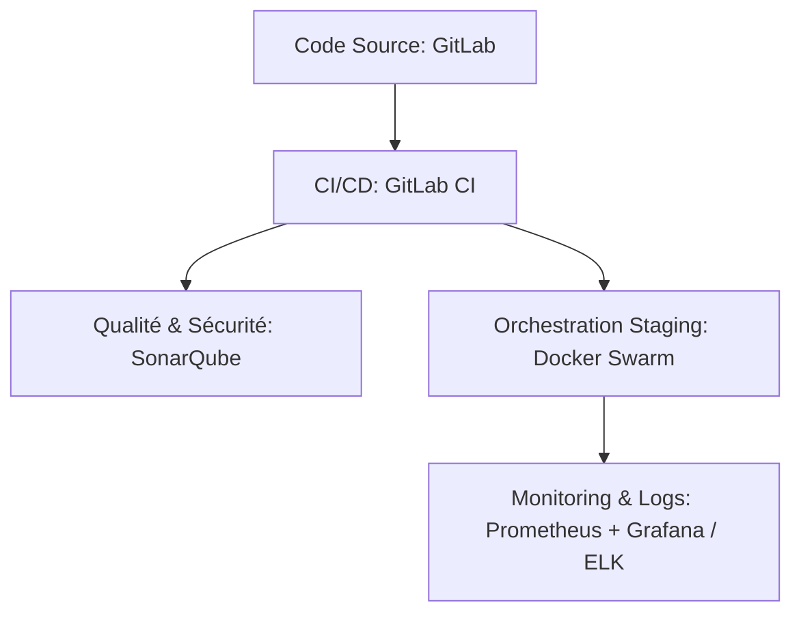

> [English Version](/posts/devops-automation-thesis) | [日本語版](/posts/devops-automation-thesis-ja)

Dans le développement logiciel moderne, la vitesse de livraison et la qualité technique du code sont souvent perçues comme deux forces contraires. D'un côté, le business exige des fonctionnalités toujours plus rapidement ; de l'autre, la stabilité opérationnelle demande de la rigueur et de multiples garde-fous. 

C'est précisément pour répondre à cette tension que j'ai mené mes travaux de recherche dans le cadre de la préparation de mon diplôme de **Manageur de Solutions Digitales et Data (MS2D)** à l'**ENI École**. Accompagné par mon tuteur en entreprise au sein de l'agence de Rennes de **mon entreprise (une ESN)**, j'ai planifié et mis en œuvre une stratégie d'automatisation globale autour d'une problématique centrale : 

> « Quelles solutions informatiques permettent d’automatiser les différentes étapes du cycle de développement d’un projet informatique afin d’améliorer la productivité des équipes ? »

Voici le retour d'expérience de cette aventure à la fois technique, organisationnelle et humaine.

---

## 1. L'état des lieux : Diagnostiquer les frictions (Audit)

Avant de foncer tête baissée dans l'écriture de scripts, il a fallu analyser l'existant. Pour réaliser ce diagnostic de manière objective, nous avons mis en œuvre une méthodologie d'audit structurée en deux piliers :
*   **Enquêtes et sondages auprès des développeurs** : Nous avons diffusé des questionnaires réguliers et mené des entretiens individuels pour cartographier le ressenti de l'équipe face au travail manuel répétitif ("toil") et identifier précisément les irritants du quotidien.
*   **Cartographie de la chaîne de valeur (Value Stream Mapping - VSM)** : Nous avons modélisé le cheminement complet d'une modification de code, depuis le commit initial sur le poste de développement jusqu'à sa livraison effective en production. Cet exercice a permis de mesurer précisément les temps de traitement, les files d'attente et les goulots d'étranglement opérationnels qui freinaient le flux de delivery :

*   **L'effet "ça marche sur ma machine"** : Sans standardisation rigoureuse des environnements, chaque développeur configurait son poste manuellement. Des disparités subtiles de versions (Node.js, runtimes Java ou bibliothèques système) provoquaient des erreurs surprises lors du déploiement.
*   **Des déploiements manuels et anxiogènes** : La mise en staging ou en production reposait sur des runbooks papier de plusieurs pages. Il fallait transférer des packages par FTP/SCP, arrêter les services manuellement, jouer les scripts SQL à la main et relancer le tout, souvent tard le soir. Une seule étape oubliée, et la livraison échouait.
*   **Une boucle de feedback trop tardive** : Faute d'exécution systématique des tests, les régressions ou les problèmes de qualité de code n'étaient découverts qu'en phase de recette (QA), voire directement en production par nos utilisateurs. Corriger un bug des semaines après son introduction s'avérait extrêmement coûteux et chronophage.
*   **Des silos Dev/Ops marqués** : Les développeurs "jetaient" leurs versions par-dessus le mur aux administrateurs système, qui devaient gérer l'infrastructure de manière isolée sans réelle visibilité sur le code applicatif.

---

## 2. Le benchmark : Faire les bons choix technologiques

Pour résoudre ces frictions, j'ai réalisé une étude comparative afin de sélectionner la chaîne d'outils la plus adaptée aux contraintes et aux compétences de notre agence. Pour ce faire, nous avons défini une matrice d'évaluation rigoureuse reposant sur plusieurs critères clés :
*   **Coûts des licences** : Privilégier des solutions open source ou intégrées sans surcoût dans nos outils existants pour éviter d'augmenter nos dépenses récurrentes.
*   **Effort opérationnel et de maintenance** : Choisir des solutions faciles à administrer et à mettre à jour au quotidien afin de ne pas surcharger nos équipes d'exploitation.
*   **Dépendance vis-à-vis des fournisseurs (Vendor lock-in)** : S'assurer que les outils et environnements s'appuient sur des technologies ouvertes pour conserver notre liberté de migration future.
*   **Courbe d'apprentissage** : Évaluer la complexité de prise en main pour les développeurs de l'agence afin de garantir une adoption rapide.
*   **Adaptabilité aux piles techniques existantes** : Garantir une compatibilité et une intégration fluides avec nos environnements actuels (Java/Spring Boot, Vue.js).



### CI/CD : Le choix de l'intégration native avec GitLab CI
Bien que Jenkins soit le vétéran de l'industrie et que GitHub Actions soit particulièrement en vogue, nous avons privilégié **GitLab CI**. Notre entreprise hébergeant déjà sa forge de code sur une instance GitLab *on-premises*, GitLab CI s'est imposé naturellement :
*   Aucun outil tiers à administrer ou sécuriser (réduction importante de la charge de maintenance par rapport à un serveur Jenkins).
*   Des pipelines déclarés sous forme de fichiers YAML (`.gitlab-ci.yml`) directement versionnés avec le code applicatif (*Pipeline-as-Code*).
*   Une interface utilisateur unifiée reliant directement les commits, les branches, les merge requests et le statut des builds.

### Orchestration : Pourquoi Docker Swarm plutôt que Kubernetes ?
**Kubernetes (K8s)** est devenu le standard de l'industrie pour l'orchestration de conteneurs, mais il présente une complexité opérationnelle et un coût d'infrastructure colossaux pour des équipes moyennes travaillant sur des projets internes. 
J'ai choisi d'adopter **Docker Swarm** pour les raisons suivantes :
*   **Courbe d'apprentissage douce** : Swarm utilise la même syntaxe déclarative que Docker Compose, outil déjà maîtrisé par nos développeurs.
*   **Légèreté et coûts réduits** : Swarm tourne directement sur le moteur Docker standard sans nécessiter une grappe de machines dédiées à l'administration du plan de contrôle.
*   **Fonctionnalités suffisantes** : Swarm gère nativement le clustering multi-nœuds, la découverte de services, l'équilibrage de charge et les *rolling updates* (déploiements progressifs sans interruption de service).

### Qualité et Observabilité : SonarQube et le duo Prometheus/Grafana
Pour la qualité et la sécurité du code, **SonarQube** a été intégré afin de fournir des retours immédiats sur la dette technique, les vulnérabilités de sécurité et la couverture des tests.
Côté production, l'observabilité a été structurée autour de **Prometheus** (pour la collecte des métriques applicatives et système via des exporters dédiés) et **Grafana** (pour la visualisation en temps réel et l'alerting sur Slack/Teams). Les logs ont quant à eux été centralisés à l'aide de la suite **ELK** (Elasticsearch, Logstash, Kibana).

---

## 3. Le projet pilote : Event (notre application événementielle interne) sur le terrain

Pour valider cette architecture, nous avons mené une expérimentation sur **Event (notre application événementielle interne)**, une application interne représentative comprenant un front-end en **Vue.js**, un back-end en **Spring Boot (Java)** et une base de données **PostgreSQL**. L'effort s'est concentré sur la migration complète du module de "Gestion des comptes utilisateurs".

> [!NOTE]
> Durant ce sprint pilote de 2 semaines, la direction a accepté un gel fonctionnel temporaire afin de permettre à l'équipe de se focaliser exclusivement sur l'ingénierie DevOps et la mise en place de la pipeline.

Voici comment nous avons résolu les principaux défis techniques rencontrés en conditions réelles :

### Défi 1 : La lenteur de la pipeline (de 20 min à 8 min)
Lors des premiers runs, la pipeline mettait près de 20 minutes à s'exécuter, principalement à cause du téléchargement systématique de toutes les dépendances logicielles et des couches de base Docker à chaque exécution.
*   **Solution** : Nous avons configuré le GitLab Runner pour mettre en cache les dossiers de dépendances (`.m2/repository` pour Maven et `node_modules` pour npm) et activé le cache des couches Docker (*Docker Layer Caching*). De plus, nous avons parallélisé l'exécution des tests unitaires backend et le build du frontend Vue.js.

Voici l'extrait correspondant de notre configuration de pipeline dans le fichier `.gitlab-ci.yml` :

```yaml
stages:
  - 🤞 test
  - 📦 build

test-backend:
  stage: 🤞 test
  image: maven:3.9-eclipse-temurin-21
  script:
    - cd back && ./mvnw $MAVEN_CLI_OPTS clean test
  cache:
    key:
      files:
        - back/pom.xml
    paths:
      - .m2/repository
    policy: pull

test-frontend:
  stage: 🤞 test
  image: node:22.11
  script:
    - cd front && npm ci && npm run coverage
  cache:
    key:
      files:
        - front/package-lock.json
    paths:
      - front/node_modules/
    policy: pull
```

Le temps de build global est ainsi tombé à **8 minutes**, rendant la boucle de feedback agréable et efficace pour l'équipe.

### Défi 2 : Les tests UI instables (*flaky tests*)
Les tests de bout en bout (E2E) sur le front-end Vue.js échouaient de manière aléatoire en raison de latences de rendu dans le navigateur sans qu'il n'y ait de réel bug applicatif.
*   **Solution** : Nous avons banni les attentes fixes (ex. `sleep 2000`) pour les remplacer par des synchronisations explicites (attentes dynamiques `waitFor` de Cypress et Playwright). De plus, nous avons implémenté un système de retry automatique (configuré à 1 rejeu en cas d'échec) afin de filtrer les faux négatifs dans la CI.

### Défi 3 : L'ordre de démarrage des services et échecs de connexion à la base de données
Lors des déploiements initiaux de notre pile de conteneurs, le conteneur contenant l'application Spring Boot démarrait plus rapidement que le moteur de base de données MySQL. L'application tentait de se connecter immédiatement à une base de données non encore opérationnelle, provoquant des échecs de connexion fatals et le crash du conteneur applicatif.
*   **Solution** : Nous avons résolu ce problème de séquencement en implémentant un bloc `healthcheck` sur la base de données à l'aide de la commande `mysqladmin ping`. Du côté du service de l'application web, nous avons configuré la directive `depends_on` avec la condition d'état `service_healthy` pour suspendre le démarrage du backend jusqu'à ce que la base de données soit pleinement opérationnelle.

Voici l'extrait correspondant de notre fichier `docker-compose.yml` :

```yaml
services:
  db:
    image: mysql:9.2.0
    restart: unless-stopped
    environment:
      MYSQL_DATABASE: app_db
      MYSQL_USER: app_user
      MYSQL_PASSWORD: app_pwd
      MYSQL_ROOT_PASSWORD: app_root_pwd
    ports:
      - "3306:3306"
    volumes:
      - db_data:/var/lib/mysql
    healthcheck:
      test: ["CMD", "mysqladmin", "ping", "-h", "localhost"]
      interval: 10s
      timeout: 5s
      retries: 5

  app:
    build:
      context: ./back
      dockerfile: Dockerfile
    ports:
      - "8080:8080"
    environment:
      SPRING_DATASOURCE_URL: "jdbc:mysql://db:3306/app_db?createDatabaseIfNotExist=true&useSSL=false&serverTimezone=UTC&allowPublicKeyRetrieval=true"
      SPRING_DATASOURCE_USERNAME: app_user
      SPRING_DATASOURCE_PASSWORD: app_pwd
      SPRING_DATASOURCE_DRIVER_CLASS_NAME: "com.mysql.cj.jdbc.Driver"
    depends_on:
      db:
        condition: service_healthy
    restart: unless-stopped
```

### Défi 4 : La dérive du schéma de base de données
Le schéma de base de données MySQL/PostgreSQL de staging différait régulièrement du schéma local des développeurs, entraînant des crashs de l'application lors des déploiements.
*   **Solution** : Nous avons intégré **Flyway** à notre processus de build et d'exécution backend. Les modifications de schéma sont désormais écrites sous forme de fichiers SQL versionnés (ex: `V1__init.sql`, `V2__add_user_roles.sql`) placés dans `src/main/resources/db/migration`. Au démarrage, Flyway compare ces fichiers avec la table de métadonnées interne (`flyway_schema_history`) et applique automatiquement les scripts manquants dans l'ordre séquentiel. Si une incohérence ou une modification non enregistrée est détectée, le conteneur backend refuse de démarrer et la pipeline de déploiement échoue, ce qui garantit qu'aucune version de code ne tourne avec une structure de base de données incompatible.

### Défi 5 : Le sous-dimensionnement de l'infrastructure
Prometheus a rapidement levé des alertes d'utilisation intensive du swap sur la VM de staging, provoquant des temps de réponse très instables de nos APIs.
*   **Solution** : En analysant les graphes d'utilisation mémoire sur Grafana, nous avons constaté que l'application Spring Boot et l'instance de base de données à l'étroit saturaient les 2 Go de RAM alloués à la VM. La mémoire a été portée à **4 Go**, ce qui a immédiatement stabilisé les performances et résolu les lenteurs.

---

## 4. Les résultats : La preuve par les chiffres (DORA & Qualité)

Les résultats recueillis après plusieurs sprints d'exploitation du module pilote sont éloquents. Ils démontrent de manière concrète l'impact de l'automatisation sur l'efficacité de nos processus et la qualité de nos livrables :

| Métrique | Avant | Après | Impact |
| :--- | :---: | :---: | :---: |
| **Lead Time** (Temps de cycle commit -> prod) | ~3 jours | **< 24 heures** | Cycles divisés par 3 |
| **Fréquence d'intégration** (Merges / jour) | ~0.4 (2 par semaine) | **2.0 (par jour)** | Intégration continue adoptée |
| **Couverture de tests** (Backend Spring Boot) | 55% | **70%** | Filet de sécurité renforcé |
| **Dette technique** (SonarQube) | Référence | **-15%** | Refactoring proactif |
| **Taux de succès des déploiements** | Aléatoire | **100% (sur 7 déploiements)** | Procédures fiabilisées |

Ces indicateurs s'alignent directement sur les métriques clés de l'organisme **DORA** (DevOps Research and Assessment). Nous avons prouvé qu'il est possible d'accélérer le rythme de livraison tout en augmentant drastiquement la qualité et la stabilité de l'application.

---

## 5. Perspectives : Vers où allons-nous ?

La généralisation de cette stratégie à l'ensemble des équipes de notre entreprise est en cours sur une feuille de route de 9 à 12 mois. Mais à plus long terme, de formidables perspectives s'ouvrent à nous :

1.  **Platform Engineering & Self-Service** : Notre but est de créer un portail interne (*Internal Developer Platform*) ou d'implémenter des commandes *ChatOps* (via Slack ou Teams). Un développeur pourra ainsi provisionner un environnement de test éphémère ou déclencher une recette d'un simple clic sans avoir à maîtriser la tuyauterie Docker ou Terraform sous-jacente.
2.  **DevSecOps de pointe** : Nous prévoyons de pousser la sécurité encore plus à gauche (*Shift-Left*) en intégrant des scans de vulnérabilités automatiques sur les images Docker tierces avec Harbor, des analyses de composition logicielle (SCA) et des scans d'Infrastructure as Code sur nos scripts Terraform pour interdire l'exposition de ressources vulnérables.
3.  **NoOps & Auto-remédiation** : Connecter notre système de monitoring Prometheus à notre orchestrateur Docker Swarm ou Kubernetes pour initier des actions automatiques. Par exemple, si une surcharge est détectée, le système pourra décider de déployer automatiquement des instances supplémentaires (*auto-scaling*) ou de redémarrer un conteneur défaillant (*auto-healing*) sans intervention humaine.
4.  **Mises à jour automatisées des dépendances** : Afin de réduire le risque de failles de sécurité et la dette technique liée aux bibliothèques obsolètes, nous déployons **Renovate Bot**. Ce robot analyse de manière continue nos fichiers de dépendances (`pom.xml` pour Java/Maven et `package.json` pour Vue.js/npm) et ouvre automatiquement des requêtes d'intégration (Merge Requests). Pour éviter le spam de notifications, les mises à jour sont regroupées automatiquement par écosystème grâce à des règles personnalisées.

Voici un exemple de notre configuration `renovate.json` :

```json
{
  "$schema": "https://docs.renovatebot.com/renovate-schema.json",
  "extends": ["config:recommended"],
  "dependencyDashboard": true,
  "timezone": "Europe/Paris",
  "baseBranches": ["develop"],
  "packageRules": [
    {
      "includePaths": ["back/**"],
      "matchManagers": ["maven"],
      "groupName": "javaDependencies",
      "assignees": ["@dev.lead"],
      "separateMinorPatch": true
    },
    {
      "includePaths": ["front/**"],
      "matchManagers": ["npm"],
      "groupName": "javascriptDependencies",
      "assignees": ["@dev.lead"],
      "separateMinorPatch": true
    }
  ]
}
```

---

## Conclusion

Ce travail de mémoire a démontré que l'automatisation n'est pas qu'un ensemble d'outils à la mode : c'est un véritable levier de performance économique et humaine pour l'entreprise. En libérant les ingénieurs des tâches manuelles, répétitives et anxiogènes, nous leur permettons de se recentrer sur leur cœur de métier : concevoir et développer de la valeur pour nos clients. 

Le chemin vers le DevOps est un voyage d'amélioration continue où la culture de collaboration et l'apprentissage par l'expérience importent tout autant que la technologie choisie.

---
*Un grand merci au directeur de notre agence, à mon tuteur en entreprise, ainsi qu'à toute l'équipe pédagogique de l'ENI École pour leur soutien tout au long de la rédaction de ce mémoire.*
