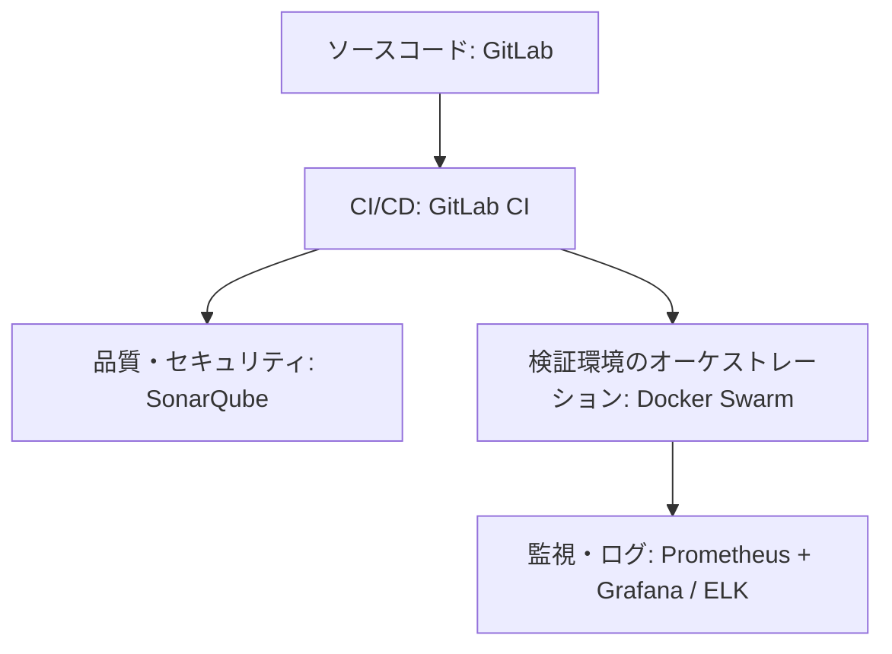

> [English Version](/posts/devops-automation-thesis) | [Version Française](/posts/devops-automation-thesis-fr)

ソフトウェア開発では、リリースの速さとコードの品質は相反するものとして語られがちだ。ビジネス側はとにかく早く機能を出したい。一方で運用の安定性には、それなりの厳格さと安全策が要る。

このジレンマに向き合うため、**ENI École** の **Manageur de Solutions Digitales et Data (MS2D)** という修士課程の一環として、この研究に取り組んだ。自分の会社(ITサービス企業)のレンヌ支店で、メンターに支えてもらいながら、次の問いを軸に会社全体の自動化戦略を計画・実行した。

> 「開発チームの生産性を向上させるために、ソフトウェア開発ライフサイクル（SDLC）の各フェーズを自動化できるソフトウェアソリューションにはどのようなものがあるか？」

技術的にも、組織的にも、そして人間的にも濃かったこの取り組みの振り返りを書いていく。

---

## 1. 摩擦の診断：まず現状を見る

やみくもにスクリプトを書き始める前に、まず既存のプロセスを分析する必要があった。この診断を客観的に行うため、2本の柱からなる監査手法を使った。
*   **開発者へのアンケートとヒアリング**：定期的なアンケートの送付や個別面談を実施し、反復的な手作業（いわゆる「トイル」）に対するチームの所感を聞き取り、日々の具体的なペインポイントを正確に特定しました。
*   **バリューストリームマッピング（VSM）**：開発環境での最初のコミットから、本番環境への実際のデプロイに至るまでのコード変更の全プロセスを可視化しました。この取り組みにより、デリバリーフローを遅らせている処理時間、待ち時間、および運用のボトルネックを測定することができました。

結果として、以下のような課題が浮き彫りになりました。

*   **「手元の環境では動く」問題（It works on my machine）**：環境の厳密な標準化が行われていなかったため、各開発者はローカルマシンを手動で設定していました。その結果、Node.jsやJavaランタイム、あるいはシステムライブラリなどの微細なバージョンの違いが、デプロイ時の予期せぬエラーを引き起こしていました。
*   **手動による不安の募るデプロイ**：ステージングや本番へのリリースは、何ページにも及ぶ紙の手順書（ランブック）に頼っていました。FTPやSCPでパッケージを転送し、手動でサービスを停止し、SQLスクリプトを手動で実行し、すべてを再起動する。しかも多くの場合、深夜に行っていました。手順を一つでも間違えれば、リリースは即座に失敗しました。
*   **遅すぎるフィードバックループ**：テストの自動実行の仕組みがなかったため、デグレード（先祖返り）やコード品質の不具合はQAフェーズになって初めて発覚するか、最悪の場合は本番環境のユーザーによって発見されていました。バグが発生してから数週間後に修正するのは、コストも時間もかかる話でした。
*   **深刻なDevとOpsのサイロ化**：開発者は完成したリリース物件を「壁の向こう」のシステム管理者に放り投げるだけであり、システム管理者はアプリケーションコードの中身を一切把握できないまま、孤立してインフラを運用せざるを得ませんでした。

---

## 2. ベンチマーク：どのツールを選ぶか

これらの課題を解決するため、会社の制約や開発チームのスキルセットに合ったツールチェーンを選ぶ比較調査を行った。評価にあたっては、いくつかの基準からなるマトリックスを定義した。
*   **ライセンス費用**：ランニングコストの増加を避けるため、オープンソースのソリューション、あるいは既存のツールに追加コストなしで統合されているものを優先する。
*   **運用およびメンテナンスの工数**：インフラ運用チームの負荷軽減のため、日々の管理や更新が容易なソリューションを選択する。
*   **ベンダーロックイン**：将来的な移行の自由を確保するため、ツールや環境がオープンな標準技術に基づいていることを確認する。
*   **学習コスト**：開発メンバーが迅速にキャッチアップできるよう、学習の難易度を評価する。
*   **既存の技術スタックへの適応性**：現在のシステム環境（Java / Spring Boot、Vue.js）とスムーズに連携・統合できることを保証する。



### CI/CD：GitLab CIを選んだ理由
業界のベテランであるJenkinsや、人気の高いGitHub Actionsも検討したが、最終的には **GitLab CI** を選んだ。当社はすでにオンプレミスのGitLabインスタンスでソースコードを管理していたので、GitLab CIの採用は自然な流れだった。
*   管理やセキュリティ対策が必要なサードパーティ製ツールが増えない（Jenkinsサーバーを自社で運用する場合と比較して、保守工数を大幅に削減可能）。
*   パイプラインの定義が YAML ファイル（`.gitlab-ci.yml`）で行われ、アプリケーションコードと同時にバージョン管理できる（*Pipeline-as-Code*）。
*   コミット、ブランチ、マージリクエスト、ビルドステータスが一元化された直感的なUIでリンクしている。

### オーケストレーション：なぜKubernetesではなくDocker Swarmなのか
**Kubernetes（K8s）** はコンテナオーケストレーションの業界標準になっているが、社内プロジェクトを扱う中規模チームには、インフラコストと運用の複雑さがどうしても大きすぎた。

そこで、次の理由から **Docker Swarm** を採用した。
*   **緩やかな学習曲線（低い学習コスト）**：Swarmは、開発チームが日常的に使用していたDocker Composeと同じ宣言的な構文を使用します。
*   **軽量かつ低コスト**：コントロールプレーンの管理用に専用のマシンクラスターを必要とせず、標準のDockerエンジン上で直接動作します。
*   **十分な機能セット**：マルチノードクラスタリング、サービス検出、ロードバランシング、ローリングアップデート（ダウンタイムゼロの段階的デプロイ）などの必須機能を標準で備えています。

### 品質とオブザーバビリティ：SonarQube、Prometheus、Grafana
コードの品質向上とセキュリティ強化のため、技術的負債や脆弱性、テストカバレッジに関するフィードバックをすぐ得られるよう **SonarQube** を統合した。

本番環境側のオブザーバビリティ（可観測性）は、**Prometheus**（専用のエクスポーター経由でアプリケーションとシステムのメトリクスを収集）と **Grafana**（リアルタイムの可視化とSlack/Teamsへのアラート通知）を中心に組み立てた。ログの集約には **ELKスタック**（Elasticsearch, Logstash, Kibana）を使った。

---

## 3. パイロットプロジェクト：Eventで実戦検証

このアーキテクチャを検証するため、Vue.jsのフロントエンド、Spring Boot (Java)のバックエンド、PostgreSQL/MySQLデータベースで構成される社内アプリケーション **Event (社内イベント管理アプリケーション)** を使って実証実験を行った。「ユーザーアカウント管理」モジュールの完全な移行に絞って取り組んだ。

> [!NOTE]
> この2週間のパイロットスプリント期間中、開発チームがDevOpsエンジニアリングとパイプラインの構築に専念できるよう、マネジメント側は一時的な新規機能開発の凍結（フィーチャーフリーズ）を承諾してくれました。

現場で実際にぶつかった主な技術的課題と、その解決策をまとめる。

### 課題1：パイプライン実行の遅さ（20分から8分へ）
最初のビルド時、パイプラインの完了に約20分もかかっていました。原因のほとんどは、Maven依存関係のダウンロードと、Dockerレイヤーのビルドが毎回ゼロから行われていたためでした。
*   **解決策**：GitLab Runnerを設定して `.m2/repository` ディレクトリをキャッシュするようにし、Dockerレイヤーキャッシュ（Docker Layer Caching）を有効にしました。さらに、バックエンドのユニットテストの実行とVue.jsフロントエンドのビルドを並列化しました。

`.gitlab-ci.yml` ファイルにおけるパイプライン設定の該当スニペットは以下の通りです。

```yaml
stages:
  - 🤞 test
  - 📦 build

test-backend:
  stage: 🤞 test
  image: maven:3.9-eclipse-temurin-21
  script:
    - cd back && ./mvnw $MAVEN_CLI_OPTS clean test
  cache:
    key:
      files:
        - back/pom.xml
    paths:
      - .m2/repository
    policy: pull

test-frontend:
  stage: 🤞 test
  image: node:22.11
  script:
    - cd front && npm ci && npm run coverage
  cache:
    key:
      files:
        - front/package-lock.json
    paths:
      - front/node_modules/
    policy: pull
```

これでビルド時間全体が **8分** まで短縮され、チームにとってフィードバックループがかなり快適になった。

### 課題2：不安定なUIテスト（flaky tests）
Vue.jsフロントエンドでのエンドツーエンド（E2E）テストで、実際のバグがないのにブラウザの描画遅延が原因でランダムに失敗する事象が発生した。
*   **解決策**：固定時間の待機（例: `sleep 2000`）を禁止し、明示的な同期処理（CypressやPlaywrightの動的な `waitFor` 命令）に置き換えた。CIでの誤検知を防ぐため、自動リトライ（失敗時に1回だけ再実行）も入れた。

### 課題3：サービスの起動順序とデータベース接続の失敗
コンテナスタックの初期デプロイ時、Spring Bootアプリケーションのコンテナがデータベースエンジンよりも先に起動してしまう問題が発生しました。アプリケーションはまだ立ち上がっていないデータベースに対して即座に接続を試みるため、致命的な接続エラーを吐いてコンテナがクラッシュを繰り返していました。
*   **解決策**：データベースに `mysqladmin ping` コマンドを使用した `healthcheck` ブロックを実装することで、起動の順序制御を行いました。アプリケーション側では、`depends_on` ディレクティブの `condition: service_healthy` オプションを設定し、データベースが完全に準備完了（Healthy）状態になるまでバックエンドの起動を待機させるようにしました。

`docker-compose.yml` ファイルの該当スニペットは以下の通りです。

```yaml
services:
  db:
    image: mysql:9.2.0
    restart: unless-stopped
    environment:
      MYSQL_DATABASE: app_db
      MYSQL_USER: app_user
      MYSQL_PASSWORD: app_pwd
      MYSQL_ROOT_PASSWORD: app_root_pwd
    ports:
      - "3306:3306"
    volumes:
      - db_data:/var/lib/mysql
    healthcheck:
      test: ["CMD", "mysqladmin", "ping", "-h", "localhost"]
      interval: 10s
      timeout: 5s
      retries: 5

  app:
    build:
      context: ./back
      dockerfile: Dockerfile
    ports:
      - "8080:8080"
    environment:
      SPRING_DATASOURCE_URL: "jdbc:mysql://db:3306/app_db?createDatabaseIfNotExist=true&useSSL=false&serverTimezone=UTC&allowPublicKeyRetrieval=true"
      SPRING_DATASOURCE_USERNAME: app_user
      SPRING_DATASOURCE_PASSWORD: app_pwd
      SPRING_DATASOURCE_DRIVER_CLASS_NAME: "com.mysql.cj.jdbc.Driver"
    depends_on:
      db:
        condition: service_healthy
    restart: unless-stopped
```

### 課題4：データベーススキーマのドリフト
ステージング環境のデータベーススキーマが、開発者のローカル環境のスキーマと頻繁に乖離してしまい、デプロイ時にアプリケーションがクラッシュする原因となっていました。
*   **解決策**：バックエンドのビルドおよび実行プロセスに **Flyway** を統合しました。スキーマの変更は、バージョン管理されたSQLファイル（例: `V1__init.sql`, `V2__add_user_roles.sql`）として作成し、`src/main/resources/db/migration` に配置します。起動時にFlywayがこれらのファイルとデータベース内の管理用テーブル（`flyway_schema_history`）を比較し、適用されていないスクリプトを順次自動で実行します。不整合や未登録の変更が検出された場合、バックエンドコンテナは起動を拒否し、デプロイパイプラインは異常終了します。これにより、スキーマとコードの整合性が保証されないまま稼働するリスクを未然に防いでいます。

### 課題5：インフラのリソース不足
Prometheusが、ステージング用仮想マシン（VM）のSWAP使用率に関する警告アラートを頻繁に発報し、APIのレスポンスタイムが著しく不安定になっていました。
*   **解決策**：Grafanaでメモリ使用率の推移を分析したところ、Spring Bootアプリケーションとデータベースインスタンスが、割り当てられていた2GBのRAMをほぼすべて使い切っていることが判明しました。そこでRAMを **4GB** にアップグレードしたところ、即座にパフォーマンスが安定し、動作の遅延も解消されました。

---

## 4. 結果：DORAメトリクスと品質

数スプリント運用したあとの変化はこうだ。

| メトリクス | 導入前 | 導入後 | 効果・インパクト |
| :--- | :---: | :---: | :---: |
| **リードタイム** (コミットから本番反映までの時間) | 約3日間 | **24時間未満** | サイクルタイムを3分の1に短縮 |
| **デプロイ頻度** (1日あたりのマージ数) | 約0.4回 (週2回) | **2.0回 (1日あたり)** | 継続的インテグレーションの定着 |
| **テストカバレッジ** (Spring Boot バックエンド) | 55% | **70%** | セーフティネットの強化 |
| **技術的負債** (SonarQube) | 基準値 | **-15%** | プロアクティブなリファクタリング |
| **デプロイ成功率** | 不安定 | **100% (7回以上のデプロイで実績)** | 手順の信頼性向上 |

これらの指標は、**DORA**（DevOps Research and Assessment）が追っているメトリクスとそのまま重なる。リリースを速めながら、アプリケーションを大きく安定させられることを実証できた。

---

## 5. この先どうするか

この自動化戦略を全開発チームへ横展開する計画が、9〜12ヶ月のロードマップで進行中だ。その先で考えているのはこのあたり。

1.  **プラットフォームエンジニアリングとセルフサービス**：私たちの目標は、内部開発者プラットフォーム（IDP：Internal Developer Platform）の構築や、Slack/Teamsを介した *ChatOps* コマンドの実装です。これにより、開発者はDockerやTerraformといった低レイヤーの仕組みを深く理解していなくても、ワンクリックで一時的なテスト環境を立ち上げたり、テストを実行したりできるようになります。
2.  **高度なDevSecOpsの実践**：Harborによるサードパーティ製Dockerイメージの自動脆弱性スキャン、ソフトウェア構成分析（SCA：Software Composition Analysis）、およびTerraformスクリプトに対するInfrastructure as Code（IaC）スキャンなどをパイプラインに統合し、セキュリティ対策をより開発プロセスの初期段階に組み込む「シフトレフト（Shift-Left）」を推進します。
3.  **NoOpsと自己修復（Auto-Remediation）**：Prometheusによる監視システムをDocker SwarmやKubernetesといったオーケストレーターと直接連携させ、自動的に対処する仕組みを作ります。たとえば、高負荷を検知した際にインスタンスを自動拡張（オートスケーリング）したり、異常が発生したコンテナを自動で再起動（自己修復：オートヒーリング）したりする動作を、人手を介さずに行えるようにします。
4.  **依存関係の自動アップデート**：ライブラリが古くなることで生じるセキュリティ脆弱性や技術的負債のリスクを軽減するため、**Renovate Bot** を導入しています。このボットは、依存関係ファイル（Java / Maven用の `pom.xml` や Vue.js / npm用の `package.json`）を継続的に分析し、自動でマージリクエスト（Merge Requests）を作成します。通知スパムを防ぐため、カスタムルールを用いてエコシステムごとに更新を自動でグループ化するように設定しています。

`renovate.json` の設定例は以下の通りです。

```json
{
  "$schema": "https://docs.renovatebot.com/renovate-schema.json",
  "extends": ["config:recommended"],
  "dependencyDashboard": true,
  "timezone": "Europe/Paris",
  "baseBranches": ["develop"],
  "packageRules": [
    {
      "includePaths": ["back/**"],
      "matchManagers": ["maven"],
      "groupName": "javaDependencies",
      "assignees": ["@dev.lead"],
      "separateMinorPatch": true
    },
    {
      "includePaths": ["front/**"],
      "matchManagers": ["npm"],
      "groupName": "javascriptDependencies",
      "assignees": ["@dev.lead"],
      "separateMinorPatch": true
    }
  ]
}
```

---

## 結論

この修士論文を通じて分かったのは、自動化は単に流行りのツールを入れることじゃなくて、経済的にも、そこで働く人にとっても、ちゃんと効果があるということだ。手作業で反復的、しかも不安の募る業務からエンジニアを解放すれば、設計や開発というクライアントに価値を届ける本業に集中できるようになる。

DevOpsに終わりはない。ずっと調整し続けるものだし、そこで培う文化や学びは、どのツールを選ぶかと同じくらい大事だ。

---
*本論文の執筆にあたり、多大なるご支援をいただいた支店長、企業でのメンター、ならびに ENI École の教育チームの皆様に、心より感謝申し上げます。*
