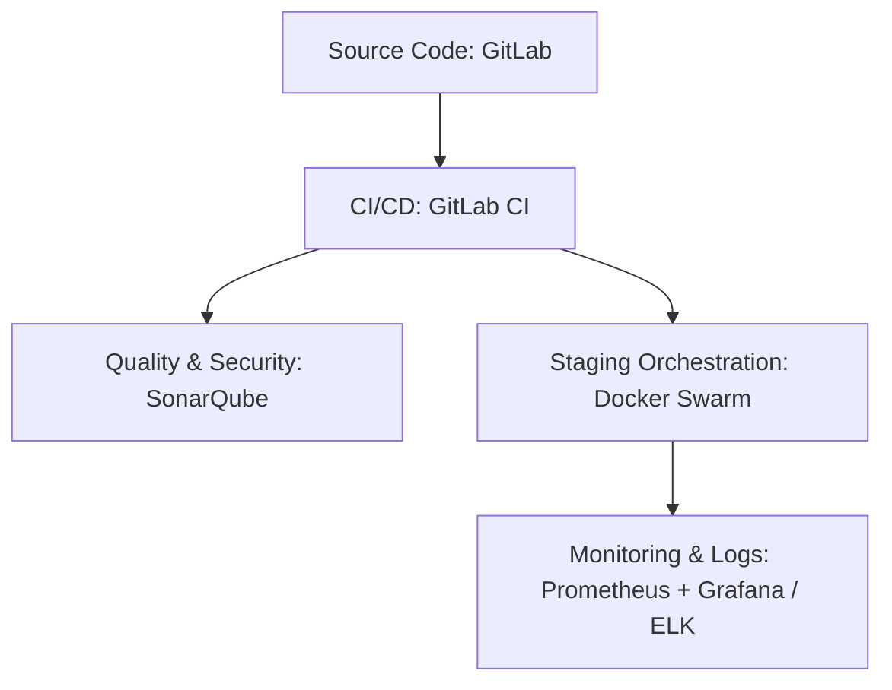

> [Version Française](/posts/devops-automation-thesis-fr) | [日本語版](/posts/devops-automation-thesis-ja)

In software development, delivery speed and code quality often feel like opposing forces. The business wants features faster and faster, while operational stability demands rigor and safeguards.

To work through that tension, I did this research as part of my **Manageur de Solutions Digitales et Data (MS2D)** master's degree at **ENI École**. With support from my mentor at my company's Rennes office (we do IT services), I planned and rolled out a company-wide automation strategy built around one question:

> "What software solutions can automate the various stages of a software development lifecycle to improve team productivity?"

Here's the retrospective of that adventure, technical, organizational, and human all at once.

---

## 1. Diagnosing friction: where things stood

Before rushing headfirst into writing scripts, we had to analyze our existing processes. To carry out this diagnosis objectively, we implemented an audit methodology structured around two pillars:
*   **Developer surveys**: We regularly sent questionnaires and conducted individual interviews to map the team's feedback regarding repetitive manual work ("toil") and to precisely identify daily pain points.
*   **Value Stream Mapping (VSM)**: We modeled the complete path of a code change, from the initial commit on the development workstation to its actual release in production. This exercise allowed us to measure processing times, wait times, and operational bottlenecks that slowed down our delivery flow:

*   **The "it works on my machine" effect**: Without rigorous environment standardization, each developer configured their local machine manually. Subtle version discrepancies (Node.js, Java runtimes, or system libraries) led to surprise errors during deployment.
*   **Manual and anxiety-inducing deployments**: Releasing to staging or production relied on multi-page paper runbooks. We had to transfer packages via FTP/SCP, stop services manually, run SQL scripts by hand, and restart everything, often late at night. Skipping a single step meant the release failed.
*   **Delayed feedback loop**: Without systematic test execution, regressions or code quality issues were only discovered during the QA phase, or worse, directly in production by our users. Fixing a bug weeks after it was introduced was costly and slow.
*   **Pronounced Dev/Ops silos**: Developers would "throw" their releases over the wall to system administrators, who had to manage the infrastructure in isolation without any real visibility into the application code.

---

## 2. The benchmark: picking the tools

To resolve these pain points, I ran a comparative study to select the toolchain best suited to our company's constraints and team skills. We defined an evaluation matrix based on a few criteria:
*   **Licensing costs**: Prioritizing open-source solutions or tools integrated at no extra cost into our existing software to avoid increasing recurring expenses.
*   **Operational and maintenance effort**: Choosing solutions that are easy to administer and update daily to avoid overloading our operations teams.
*   **Vendor lock-in**: Ensuring that tools and environments rely on open technologies to preserve our freedom to migrate in the future.
*   **Learning curve**: Evaluating the complexity of adoption for our agency's developers to guarantee quick onboarding.
*   **Adaptability to existing tech stacks**: Ensuring smooth compatibility and integration with our current environments (Java/Spring Boot, Vue.js).



### CI/CD: going with GitLab CI
Although Jenkins is the industry veteran and GitHub Actions is highly popular, we prioritized **GitLab CI**. Since our company already hosted its source code on an on-premises GitLab instance, GitLab CI was a natural fit:
*   No third-party tools to manage or secure (significantly reducing the maintenance overhead compared to a Jenkins server).
*   Pipelines declared as YAML files (`.gitlab-ci.yml`) versioned directly alongside the application code (*Pipeline-as-Code*).
*   A unified user interface linking commits, branches, merge requests, and build status together.

### Orchestration: why Docker Swarm instead of Kubernetes?
**Kubernetes (K8s)** is the industry standard for container orchestration, but it brings a lot of operational complexity and infrastructure cost for mid-sized teams working on internal projects.

I chose to adopt **Docker Swarm** for the following reasons:
*   **Gentle learning curve**: Swarm uses the same declarative syntax as Docker Compose, a tool our developers were already familiar with.
*   **Lightweight and cost-effective**: Swarm runs directly on the standard Docker engine without requiring a dedicated cluster of machines to manage the control plane.
*   **Sufficient feature set**: Swarm natively handles multi-node clustering, service discovery, load balancing, and rolling updates (progressive deployments with zero downtime).

### Quality and observability: SonarQube, Prometheus, and Grafana
For code quality and security, **SonarQube** was integrated to provide immediate feedback on technical debt, security vulnerabilities, and test coverage.

On the production side, observability was structured around **Prometheus** (collecting application and system metrics via dedicated exporters) and **Grafana** (for real-time visualization and alerting on Slack/Teams). Logs were centralized using the **ELK** suite (Elasticsearch, Logstash, Kibana).

---

## 3. The pilot project: Event, in the field

To validate this architecture, we ran an experiment on **Event (our internal event-planning application)**, a representative internal application consisting of a **Vue.js** frontend, a **Spring Boot (Java)** backend, and a **PostgreSQL** database. The effort focused on the complete migration of the "User Account Management" module.

> [!NOTE]
> During this 2-week pilot sprint, management agreed to a temporary feature freeze, allowing the team to focus exclusively on DevOps engineering and pipeline setup.

Here's how we solved the main technical challenges we hit in the field:

### Challenge 1: Slow Pipeline Runs (from 20 min to 8 min)
During initial runs, the pipeline took nearly 20 minutes to complete, mostly due to systematically downloading Maven dependencies and rebuilding Docker layers from scratch. 
*   **Solution**: We configured the GitLab Runner to cache the `.m2/repository` directory and enabled Docker Layer Caching. Finally, we parallelized the execution of backend unit tests and the Vue.js frontend build.

Here is the corresponding snippet of our pipeline configuration in the `.gitlab-ci.yml` file:

```yaml
stages:
  - 🤞 test
  - 📦 build

test-backend:
  stage: 🤞 test
  image: maven:3.9-eclipse-temurin-21
  script:
    - cd back && ./mvnw $MAVEN_CLI_OPTS clean test
  cache:
    key:
      files:
        - back/pom.xml
    paths:
      - .m2/repository
    policy: pull

test-frontend:
  stage: 🤞 test
  image: node:22.11
  script:
    - cd front && npm ci && npm run coverage
  cache:
    key:
      files:
        - front/package-lock.json
    paths:
      - front/node_modules/
    policy: pull
```

Overall build times dropped to **8 minutes**, and the feedback loop became a lot less painful for the team.

### Challenge 2: flaky UI tests
End-to-end (E2E) tests on the Vue.js frontend failed randomly due to browser rendering latencies, without any actual bugs in the code.
*   **Solution**: We banned fixed wait times (e.g., `sleep 2000`) and replaced them with explicit synchronizations (dynamic `waitFor` statements in Cypress and Playwright). We also added an automatic retry system (1 retry on failure) to filter out false negatives in the CI.

### Challenge 3: service startup order and database connection failures
During initial deployments of our container stack, the Spring Boot application container started faster than the database engine. The application attempted to connect immediately to a database that was not yet operational, resulting in fatal connection failures and container crashes.
*   **Solution**: We resolved this sequencing issue by implementing a `healthcheck` block on the database using the `mysqladmin ping` command. On the web application side, we configured the `depends_on` directive with the `service_healthy` condition to delay the backend startup until the database is fully operational.

Here is the corresponding snippet from our `docker-compose.yml` file:

```yaml
services:
  db:
    image: mysql:9.2.0
    restart: unless-stopped
    environment:
      MYSQL_DATABASE: app_db
      MYSQL_USER: app_user
      MYSQL_PASSWORD: app_pwd
      MYSQL_ROOT_PASSWORD: app_root_pwd
    ports:
      - "3306:3306"
    volumes:
      - db_data:/var/lib/mysql
    healthcheck:
      test: ["CMD", "mysqladmin", "ping", "-h", "localhost"]
      interval: 10s
      timeout: 5s
      retries: 5

  app:
    build:
      context: ./back
      dockerfile: Dockerfile
    ports:
      - "8080:8080"
    environment:
      SPRING_DATASOURCE_URL: "jdbc:mysql://db:3306/app_db?createDatabaseIfNotExist=true&useSSL=false&serverTimezone=UTC&allowPublicKeyRetrieval=true"
      SPRING_DATASOURCE_USERNAME: app_user
      SPRING_DATASOURCE_PASSWORD: app_pwd
      SPRING_DATASOURCE_DRIVER_CLASS_NAME: "com.mysql.cj.jdbc.Driver"
    depends_on:
      db:
        condition: service_healthy
    restart: unless-stopped
```

### Challenge 4: database schema drift
The staging database schema frequently drifted from the developers' local schemas, causing application crashes during deployments.
*   **Solution**: We integrated **Flyway** into our backend build and execution process. Schema changes are now written as versioned SQL files (e.g., `V1__init.sql`, `V2__add_user_roles.sql`) placed in `src/main/resources/db/migration`. On startup, Flyway compares these files with the internal metadata table (`flyway_schema_history`) and automatically applies missing scripts in sequential order. If an inconsistency or undocumented change is detected, the backend container refuses to start and the deployment pipeline fails, ensuring that no code version runs with an incompatible database structure.

### Challenge 5: under-dimensioned infrastructure
Prometheus quickly triggered swap usage alerts on the staging VM, causing highly unstable API response times.
*   **Solution**: Analyzing memory usage graphs in Grafana revealed that the Spring Boot application and the database instance were tightly constrained, saturating the VM's 2 GB of allocated RAM. The RAM was upgraded to **4 GB**, which immediately stabilized performance and resolved the slowdowns.

---

## 4. Results: DORA metrics and quality

Here's what changed after running the pilot module for several sprints:

| Metric | Before | After | Impact |
| :--- | :---: | :---: | :---: |
| **Lead Time** (Commit-to-production cycle time) | ~3 days | **< 24 hours** | Cycles divided by 3 |
| **Deployment Frequency** (Merges / day) | ~0.4 (2 per week) | **2.0 (per day)** | Continuous integration adopted |
| **Test Coverage** (Backend Spring Boot) | 55% | **70%** | Strengthened safety net |
| **Technical Debt** (SonarQube) | Baseline | **-15%** | Proactive refactoring |
| **Deployment Success Rate** | Unpredictable | **100% (over 7 deployments)** | Reliable procedures |

These indicators map directly onto the metrics tracked by **DORA** (DevOps Research and Assessment). We proved it's possible to speed up delivery while also making the application meaningfully more stable.

---

## 5. What's next

Rolling this strategy out across the rest of the company's teams is underway, on a 9-to-12-month roadmap. Beyond that, here's what's on the radar:

1.  **Platform Engineering & Self-Service**: Our goal is to build an Internal Developer Platform (IDP) or implement *ChatOps* commands (via Slack or Teams). This will allow developers to provision ephemeral test environments or trigger a test run with a single click, without needing to master the underlying Docker or Terraform plumbing.
2.  **Advanced DevSecOps**: We plan to shift security further left (*Shift-Left*) by integrating automated vulnerability scans on third-party Docker images using Harbor, Software Composition Analysis (SCA), and Infrastructure as Code (IaC) scanning on our Terraform scripts to prevent exposing vulnerable resources.
3.  **NoOps & Auto-Remediation**: Connecting our Prometheus monitoring system to our Docker Swarm or Kubernetes orchestrator to trigger automated actions. For example, if a high load is detected, the system could automatically deploy additional instances (*auto-scaling*) or restart a failing container (*auto-healing*) without human intervention.
4.  **Automated Dependency Updates**: To reduce the risk of security vulnerabilities and technical debt associated with outdated libraries, we are deploying **Renovate Bot**. This bot continuously analyzes our dependency files (`pom.xml` for Java/Maven and `package.json` for Vue.js/npm) and automatically opens integration requests (Merge Requests). To prevent notification spam, updates are automatically grouped by ecosystem using custom rules.

Here is an example of our `renovate.json` configuration:

```json
{
  "$schema": "https://docs.renovatebot.com/renovate-schema.json",
  "extends": ["config:recommended"],
  "dependencyDashboard": true,
  "timezone": "Europe/Paris",
  "baseBranches": ["develop"],
  "packageRules": [
    {
      "includePaths": ["back/**"],
      "matchManagers": ["maven"],
      "groupName": "javaDependencies",
      "assignees": ["@dev.lead"],
      "separateMinorPatch": true
    },
    {
      "includePaths": ["front/**"],
      "matchManagers": ["npm"],
      "groupName": "javascriptDependencies",
      "assignees": ["@dev.lead"],
      "separateMinorPatch": true
    }
  ]
}
```

---

## Conclusion

What this thesis work showed me is that automation isn't just about adopting trendy tools, it actually pays off, economically and for the people doing the work. Freeing engineers from manual, repetitive, anxiety-inducing tasks lets them get back to what they're actually good at: building things our clients value.

DevOps isn't something you finish. You keep tuning it, and the culture and lessons picked up along the way matter as much as which tools you pick.

---
*Many thanks to the director of our agency, to my company mentor, and the entire pedagogical team at ENI École for their support throughout the writing of this thesis.*
