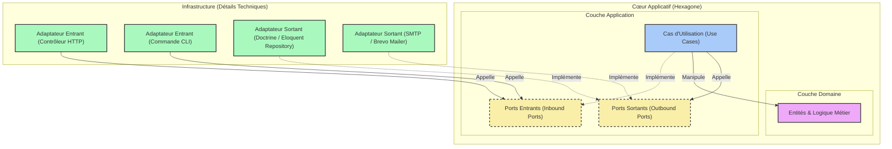

> [English Version](/posts/hexagonal-architecture)

L'architecture logicielle est souvent reléguée au second plan lors des phases initiales d'un projet. On privilégie la vitesse de livraison, l'utilisation de frameworks tout-en-un, et le développement rapide de fonctionnalités. Cependant, à mesure que l'application grandit, les coûts de maintenance s'envolent, les régressions se multiplient, et le code métier se retrouve inextricablement couplé aux détails techniques comme la base de données, les bibliothèques tierces, ou le framework lui-même.

C'est ici qu'intervient **l'Architecture Hexagonale** (également connue sous le nom de *Ports & Adapters*). Théorisée par Alistair Cockburn en 2005, elle propose de structurer l'application de manière à isoler la logique métier des détails d'infrastructure.

Dans cet article, nous allons comprendre pourquoi l'architecture traditionnelle pose problème, explorer en détail les concepts de l'architecture hexagonale, et voir comment elle résout les limites des approches couplées classiques.

---

## 1. Le Constat de départ – Le Code Couplé (Legacy Pain)

Pour comprendre l'intérêt de l'architecture hexagonale, analysons un exemple typique de code hérité ("legacy"). Imaginons un contrôleur PHP classique gérant l'inscription d'un utilisateur au sein d'une application web.

Voici le genre de code que l'on retrouve fréquemment dans de nombreux projets :

```php
<?php

namespace App\Http\Controllers;

use App\Models\User;
use Illuminate\Http\Request;
use PHPMailer\PHPMailer\PHPMailer;
use PHPMailer\PHPMailer\Exception;

class RegistrationController extends Controller
{
    public function register(Request $request)
    {
        // 1. Validation HTTP directe
        $request->validate([
            'username' => 'required|string|max:255|unique:users',
            'email' => 'required|email|max:255|unique:users',
            'password' => 'required|string|min:8',
        ]);

        // 2. Logique métier + Persistance (Eloquent ORM couplé)
        $user = new User();
        $user->username = $request->input('username');
        $user->email = $request->input('email');
        $user->password = password_hash($request->input('password'), PASSWORD_BCRYPT);
        $user->save(); // Couplage direct à la base de données MySQL via Active Record

        // 3. Notification par Email (Envoi direct via SMTP avec PHPMailer)
        $mail = new PHPMailer(true);
        try {
            // Configuration SMTP hardcodée ou via variables d'environnement directes
            $mail->isSMTP();
            $mail->Host       = env('MAIL_HOST', 'smtp.mailtrap.io');
            $mail->SMTPAuth   = true;
            $mail->Username   = env('MAIL_USERNAME');
            $mail->Password   = env('MAIL_PASSWORD');
            $mail->SMTPSecure = PHPMailer::ENCRYPTION_STARTTLS;
            $mail->Port       = env('MAIL_PORT', 587);

            $mail->setFrom('no-reply@notre-application.com', 'Mon App');
            $mail->addAddress($user->email, $user->username);

            $mail->isHTML(true);
            $mail->Subject = 'Bienvenue sur notre application !';
            $mail->Body    = "<h1>Bonjour {$user->username} !</h1><p>Merci de vous être inscrit.</p>";

            $mail->send();
        } catch (Exception $e) {
            // En cas d'erreur d'envoi d'email, la réponse HTTP est compromise
            return response()->json(['error' => "Impossible d'envoyer l'email : {$mail->ErrorInfo}"], 500);
        }

        // 4. Réponse HTTP
        return response()->json([
            'message' => 'Utilisateur créé avec succès !',
            'user' => [
                'id' => $user->id,
                'username' => $user->username,
                'email' => $user->email,
            ]
        ], 201);
    }
}
```

### Pourquoi ce code est fragile et problématique ?

À première vue, ce contrôleur fonctionne parfaitement. Il remplit son rôle : il valide les entrées, enregistre en base de données, envoie un email de bienvenue et renvoie une réponse JSON. 

Pourtant, d'un point de vue architectural, c'est une bombe à retardement. Voici pourquoi :

#### 1. Violation flagrante des principes SOLID
- **SRP (Single Responsibility Principle)** : La classe `RegistrationController` a beaucoup trop de responsabilités. Elle s'occupe de la sérialisation/désérialisation HTTP, de la validation des données d'entrée, de l'implémentation de la logique métier (le hachage du mot de passe), de l'accès à la base de données (Eloquent `save()`), de l'envoi de courriels (configuration SMTP et PHPMailer), et du formatage de la réponse. Si l'une de ces étapes change, nous devons modifier ce contrôleur.
- **OCP (Open/Closed Principle)** : Si demain nous souhaitons passer de PHPMailer (SMTP) à un service d'API tiers comme Mailgun, Brevo ou AWS SES, nous devons ouvrir cette classe et modifier son code interne. Il en va de même si nous souhaitons modifier le type de stockage (par exemple, appeler un microservice de gestion des identités).
- **DIP (Dependency Inversion Principle)** : La logique de haut niveau (l'inscription d'un utilisateur) dépend directement de détails de bas niveau : l'ORM Eloquent pour MySQL et la bibliothèque PHPMailer pour le transport SMTP. Le code métier est l'esclave des technologies choisies.

#### 2. Un code impossible à tester unitairement (Untestable Code)
Pour tester la logique de création d'un utilisateur, vous êtes obligé de configurer et d'exécuter :
- Une véritable base de données (ou utiliser des mocks complexes de Laravel qui interceptent les requêtes Eloquent).
- Un serveur SMTP réel ou un outil comme Mailtrap pour intercepter l'envoi d'email de PHPMailer, ou encore mocker de manière agressive les objets globaux de PHPMailer.

Il est impossible de tester uniquement la logique métier en isolation dans un test unitaire pur qui s'exécute en quelques millisecondes. Les tests deviennent lents, fragiles et complexes à écrire.

#### 3. Dépendance totale au Framework (Vendor Lock-in)
Le code métier est intimement lié à Laravel (classes `Request`, `Response`, ORM Eloquent, helpers comme `env()`). Si vous décidez demain de migrer votre projet vers Symfony ou de déplacer cette logique spécifique dans un CLI ou un script asynchrone, vous devrez réécrire la quasi-totalité du code car la logique métier est soudée au framework.

---

## 2. Qu'est-ce que l'Architecture Hexagonale ? (Ports & Adapters)

L'objectif de l'Architecture Hexagonale est simple : **isoler le code métier** de toutes ces contraintes externes. L'application doit être considérée comme un système fermé et autonome, le "Cœur Applicatif", qui communique avec l'extérieur uniquement via des contrats bien définis.

### Les 4 Piliers de l'Hexagone

Dans cette architecture, nous divisons notre projet en plusieurs couches distinctes, structurées autour du Domaine et de l'Application :



#### 1. Le Domaine (Domain)
C'est le cœur de l'hexagone. Il contient les **Entités**, les **Value Objects** et les **Domain Services**.
- Il définit la logique métier pure (par exemple : un utilisateur doit avoir un email valide, son mot de passe doit respecter certains critères, etc.).
- Il n'a **aucune dépendance externe**. Il ne connaît ni le framework, ni la base de données, ni PHPMailer, ni même le protocole HTTP. C'est du code PHP natif pur (Plain Old PHP Objects - POPO).

#### 2. L'Application (Cas d'Utilisation / Use Cases)
Cette couche orchestre le flux de contrôle. Elle contient les **Use Cases** (ou services d'application).
- Un Use Case représente une action utilisateur ou système (par exemple : `RegisterUser`).
- Il récupère les requêtes du monde extérieur, coordonne les entités du Domaine, et utilise des interfaces abstraites (les Ports) pour interagir avec l'extérieur (sauvegarder en base de données, envoyer un email).

#### 3. Les Ports
Les Ports sont les frontières de notre hexagone. Ce sont des **interfaces** (au sens PHP `interface`) qui définissent comment le cœur applicatif interagit avec le monde extérieur. On distingue deux types de ports :
- **Les Ports Entrants (Inbound / Driving Ports)** : Ils définissent comment l'extérieur peut déclencher une action dans le cœur. C'est le point d'entrée de notre hexagone. (Exemple : Une interface `RegisterUserInterface`).
- **Les Ports Sortants (Outbound / Driven Ports)** : Ils définissent ce dont le cœur applicatif a besoin pour accomplir sa tâche, sans spécifier comment cela sera fait. (Exemple : `UserRepositoryInterface` pour stocker l'utilisateur, `MailerInterface` pour envoyer le mail).

#### 4. Les Adaptateurs (Adapters)
Les Adaptateurs se situent en dehors de l'hexagone (dans la couche Infrastructure). Ils représentent l'implémentation concrète de nos interactions avec le monde extérieur. Ils traduisent les technologies techniques en appels compréhensibles par les ports, et vice versa :
- **Les Adaptateurs Entrants (Driving Adapters)** : Ils prennent un stimulus du monde extérieur et le convertissent en un appel à un Port Entrant. Exemples : Un contrôleur HTTP Laravel, une commande de console CLI Symfony, un consommateur de messages RabbitMQ.
- **Les Adaptateurs Sortants (Driven Adapters)** : Ils implémentent les interfaces des Ports Sortants pour réaliser l'action technique. Exemples : `EloquentUserRepository` (qui implémente `UserRepositoryInterface`), `BrevoMailer` (qui implémente `MailerInterface`), ou encore `InMemoryUserRepository` (utilisé spécifiquement pour les tests unitaires).

---

### Le Secret : Le Principe d'Inversion de Dépendance (DIP)

Le point de bascule fondamental pour comprendre l'architecture hexagonale réside dans l'utilisation du **Principe d'Inversion de Dépendance**. 

Dans une architecture traditionnelle en couches, la couche supérieure dépend de la couche inférieure :
`Contrôleur -> Service -> Base de Données (ORM)`

Ici, la couche Infrastructure dépend des interfaces (les Ports) définies à l'intérieur du Cœur Applicatif. Ainsi, **le flux d'exécution et la direction des dépendances sont découplés** :
- **À l'exécution (Runtime)** : Le contrôleur HTTP appelle l'application (Use Case), qui à son tour appelle l'adaptateur de base de données. Le flux va de gauche à droite.
- **À la compilation (Compile-time / Code)** : L'adaptateur de base de données (dans l'Infrastructure) dépend de l'interface `UserRepositoryInterface` (définie dans l'Application). La dépendance pointe vers l'intérieur.

> [!IMPORTANT]
> C'est l'inversion de dépendance qui garantit la protection du métier. Le Domaine et l'Application définissent les contrats dont ils ont besoin. L'Infrastructure s'y plie en les implémentant. C'est l'extérieur qui dépend de l'intérieur, jamais l'inverse.

Dans la prochaine partie de cet article, nous mettrons en pratique ces concepts en refactorisant notre contrôleur spaghetti en une architecture propre, modulaire et 100% testable.
