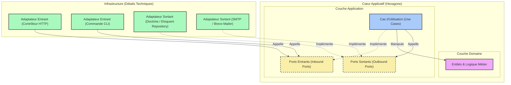

> [English Version](/posts/hexagonal-architecture)

[[toc]]

L'architecture logicielle est souvent reléguée au second plan lors des phases initiales d'un projet. On privilégie la vitesse de livraison, l'utilisation de frameworks tout-en-un, et le développement rapide de fonctionnalités. Cependant, à mesure que l'application grandit, les coûts de maintenance s'envolent, les régressions se multiplient, et le code métier se retrouve inextricablement couplé aux détails techniques comme la base de données, les bibliothèques tierces, ou le framework lui-même.

C'est ici qu'intervient **l'Architecture Hexagonale** (également connue sous le nom de *Ports & Adapters*). Théorisée par Alistair Cockburn en 2005, elle propose de structurer l'application de manière à isoler la logique métier des détails d'infrastructure.

Dans cet article, nous allons comprendre pourquoi l'architecture traditionnelle pose problème, explorer en détail les concepts de l'architecture hexagonale, et voir comment elle résout les limites des approches couplées classiques.

---

## 1. Le Constat de départ – Le Code Couplé (Legacy Pain)

Pour comprendre l'intérêt de l'architecture hexagonale, analysons un exemple typique de code hérité ("legacy"). Imaginons un contrôleur PHP classique gérant l'inscription d'un utilisateur au sein d'une application web.

Voici le genre de code que l'on retrouve fréquemment dans de nombreux projets :

```php
<?php

namespace App\Http\Controllers;

use App\Models\User;
use Illuminate\Http\Request;
use PHPMailer\PHPMailer\PHPMailer;
use PHPMailer\PHPMailer\Exception;

class RegistrationController extends Controller
{
    public function register(Request $request)
    {
        // 1. Validation HTTP directe
        $request->validate([
            'username' => 'required|string|max:255|unique:users',
            'email' => 'required|email|max:255|unique:users',
            'password' => 'required|string|min:8',
        ]);

        // 2. Logique métier + Persistance (Eloquent ORM couplé)
        $user = new User();
        $user->username = $request->input('username');
        $user->email = $request->input('email');
        $user->password = password_hash($request->input('password'), PASSWORD_BCRYPT);
        $user->save(); // Couplage direct à la base de données MySQL via Active Record

        // 3. Notification par Email (Envoi direct via SMTP avec PHPMailer)
        $mail = new PHPMailer(true);
        try {
            // Configuration SMTP hardcodée ou via variables d'environnement directes
            $mail->isSMTP();
            $mail->Host       = env('MAIL_HOST', 'smtp.mailtrap.io');
            $mail->SMTPAuth   = true;
            $mail->Username   = env('MAIL_USERNAME');
            $mail->Password   = env('MAIL_PASSWORD');
            $mail->SMTPSecure = PHPMailer::ENCRYPTION_STARTTLS;
            $mail->Port       = env('MAIL_PORT', 587);

            $mail->setFrom('no-reply@notre-application.com', 'Mon App');
            $mail->addAddress($user->email, $user->username);

            $mail->isHTML(true);
            $mail->Subject = 'Bienvenue sur notre application !';
            $mail->Body    = "<h1>Bonjour {$user->username} !</h1><p>Merci de vous être inscrit.</p>";

            $mail->send();
        } catch (Exception $e) {
            // En cas d'erreur d'envoi d'email, la réponse HTTP est compromise
            return response()->json(['error' => "Impossible d'envoyer l'email : {$mail->ErrorInfo}"], 500);
        }

        // 4. Réponse HTTP
        return response()->json([
            'message' => 'Utilisateur créé avec succès !',
            'user' => [
                'id' => $user->id,
                'username' => $user->username,
                'email' => $user->email,
            ]
        ], 201);
    }
}
```

### Pourquoi ce code est fragile et problématique ?

À première vue, ce contrôleur fonctionne parfaitement. Il remplit son rôle : il valide les entrées, enregistre en base de données, envoie un email de bienvenue et renvoie une réponse JSON. 

Pourtant, d'un point de vue architectural, c'est une bombe à retardement. Voici pourquoi :

#### 1. Violation flagrante des principes SOLID
- **SRP (Single Responsibility Principle)** : La classe `RegistrationController` a beaucoup trop de responsabilités. Elle s'occupe de la sérialisation/désérialisation HTTP, de la validation des données d'entrée, de l'implémentation de la logique métier (le hachage du mot de passe), de l'accès à la base de données (Eloquent `save()`), de l'envoi de courriels (configuration SMTP et PHPMailer), et du formatage de la réponse. Si l'une de ces étapes change, nous devons modifier ce contrôleur.
- **OCP (Open/Closed Principle)** : Si demain nous souhaitons passer de PHPMailer (SMTP) à un service d'API tiers comme Mailgun, Brevo ou AWS SES, nous devons ouvrir cette classe et modifier son code interne. Il en va de même si nous souhaitons modifier le type de stockage (par exemple, appeler un microservice de gestion des identités).
- **DIP (Dependency Inversion Principle)** : La logique de haut niveau (l'inscription d'un utilisateur) dépend directement de détails de bas niveau : l'ORM Eloquent pour MySQL et la bibliothèque PHPMailer pour le transport SMTP. Le code métier est l'esclave des technologies choisies.

#### 2. Un code impossible à tester unitairement (Untestable Code)
Pour tester la logique de création d'un utilisateur, vous êtes obligé de configurer et d'exécuter :
- Une véritable base de données (ou utiliser des mocks complexes de Laravel qui interceptent les requêtes Eloquent).
- Un serveur SMTP réel ou un outil comme Mailtrap pour intercepter l'envoi d'email de PHPMailer, ou encore mocker de manière agressive les objets globaux de PHPMailer.

Il est impossible de tester uniquement la logique métier en isolation dans un test unitaire pur qui s'exécute en quelques millisecondes. Les tests deviennent lents, fragiles et complexes à écrire.

#### 3. Dépendance totale au Framework (Vendor Lock-in)
Le code métier est intimement lié à Laravel (classes `Request`, `Response`, ORM Eloquent, helpers comme `env()`). Si vous décidez demain de migrer votre projet vers Symfony ou de déplacer cette logique spécifique dans un CLI ou un script asynchrone, vous devrez réécrire la quasi-totalité du code car la logique métier est soudée au framework.

---

## 2. Qu'est-ce que l'Architecture Hexagonale ? (Ports & Adapters)

L'objectif de l'Architecture Hexagonale est simple : **isoler le code métier** de toutes ces contraintes externes. L'application doit être considérée comme un système fermé et autonome, le "Cœur Applicatif", qui communique avec l'extérieur uniquement via des contrats bien définis.

### Les 4 Piliers de l'Hexagone

Dans cette architecture, nous divisons notre projet en plusieurs couches distinctes, structurées autour du Domaine et de l'Application :



#### 1. Le Domaine (Domain)
C'est le cœur de l'hexagone. Il contient les **Entités**, les **Value Objects** et les **Domain Services**.
- Il définit la logique métier pure (par exemple : un utilisateur doit avoir un email valide, son mot de passe doit respecter certains critères, etc.).
- Il n'a **aucune dépendance externe**. Il ne connaît ni le framework, ni la base de données, ni PHPMailer, ni même le protocole HTTP. C'est du code PHP natif pur (Plain Old PHP Objects - POPO).

#### 2. L'Application (Cas d'Utilisation / Use Cases)
Cette couche orchestre le flux de contrôle. Elle contient les **Use Cases** (ou services d'application).
- Un Use Case représente une action utilisateur ou système (par exemple : `RegisterUser`).
- Il récupère les requêtes du monde extérieur, coordonne les entités du Domaine, et utilise des interfaces abstraites (les Ports) pour interagir avec l'extérieur (sauvegarder en base de données, envoyer un email).

#### 3. Les Ports
Les Ports sont les frontières de notre hexagone. Ce sont des **interfaces** (au sens PHP `interface`) qui définissent comment le cœur applicatif interagit avec le monde extérieur. On distingue deux types de ports :
- **Les Ports Entrants (Inbound / Driving Ports)** : Ils définissent comment l'extérieur peut déclencher une action dans le cœur. C'est le point d'entrée de notre hexagone. (Exemple : Une interface `RegisterUserInterface`).
- **Les Ports Sortants (Outbound / Driven Ports)** : Ils définissent ce dont le cœur applicatif a besoin pour accomplir sa tâche, sans spécifier comment cela sera fait. (Exemple : `UserRepositoryInterface` pour stocker l'utilisateur, `MailerInterface` pour envoyer le mail).

#### 4. Les Adaptateurs (Adapters)
Les Adaptateurs se situent en dehors de l'hexagone (dans la couche Infrastructure). Ils représentent l'implémentation concrète de nos interactions avec le monde extérieur. Ils traduisent les technologies techniques en appels compréhensibles par les ports, et vice versa :
- **Les Adaptateurs Entrants (Driving Adapters)** : Ils prennent un stimulus du monde extérieur et le convertissent en un appel à un Port Entrant. Exemples : Un contrôleur HTTP Laravel, une commande de console CLI Symfony, un consommateur de messages RabbitMQ.
- **Les Adaptateurs Sortants (Driven Adapters)** : Ils implémentent les interfaces des Ports Sortants pour réaliser l'action technique. Exemples : `EloquentUserRepository` (qui implémente `UserRepositoryInterface`), `BrevoMailer` (qui implémente `MailerInterface`), ou encore `InMemoryUserRepository` (utilisé spécifiquement pour les tests unitaires).

---

### Le Secret : Le Principe d'Inversion de Dépendance (DIP)

Le point de bascule fondamental pour comprendre l'architecture hexagonale réside dans l'utilisation du **Principe d'Inversion de Dépendance**. 

Dans une architecture traditionnelle en couches, la couche supérieure dépend de la couche inférieure :
`Contrôleur -> Service -> Base de Données (ORM)`

Ici, la couche Infrastructure dépend des interfaces (les Ports) définies à l'intérieur du Cœur Applicatif. Ainsi, **le flux d'exécution et la direction des dépendances sont découplés** :
- **À l'exécution (Runtime)** : Le contrôleur HTTP appelle l'application (Use Case), qui à son tour appelle l'adaptateur de base de données. Le flux va de gauche à droite.
- **À la compilation (Compile-time / Code)** : L'adaptateur de base de données (dans l'Infrastructure) dépend de l'interface `UserRepositoryInterface` (définie dans l'Application). La dépendance pointe vers l'intérieur.

> [!IMPORTANT]
> C'est l'inversion de dépendance qui garantit la protection du métier. Le Domaine et l'Application définissent les contrats dont ils ont besoin. L'Infrastructure s'y plie en les implémentant. C'est l'extérieur qui dépend de l'intérieur, jamais l'inverse.

Dans cet article, nous allons mettre en pratique ces concepts en refactorisant notre contrôleur spaghetti en une architecture propre, modulaire et 100% testable.

---

## 3. La Pratique : Le Cœur Applicatif (Domaine & Ports)

Pour cette refactorisation, nous allons structurer notre projet de manière à séparer clairement chaque couche de notre hexagone. Commençons par le cœur : le Domaine et ses frontières (les Ports).

### Le Domaine : Isolation absolue de la logique métier

Le Domaine est le centre névralgique de notre application. Il ne contient que du code PHP natif pur (Plain Old PHP Objects), libre de toute dépendance vis-à-vis d'un framework ou d'une base de données. Il garantit que les règles et invariants métier sont toujours respectés.

#### 1. Les Exceptions Métier (Invariants)

Nous commençons par définir des exceptions spécifiques qui modélisent des erreurs fonctionnelles liées aux règles métier.

```php
<?php

namespace App\Domain\Exception;

class InvalidEmailException extends \DomainException
{
    public function __construct(string $email)
    {
        parent::__construct(sprintf('L\'adresse email "%s" n\'est pas valide.', $email));
    }
}
```

```php
<?php

namespace App\Domain\Exception;

class WeakPasswordException extends \DomainException
{
    public function __construct()
    {
        parent::__construct('Le mot de passe est trop faible. Il doit contenir au moins 8 caractères.');
    }
}
```

#### 2. L'Entité Métier `User`

Cette entité encapsule les invariants de notre concept d'utilisateur : validation de la validité de l'email, de la force du mot de passe, et le hachage sécurisé du mot de passe.

```php
<?php

namespace App\Domain\Entity;

use App\Domain\Exception\InvalidEmailException;
use App\Domain\Exception\WeakPasswordException;

class User
{
    private string $id;
    private string $username;
    private string $email;
    private string $passwordHash;

    public function __construct(
        string $id,
        string $username,
        string $email,
        string $plainPassword
    ) {
        $this->id = $id;

        if (empty(trim($username))) {
            throw new \DomainException("Le nom d'utilisateur ne peut pas être vide.");
        }
        $this->username = $username;

        $this->setEmail($email);
        $this->setPassword($plainPassword);
    }

    public function getId(): string
    {
        return $this->id;
    }

    public function getUsername(): string
    {
        return $this->username;
    }

    public function getEmail(): string
    {
        return $this->email;
    }

    public function getPasswordHash(): string
    {
        return $this->passwordHash;
    }

    private function setEmail(string $email): void
    {
        if (!filter_var($email, FILTER_VALIDATE_EMAIL)) {
            throw new InvalidEmailException($email);
        }
        $this->email = $email;
    }

    private function setPassword(string $plainPassword): void
    {
        if (strlen($plainPassword) < 8) {
            throw new WeakPasswordException();
        }
        
        // Le hachage du mot de passe est une règle de sécurité métier essentielle.
        $this->passwordHash = password_hash($plainPassword, PASSWORD_BCRYPT);
    }
}
```

---

### Les Ports : Définir les frontières

Les ports sont les contrats (interfaces) définissant comment l'Hexagone communique avec l'extérieur. Le Domaine ou les Use Cases déclarent ces besoins, sans savoir comment ils seront implémentés.

#### 1. Le Port du Dépôt : `UserRepositoryInterface` (Outbound Port)

Ce port définit les besoins de notre hexagone pour la persistance et la recherche des utilisateurs.

```php
<?php

namespace App\Domain\Repository;

use App\Domain\Entity\User;

interface UserRepositoryInterface
{
    public function save(User $user): void;
    public function findByEmail(string $email): ?User;
    public function existsByUsername(string $username): bool;
}
```

#### 2. Le Port de Notification : `MailerInterface` (Outbound Port)

Ce port définit la capacité de notifier l'utilisateur lors de son inscription.

```php
<?php

namespace App\Domain\Gateway;

use App\Domain\Entity\User;

interface MailerInterface
{
    public function sendWelcomeEmail(User $user): void;
}
```

---

## 4. La Couche Application (Cas d'Utilisation & DTOs)

La couche Application coordonne l'exécution des scénarios d'utilisation. Elle dépend uniquement du Domaine et des interfaces (les Ports).

### Les Data Transfer Objects (DTO)

Les DTOs permettent de faire circuler les données de manière structurée et immutable sans coupler l'application aux requêtes HTTP ou aux types natifs du framework.

#### 1. Le DTO de Requête : `RegisterUserRequest`

```php
<?php

namespace App\Application\DTO;

readonly class RegisterUserRequest
{
    public function __construct(
        public string $username,
        public string $email,
        public string $password
    ) {}
}
```

#### 2. Le DTO de Réponse : `RegisterUserResponse`

```php
<?php

namespace App\Application\DTO;

use App\Domain\Entity\User;

readonly class RegisterUserResponse
{
    public function __construct(
        public string $id,
        public string $username,
        public string $email
    ) {}

    public static function fromEntity(User $user): self
    {
        return new self(
            $user->getId(),
            $user->getUsername(),
            $user->getEmail()
        );
    }
}
```

### Le Service d'Application (Use Case) : `RegisterUser`

Voici la classe qui orchestre la création de l'utilisateur. Remarquez l'injection de dépendances via le constructeur des ports `UserRepositoryInterface` et `MailerInterface`.

```php
<?php

namespace App\Application\UseCase;

use App\Application\DTO\RegisterUserRequest;
use App\Application\DTO\RegisterUserResponse;
use App\Domain\Entity\User;
use App\Domain\Repository\UserRepositoryInterface;
use App\Domain\Gateway\MailerInterface;

class RegisterUser
{
    public function __construct(
        private UserRepositoryInterface $userRepository,
        private MailerInterface $mailer
    ) {}

    public function execute(RegisterUserRequest $request): RegisterUserResponse
    {
        // 1. Validation des règles d'unicité (qui nécessitent le port UserRepository)
        if ($this->userRepository->existsByUsername($request->username)) {
            throw new \DomainException("Ce nom d'utilisateur est déjà utilisé.");
        }

        if ($this->userRepository->findByEmail($request->email) !== null) {
            throw new \DomainException("Cette adresse email est déjà enregistrée.");
        }

        // 2. Génération d'un identifiant unique (UUID-like)
        $id = bin2hex(random_bytes(16));

        // 3. Création de l'entité de Domaine (valide implicitement les invariants)
        $user = new User(
            $id,
            $request->username,
            $request->email,
            $request->password
        );

        // 4. Persistance via le Port
        $this->userRepository->save($user);

        // 5. Envoi du mail de bienvenue via le Port
        $this->mailer->sendWelcomeEmail($user);

        // 6. Retour du DTO de réponse
        return RegisterUserResponse::fromEntity($user);
    }
}
```

> [!NOTE]
> **Sécurité transactionnelle et effets de bord :** Dans cet exemple simplifié, l'envoi d'email est fait directement à la suite de l'enregistrement en base de données. En production, si l'envoi d'email échoue (panne du serveur SMTP), le cas d'utilisation échouera et renverra une erreur, alors que l'utilisateur aura potentiellement déjà été enregistré en base de données. Pour garantir la cohérence transactionnelle, on utilise généralement des **Événements de Domaine** (Domain Events) combinés au pattern **Outbox** pour déléguer l'envoi d'email de manière asynchrone et fiable.

---

## 5. La Couche Infrastructure (Les Adaptateurs)

L'Infrastructure contient l'implémentation concrète de nos interfaces (les adaptateurs sortants) ainsi que les mécanismes de déclenchement (les adaptateurs entrants).

### Les Adaptateurs Sortants (Outbound Adapters)

Ces classes implémentent les ports sortants en manipulant des détails techniques spécifiques (SQL, SMTP).

#### 1. Persistance SQL : `SqlUserRepository` (via PDO)

```php
<?php

namespace App\Infrastructure\Adapter\Persistence;

use App\Domain\Entity\User;
use App\Domain\Repository\UserRepositoryInterface;
use PDO;

class SqlUserRepository implements UserRepositoryInterface
{
    public function __construct(private PDO $pdo)
    {}

    public function save(User $user): void
    {
        $stmt = $this->pdo->prepare('
            INSERT INTO users (id, username, email, password_hash)
            VALUES (:id, :username, :email, :password_hash)
        ');

        $stmt->execute([
            'id' => $user->getId(),
            'username' => $user->getUsername(),
            'email' => $user->getEmail(),
            'password_hash' => $user->getPasswordHash(),
        ]);
    }

    public function findByEmail(string $email): ?User
    {
        $stmt = $this->pdo->prepare('SELECT * FROM users WHERE email = :email LIMIT 1');
        $stmt->execute(['email' => $email]);
        $row = $stmt->fetch(PDO::FETCH_ASSOC);

        if (!$row) {
            return null;
        }

        return $this->reconstituteEntity($row);
    }

    public function existsByUsername(string $username): bool
    {
        $stmt = $this->pdo->prepare('SELECT COUNT(*) FROM users WHERE username = :username');
        $stmt->execute(['username' => $username]);
        return (int) $stmt->fetchColumn() > 0;
    }

    /**
     * Reconstitue une entité User à partir des données de la base de données.
     * Cette méthode permet de contourner le hachage et la validation du mot de passe en clair.
     */
    private function reconstituteEntity(array $row): User
    {
        $reflection = new \ReflectionClass(User::class);
        $user = $reflection->newInstanceWithoutConstructor();

        $properties = [
            'id' => $row['id'],
            'username' => $row['username'],
            'email' => $row['email'],
            'passwordHash' => $row['password_hash'],
        ];

        foreach ($properties as $name => $value) {
            $property = $reflection->getProperty($name);
            $property->setAccessible(true);
            $property->setValue($user, $value);
        }

        return $user;
    }
}
```

#### 2. Envoi de Mail : `SmtpMailer` (via Symfony Mailer)

```php
<?php

namespace App\Infrastructure\Adapter\Mailer;

use App\Domain\Entity\User;
use App\Domain\Gateway\MailerInterface;
use Symfony\Component\Mailer\MailerInterface as SymfonyMailerInterface;
use Symfony\Component\Mime\Email;

class SmtpMailer implements MailerInterface
{
    public function __construct(private SymfonyMailerInterface $symfonyMailer)
    {}

    public function sendWelcomeEmail(User $user): void
    {
        $email = (new Email())
            ->from('no-reply@notre-application.com')
            ->to($user->getEmail())
            ->subject('Bienvenue sur notre application !')
            ->html(sprintf(
                '<h1>Bonjour %s !</h1><p>Merci de vous être inscrit.</p>',
                htmlspecialchars($user->getUsername(), ENT_QUOTES, 'UTF-8')
            ));

        $this->symfonyMailer->send($email);
    }
}
```

---

### Les Adaptateurs Entrants (Inbound Adapters)

Ces classes capturent un stimulus de l'extérieur, valident le format de la requête et invoquent notre cas d'utilisation.

#### 1. Le Contrôleur HTTP : `RegisterUserController`

Ce contrôleur reçoit une requête HTTP, la décode, instancie le DTO et lance l'exécution. En cas de `DomainException`, il renvoie une erreur `422 Unprocessable Entity` avec le message adéquat.

```php
<?php

namespace App\Infrastructure\Adapter\Http;

use App\Application\DTO\RegisterUserRequest;
use App\Application\UseCase\RegisterUser;
use Nyholm\Psr7\Response;
use Psr\Http\Message\ResponseInterface;
use Psr\Http\Message\ServerRequestInterface;

class RegisterUserController
{
    public function __construct(private RegisterUser $registerUserUseCase)
    {}

    public function __invoke(ServerRequestInterface $request): ResponseInterface
    {
        $body = json_decode((string) $request->getBody(), true) ?? [];

        // 1. Validation de la requête HTTP
        if (empty($body['username']) || empty($body['email']) || empty($body['password'])) {
            return new Response(400, ['Content-Type' => 'application/json'], json_encode([
                'error' => 'Les champs username, email et password sont obligatoires.'
            ]));
        }

        try {
            // 2. Création du DTO
            $useCaseRequest = new RegisterUserRequest(
                username: $body['username'],
                email: $body['email'],
                password: $body['password']
            );

            // 3. Appel du cas d'utilisation
            $response = $this->registerUserUseCase->execute($useCaseRequest);

            // 4. Réponse de succès
            return new Response(201, ['Content-Type' => 'application/json'], json_encode([
                'message' => 'Utilisateur créé avec succès !',
                'user' => [
                    'id' => $response->id,
                    'username' => $response->username,
                    'email' => $response->email,
                ]
            ]));
        } catch (\DomainException $e) {
            // Les exceptions du domaine sont traduites en code statut HTTP 422
            return new Response(422, ['Content-Type' => 'application/json'], json_encode([
                'error' => $e->getMessage()
            ]));
        } catch (\Throwable $e) {
            // Les exceptions techniques imprévues sont cachées (HTTP 500)
            return new Response(500, ['Content-Type' => 'application/json'], json_encode([
                'error' => 'Une erreur interne est survenue.'
            ]));
        }
    }
}
```

#### 2. La Commande de Console CLI : `RegisterUserCommand`

Nous pouvons sans problème brancher un second canal d'entrée (le CLI) sur le même scénario applicatif. Le code métier reste totalement inchangé, démontrant ainsi la flexibilité de notre découplage.

```php
<?php

namespace App\Infrastructure\Adapter\Cli;

use App\Application\DTO\RegisterUserRequest;
use App\Application\UseCase\RegisterUser;
use Symfony\Component\Console\Attribute\AsCommand;
use Symfony\Component\Console\Command\Command;
use Symfony\Component\Console\Input\InputArgument;
use Symfony\Component\Console\Input\InputInterface;
use Symfony\Component\Console\Output\OutputInterface;
use Symfony\Component\Console\Style\SymfonyStyle;

#[AsCommand(name: 'app:register-user', description: 'Enregistre un nouvel utilisateur.')]
class RegisterUserCommand extends Command
{
    public function __construct(private RegisterUser $registerUserUseCase)
    {
        parent::__construct();
    }

    protected function configure(): void
    {
        $this
            ->addArgument('username', InputArgument::REQUIRED, 'Le nom d\'utilisateur')
            ->addArgument('email', InputArgument::REQUIRED, 'L\'adresse email')
            ->addArgument('password', InputArgument::REQUIRED, 'Le mot de passe');
    }

    protected function execute(InputInterface $input, OutputInterface $output): int
    {
        $io = new SymfonyStyle($input, $output);

        $username = $input->getArgument('username');
        $email = $input->getArgument('email');
        $password = $input->getArgument('password');

        try {
            $useCaseRequest = new RegisterUserRequest($username, $email, $password);
            $response = $this->registerUserUseCase->execute($useCaseRequest);

            $io->success(sprintf(
                'Utilisateur créé avec succès ! ID : %s, Nom : %s, Email : %s',
                $response->id,
                $response->username,
                $response->email
            ));

            return Command::SUCCESS;
        } catch (\DomainException $e) {
            $io->error($e->getMessage());
            return Command::FAILURE;
        } catch (\Throwable $e) {
            $io->error('Une erreur inattendue est survenue : ' . $e->getMessage());
            return Command::INVALID;
        }
    }
}
```

---

## 6. Mise en Pratique : Arborescence et Câblage

Pour mettre en place l'architecture hexagonale dans un projet concret, il est crucial de définir une structure de répertoires claire et d'apprendre au conteneur d'injection de dépendances (Dependency Injection / DI) comment lier nos ports (interfaces) à nos adaptateurs (implémentations concrètes).

### Structure des Dossiers (Arborescence)

Voici l'arborescence recommandée pour organiser les couches de notre hexagone au sein du dossier `src/` d'une application PHP moderne :

```text
src/
├── Domain/
│   ├── Entity/
│   │   └── User.php
│   ├── ValueObject/
│   │   └── Email.php (optionnel)
│   ├── Exception/
│   │   ├── InvalidEmailException.php
│   │   └── WeakPasswordException.php
│   ├── Repository/         <-- Ports Sortants (Driven Ports)
│   │   └── UserRepositoryInterface.php
│   └── Gateway/            <-- Ports Sortants pour services tiers
│       └── MailerInterface.php
├── Application/
│   ├── UseCase/            <-- Cas d'utilisation de l'hexagone
│   │   └── RegisterUser.php
│   └── DTO/                <-- Data Transfer Objects
│       ├── RegisterUserRequest.php
│       └── RegisterUserResponse.php
└── Infrastructure/
    ├── Adapter/            <-- Adaptateurs concrets
    │   ├── Http/           <-- Entrants (Driving) : Contrôleurs
    │   │   └── RegisterUserController.php
    │   ├── Cli/            <-- Entrants (Driving) : Commandes Console
    │   │   └── RegisterUserCommand.php
    │   ├── Persistence/    <-- Sortants (Driven) : ORM, SQL, In-Memory
    │   │   ├── SqlUserRepository.php
    │   │   └── InMemoryUserRepository.php
    │   └── Mailer/         <-- Sortants (Driven) : SMTP, Brevo, etc.
    │       └── SmtpMailer.php
    └── Share/              <-- Utilitaires et code transverse partagé
```

Cette structure garantit une séparation visuelle et physique immédiate. Un développeur ouvrant le projet peut immédiatement distinguer les règles métier (le Domaine) de l'orchestration des flux (l'Application) et des détails d'implémentation technologiques (l'Infrastructure).

### Câblage des Dépendances (Wiring)

Le cœur de l'application (l'hexagone) n'a pas le droit d'instancier directement des classes de l'Infrastructure. Il dépend d'interfaces. C'est le rôle du framework et de son conteneur d'injection de dépendances de résoudre ces abstractions au moment de l'exécution (Runtime).

Voici comment configurer ce câblage dans les deux frameworks PHP les plus populaires.

#### Option A : Configuration dans Symfony (`services.yaml`)

Dans Symfony, le système d'autowiring gère automatiquement la majorité des injections si le nom de la classe correspond au type attendu. Pour injecter un adaptateur spécifique lorsqu'une interface est demandée, nous configurons des liaisons explicites dans `config/services.yaml` :

```yaml
# config/services.yaml
services:
    # Configuration par défaut
    _defaults:
        autowire: true      # Active l'injection automatique
        autoconfigure: true # Enregistre automatiquement les commandes CLI, contrôleurs, etc.

    # Rendre disponible notre cœur applicatif et nos adaptateurs
    App\:
        resource: '../src/'
        exclude:
            - '../src/Domain/Entity/'
            - '../src/Domain/ValueObject/'
            - '../src/Domain/Exception/'
            - '../src/Application/DTO/'

    # Liaison explicite des ports (interfaces) aux adaptateurs (implémentations)
    App\Domain\Repository\UserRepositoryInterface:
        class: App\Infrastructure\Adapter\Persistence\SqlUserRepository

    App\Domain\Gateway\MailerInterface:
        class: App\Infrastructure\Adapter\Mailer\SmtpMailer
```

#### Option B : Configuration dans Laravel (`AppServiceProvider`)

Dans Laravel, la liaison des interfaces aux implémentations se fait directement en PHP via les Service Providers, généralement dans la méthode `register` du `AppServiceProvider` :

```php
<?php

namespace App\Providers;

use Illuminate\Support\ServiceProvider;
use App\Domain\Repository\UserRepositoryInterface;
use App\Infrastructure\Adapter\Persistence\SqlUserRepository;
use App\Domain\Gateway\MailerInterface;
use App\Infrastructure\Adapter\Mailer\SmtpMailer;

class AppServiceProvider extends ServiceProvider
{
    /**
     * Enregistre les liaisons dans le conteneur.
     */
    public function register(): void
    {
        // Liaison des interfaces (Ports) aux classes concrètes (Adaptateurs)
        $this->app->bind(UserRepositoryInterface::class, SqlUserRepository::class);
        $this->app->bind(MailerInterface::class, SmtpMailer::class);
    }
}
```

---

## 7. Maîtriser l'Architecture Hexagonale (Concepts Avancés)

Une fois les fondations posées, l'architecture hexagonale libère tout son potentiel à travers des pratiques avancées permettant de maximiser la qualité du code, de réduire le temps d'exécution des tests et de garantir l'intégrité de l'architecture sur le long terme.

### La Stratégie de Test Ultime (The Ultimate Testing Strategy)

L'un des plus grands avantages d'avoir découplé le cœur métier de l'infrastructure est la possibilité de tester les cas d'utilisation (Use Cases) de manière purement unitaire, sans aucune dépendance réseau, système de fichiers ou base de données.

Plutôt que d'utiliser des outils de mock complexes (qui rendent les tests verbeux et fragiles face aux refactorisations internes), nous pouvons implémenter une version en mémoire de nos ports.

#### 1. L'implémentation en mémoire : `InMemoryUserRepository`

Cet adaptateur de test conserve les entités en mémoire dans un simple tableau PHP. Il reproduit fidèlement le comportement d'une base de données sans en subir la lenteur ou les contraintes de configuration.

```php
<?php

namespace App\Infrastructure\Adapter\Persistence;

use App\Domain\Entity\User;
use App\Domain\Repository\UserRepositoryInterface;

class InMemoryUserRepository implements UserRepositoryInterface
{
    /**
     * @var array<string, User>
     */
    private array $users = [];

    public function save(User $user): void
    {
        $this->users[$user->getId()] = $user;
    }

    public function findByEmail(string $email): ?User
    {
        foreach ($this->users as $user) {
            if ($user->getEmail() === $email) {
                return $user;
            }
        }
        return null;
    }

    public function existsByUsername(string $username): bool
    {
        foreach ($this->users as $user) {
            if ($user->getUsername() === $username) {
                return true;
            }
        }
        return false;
    }
}
```

Pour le mailer, nous pouvons faire de même en créant un `InMemoryMailer` qui enregistre les notifications envoyées pour vérification ultérieure :

```php
<?php

namespace App\Infrastructure\Adapter\Mailer;

use App\Domain\Entity\User;
use App\Domain\Gateway\MailerInterface;

class InMemoryMailer implements MailerInterface
{
    /**
     * @var array<int, User>
     */
    private array $sentEmails = [];

    public function sendWelcomeEmail(User $user): void
    {
        $this->sentEmails[] = $user;
    }

    public function hasSentWelcomeEmailTo(string $email): bool
    {
        foreach ($this->sentEmails as $user) {
            if ($user->getEmail() === $email) {
                return true;
            }
        }
        return false;
    }
}
```

#### 2. Le Test PHPUnit : `RegisterUserTest`

Nous pouvons maintenant écrire un test unitaire pur. Il s'exécute en une fraction de milliseconde, ne nécessite aucune base de données de test et ne lèvera jamais d'erreur en cas de serveur SMTP indisponible.

```php
<?php

namespace App\Tests\Application\UseCase;

use App\Application\DTO\RegisterUserRequest;
use App\Application\UseCase\RegisterUser;
use App\Domain\Exception\InvalidEmailException;
use App\Infrastructure\Adapter\Persistence\InMemoryUserRepository;
use App\Infrastructure\Adapter\Mailer\InMemoryMailer;
use PHPUnit\Framework\TestCase;

class RegisterUserTest extends TestCase
{
    private InMemoryUserRepository $userRepository;
    private InMemoryMailer $mailer;
    private RegisterUser $useCase;

    protected function setUp(): void
    {
        $this->userRepository = new InMemoryUserRepository();
        $this->mailer = new InMemoryMailer();
        
        // Instanciation directe du cas d'utilisation avec nos adaptateurs en mémoire
        $this->useCase = new RegisterUser($this->userRepository, $this->mailer);
    }

    public function testUserRegistrationSuccess(): void
    {
        // Given
        $request = new RegisterUserRequest(
            username: 'alexdev',
            email: 'alex@example.com',
            password: 'SuperSecurePassword123'
        );

        // When
        $response = $this->useCase->execute($request);

        // Then
        $this->assertNotEmpty($response->id);
        $this->assertEquals('alexdev', $response->username);
        $this->assertEquals('alex@example.com', $response->email);

        // Vérification de la persistance en mémoire
        $savedUser = $this->userRepository->findByEmail('alex@example.com');
        $this->assertNotNull($savedUser);
        $this->assertEquals('alexdev', $savedUser->getUsername());

        // Vérification de l'envoi d'email
        $this->assertTrue($this->mailer->hasSentWelcomeEmailTo('alex@example.com'));
    }

    public function testRegistrationFailsWithInvalidEmail(): void
    {
        // Given
        $request = new RegisterUserRequest(
            username: 'alexdev',
            email: 'invalid-email',
            password: 'SuperSecurePassword123'
        );

        // Then
        $this->expectException(InvalidEmailException::class);

        // When
        $this->useCase->execute($request);
    }

    public function testRegistrationFailsWithDuplicateEmail(): void
    {
        // Given - Enregistrement d'un utilisateur existant avec cet email
        $existingUser = new \App\Domain\Entity\User(
            'existing-uuid',
            'johndoe',
            'john@example.com',
            'Password12345'
        );
        $this->userRepository->save($existingUser);

        // Demande d'inscription avec le même email
        $request = new RegisterUserRequest(
            username: 'newuser',
            email: 'john@example.com',
            password: 'SuperSecurePassword123'
        );

        // Then - Attente de l'exception de doublon d'email
        $this->expectException(\DomainException::class);
        $this->expectExceptionMessage("Cette adresse email est déjà enregistrée.");

        // When
        $this->useCase->execute($request);
    }
}
```

> [!TIP]
> **Vitesse d'exécution :** Ces tests s'exécutent en moins de 2 millisecondes chacun. Dans un grand projet contenant des centaines de règles métier, vous pouvez faire tourner des milliers de tests unitaires en moins de 3 secondes, favorisant une boucle de feedback ultra-rapide et l'adoption sereine du TDD (Test-Driven Development) sans les contraintes d'une base de données.

---

### Contrôler l'Architecture avec Deptrac

L'architecture hexagonale repose sur une règle absolue : **les couches internes ne doivent jamais dépendre des couches externes**. Cependant, face aux pressions de livraison et à l'inattention, un développeur peut facilement introduire un import interdit (par exemple, importer un contrôleur HTTP ou une classe Doctrine directement dans le Domaine).

Pour empêcher ces dérives, on utilise un outil d'analyse statique de dépendances appelé **Deptrac**. Il permet de définir des règles architecturales strictes et de faire échouer la CI en cas de violation.

Voici un exemple de fichier `deptrac.yaml` pour notre structure :

```yaml
# deptrac.yaml
deptrac:
  paths:
    - src/
  layers:
    - name: Domain
      collectors:
        - type: directory
          value: src/Domain/.*
    - name: Application
      collectors:
        - type: directory
          value: src/Application/.*
    - name: Infrastructure
      collectors:
        - type: directory
          value: src/Infrastructure/.*
  ruleset:
    Domain:
      # Le Domaine est totalement isolé : il ne dépend de rien d'autre
      - ~
    Application:
      # L'Application ne peut dépendre que du Domaine
      - Domain
    Infrastructure:
      # L'Infrastructure peut dépendre de l'Application et du Domaine
      - Application
      - Domain
```

En lançant la commande `vendor/bin/deptrac`, l'outil scanne tout votre code et lève une erreur bloquante si une dépendance pointe dans la mauvaise direction.

---

### Liens avec le Domain-Driven Design (DDD) et CQRS

L'Architecture Hexagonale est souvent associée à d'autres approches architecturales et méthodologies logicielles :

#### 1. Domain-Driven Design (DDD)
Bien que l'architecture hexagonale puisse être utilisée sans DDD, elle en est le réceptacle idéal. Le DDD met l'accent sur la modélisation rigoureuse de la logique métier. L'hexagone fournit l'écrin technique protecteur pour cette modélisation. Les concepts DDD d'**Entités**, de **Value Objects**, d'**Agrégats** et de **Services de Domaine** s'intègrent naturellement à l'intérieur du Domaine de l'hexagone, tandis que les **Repositories** DDD correspondent exactement aux ports sortants.

#### 2. CQRS (Command Query Responsibility Segregation)
Le pattern CQRS sépare les opérations de lecture (Queries) et d'écriture (Commands) pour optimiser les performances et la clarté du code. 
Dans un hexagone :
- **Le chemin d'écriture (Command)** passe par les Use Cases de l'Application, manipule les entités du Domaine et persiste l'état via les ports de persistance.
- **Le chemin de lecture (Query)** peut parfois contourner l'hexagone de manière pragmatique. Étant donné que la lecture n'exécute pas de règles métier complexes mais se contente de projeter des données, un adaptateur entrant (ex: contrôleur) peut appeler un service de requête optimisé pour obtenir directement des DTOs de vue en une seule requête SQL performante, évitant ainsi le coût de reconstruction d'entités métier complexes.

---

### Compromis : Quand l'adopter et quand l'éviter ?

Aucune architecture n'est une solution miracle ("no silver bullet"). L'architecture hexagonale apporte de grands bénéfices mais introduit également une complexité accidentelle indéniable.

#### Avantages
* **Testabilité maximale** : Tests unitaires ultra-rapides et sans effets de bord.
* **Indépendance technologique** : Facilité de mise à jour ou de remplacement de l'infrastructure (framework, base de données, services tiers).
* **Code métier protégé** : Clarté absolue de la logique métier, nettoyée des détails techniques.
* **Parallélisation du travail** : Une équipe peut travailler sur les Use Cases tandis qu'une autre développe les adaptateurs concrets de l'Infrastructure.

#### Inconvénients
* **Verbosité et surcoût de fichiers** : Multiplication des classes, interfaces, DTOs et mappings.
* **Courbe d'apprentissage** : Nécessite une bonne compréhension de l'inversion de dépendance et de la séparation des couches.
* **Le coût de l'indirection** : Naviguer dans le code demande de passer par des interfaces avant d'atteindre les implémentations concrètes.

#### Quand l'utiliser ?
* Projets de taille moyenne à grande ayant une logique métier riche, complexe et évolutive.
* Applications conçues pour durer plusieurs années (où le framework ou les bases de données changeront probablement de version ou de technologie).
* Systèmes nécessitant des stratégies de tests automatisés poussées.

#### Quand l'éviter ?
* **Applications purement CRUD** : Si votre application ne fait que lire et écrire dans une base de données sans appliquer de règles métier complexes, l'architecture hexagonale sera une usine à gaz inutile. Utilisez un framework classique avec son ORM natif (ex: Laravel Eloquent actif).
* **Microservices ultra-spécialisés** : Pour un petit microservice de quelques endpoints qui fait office de passerelle ou de passe-plat technique.
* **Prototypes et MVP jetables** : Privilégiez la vitesse de mise sur le marché avec des couplages directs, quitte à refactoriser en hexagone une fois le modèle économique validé.

---

## Conclusion et Comparatif

En isolant le cœur de l'application (le Domaine et les Use Cases) des détails techniques via des interfaces (les Ports), nous avons obtenu :
1. **Un code hautement testable** : Nous pouvons désormais écrire des tests unitaires très rapides en fournissant une implémentation `InMemoryUserRepository` ultra-simple, sans avoir à configurer de mocks ou de bases de données réelles.
2. **Une indépendance technologique** : Changer d'ORM (Eloquent vers Doctrine) ou de service d'email (SMTP vers Mailgun) ne demande aucune modification du code métier dans `RegisterUser` ou `User`. Seuls de nouveaux adaptateurs doivent être écrits dans la couche Infrastructure.
3. **Une flexibilité accrue** : HTTP et CLI partagent exactement le même cas d'utilisation applicatif.

L'Architecture Hexagonale demande plus de fichiers et une rigueur supérieure de découplage au départ, mais elle garantit la pérennité de votre logique métier face à l'obsolescence et à l'évolution des infrastructures technologiques.

