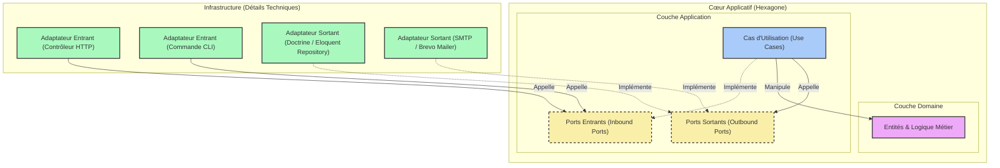

> [English Version](/posts/hexagonal-architecture)

> Diaporama : [SPA](https://slides.alexvolkihar.ovh/2026/hexagonal-architecture/)
>
> Réalisé avec <Slidev class="inline"/> [**Slidev**](https://github.com/slidevjs/slidev) - presentation slides for developers.

[[toc]]

Dans les premiers mois d'un projet, l'architecture perd toujours face à l'échéance. On prend un framework tout-en-un, on livre des fonctionnalités, on avance. La facture arrive plus tard : la maintenance coûte cher, les régressions s'accumulent, et le code métier se retrouve soudé à la base de données, aux bibliothèques tierces et au framework lui-même.

**L'architecture hexagonale** (aussi appelée *Ports & Adapters*) est une réponse à cela. Alistair Cockburn l'a décrite en 2005 : structurer l'application pour que la logique métier ne touche jamais aux détails d'infrastructure.

La suite part d'un contrôleur couplé, détaille ce que le modèle exige réellement, puis reconstruit ce contrôleur couche par couche.

---

## 1. Le point de départ : le code couplé

Voici un contrôleur PHP qui gère l'inscription d'un utilisateur. Rien d'exotique, et sans doute proche de quelque chose que vous avez écrit ou hérité :

```php
<?php

namespace App\Http\Controllers;

use App\Models\User;
use Illuminate\Http\Request;
use PHPMailer\PHPMailer\PHPMailer;
use PHPMailer\PHPMailer\Exception;

class RegistrationController extends Controller
{
    public function register(Request $request)
    {
        // 1. Validation HTTP directe
        $request->validate([
            'username' => 'required|string|max:255|unique:users',
            'email' => 'required|email|max:255|unique:users',
            'password' => 'required|string|min:8',
        ]);

        // 2. Logique métier + Persistance (Eloquent ORM couplé)
        $user = new User();
        $user->username = $request->input('username');
        $user->email = $request->input('email');
        $user->password = password_hash($request->input('password'), PASSWORD_BCRYPT);
        $user->save(); // Couplage direct à la base de données MySQL via Active Record

        // 3. Notification par Email (Envoi direct via SMTP avec PHPMailer)
        $mail = new PHPMailer(true);
        try {
            // Configuration SMTP hardcodée ou via variables d'environnement directes
            $mail->isSMTP();
            $mail->Host       = env('MAIL_HOST', 'smtp.mailtrap.io');
            $mail->SMTPAuth   = true;
            $mail->Username   = env('MAIL_USERNAME');
            $mail->Password   = env('MAIL_PASSWORD');
            $mail->SMTPSecure = PHPMailer::ENCRYPTION_STARTTLS;
            $mail->Port       = env('MAIL_PORT', 587);

            $mail->setFrom('no-reply@notre-application.com', 'Mon App');
            $mail->addAddress($user->email, $user->username);

            $mail->isHTML(true);
            $mail->Subject = 'Bienvenue sur notre application !';
            $mail->Body    = "<h1>Bonjour {$user->username} !</h1><p>Merci de vous être inscrit.</p>";

            $mail->send();
        } catch (Exception $e) {
            // En cas d'erreur d'envoi d'email, la réponse HTTP est compromise
            return response()->json(['error' => "Impossible d'envoyer l'email : {$mail->ErrorInfo}"], 500);
        }

        // 4. Réponse HTTP
        return response()->json([
            'message' => 'Utilisateur créé avec succès !',
            'user' => [
                'id' => $user->id,
                'username' => $user->username,
                'email' => $user->email,
            ]
        ], 201);
    }
}
```

### Pourquoi ce code est fragile

Ce contrôleur fonctionne. Il valide les entrées, enregistre en base, envoie un email de bienvenue et renvoie du JSON. Les ennuis commencent le jour où quelque chose doit changer.

#### 1. Il viole SOLID sur trois points

**SRP.** `RegistrationController` s'occupe de la sérialisation HTTP, de la validation des entrées, d'une règle métier (le hachage du mot de passe), de l'accès à la base via Eloquent, de la configuration SMTP et du formatage de la réponse. Modifier l'un de ces points, c'est éditer cette classe.

**OCP.** Passer de PHPMailer à Mailgun, Brevo ou AWS SES oblige à ouvrir la classe et à en réécrire les entrailles. Même histoire si les utilisateurs partent derrière un microservice d'identité au lieu d'une table MySQL.

**DIP.** L'opération de haut niveau, inscrire un utilisateur, dépend directement des détails de bas niveau : Eloquent pour MySQL, PHPMailer pour SMTP. Le code métier n'a son mot à dire sur aucun des deux.

#### 2. Il est impossible à tester unitairement

Pour exercer la logique de création d'un utilisateur, il vous faut une vraie base de données (ou une pile de mocks Laravel qui interceptent les requêtes Eloquent), plus un vrai serveur SMTP, ou Mailtrap, ou du mock agressif sur les objets globaux de PHPMailer.

Aucun moyen d'exécuter les règles d'inscription seules dans un test qui se termine en une milliseconde. Et les tests que l'on finit par écrire sont lents et cassent au moindre remaniement.

#### 3. Il est soudé au framework

`Request`, `Response`, Eloquent, le helper `env()` : le code métier est du code Laravel. Déplacez la même logique vers Symfony, vers une commande CLI ou vers un worker asynchrone, et il n'en survit presque rien.

---

## 2. Qu'est-ce que l'architecture hexagonale ?

L'objectif est d'isoler le code métier de tout ce qui précède. L'application devient un système fermé, le « cœur applicatif », et ne parle au monde extérieur qu'à travers des contrats qu'elle définit elle-même.

### Les quatre pièces

Le projet se découpe en couches organisées autour du domaine et de l'application :



#### 1. Le domaine

Le centre de l'hexagone : entités, value objects, services de domaine.

- Il porte les règles métier. Un utilisateur doit avoir un email valide, un mot de passe doit satisfaire un critère de robustesse.
- Il n'a **aucune dépendance externe**. Il ignore le framework, la base de données, PHPMailer et HTTP. Du PHP natif, rien de plus.

#### 2. La couche application

C'est là que vit le flux de contrôle, dans des cas d'utilisation (certains les appellent services d'application).

- Un cas d'utilisation, c'est une action qu'un utilisateur ou un autre système peut déclencher, comme `RegisterUser`.
- Il reçoit une requête, coordonne les entités du domaine et ne joint le monde extérieur qu'à travers des interfaces : enregistrer en base, envoyer un email.

#### 3. Les ports

Les ports sont la frontière. Ce sont des `interface` PHP qui disent comment le cœur parle au reste, et il en existe deux sortes.

Les ports entrants (ou *driving ports*) disent comment l'extérieur peut déclencher quelque chose dans le cœur ; `RegisterUserInterface` en serait un. Les ports sortants (*driven ports*) disent ce dont le cœur a besoin pour finir son travail, sans dire comment : `UserRepositoryInterface` pour stocker un utilisateur, `MailerInterface` pour envoyer l'email.

#### 4. Les adaptateurs

Les adaptateurs vivent en dehors de l'hexagone, dans la couche infrastructure, et traduisent entre une technologie et un port.

Les adaptateurs entrants prennent un stimulus extérieur et le transforment en appel sur un port entrant : un contrôleur HTTP Laravel, une commande de console Symfony, un consommateur RabbitMQ. Les adaptateurs sortants implémentent les ports sortants et font le travail technique : `EloquentUserRepository` qui implémente `UserRepositoryInterface`, `BrevoMailer` qui implémente `MailerInterface`, ou `InMemoryUserRepository`, qui n'existe que pour les tests.

---

### Le principe d'inversion de dépendance

Tout ceci repose sur un seul principe.

Dans une application en couches classique, chaque couche dépend de celle du dessous : contrôleur, puis service, puis base de données via l'ORM.

Ici, l'infrastructure dépend d'interfaces déclarées à l'intérieur du cœur. Cela sépare le flux d'exécution de la direction des dépendances. À l'exécution, le contrôleur HTTP appelle le cas d'utilisation, qui appelle l'adaptateur de base de données. Dans le code, l'adaptateur de base de données dépend de `UserRepositoryInterface`, qui vit dans la couche application. La dépendance pointe vers l'intérieur pendant que l'appel pointe vers l'extérieur.

> [!IMPORTANT]
> C'est l'inversion de dépendance qui protège le métier. Le domaine et l'application déclarent les contrats dont ils ont besoin. L'infrastructure les implémente. C'est l'extérieur qui dépend de l'intérieur, jamais l'inverse.

La suite de l'article refactorise le contrôleur spaghetti au regard de cette règle.

---

## 3. Le cœur : domaine et ports

Commençons par le centre.

### Le domaine

Le domaine porte les règles, et rien d'autre. Du PHP nu, sans framework ni base de données, chargé de garantir que les invariants tiennent.

#### 1. Les exceptions métier

On commence par des exceptions qui modélisent des erreurs fonctionnelles plutôt que techniques.

```php
<?php

namespace App\Domain\Exception;

class InvalidEmailException extends \DomainException
{
    public function __construct(string $email)
    {
        parent::__construct(sprintf('L\'adresse email "%s" n\'est pas valide.', $email));
    }
}
```

```php
<?php

namespace App\Domain\Exception;

class WeakPasswordException extends \DomainException
{
    public function __construct()
    {
        parent::__construct('Le mot de passe est trop faible. Il doit contenir au moins 8 caractères.');
    }
}
```

#### 2. L'entité `User`

L'entité possède ses invariants : un email valide, un mot de passe assez robuste, et un hachage avant que la valeur ne soit stockée où que ce soit.

```php
<?php

namespace App\Domain\Entity;

use App\Domain\Exception\InvalidEmailException;
use App\Domain\Exception\WeakPasswordException;

class User
{
    private string $id;
    private string $username;
    private string $email;
    private string $passwordHash;

    public function __construct(
        string $id,
        string $username,
        string $email,
        string $plainPassword
    ) {
        $this->id = $id;

        if (empty(trim($username))) {
            throw new \DomainException("Le nom d'utilisateur ne peut pas être vide.");
        }
        $this->username = $username;

        $this->setEmail($email);
        $this->setPassword($plainPassword);
    }

    public function getId(): string
    {
        return $this->id;
    }

    public function getUsername(): string
    {
        return $this->username;
    }

    public function getEmail(): string
    {
        return $this->email;
    }

    public function getPasswordHash(): string
    {
        return $this->passwordHash;
    }

    private function setEmail(string $email): void
    {
        if (!filter_var($email, FILTER_VALIDATE_EMAIL)) {
            throw new InvalidEmailException($email);
        }
        $this->email = $email;
    }

    private function setPassword(string $plainPassword): void
    {
        if (strlen($plainPassword) < 8) {
            throw new WeakPasswordException();
        }
        
        // Le hachage du mot de passe est une règle de sécurité métier essentielle.
        $this->passwordHash = password_hash($plainPassword, PASSWORD_BCRYPT);
    }
}
```

---

### Les ports

Les ports sont les contrats par lesquels l'hexagone communique. Le domaine ou le cas d'utilisation déclare ce dont il a besoin ; ni l'un ni l'autre ne sait comment cela sera fourni.

#### 1. `UserRepositoryInterface`, un port sortant

Tout ce dont l'hexagone a besoin pour stocker et retrouver des utilisateurs :

```php
<?php

namespace App\Domain\Repository;

use App\Domain\Entity\User;

interface UserRepositoryInterface
{
    public function save(User $user): void;
    public function findByEmail(string $email): ?User;
    public function existsByUsername(string $username): bool;
}
```

#### 2. `MailerInterface`, un port sortant

Et la capacité de notifier l'utilisateur une fois inscrit :

```php
<?php

namespace App\Domain\Gateway;

use App\Domain\Entity\User;

interface MailerInterface
{
    public function sendWelcomeEmail(User $user): void;
}
```

---

## 4. La couche application

Cette couche coordonne les cas d'utilisation. Elle dépend du domaine et des ports, et de rien d'autre.

### Les data transfer objects

Les DTO font entrer et sortir les données dans une forme structurée et immuable, pour que l'application ne voie jamais une requête HTTP ni un type du framework.

#### 1. `RegisterUserRequest`

```php
<?php

namespace App\Application\DTO;

readonly class RegisterUserRequest
{
    public function __construct(
        public string $username,
        public string $email,
        public string $password
    ) {}
}
```

#### 2. `RegisterUserResponse`

```php
<?php

namespace App\Application\DTO;

use App\Domain\Entity\User;

readonly class RegisterUserResponse
{
    public function __construct(
        public string $id,
        public string $username,
        public string $email
    ) {}

    public static function fromEntity(User $user): self
    {
        return new self(
            $user->getId(),
            $user->getUsername(),
            $user->getEmail()
        );
    }
}
```

### Le cas d'utilisation : `RegisterUser`

La classe qui orchestre la création de l'utilisateur. Les deux ports arrivent par le constructeur :

```php
<?php

namespace App\Application\UseCase;

use App\Application\DTO\RegisterUserRequest;
use App\Application\DTO\RegisterUserResponse;
use App\Domain\Entity\User;
use App\Domain\Repository\UserRepositoryInterface;
use App\Domain\Gateway\MailerInterface;

class RegisterUser
{
    public function __construct(
        private UserRepositoryInterface $userRepository,
        private MailerInterface $mailer
    ) {}

    public function execute(RegisterUserRequest $request): RegisterUserResponse
    {
        // 1. Validation des règles d'unicité (qui nécessitent le port UserRepository)
        if ($this->userRepository->existsByUsername($request->username)) {
            throw new \DomainException("Ce nom d'utilisateur est déjà utilisé.");
        }

        if ($this->userRepository->findByEmail($request->email) !== null) {
            throw new \DomainException("Cette adresse email est déjà enregistrée.");
        }

        // 2. Génération d'un identifiant unique (UUID-like)
        $id = bin2hex(random_bytes(16));

        // 3. Création de l'entité de Domaine (valide implicitement les invariants)
        $user = new User(
            $id,
            $request->username,
            $request->email,
            $request->password
        );

        // 4. Persistance via le Port
        $this->userRepository->save($user);

        // 5. Envoi du mail de bienvenue via le Port
        $this->mailer->sendWelcomeEmail($user);

        // 6. Retour du DTO de réponse
        return RegisterUserResponse::fromEntity($user);
    }
}
```

> [!NOTE]
> **Sécurité transactionnelle et effets de bord :** l'exemple envoie l'email juste après l'enregistrement. En production, une panne SMTP fait échouer le cas d'utilisation alors que l'utilisateur est déjà en base. La parade habituelle est un **événement de domaine** couplé au pattern **outbox**, pour déléguer l'envoi de façon asynchrone et le rejouer en cas d'échec.

---

## 5. La couche infrastructure

L'infrastructure contient les implémentations concrètes des ports, et les points d'entrée qui déclenchent le cœur.

### Les adaptateurs sortants

Ils implémentent les ports sortants face à une vraie technologie : SQL, SMTP.

#### 1. `SqlUserRepository`, via PDO

```php
<?php

namespace App\Infrastructure\Adapter\Persistence;

use App\Domain\Entity\User;
use App\Domain\Repository\UserRepositoryInterface;
use PDO;

class SqlUserRepository implements UserRepositoryInterface
{
    public function __construct(private PDO $pdo)
    {}

    public function save(User $user): void
    {
        $stmt = $this->pdo->prepare('
            INSERT INTO users (id, username, email, password_hash)
            VALUES (:id, :username, :email, :password_hash)
        ');

        $stmt->execute([
            'id' => $user->getId(),
            'username' => $user->getUsername(),
            'email' => $user->getEmail(),
            'password_hash' => $user->getPasswordHash(),
        ]);
    }

    public function findByEmail(string $email): ?User
    {
        $stmt = $this->pdo->prepare('SELECT * FROM users WHERE email = :email LIMIT 1');
        $stmt->execute(['email' => $email]);
        $row = $stmt->fetch(PDO::FETCH_ASSOC);

        if (!$row) {
            return null;
        }

        return $this->reconstituteEntity($row);
    }

    public function existsByUsername(string $username): bool
    {
        $stmt = $this->pdo->prepare('SELECT COUNT(*) FROM users WHERE username = :username');
        $stmt->execute(['username' => $username]);
        return (int) $stmt->fetchColumn() > 0;
    }

    /**
     * Reconstitue une entité User à partir des données de la base de données.
     * Cette méthode permet de contourner le hachage et la validation du mot de passe en clair.
     */
    private function reconstituteEntity(array $row): User
    {
        $reflection = new \ReflectionClass(User::class);
        $user = $reflection->newInstanceWithoutConstructor();

        $properties = [
            'id' => $row['id'],
            'username' => $row['username'],
            'email' => $row['email'],
            'passwordHash' => $row['password_hash'],
        ];

        foreach ($properties as $name => $value) {
            $property = $reflection->getProperty($name);
            $property->setAccessible(true);
            $property->setValue($user, $value);
        }

        return $user;
    }
}
```

#### 2. `SmtpMailer`, via Symfony Mailer

```php
<?php

namespace App\Infrastructure\Adapter\Mailer;

use App\Domain\Entity\User;
use App\Domain\Gateway\MailerInterface;
use Symfony\Component\Mailer\MailerInterface as SymfonyMailerInterface;
use Symfony\Component\Mime\Email;

class SmtpMailer implements MailerInterface
{
    public function __construct(private SymfonyMailerInterface $symfonyMailer)
    {}

    public function sendWelcomeEmail(User $user): void
    {
        $email = (new Email())
            ->from('no-reply@notre-application.com')
            ->to($user->getEmail())
            ->subject('Bienvenue sur notre application !')
            ->html(sprintf(
                '<h1>Bonjour %s !</h1><p>Merci de vous être inscrit.</p>',
                htmlspecialchars($user->getUsername(), ENT_QUOTES, 'UTF-8')
            ));

        $this->symfonyMailer->send($email);
    }
}
```

---

### Les adaptateurs entrants

Ils captent un stimulus extérieur, vérifient la forme de la requête et appellent le cas d'utilisation.

#### 1. `RegisterUserController`

Il décode la requête HTTP, construit le DTO et lance le cas d'utilisation. Une `DomainException` ressort en `422 Unprocessable Entity`, avec le message du domaine.

```php
<?php

namespace App\Infrastructure\Adapter\Http;

use App\Application\DTO\RegisterUserRequest;
use App\Application\UseCase\RegisterUser;
use Nyholm\Psr7\Response;
use Psr\Http\Message\ResponseInterface;
use Psr\Http\Message\ServerRequestInterface;

class RegisterUserController
{
    public function __construct(private RegisterUser $registerUserUseCase)
    {}

    public function __invoke(ServerRequestInterface $request): ResponseInterface
    {
        $body = json_decode((string) $request->getBody(), true) ?? [];

        // 1. Validation de la requête HTTP
        if (empty($body['username']) || empty($body['email']) || empty($body['password'])) {
            return new Response(400, ['Content-Type' => 'application/json'], json_encode([
                'error' => 'Les champs username, email et password sont obligatoires.'
            ]));
        }

        try {
            // 2. Création du DTO
            $useCaseRequest = new RegisterUserRequest(
                username: $body['username'],
                email: $body['email'],
                password: $body['password']
            );

            // 3. Appel du cas d'utilisation
            $response = $this->registerUserUseCase->execute($useCaseRequest);

            // 4. Réponse de succès
            return new Response(201, ['Content-Type' => 'application/json'], json_encode([
                'message' => 'Utilisateur créé avec succès !',
                'user' => [
                    'id' => $response->id,
                    'username' => $response->username,
                    'email' => $response->email,
                ]
            ]));
        } catch (\DomainException $e) {
            // Les exceptions du domaine sont traduites en code statut HTTP 422
            return new Response(422, ['Content-Type' => 'application/json'], json_encode([
                'error' => $e->getMessage()
            ]));
        } catch (\Throwable $e) {
            // Les exceptions techniques imprévues sont cachées (HTTP 500)
            return new Response(500, ['Content-Type' => 'application/json'], json_encode([
                'error' => 'Une erreur interne est survenue.'
            ]));
        }
    }
}
```

#### 2. `RegisterUserCommand`

Un second point d'entrée, cette fois la console, se branche sur le même cas d'utilisation. Pas une ligne de code métier ne change.

```php
<?php

namespace App\Infrastructure\Adapter\Cli;

use App\Application\DTO\RegisterUserRequest;
use App\Application\UseCase\RegisterUser;
use Symfony\Component\Console\Attribute\AsCommand;
use Symfony\Component\Console\Command\Command;
use Symfony\Component\Console\Input\InputArgument;
use Symfony\Component\Console\Input\InputInterface;
use Symfony\Component\Console\Output\OutputInterface;
use Symfony\Component\Console\Style\SymfonyStyle;

#[AsCommand(name: 'app:register-user', description: 'Enregistre un nouvel utilisateur.')]
class RegisterUserCommand extends Command
{
    public function __construct(private RegisterUser $registerUserUseCase)
    {
        parent::__construct();
    }

    protected function configure(): void
    {
        $this
            ->addArgument('username', InputArgument::REQUIRED, 'Le nom d\'utilisateur')
            ->addArgument('email', InputArgument::REQUIRED, 'L\'adresse email')
            ->addArgument('password', InputArgument::REQUIRED, 'Le mot de passe');
    }

    protected function execute(InputInterface $input, OutputInterface $output): int
    {
        $io = new SymfonyStyle($input, $output);

        $username = $input->getArgument('username');
        $email = $input->getArgument('email');
        $password = $input->getArgument('password');

        try {
            $useCaseRequest = new RegisterUserRequest($username, $email, $password);
            $response = $this->registerUserUseCase->execute($useCaseRequest);

            $io->success(sprintf(
                'Utilisateur créé avec succès ! ID : %s, Nom : %s, Email : %s',
                $response->id,
                $response->username,
                $response->email
            ));

            return Command::SUCCESS;
        } catch (\DomainException $e) {
            $io->error($e->getMessage());
            return Command::FAILURE;
        } catch (\Throwable $e) {
            $io->error('Une erreur inattendue est survenue : ' . $e->getMessage());
            return Command::INVALID;
        }
    }
}
```

---

## 6. Arborescence et câblage

Restent deux choses : une arborescence qui reflète les couches, et un conteneur d'injection de dépendances qui sait quel adaptateur répond à quel port.

### Structure des dossiers

Voici comment les couches s'installent dans `src/` sur une application PHP moderne :

```text
src/
├── Domain/
│   ├── Entity/
│   │   └── User.php
│   ├── ValueObject/
│   │   └── Email.php (optionnel)
│   ├── Exception/
│   │   ├── InvalidEmailException.php
│   │   └── WeakPasswordException.php
│   ├── Repository/         <-- Ports Sortants (Driven Ports)
│   │   └── UserRepositoryInterface.php
│   └── Gateway/            <-- Ports Sortants pour services tiers
│       └── MailerInterface.php
├── Application/
│   ├── UseCase/            <-- Cas d'utilisation de l'hexagone
│   │   └── RegisterUser.php
│   └── DTO/                <-- Data Transfer Objects
│       ├── RegisterUserRequest.php
│       └── RegisterUserResponse.php
└── Infrastructure/
    ├── Adapter/            <-- Adaptateurs concrets
    │   ├── Http/           <-- Entrants (Driving) : Contrôleurs
    │   │   └── RegisterUserController.php
    │   ├── Cli/            <-- Entrants (Driving) : Commandes Console
    │   │   └── RegisterUserCommand.php
    │   ├── Persistence/    <-- Sortants (Driven) : ORM, SQL, In-Memory
    │   │   ├── SqlUserRepository.php
    │   │   └── InMemoryUserRepository.php
    │   └── Mailer/         <-- Sortants (Driven) : SMTP, Brevo, etc.
    │       └── SmtpMailer.php
    └── Share/              <-- Utilitaires et code transverse partagé
```

La séparation est physique, pas seulement conceptuelle. Quelqu'un qui ouvre le projet pour la première fois distingue les règles métier, l'orchestration et les détails techniques sans lire une ligne de code.

### Câblage

L'hexagone n'instancie jamais une classe d'infrastructure. Il dépend d'interfaces, et le conteneur du framework les résout à l'exécution.

#### Option A : Symfony (`services.yaml`)

L'autowiring de Symfony fait l'essentiel du travail dès que le nom de la classe correspond au type attendu. Pour choisir un adaptateur précis face à une interface, on lie explicitement :

```yaml
# config/services.yaml
services:
    # Configuration par défaut
    _defaults:
        autowire: true      # Active l'injection automatique
        autoconfigure: true # Enregistre automatiquement les commandes CLI, contrôleurs, etc.

    # Rendre disponible notre cœur applicatif et nos adaptateurs
    App\:
        resource: '../src/'
        exclude:
            - '../src/Domain/Entity/'
            - '../src/Domain/ValueObject/'
            - '../src/Domain/Exception/'
            - '../src/Application/DTO/'

    # Liaison explicite des ports (interfaces) aux adaptateurs (implémentations)
    App\Domain\Repository\UserRepositoryInterface:
        class: App\Infrastructure\Adapter\Persistence\SqlUserRepository

    App\Domain\Gateway\MailerInterface:
        class: App\Infrastructure\Adapter\Mailer\SmtpMailer
```

#### Option B : Laravel (`AppServiceProvider`)

Laravel fait la même liaison en PHP, via un service provider, en général dans `register()` :

```php
<?php

namespace App\Providers;

use Illuminate\Support\ServiceProvider;
use App\Domain\Repository\UserRepositoryInterface;
use App\Infrastructure\Adapter\Persistence\SqlUserRepository;
use App\Domain\Gateway\MailerInterface;
use App\Infrastructure\Adapter\Mailer\SmtpMailer;

class AppServiceProvider extends ServiceProvider
{
    /**
     * Enregistre les liaisons dans le conteneur.
     */
    public function register(): void
    {
        // Liaison des interfaces (Ports) aux classes concrètes (Adaptateurs)
        $this->app->bind(UserRepositoryInterface::class, SqlUserRepository::class);
        $this->app->bind(MailerInterface::class, SmtpMailer::class);
    }
}
```

---

## 7. Pour aller plus loin

### Tester sans infrastructure

Découpler le cœur achète surtout une chose : les cas d'utilisation se testent sans réseau, sans système de fichiers, sans base de données.

Les bibliothèques de mock feraient l'affaire, mais elles rendent les tests verbeux et cassent à chaque remaniement interne. Écrire une implémentation en mémoire du port revient en général moins cher.

#### 1. `InMemoryUserRepository`

Cet adaptateur de test garde les entités dans un tableau PHP. Du point de vue du cas d'utilisation, il se comporte comme la base, et il ne coûte rien à mettre en place.

```php
<?php

namespace App\Infrastructure\Adapter\Persistence;

use App\Domain\Entity\User;
use App\Domain\Repository\UserRepositoryInterface;

class InMemoryUserRepository implements UserRepositoryInterface
{
    /**
     * @var array<string, User>
     */
    private array $users = [];

    public function save(User $user): void
    {
        $this->users[$user->getId()] = $user;
    }

    public function findByEmail(string $email): ?User
    {
        foreach ($this->users as $user) {
            if ($user->getEmail() === $email) {
                return $user;
            }
        }
        return null;
    }

    public function existsByUsername(string $username): bool
    {
        foreach ($this->users as $user) {
            if ($user->getUsername() === $username) {
                return true;
            }
        }
        return false;
    }
}
```

Même idée pour le mailer. `InMemoryMailer` retient ce qu'on lui a demandé d'envoyer, pour que le test puisse le vérifier ensuite :

```php
<?php

namespace App\Infrastructure\Adapter\Mailer;

use App\Domain\Entity\User;
use App\Domain\Gateway\MailerInterface;

class InMemoryMailer implements MailerInterface
{
    /**
     * @var array<int, User>
     */
    private array $sentEmails = [];

    public function sendWelcomeEmail(User $user): void
    {
        $this->sentEmails[] = $user;
    }

    public function hasSentWelcomeEmailTo(string $email): bool
    {
        foreach ($this->sentEmails as $user) {
            if ($user->getEmail() === $email) {
                return true;
            }
        }
        return false;
    }
}
```

#### 2. Le test PHPUnit

Le test devient un test unitaire ordinaire. Pas de base de test, et pas d'échec le matin où le serveur SMTP est tombé.

```php
<?php

namespace App\Tests\Application\UseCase;

use App\Application\DTO\RegisterUserRequest;
use App\Application\UseCase\RegisterUser;
use App\Domain\Exception\InvalidEmailException;
use App\Infrastructure\Adapter\Persistence\InMemoryUserRepository;
use App\Infrastructure\Adapter\Mailer\InMemoryMailer;
use PHPUnit\Framework\TestCase;

class RegisterUserTest extends TestCase
{
    private InMemoryUserRepository $userRepository;
    private InMemoryMailer $mailer;
    private RegisterUser $useCase;

    protected function setUp(): void
    {
        $this->userRepository = new InMemoryUserRepository();
        $this->mailer = new InMemoryMailer();
        
        // Instanciation directe du cas d'utilisation avec nos adaptateurs en mémoire
        $this->useCase = new RegisterUser($this->userRepository, $this->mailer);
    }

    public function testUserRegistrationSuccess(): void
    {
        // Given
        $request = new RegisterUserRequest(
            username: 'alexdev',
            email: 'alex@example.com',
            password: 'SuperSecurePassword123'
        );

        // When
        $response = $this->useCase->execute($request);

        // Then
        $this->assertNotEmpty($response->id);
        $this->assertEquals('alexdev', $response->username);
        $this->assertEquals('alex@example.com', $response->email);

        // Vérification de la persistance en mémoire
        $savedUser = $this->userRepository->findByEmail('alex@example.com');
        $this->assertNotNull($savedUser);
        $this->assertEquals('alexdev', $savedUser->getUsername());

        // Vérification de l'envoi d'email
        $this->assertTrue($this->mailer->hasSentWelcomeEmailTo('alex@example.com'));
    }

    public function testRegistrationFailsWithInvalidEmail(): void
    {
        // Given
        $request = new RegisterUserRequest(
            username: 'alexdev',
            email: 'invalid-email',
            password: 'SuperSecurePassword123'
        );

        // Then
        $this->expectException(InvalidEmailException::class);

        // When
        $this->useCase->execute($request);
    }

    public function testRegistrationFailsWithDuplicateEmail(): void
    {
        // Given - Enregistrement d'un utilisateur existant avec cet email
        $existingUser = new \App\Domain\Entity\User(
            'existing-uuid',
            'johndoe',
            'john@example.com',
            'Password12345'
        );
        $this->userRepository->save($existingUser);

        // Demande d'inscription avec le même email
        $request = new RegisterUserRequest(
            username: 'newuser',
            email: 'john@example.com',
            password: 'SuperSecurePassword123'
        );

        // Then - Attente de l'exception de doublon d'email
        $this->expectException(\DomainException::class);
        $this->expectExceptionMessage("Cette adresse email est déjà enregistrée.");

        // When
        $this->useCase->execute($request);
    }
}
```

> [!TIP]
> **Vitesse d'exécution :** ces tests tournent en moins de 2 millisecondes chacun. Sur un projet aux centaines de règles métier, des milliers de tests unitaires passent en moins de 3 secondes. C'est la boucle de retour qui rend le TDD supportable.

---

### Faire respecter la règle avec Deptrac

Tout repose sur une règle : les couches internes ne dépendent jamais des couches externes. Sous la pression de livraison, quelqu'un importera une classe Doctrine ou un contrôleur HTTP directement dans le domaine, et la revue de code passera à côté.

**Deptrac** vérifie cela statiquement et fait échouer le build dès qu'une dépendance pointe dans le mauvais sens. Un `deptrac.yaml` pour la structure ci-dessus :

```yaml
# deptrac.yaml
deptrac:
  paths:
    - src/
  layers:
    - name: Domain
      collectors:
        - type: directory
          value: src/Domain/.*
    - name: Application
      collectors:
        - type: directory
          value: src/Application/.*
    - name: Infrastructure
      collectors:
        - type: directory
          value: src/Infrastructure/.*
  ruleset:
    Domain:
      # Le Domaine est totalement isolé : il ne dépend de rien d'autre
      - ~
    Application:
      # L'Application ne peut dépendre que du Domaine
      - Domain
    Infrastructure:
      # L'Infrastructure peut dépendre de l'Application et du Domaine
      - Application
      - Domain
```

Un `vendor/bin/deptrac` scanne le code et échoue bruyamment sur toute dépendance orientée dans le mauvais sens.

---

### Où se placent le DDD et CQRS

#### Domain-driven design

On peut utiliser l'hexagone sans DDD, mais les deux s'accordent bien. Le DDD consiste à modéliser le métier avec soin ; l'hexagone est le contenant qui tient ce modèle à l'écart du bruit technique. Entités, value objects, agrégats et services de domaine vivent tous dans la couche domaine, et un repository DDD est exactement un port sortant.

#### CQRS

CQRS sépare les lectures des écritures. Dans un hexagone, le chemin d'écriture passe par un cas d'utilisation, travaille sur les entités du domaine et persiste via un port.

Le chemin de lecture, lui, peut contourner l'hexagone, et devrait souvent le faire. Une requête n'exécute aucune règle métier ; elle projette des données. Un adaptateur entrant peut donc appeler un service de requête dédié qui renvoie des DTO de vue directement depuis une seule requête SQL bien taillée, plutôt que de reconstruire des entités complètes pour les aplatir aussitôt.

---

### Quand l'adopter, et quand s'abstenir

Il n'y a pas de solution miracle ici. L'hexagone achète des choses réelles et coûte des choses réelles.

Ce que vous y gagnez : des tests unitaires sans effets de bord, la liberté de remplacer le framework, la base de données ou un service tiers, et une logique métier lisible sans bruit technique autour. Cela permet aussi à une équipe de travailler sur les cas d'utilisation pendant qu'une autre écrit les adaptateurs, puisque les ports sont convenus à l'avance.

Ce que cela coûte : beaucoup plus de classes, d'interfaces, de DTO et de mappings. Cela demande que toute l'équipe comprenne vraiment l'inversion de dépendance. Et naviguer dans le code impose de traverser une interface avant d'atteindre quoi que ce soit de concret.

Le jeu en vaut la chandelle sur des projets moyens à grands avec une vraie logique métier, sur des applications censées tourner des années pendant que l'infrastructure sous elles change de version ou de fournisseur, et partout où la stratégie de test compte.

Passez votre chemin si l'application est du CRUD pur. Si vous ne faites que lire et écrire des lignes sans appliquer de règles, l'hexagone est un échafaudage autour du vide : utilisez l'ORM du framework. Passez aussi votre chemin pour un petit microservice passerelle de quelques endpoints. Et pour un prototype jetable, où se coupler directement au framework est le bon choix tant que le modèle économique n'est pas validé.

---

## Conclusion

Isoler le domaine et les cas d'utilisation derrière des interfaces nous a rapporté trois choses.

Le code est testable : un `InMemoryUserRepository` de quinze lignes remplace une base de données, sans le moindre framework de mock. Remplacer Eloquent par Doctrine, ou SMTP par Mailgun, laisse `RegisterUser` et `User` intacts ; seul un nouvel adaptateur s'écrit. Et le contrôleur HTTP comme la commande console exécutent exactement le même cas d'utilisation.

Cela coûte plus de fichiers et plus de rigueur au départ. En échange, vous obtenez une couche métier qui survit à l'infrastructure qui la porte.

