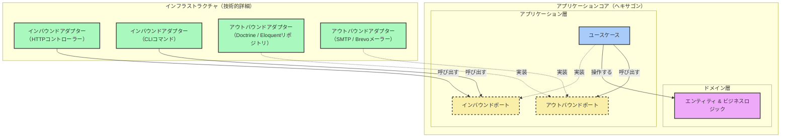

> [English Version](/posts/hexagonal-architecture) · [Version Française](/posts/hexagonal-architecture-fr)

> スライド: [SPA](https://slides.alexvolkihar.ovh/2026/hexagonal-architecture/)（フランス<ruby>語<rt>ご</rt></ruby>のみ）
>
> <Slidev class="inline"/> [**Slidev**](https://github.com/slidevjs/slidev) で<ruby>作成<rt>さくせい</rt></ruby> - presentation slides for developers.

[[toc]]

プロジェクトの<ruby>最初<rt>さいしょ</rt></ruby>の<ruby>数<rt>すう</rt></ruby>ヶ<ruby>月<rt>げつ</rt></ruby>、アーキテクチャは<ruby>大抵<rt>たいてい</rt></ruby>の<ruby>場合<rt>ばあい</rt></ruby>、<ruby>締切<rt>しめきり</rt></ruby>に<ruby>負<rt>ま</rt></ruby>ける。オールインワンのフレームワークを<ruby>選<rt>えら</rt></ruby>び、<ruby>機能<rt>きのう</rt></ruby>をリリースし、そのまま<ruby>前<rt>まえ</rt></ruby>に<ruby>進<rt>すす</rt></ruby>む。ツケは<ruby>後<rt>あと</rt></ruby>になって<ruby>回<rt>まわ</rt></ruby>ってくる――<ruby>保守<rt>ほしゅ</rt></ruby>コストは<ruby>膨<rt>ふく</rt></ruby>らみ、リグレッションは<ruby>積<rt>つ</rt></ruby>み<ruby>重<rt>かさ</rt></ruby>なり、ビジネスロジックはデータベースやサードパーティライブラリ、そしてフレームワーク<ruby>自体<rt>じたい</rt></ruby>にがっちり<ruby>溶接<rt>ようせつ</rt></ruby>されてしまう。

**ヘキサゴナルアーキテクチャ**（*ポート＆アダプター*とも<ruby>呼<rt>よ</rt></ruby>ばれる）は、この<ruby>問題<rt>もんだい</rt></ruby>への<ruby>一<rt>ひと</rt></ruby>つの<ruby>答<rt>こた</rt></ruby>えだ。Alistair Cockburnが2005<ruby>年<rt>ねん</rt></ruby>に<ruby>提唱<rt>ていしょう</rt></ruby>したもので、<ruby>要<rt>よう</rt></ruby>はビジネスロジックがインフラの<ruby>詳細<rt>しょうさい</rt></ruby>に<ruby>一切<rt>いっさい</rt></ruby><ruby>触<rt>ふ</rt></ruby>れないようにアプリケーションを<ruby>構造化<rt>こうぞうか</rt></ruby>する、という<ruby>考<rt>かんが</rt></ruby>え<ruby>方<rt>かた</rt></ruby>だ。

<ruby>以下<rt>いか</rt></ruby>では、<ruby>密結合<rt>みっけつごう</rt></ruby>したコントローラーから<ruby>出発<rt>しゅっぱつ</rt></ruby>し、このパターンが<ruby>実際<rt>じっさい</rt></ruby>に<ruby>何<rt>なに</rt></ruby>を<ruby>要求<rt>ようきゅう</rt></ruby>するのかを<ruby>一<rt>ひと</rt></ruby>つずつ<ruby>確認<rt>かくにん</rt></ruby>しながら、そのコントローラー<ruby>層<rt>そう</rt></ruby>を<ruby>段階的<rt>だんかいてき</rt></ruby>に<ruby>作<rt>つく</rt></ruby>り<ruby>直<rt>なお</rt></ruby>していく。

---

## 1. <ruby>出発点<rt>しゅっぱつてん</rt></ruby>：<ruby>密結合<rt>みっけつごう</rt></ruby>したコード

ユーザー<ruby>登録<rt>とうろく</rt></ruby>を<ruby>処理<rt>しょり</rt></ruby>するPHPのコントローラーを<ruby>見<rt>み</rt></ruby>てみよう。<ruby>特<rt>とく</rt></ruby>に<ruby>変<rt>か</rt></ruby>わったところはなく、おそらく<ruby>皆<rt>みな</rt></ruby>さんが<ruby>書<rt>か</rt></ruby>いたことがある、あるいは<ruby>引<rt>ひ</rt></ruby>き<ruby>継<rt>つ</rt></ruby>いだことのあるコードに<ruby>近<rt>ちか</rt></ruby>いはずだ。

```php
<?php

namespace App\Http\Controllers;

use App\Models\User;
use Illuminate\Http\Request;
use PHPMailer\PHPMailer\PHPMailer;
use PHPMailer\PHPMailer\Exception;

class RegistrationController extends Controller
{
    public function register(Request $request)
    {
        // 1. Direct HTTP validation
        $request->validate([
            'username' => 'required|string|max:255|unique:users',
            'email' => 'required|email|max:255|unique:users',
            'password' => 'required|string|min:8',
        ]);

        // 2. Business logic + Persistence (coupled Eloquent ORM)
        $user = new User();
        $user->username = $request->input('username');
        $user->email = $request->input('email');
        $user->password = password_hash($request->input('password'), PASSWORD_BCRYPT);
        $user->save(); // Direct coupling to the MySQL database via Active Record

        // 3. Email Notification (direct sending via SMTP with PHPMailer)
        $mail = new PHPMailer(true);
        try {
            // Hardcoded SMTP configuration or direct environment variables
            $mail->isSMTP();
            $mail->Host       = env('MAIL_HOST', 'smtp.mailtrap.io');
            $mail->SMTPAuth   = true;
            $mail->Username   = env('MAIL_USERNAME');
            $mail->Password   = env('MAIL_PASSWORD');
            $mail->SMTPSecure = PHPMailer::ENCRYPTION_STARTTLS;
            $mail->Port       = env('MAIL_PORT', 587);

            $mail->setFrom('no-reply@notre-application.com', 'Mon App');
            $mail->addAddress($user->email, $user->username);

            $mail->isHTML(true);
            $mail->Subject = 'Bienvenue sur notre application !';
            $mail->Body    = "<h1>Bonjour {$user->username} !</h1><p>Merci de vous être inscrit.</p>";

            $mail->send();
        } catch (Exception $e) {
            // In case of email sending error, the HTTP response is compromised
            return response()->json(['error' => "Impossible d'envoyer l'email : {$mail->ErrorInfo}"], 500);
        }

        // 4. HTTP response
        return response()->json([
            'message' => 'Utilisateur créé avec succès !',
            'user' => [
                'id' => $user->id,
                'username' => $user->username,
                'email' => $user->email,
            ]
        ], 201);
    }
}
```

### このコードが<ruby>脆<rt>もろ</rt></ruby>い<ruby>理由<rt>りゆう</rt></ruby>

このコントローラーはちゃんと<ruby>動<rt>うご</rt></ruby>く。<ruby>入力<rt>にゅうりょく</rt></ruby>を<ruby>検証<rt>けんしょう</rt></ruby>し、DBに<ruby>保存<rt>ほぞん</rt></ruby>し、ウェルカムメールを<ruby>送<rt>おく</rt></ruby>り、JSONを<ruby>返<rt>かえ</rt></ruby>す。<ruby>問題<rt>もんだい</rt></ruby>が<ruby>表面化<rt>ひょうめんか</rt></ruby>するのは、<ruby>何<rt>なに</rt></ruby>かを<ruby>変更<rt>へんこう</rt></ruby>しなければならなくなった<ruby>日<rt>ひ</rt></ruby>だ。

#### 1. SOLIDを3<ruby>点<rt>てん</rt></ruby>で<ruby>破<rt>やぶ</rt></ruby>っている

**SRP。** `RegistrationController` は、HTTPのシリアライズ、<ruby>入力<rt>にゅうりょく</rt></ruby>バリデーション、ビジネスルール（パスワードのハッシュ<ruby>化<rt>か</rt></ruby>）、Eloquent<ruby>経由<rt>けいゆ</rt></ruby>のDBアクセス、SMTP<ruby>設定<rt>せってい</rt></ruby>、レスポンスのフォーマットを<ruby>一手<rt>いって</rt></ruby>に<ruby>引<rt>ひ</rt></ruby>き<ruby>受<rt>う</rt></ruby>けている。このどれか<ruby>一<rt>ひと</rt></ruby>つを<ruby>変更<rt>へんこう</rt></ruby>するだけで、このクラスを<ruby>編集<rt>へんしゅう</rt></ruby>することになる。

**OCP。** PHPMailerからMailgun、Brevo、AWS SESに<ruby>乗<rt>の</rt></ruby>り<ruby>換<rt>か</rt></ruby>えるには、クラスを<ruby>開<rt>ひら</rt></ruby>いて<ruby>中身<rt>なかみ</rt></ruby>を<ruby>書<rt>か</rt></ruby>き<ruby>換<rt>か</rt></ruby>える<ruby>必要<rt>ひつよう</rt></ruby>がある。ユーザー<ruby>管理<rt>かんり</rt></ruby>がMySQLのテーブルから<ruby>認証<rt>にんしょう</rt></ruby>マイクロサービスに<ruby>移<rt>うつ</rt></ruby>る<ruby>場合<rt>ばあい</rt></ruby>も<ruby>同<rt>おな</rt></ruby>じことが<ruby>起<rt>お</rt></ruby>きる。

**DIP。** 「ユーザーを<ruby>登録<rt>とうろく</rt></ruby>する」という<ruby>高<rt>こう</rt></ruby>レベルの<ruby>操作<rt>そうさ</rt></ruby>が、MySQL<ruby>用<rt>よう</rt></ruby>のEloquentやSMTP<ruby>用<rt>よう</rt></ruby>のPHPMailerといった<ruby>低<rt>てい</rt></ruby>レベルの<ruby>詳細<rt>しょうさい</rt></ruby>に<ruby>直接<rt>ちょくせつ</rt></ruby><ruby>依存<rt>いぞん</rt></ruby>している。ビジネスコードはどちらの<ruby>選択<rt>せんたく</rt></ruby>にも<ruby>口出<rt>くちだ</rt></ruby>しできない。

#### 2. ユニットテストができない

ユーザー<ruby>作成<rt>さくせい</rt></ruby>ロジックを<ruby>動<rt>うご</rt></ruby>かすには、<ruby>本物<rt>ほんもの</rt></ruby>のデータベース（あるいはEloquentのクエリをインターセプトする<ruby>大量<rt>たいりょう</rt></ruby>のLaravelモック）に<ruby>加<rt>くわ</rt></ruby>えて、<ruby>本物<rt>ほんもの</rt></ruby>のSMTPサーバー、もしくはMailtrap、あるいはPHPMailerのグローバル<ruby>変数<rt>へんすう</rt></ruby>を<ruby>力技<rt>ちからわざ</rt></ruby>でモックする<ruby>仕組<rt>しく</rt></ruby>みが<ruby>必要<rt>ひつよう</rt></ruby>になる。

<ruby>登録<rt>とうろく</rt></ruby>ルールだけを1ミリ<ruby>秒<rt>びょう</rt></ruby>で<ruby>終<rt>お</rt></ruby>わるテストとして<ruby>単独<rt>たんどく</rt></ruby>で<ruby>実行<rt>じっこう</rt></ruby>する<ruby>方法<rt>ほうほう</rt></ruby>はない。<ruby>結局<rt>けっきょく</rt></ruby><ruby>書<rt>か</rt></ruby>くことになるテストは<ruby>遅<rt>おそ</rt></ruby>く、<ruby>壊<rt>こわ</rt></ruby>れやすい。

#### 3. フレームワークに<ruby>溶接<rt>ようせつ</rt></ruby>されている

`Request`、`Response`、Eloquent、`env()`ヘルパー――このビジネスコードは<ruby>事実上<rt>じじつじょう</rt></ruby>Laravelのコードだ。<ruby>同<rt>おな</rt></ruby>じロジックをSymfonyやCLIコマンド、<ruby>非同期<rt>ひどうき</rt></ruby>ワーカーに<ruby>移<rt>うつ</rt></ruby>そうとしても、ほとんど<ruby>何<rt>なに</rt></ruby>も<ruby>生<rt>い</rt></ruby>き<ruby>残<rt>のこ</rt></ruby>らない。

---

## 2. ヘキサゴナルアーキテクチャとは<ruby>何<rt>なに</rt></ruby>か

<ruby>目的<rt>もくてき</rt></ruby>は、ビジネスコードをそれ<ruby>以外<rt>いがい</rt></ruby>のすべてから<ruby>切<rt>き</rt></ruby>り<ruby>離<rt>はな</rt></ruby>すことにある。アプリケーションは<ruby>閉<rt>と</rt></ruby>じたシステム、いわば「アプリケーションコア」になり、<ruby>外<rt>そと</rt></ruby>の<ruby>世界<rt>せかい</rt></ruby>とは<ruby>自分自身<rt>じぶんじしん</rt></ruby>が<ruby>定義<rt>ていぎ</rt></ruby>した<ruby>契約<rt>けいやく</rt></ruby>を<ruby>通<rt>とお</rt></ruby>してのみやり<ruby>取<rt>と</rt></ruby>りする。

### 4つの<ruby>構成要素<rt>こうせいようそ</rt></ruby>

プロジェクトは、ドメインとアプリケーションを<ruby>中心<rt>ちゅうしん</rt></ruby>に<ruby>配置<rt>はいち</rt></ruby>された<ruby>層<rt>そう</rt></ruby>に<ruby>分割<rt>ぶんかつ</rt></ruby>される。



#### 1. ドメイン

ヘキサゴンの<ruby>中心<rt>ちゅうしん</rt></ruby>。エンティティ、<ruby>値<rt>あたい</rt></ruby>オブジェクト、ドメインサービスがここに<ruby>置<rt>お</rt></ruby>かれる。

- ビジネスルールを<ruby>保持<rt>ほじ</rt></ruby>する。ユーザーは<ruby>有効<rt>ゆうこう</rt></ruby>なメールアドレスを<ruby>持<rt>も</rt></ruby>たなければならない、パスワードは<ruby>一定<rt>いってい</rt></ruby>の<ruby>強度<rt>きょうど</rt></ruby><ruby>基準<rt>きじゅん</rt></ruby>を<ruby>満<rt>み</rt></ruby>たさなければならない、といった<ruby>具合<rt>ぐあい</rt></ruby>だ。
- **<ruby>外部<rt>がいぶ</rt></ruby><ruby>依存<rt>いぞん</rt></ruby>を<ruby>一切<rt>いっさい</rt></ruby><ruby>持<rt>も</rt></ruby>たない**。フレームワーク、データベース、PHPMailer、HTTPについて<ruby>何<rt>なに</rt></ruby>も<ruby>知<rt>し</rt></ruby>らない。ただのPHPオブジェクト、それ<ruby>以上<rt>いじょう</rt></ruby>でもそれ<ruby>以下<rt>いか</rt></ruby>でもない。

#### 2. アプリケーション<ruby>層<rt>そう</rt></ruby>

<ruby>制御<rt>せいぎょ</rt></ruby>フローが<ruby>実際<rt>じっさい</rt></ruby>に<ruby>生<rt>い</rt></ruby>きる<ruby>場所<rt>ばしょ</rt></ruby>で、ユースケース（アプリケーションサービスと<ruby>呼<rt>よ</rt></ruby>ぶ<ruby>人<rt>ひと</rt></ruby>もいる）として<ruby>表現<rt>ひょうげん</rt></ruby>される。

- ユースケースとは、ユーザーや<ruby>他<rt>ほか</rt></ruby>のシステムが<ruby>実行<rt>じっこう</rt></ruby>できる<ruby>一<rt>ひと</rt></ruby>つのアクションのことで、<ruby>例<rt>たと</rt></ruby>えば `RegisterUser` がそれにあたる。
- リクエストを<ruby>受<rt>う</rt></ruby>け<ruby>取<rt>と</rt></ruby>り、ドメインエンティティを<ruby>協調<rt>きょうちょう</rt></ruby>させ、<ruby>外<rt>そと</rt></ruby>の<ruby>世界<rt>せかい</rt></ruby>にはインターフェース<ruby>越<rt>ご</rt></ruby>しにしか<ruby>触<rt>ふ</rt></ruby>れない――DBへの<ruby>保存<rt>ほぞん</rt></ruby>、メール<ruby>送信<rt>そうしん</rt></ruby>など。

#### 3. ポート

ポートは<ruby>境界線<rt>きょうかいせん</rt></ruby>そのものだ。コアが<ruby>外部<rt>がいぶ</rt></ruby>とどうやり<ruby>取<rt>と</rt></ruby>りするかを<ruby>定<rt>さだ</rt></ruby>めるPHPの `interface` であり、2<ruby>種類<rt>しゅるい</rt></ruby>に<ruby>分<rt>わ</rt></ruby>かれる。

インバウンドポート（ドライビングポートとも<ruby>呼<rt>よ</rt></ruby>ばれる）は、<ruby>外部<rt>がいぶ</rt></ruby>がコア<ruby>内<rt>ない</rt></ruby>の<ruby>何<rt>なに</rt></ruby>かをどうやってトリガーできるかを<ruby>示<rt>しめ</rt></ruby>す。`RegisterUserInterface` はその<ruby>一例<rt>いちれい</rt></ruby>だ。アウトバウンドポート（ドリブンポート）は、コアが<ruby>処理<rt>しょり</rt></ruby>を<ruby>完了<rt>かんりょう</rt></ruby>するために<ruby>何<rt>なに</rt></ruby>を<ruby>必要<rt>ひつよう</rt></ruby>としているかを<ruby>示<rt>しめ</rt></ruby>すが、どうやってそれを<ruby>提供<rt>ていきょう</rt></ruby>するかは<ruby>規定<rt>きてい</rt></ruby>しない――ユーザーを<ruby>保存<rt>ほぞん</rt></ruby>するための `UserRepositoryInterface`、メールを<ruby>送<rt>おく</rt></ruby>るための `MailerInterface` などがそれにあたる。

#### 4. アダプター

アダプターはヘキサゴンの<ruby>外側<rt>そとがわ</rt></ruby>、インフラ<ruby>層<rt>そう</rt></ruby>に<ruby>存在<rt>そんざい</rt></ruby>し、あるテクノロジーとポートの<ruby>間<rt>あいだ</rt></ruby>を<ruby>橋渡<rt>はしわた</rt></ruby>しする。

インバウンドアダプターは<ruby>外部<rt>がいぶ</rt></ruby>からの<ruby>刺激<rt>しげき</rt></ruby>を<ruby>受<rt>う</rt></ruby>け<ruby>取<rt>と</rt></ruby>り、それをインバウンドポートへの<ruby>呼<rt>よ</rt></ruby>び<ruby>出<rt>だ</rt></ruby>しに<ruby>変換<rt>へんかん</rt></ruby>する――LaravelのHTTPコントローラー、Symfonyのコンソールコマンド、RabbitMQのコンシューマーなどだ。アウトバウンドアダプターはアウトバウンドポートを<ruby>実装<rt>じっそう</rt></ruby>し、<ruby>実際<rt>じっさい</rt></ruby>の<ruby>技術的<rt>ぎじゅつてき</rt></ruby>な<ruby>作業<rt>さぎょう</rt></ruby>を<ruby>行<rt>おこな</rt></ruby>う――`UserRepositoryInterface` を<ruby>実装<rt>じっそう</rt></ruby>する `EloquentUserRepository`、`MailerInterface` を<ruby>実装<rt>じっそう</rt></ruby>する `BrevoMailer`、そしてテストのためだけに<ruby>存在<rt>そんざい</rt></ruby>する `InMemoryUserRepository` などがそれにあたる。

---

### <ruby>依存性逆転<rt>いぞんせいぎゃくてん</rt></ruby>の<ruby>原則<rt>げんそく</rt></ruby>

これらすべては、たった<ruby>一<rt>ひと</rt></ruby>つの<ruby>原則<rt>げんそく</rt></ruby>の<ruby>上<rt>うえ</rt></ruby>に<ruby>成<rt>な</rt></ruby>り<ruby>立<rt>た</rt></ruby>っている。

<ruby>従来<rt>じゅうらい</rt></ruby>のレイヤードアーキテクチャでは、<ruby>各層<rt>かくそう</rt></ruby>はその<ruby>下<rt>した</rt></ruby>の<ruby>層<rt>そう</rt></ruby>に<ruby>依存<rt>いぞん</rt></ruby>する――コントローラー、<ruby>次<rt>つぎ</rt></ruby>にサービス、そしてORM<ruby>経由<rt>けいゆ</rt></ruby>のデータベース、という<ruby>具合<rt>ぐあい</rt></ruby>だ。

ここでは、インフラがコアの<ruby>内側<rt>うちがわ</rt></ruby>で<ruby>宣言<rt>せんげん</rt></ruby>されたインターフェースに<ruby>依存<rt>いぞん</rt></ruby>する。これによって、<ruby>実行<rt>じっこう</rt></ruby>フローの<ruby>向<rt>む</rt></ruby>きと<ruby>依存関係<rt>いぞんかんけい</rt></ruby>の<ruby>向<rt>む</rt></ruby>きが<ruby>切<rt>き</rt></ruby>り<ruby>離<rt>はな</rt></ruby>される。<ruby>実行時<rt>じっこうじ</rt></ruby>には、HTTPコントローラーがユースケースを<ruby>呼<rt>よ</rt></ruby>び<ruby>出<rt>だ</rt></ruby>し、ユースケースがデータベースアダプターを<ruby>呼<rt>よ</rt></ruby>び<ruby>出<rt>だ</rt></ruby>す。コード<ruby>上<rt>じょう</rt></ruby>では、データベースアダプターはアプリケーション<ruby>層<rt>そう</rt></ruby>に<ruby>存在<rt>そんざい</rt></ruby>する `UserRepositoryInterface` に<ruby>依存<rt>いぞん</rt></ruby>している。<ruby>依存<rt>いぞん</rt></ruby>は<ruby>内側<rt>うちがわ</rt></ruby>を<ruby>向<rt>む</rt></ruby>き、<ruby>呼<rt>よ</rt></ruby>び<ruby>出<rt>だ</rt></ruby>しは<ruby>外側<rt>そとがわ</rt></ruby>を<ruby>向<rt>む</rt></ruby>く。

> [!IMPORTANT]
> ビジネスロジックを<ruby>守<rt>まも</rt></ruby>っているのは、まさにこの<ruby>依存性逆転<rt>いぞんせいぎゃくてん</rt></ruby>だ。ドメインとアプリケーションが<ruby>必要<rt>ひつよう</rt></ruby>とする<ruby>契約<rt>けいやく</rt></ruby>を<ruby>宣言<rt>せんげん</rt></ruby>し、インフラがそれを<ruby>実装<rt>じっそう</rt></ruby>する。<ruby>外側<rt>そとがわ</rt></ruby>が<ruby>内側<rt>うちがわ</rt></ruby>に<ruby>依存<rt>いぞん</rt></ruby>するのであって、その<ruby>逆<rt>ぎゃく</rt></ruby>は<ruby>決<rt>けっ</rt></ruby>してない。

この<ruby>後<rt>あと</rt></ruby>の<ruby>内容<rt>ないよう</rt></ruby>は、この<ruby>規則<rt>きそく</rt></ruby>に<ruby>沿<rt>そ</rt></ruby>ってスパゲッティコントローラーをリファクタリングしていく。

---

## 3. コア：ドメインとポート

まずは<ruby>中心<rt>ちゅうしん</rt></ruby>から<ruby>始<rt>はじ</rt></ruby>めよう。

### ドメイン

ドメインはルールだけを<ruby>保持<rt>ほじ</rt></ruby>し、それ<ruby>以外<rt>いがい</rt></ruby>は<ruby>何<rt>なに</rt></ruby>も<ruby>持<rt>も</rt></ruby>たない。フレームワークもデータベースもない<ruby>素<rt>す</rt></ruby>のPHPで、<ruby>不変条件<rt>ふへんじょうけん</rt></ruby>（インバリアント）が<ruby>確実<rt>かくじつ</rt></ruby>に<ruby>守<rt>まも</rt></ruby>られるようにする<ruby>責任<rt>せきにん</rt></ruby>を<ruby>負<rt>お</rt></ruby>う。

#### 1. ビジネス<ruby>例外<rt>れいがい</rt></ruby>

まずは、<ruby>技術的<rt>ぎじゅつてき</rt></ruby>なエラーではなく<ruby>機能的<rt>きのうてき</rt></ruby>なエラーをモデル<ruby>化<rt>か</rt></ruby>する<ruby>例外<rt>れいがい</rt></ruby>から<ruby>始<rt>はじ</rt></ruby>める。

```php
<?php

namespace App\Domain\Exception;

class InvalidEmailException extends \DomainException
{
    public function __construct(string $email)
    {
        parent::__construct(sprintf('The email address "%s" is not valid.', $email));
    }
}
```

```php
<?php

namespace App\Domain\Exception;

class WeakPasswordException extends \DomainException
{
    public function __construct()
    {
        parent::__construct('The password is too weak. It must contain at least 8 characters.');
    }
}
```

#### 2. `User` エンティティ

このエンティティは<ruby>不変条件<rt>ふへんじょうけん</rt></ruby>そのものを<ruby>保有<rt>ほゆう</rt></ruby>する――<ruby>有効<rt>ゆうこう</rt></ruby>なメールアドレス、<ruby>十分<rt>じゅうぶん</rt></ruby>な<ruby>強度<rt>きょうど</rt></ruby>のパスワード、そして<ruby>値<rt>あたい</rt></ruby>が<ruby>保存<rt>ほぞん</rt></ruby>される<ruby>前<rt>まえ</rt></ruby>に<ruby>必<rt>かなら</rt></ruby>ずハッシュ<ruby>化<rt>か</rt></ruby>されること。

```php
<?php

namespace App\Domain\Entity;

use App\Domain\Exception\InvalidEmailException;
use App\Domain\Exception\WeakPasswordException;

class User
{
    private string $id;
    private string $username;
    private string $email;
    private string $passwordHash;

    public function __construct(
        string $id,
        string $username,
        string $email,
        string $plainPassword
    ) {
        $this->id = $id;

        if (empty(trim($username))) {
            throw new \DomainException("Username cannot be empty.");
        }
        $this->username = $username;

        $this->setEmail($email);
        $this->setPassword($plainPassword);
    }

    public function getId(): string
    {
        return $this->id;
    }

    public function getUsername(): string
    {
        return $this->username;
    }

    public function getEmail(): string
    {
        return $this->email;
    }

    public function getPasswordHash(): string
    {
        return $this->passwordHash;
    }

    private function setEmail(string $email): void
    {
        if (!filter_var($email, FILTER_VALIDATE_EMAIL)) {
            throw new InvalidEmailException($email);
        }
        $this->email = $email;
    }

    private function setPassword(string $plainPassword): void
    {
        if (strlen($plainPassword) < 8) {
            throw new WeakPasswordException();
        }
        
        // Password hashing is an essential business security rule.
        $this->passwordHash = password_hash($plainPassword, PASSWORD_BCRYPT);
    }
}
```

---

### ポート

ポートは、ヘキサゴンがそれを<ruby>通<rt>とお</rt></ruby>してやり<ruby>取<rt>と</rt></ruby>りする<ruby>契約<rt>けいやく</rt></ruby>だ。ドメインまたはユースケースが<ruby>必要<rt>ひつよう</rt></ruby>なものを<ruby>宣言<rt>せんげん</rt></ruby>し、それがどう<ruby>提供<rt>ていきょう</rt></ruby>されるかはどちらも<ruby>知<rt>し</rt></ruby>らない。

#### 1. `UserRepositoryInterface`、アウトバウンドポート

ヘキサゴンがユーザーを<ruby>保存<rt>ほぞん</rt></ruby>・<ruby>検索<rt>けんさく</rt></ruby>するために<ruby>必要<rt>ひつよう</rt></ruby>なものすべて。

```php
<?php

namespace App\Domain\Repository;

use App\Domain\Entity\User;

interface UserRepositoryInterface
{
    public function save(User $user): void;
    public function findByEmail(string $email): ?User;
    public function existsByUsername(string $username): bool;
}
```

#### 2. `MailerInterface`、アウトバウンドポート

そして、<ruby>登録完了<rt>とうろくかんりょう</rt></ruby><ruby>後<rt>ご</rt></ruby>にユーザーへ<ruby>通知<rt>つうち</rt></ruby>する<ruby>能力<rt>のうりょく</rt></ruby>。

```php
<?php

namespace App\Domain\Gateway;

use App\Domain\Entity\User;

interface MailerInterface
{
    public function sendWelcomeEmail(User $user): void;
}
```

---

## 4. アプリケーション<ruby>層<rt>そう</rt></ruby>

この<ruby>層<rt>そう</rt></ruby>はユースケースを<ruby>調整<rt>ちょうせい</rt></ruby>する。<ruby>依存<rt>いぞん</rt></ruby>するのはドメインとポートのみで、それ<ruby>以外<rt>いがい</rt></ruby>には<ruby>何<rt>なに</rt></ruby>も<ruby>依存<rt>いぞん</rt></ruby>しない。

### データ<ruby>転送<rt>てんそう</rt></ruby>オブジェクト（DTO）

DTOは、<ruby>構造化<rt>こうぞうか</rt></ruby>された<ruby>不変<rt>ふへん</rt></ruby>な<ruby>形<rt>かたち</rt></ruby>でデータを<ruby>出入<rt>でい</rt></ruby>りさせる<ruby>役割<rt>やくわり</rt></ruby>を<ruby>持<rt>も</rt></ruby>ち、アプリケーションがHTTPリクエストやフレームワーク<ruby>固有<rt>こゆう</rt></ruby>の<ruby>型<rt>かた</rt></ruby>を<ruby>直接<rt>ちょくせつ</rt></ruby><ruby>目<rt>め</rt></ruby>にすることはない。

#### 1. `RegisterUserRequest`

```php
<?php

namespace App\Application\DTO;

readonly class RegisterUserRequest
{
    public function __construct(
        public string $username,
        public string $email,
        public string $password
    ) {}
}
```

#### 2. `RegisterUserResponse`

```php
<?php

namespace App\Application\DTO;

use App\Domain\Entity\User;

readonly class RegisterUserResponse
{
    public function __construct(
        public string $id,
        public string $username,
        public string $email
    ) {}

    public static function fromEntity(User $user): self
    {
        return new self(
            $user->getId(),
            $user->getUsername(),
            $user->getEmail()
        );
    }
}
```

### ユースケース：`RegisterUser`

ユーザー<ruby>作成<rt>さくせい</rt></ruby>を<ruby>統括<rt>とうかつ</rt></ruby>するクラス。2つのポートはどちらもコンストラクタ<ruby>経由<rt>けいゆ</rt></ruby>で<ruby>渡<rt>わた</rt></ruby>される。

```php
<?php

namespace App\Application\UseCase;

use App\Application\DTO\RegisterUserRequest;
use App\Application\DTO\RegisterUserResponse;
use App\Domain\Entity\User;
use App\Domain\Repository\UserRepositoryInterface;
use App\Domain\Gateway\MailerInterface;

class RegisterUser
{
    public function __construct(
        private UserRepositoryInterface $userRepository,
        private MailerInterface $mailer
    ) {}

    public function execute(RegisterUserRequest $request): RegisterUserResponse
    {
        // 1. Validation of uniqueness rules (requiring the UserRepository port)
        if ($this->userRepository->existsByUsername($request->username)) {
            throw new \DomainException("This username is already taken.");
        }

        if ($this->userRepository->findByEmail($request->email) !== null) {
            throw new \DomainException("This email address is already registered.");
        }

        // 2. Generation of a unique identifier (UUID-like)
        $id = bin2hex(random_bytes(16));

        // 3. Creation of the Domain entity (implicitly validating invariants)
        $user = new User(
            $id,
            $request->username,
            $request->email,
            $request->password
        );

        // 4. Persistence via the Port
        $this->userRepository->save($user);

        // 5. Sending the welcome email via the Port
        $this->mailer->sendWelcomeEmail($user);

        // 6. Return of the response DTO
        return RegisterUserResponse::fromEntity($user);
    }
}
```

> [!NOTE]
> **トランザクションの<ruby>安全性<rt>あんぜんせい</rt></ruby>と<ruby>副作用<rt>ふくさよう</rt></ruby>：** この<ruby>例<rt>れい</rt></ruby>では、<ruby>保存<rt>ほぞん</rt></ruby>の<ruby>直後<rt>ちょくご</rt></ruby>にメールを<ruby>送信<rt>そうしん</rt></ruby>している。<ruby>本番環境<rt>ほんばんかんきょう</rt></ruby>でSMTPに<ruby>障害<rt>しょうがい</rt></ruby>が<ruby>起<rt>お</rt></ruby>きると、ユーザーは<ruby>既<rt>すで</rt></ruby>にDBに<ruby>存在<rt>そんざい</rt></ruby>するにもかかわらず、ユースケース<ruby>自体<rt>じたい</rt></ruby>は<ruby>例外<rt>れいがい</rt></ruby>を<ruby>投<rt>な</rt></ruby>げてしまう。よくある<ruby>解決策<rt>かいけつさく</rt></ruby>は、**ドメインイベント**と**アウトボックス**パターンを<ruby>組<rt>く</rt></ruby>み<ruby>合<rt>あ</rt></ruby>わせ、メール<ruby>送信<rt>そうしん</rt></ruby>を<ruby>非同期<rt>ひどうき</rt></ruby>に<ruby>切<rt>き</rt></ruby>り<ruby>出<rt>だ</rt></ruby>してリトライ<ruby>可能<rt>かのう</rt></ruby>にすることだ。

---

## 5. インフラストラクチャ<ruby>層<rt>そう</rt></ruby>

インフラは、ポートの<ruby>具体的<rt>ぐたいてき</rt></ruby>な<ruby>実装<rt>じっそう</rt></ruby>と、コアを<ruby>起動<rt>きどう</rt></ruby>するエントリーポイントを<ruby>保持<rt>ほじ</rt></ruby>する。

### アウトバウンドアダプター

これらはアウトバウンドポートを、SQLやSMTPといった<ruby>実際<rt>じっさい</rt></ruby>の<ruby>技術<rt>ぎじゅつ</rt></ruby>に<ruby>対<rt>たい</rt></ruby>して<ruby>実装<rt>じっそう</rt></ruby>する。

#### 1. `SqlUserRepository`、PDO<ruby>経由<rt>けいゆ</rt></ruby>

```php
<?php

namespace App\Infrastructure\Adapter\Persistence;

use App\Domain\Entity\User;
use App\Domain\Repository\UserRepositoryInterface;
use PDO;

class SqlUserRepository implements UserRepositoryInterface
{
    public function __construct(private PDO $pdo)
    {}

    public function save(User $user): void
    {
        $stmt = $this->pdo->prepare('
            INSERT INTO users (id, username, email, password_hash)
            VALUES (:id, :username, :email, :password_hash)
        ');

        $stmt->execute([
            'id' => $user->getId(),
            'username' => $user->getUsername(),
            'email' => $user->getEmail(),
            'password_hash' => $user->getPasswordHash(),
        ]);
    }

    public function findByEmail(string $email): ?User
    {
        $stmt = $this->pdo->prepare('SELECT * FROM users WHERE email = :email LIMIT 1');
        $stmt->execute(['email' => $email]);
        $row = $stmt->fetch(PDO::FETCH_ASSOC);

        if (!$row) {
            return null;
        }

        return $this->reconstituteEntity($row);
    }

    public function existsByUsername(string $username): bool
    {
        $stmt = $this->pdo->prepare('SELECT COUNT(*) FROM users WHERE username = :username');
        $stmt->execute(['username' => $username]);
        return (int) $stmt->fetchColumn() > 0;
    }

    /**
     * Reconstitutes a User entity from database data.
     * This method bypasses password hashing and validation of the plain password.
     */
    private function reconstituteEntity(array $row): User
    {
        $reflection = new \ReflectionClass(User::class);
        $user = $reflection->newInstanceWithoutConstructor();

        $properties = [
            'id' => $row['id'],
            'username' => $row['username'],
            'email' => $row['email'],
            'passwordHash' => $row['password_hash'],
        ];

        foreach ($properties as $name => $value) {
            $property = $reflection->getProperty($name);
            $property->setAccessible(true);
            $property->setValue($user, $value);
        }

        return $user;
    }
}
```

#### 2. `SmtpMailer`、Symfony Mailer<ruby>経由<rt>けいゆ</rt></ruby>

```php
<?php

namespace App\Infrastructure\Adapter\Mailer;

use App\Domain\Entity\User;
use App\Domain\Gateway\MailerInterface;
use Symfony\Component\Mailer\MailerInterface as SymfonyMailerInterface;
use Symfony\Component\Mime\Email;

class SmtpMailer implements MailerInterface
{
    public function __construct(private SymfonyMailerInterface $symfonyMailer)
    {}

    public function sendWelcomeEmail(User $user): void
    {
        $email = (new Email())
            ->from('no-reply@our-application.com')
            ->to($user->getEmail())
            ->subject('Welcome to our application!')
            ->html(sprintf(
                '<h1>Hello %s!</h1><p>Thank you for registering.</p>',
                htmlspecialchars($user->getUsername(), ENT_QUOTES, 'UTF-8')
            ));

        $this->symfonyMailer->send($email);
    }
}
```

---

### インバウンドアダプター

これらは<ruby>外部<rt>がいぶ</rt></ruby>からの<ruby>刺激<rt>しげき</rt></ruby>を<ruby>受<rt>う</rt></ruby>け<ruby>取<rt>と</rt></ruby>り、リクエストの<ruby>形<rt>かたち</rt></ruby>を<ruby>検証<rt>けんしょう</rt></ruby>してからユースケースを<ruby>呼<rt>よ</rt></ruby>び<ruby>出<rt>だ</rt></ruby>す。

#### 1. `RegisterUserController`

HTTPリクエストをデコードし、DTOを<ruby>組<rt>く</rt></ruby>み<ruby>立<rt>た</rt></ruby>て、ユースケースを<ruby>実行<rt>じっこう</rt></ruby>する。`DomainException` は `422 Unprocessable Entity` として<ruby>返<rt>かえ</rt></ruby>され、ドメイン<ruby>自身<rt>じしん</rt></ruby>のメッセージがそのまま<ruby>乗<rt>の</rt></ruby>る。

```php
<?php

namespace App\Infrastructure\Adapter\Http;

use App\Application\DTO\RegisterUserRequest;
use App\Application\UseCase\RegisterUser;
use Nyholm\Psr7\Response;
use Psr\Http\Message\ResponseInterface;
use Psr\Http\Message\ServerRequestInterface;

class RegisterUserController
{
    public function __construct(private RegisterUser $registerUserUseCase)
    {}

    public function __invoke(ServerRequestInterface $request): ResponseInterface
    {
        $body = json_decode((string) $request->getBody(), true) ?? [];

        // 1. HTTP request validation
        if (empty($body['username']) || empty($body['email']) || empty($body['password'])) {
            return new Response(400, ['Content-Type' => 'application/json'], json_encode([
                'error' => 'The username, email, and password fields are required.'
            ]));
        }

        try {
            // 2. DTO creation
            $useCaseRequest = new RegisterUserRequest(
                username: $body['username'],
                email: $body['email'],
                password: $body['password']
            );

            // 3. Calling the use case
            $response = $this->registerUserUseCase->execute($useCaseRequest);

            // 4. Success response
            return new Response(201, ['Content-Type' => 'application/json'], json_encode([
                'message' => 'User created successfully!',
                'user' => [
                    'id' => $response->id,
                    'username' => $response->username,
                    'email' => $response->email,
                ]
            ]));
        } catch (\DomainException $e) {
            // Domain exceptions are translated into HTTP status code 422
            return new Response(422, ['Content-Type' => 'application/json'], json_encode([
                'error' => $e->getMessage()
            ]));
        } catch (\Throwable $e) {
            // Unforeseen technical exceptions are hidden (HTTP 500)
            return new Response(500, ['Content-Type' => 'application/json'], json_encode([
                'error' => 'An internal error occurred.'
            ]));
        }
    }
}
```

#### 2. `RegisterUserCommand`

2つ<ruby>目<rt>め</rt></ruby>のエントリーポイントとして、<ruby>今度<rt>こんど</rt></ruby>はコンソールが<ruby>同<rt>おな</rt></ruby>じユースケースに<ruby>接続<rt>せつぞく</rt></ruby>される。ビジネスコードは<ruby>一行<rt>いちぎょう</rt></ruby>も<ruby>変<rt>か</rt></ruby>わらない。

```php
<?php

namespace App\Infrastructure\Adapter\Cli;

use App\Application\DTO\RegisterUserRequest;
use App\Application\UseCase\RegisterUser;
use Symfony\Component\Console\Attribute\AsCommand;
use Symfony\Component\Console\Command\Command;
use Symfony\Component\Console\Input\InputArgument;
use Symfony\Component\Console\Input\InputInterface;
use Symfony\Component\Console\Output\OutputInterface;
use Symfony\Component\Console\Style\SymfonyStyle;

#[AsCommand(name: 'app:register-user', description: 'Registers a new user.')]
class RegisterUserCommand extends Command
{
    public function __construct(private RegisterUser $registerUserUseCase)
    {
        parent::__construct();
    }

    protected function configure(): void
    {
        $this
            ->addArgument('username', InputArgument::REQUIRED, 'The username')
            ->addArgument('email', InputArgument::REQUIRED, 'The email address')
            ->addArgument('password', InputArgument::REQUIRED, 'The password');
    }

    protected function execute(InputInterface $input, OutputInterface $output): int
    {
        $io = new SymfonyStyle($input, $output);

        $username = $input->getArgument('username');
        $email = $input->getArgument('email');
        $password = $input->getArgument('password');

        try {
            $useCaseRequest = new RegisterUserRequest($username, $email, $password);
            $response = $this->registerUserUseCase->execute($useCaseRequest);

            $io->success(sprintf(
                'User created successfully! ID: %s, Name: %s, Email: %s',
                $response->id,
                $response->username,
                $response->email
            ));

            return Command::SUCCESS;
        } catch (\DomainException $e) {
            $io->error($e->getMessage());
            return Command::FAILURE;
        } catch (\Throwable $e) {
            $io->error('An unexpected error occurred: ' . $e->getMessage());
            return Command::INVALID;
        }
    }
}
```

---

## 6. ディレクトリ<ruby>構成<rt>こうせい</rt></ruby>と<ruby>配線<rt>はいせん</rt></ruby>

<ruby>残<rt>のこ</rt></ruby>るのは2つ――<ruby>各層<rt>かくそう</rt></ruby>に<ruby>対応<rt>たいおう</rt></ruby>したディレクトリ<ruby>構成<rt>こうせい</rt></ruby>と、どのアダプターがどのポートに<ruby>応答<rt>おうとう</rt></ruby>するかを<ruby>知<rt>し</rt></ruby>っているDIコンテナだ。

### ディレクトリ<ruby>構成<rt>こうせい</rt></ruby>

モダンなPHPアプリケーションにおいて、<ruby>各層<rt>かくそう</rt></ruby>が `src/` の<ruby>中<rt>なか</rt></ruby>にどう<ruby>配置<rt>はいち</rt></ruby>されるかを<ruby>見<rt>み</rt></ruby>てみよう。

```text
src/
├── Domain/
│   ├── Entity/
│   │   └── User.php
│   ├── ValueObject/
│   │   └── Email.php (optional)
│   ├── Exception/
│   │   ├── InvalidEmailException.php
│   │   └── WeakPasswordException.php
│   ├── Repository/         <-- アウトバウンドポート（Driven Ports）
│   │   └── UserRepositoryInterface.php
│   └── Gateway/            <-- サードパーティサービス向けのアウトバウンドポート
│       └── MailerInterface.php
├── Application/
│   ├── UseCase/            <-- ヘキサゴンのユースケース
│   │   └── RegisterUser.php
│   └── DTO/                <-- データ転送オブジェクト
│       ├── RegisterUserRequest.php
│       └── RegisterUserResponse.php
└── Infrastructure/
    ├── Adapter/            <-- 具体的なアダプター
    │   ├── Http/           <-- インバウンド（Driving）：コントローラー
    │   │   └── RegisterUserController.php
    │   ├── Cli/            <-- インバウンド（Driving）：コンソールコマンド
    │   │   └── RegisterUserCommand.php
    │   ├── Persistence/    <-- アウトバウンド（Driven）：ORM、SQL、インメモリ
    │   │   ├── SqlUserRepository.php
    │   │   └── InMemoryUserRepository.php
    │   └── Mailer/         <-- アウトバウンド（Driven）：SMTP、Brevoなど
    │       └── SmtpMailer.php
    └── Share/              <-- 共有コードと横断的なユーティリティ
```

この<ruby>分離<rt>ぶんり</rt></ruby>は<ruby>概念的<rt>がいねんてき</rt></ruby>なだけでなく、<ruby>物理的<rt>ぶつりてき</rt></ruby>でもある。プロジェクトを<ruby>初<rt>はじ</rt></ruby>めて<ruby>開<rt>ひら</rt></ruby>いた<ruby>人<rt>ひと</rt></ruby>でも、<ruby>一行<rt>いちぎょう</rt></ruby>のコードも<ruby>読<rt>よ</rt></ruby>まずに、ビジネスルールとオーケストレーションと<ruby>技術的<rt>ぎじゅつてき</rt></ruby><ruby>詳細<rt>しょうさい</rt></ruby>を<ruby>見分<rt>みわ</rt></ruby>けられる。

### <ruby>配線<rt>はいせん</rt></ruby>

ヘキサゴンはインフラのクラスを<ruby>直接<rt>ちょくせつ</rt></ruby>インスタンス<ruby>化<rt>か</rt></ruby>することは<ruby>決<rt>けっ</rt></ruby>してない。インターフェースに<ruby>依存<rt>いぞん</rt></ruby>し、フレームワークのDIコンテナがそれを<ruby>実行時<rt>じっこうじ</rt></ruby>に<ruby>解決<rt>かいけつ</rt></ruby>する。

#### オプションA：Symfony（`services.yaml`）

Symfonyのオートワイヤリングは、クラス<ruby>名<rt>めい</rt></ruby>が<ruby>期待<rt>きたい</rt></ruby>される<ruby>型<rt>かた</rt></ruby>に<ruby>一致<rt>いっち</rt></ruby>していれば、ほとんどの<ruby>部分<rt>ぶぶん</rt></ruby>を<ruby>自動<rt>じどう</rt></ruby>でやってくれる。あるインターフェースに<ruby>対<rt>たい</rt></ruby>して<ruby>特定<rt>とくてい</rt></ruby>のアダプターを<ruby>選<rt>えら</rt></ruby>びたい<ruby>場合<rt>ばあい</rt></ruby>は、<ruby>明示的<rt>めいじてき</rt></ruby>にバインドする。

```yaml
# config/services.yaml
services:
    # Default configuration
    _defaults:
        autowire: true      # Enables automatic injection
        autoconfigure: true # Automatically registers CLI commands, controllers, etc.

    # Make our application core and adapters available
    App\:
        resource: '../src/'
        exclude:
            - '../src/Domain/Entity/'
            - '../src/Domain/ValueObject/'
            - '../src/Domain/Exception/'
            - '../src/Application/DTO/'

    # Explicit binding of ports (interfaces) to adapters (implementations)
    App\Domain\Repository\UserRepositoryInterface:
        class: App\Infrastructure\Adapter\Persistence\SqlUserRepository

    App\Domain\Gateway\MailerInterface:
        class: App\Infrastructure\Adapter\Mailer\SmtpMailer
```

#### オプションB：Laravel（`AppServiceProvider`）

Laravelは<ruby>同<rt>おな</rt></ruby>じバインディングをPHPで<ruby>行<rt>おこな</rt></ruby>い、サービスプロバイダー、<ruby>通常<rt>つうじょう</rt></ruby>は `register()` の<ruby>中<rt>なか</rt></ruby>に<ruby>書<rt>か</rt></ruby>く。

```php
<?php

namespace App\Providers;

use Illuminate\Support\ServiceProvider;
use App\Domain\Repository\UserRepositoryInterface;
use App\Infrastructure\Adapter\Persistence\SqlUserRepository;
use App\Domain\Gateway\MailerInterface;
use App\Infrastructure\Adapter\Mailer\SmtpMailer;

class AppServiceProvider extends ServiceProvider
{
    /**
     * Register bindings in the container.
     */
    public function register(): void
    {
        // Bind interfaces (Ports) to concrete classes (Adapters)
        $this->app->bind(UserRepositoryInterface::class, SqlUserRepository::class);
        $this->app->bind(MailerInterface::class, SmtpMailer::class);
    }
}
```

---

## 7. さらに<ruby>一歩<rt>いっぽ</rt></ruby><ruby>進<rt>すす</rt></ruby>める

### インフラなしでテストする

コアを<ruby>疎結合<rt>そけつごう</rt></ruby>にすることで<ruby>得<rt>え</rt></ruby>られる<ruby>一番<rt>いちばん</rt></ruby>のメリットは、ユースケースをネットワークもファイルシステムもデータベースもなしにテストできることだ。

モックライブラリを<ruby>使<rt>つか</rt></ruby>う<ruby>手<rt>て</rt></ruby>もあるが、テストが<ruby>冗長<rt>じょうちょう</rt></ruby>になり、<ruby>内部<rt>ないぶ</rt></ruby>をリファクタリングするたびに<ruby>壊<rt>こわ</rt></ruby>れやすい。ポートのインメモリ<ruby>実装<rt>じっそう</rt></ruby>を<ruby>書<rt>か</rt></ruby>く<ruby>方<rt>ほう</rt></ruby>が、<ruby>大抵<rt>たいてい</rt></ruby>の<ruby>場合<rt>ばあい</rt></ruby>は<ruby>安上<rt>やすあ</rt></ruby>がりだ。

#### 1. `InMemoryUserRepository`

このテスト<ruby>用<rt>よう</rt></ruby>アダプターは、エンティティをPHPの<ruby>配列<rt>はいれつ</rt></ruby>に<ruby>保持<rt>ほじ</rt></ruby>する。ユースケースから<ruby>見<rt>み</rt></ruby>れば<ruby>本物<rt>ほんもの</rt></ruby>のデータベースのように<ruby>振<rt>ふ</rt></ruby>る<ruby>舞<rt>ま</rt></ruby>い、しかも<ruby>用意<rt>ようい</rt></ruby>するコストはゼロに<ruby>等<rt>ひと</rt></ruby>しい。

```php
<?php

namespace App\Infrastructure\Adapter\Persistence;

use App\Domain\Entity\User;
use App\Domain\Repository\UserRepositoryInterface;

class InMemoryUserRepository implements UserRepositoryInterface
{
    /**
     * @var array<string, User>
     */
    private array $users = [];

    public function save(User $user): void
    {
        $this->users[$user->getId()] = $user;
    }

    public function findByEmail(string $email): ?User
    {
        foreach ($this->users as $user) {
            if ($user->getEmail() === $email) {
                return $user;
            }
        }
        return null;
    }

    public function existsByUsername(string $username): bool
    {
        foreach ($this->users as $user) {
            if ($user->getUsername() === $username) {
                return true;
            }
        }
        return false;
    }
}
```

メーラーについても<ruby>同<rt>おな</rt></ruby>じ<ruby>発想<rt>はっそう</rt></ruby>だ。`InMemoryMailer` は<ruby>送信<rt>そうしん</rt></ruby>を<ruby>依頼<rt>いらい</rt></ruby>された<ruby>内容<rt>ないよう</rt></ruby>を<ruby>記録<rt>きろく</rt></ruby>しておき、テストが<ruby>後<rt>あと</rt></ruby>からそれを<ruby>検証<rt>けんしょう</rt></ruby>できるようにする。

```php
<?php

namespace App\Infrastructure\Adapter\Mailer;

use App\Domain\Entity\User;
use App\Domain\Gateway\MailerInterface;

class InMemoryMailer implements MailerInterface
{
    /**
     * @var array<int, User>
     */
    private array $sentEmails = [];

    public function sendWelcomeEmail(User $user): void
    {
        $this->sentEmails[] = $user;
    }

    public function hasSentWelcomeEmailTo(string $email): bool
    {
        foreach ($this->sentEmails as $user) {
            if ($user->getEmail() === $email) {
                return true;
            }
        }
        return false;
    }
}
```

#### 2. PHPUnitのテスト

これで、テストはごく<ruby>普通<rt>ふつう</rt></ruby>のユニットテストになる。テスト<ruby>用<rt>よう</rt></ruby>データベースは<ruby>不要<rt>ふよう</rt></ruby>だし、SMTPサーバーが<ruby>落<rt>お</rt></ruby>ちている<ruby>朝<rt>あさ</rt></ruby>にテストが<ruby>失敗<rt>しっぱい</rt></ruby>することもない。

```php
<?php

namespace App\Tests\Application\UseCase;

use App\Application\DTO\RegisterUserRequest;
use App\Application\UseCase\RegisterUser;
use App\Domain\Exception\InvalidEmailException;
use App\Infrastructure\Adapter\Persistence\InMemoryUserRepository;
use App\Infrastructure\Adapter\Mailer\InMemoryMailer;
use PHPUnit\Framework\TestCase;

class RegisterUserTest extends TestCase
{
    private InMemoryUserRepository $userRepository;
    private InMemoryMailer $mailer;
    private RegisterUser $useCase;

    protected function setUp(): void
    {
        $this->userRepository = new InMemoryUserRepository();
        $this->mailer = new InMemoryMailer();
        
        // Direct instantiation of the use case with our in-memory adapters
        $this->useCase = new RegisterUser($this->userRepository, $this->mailer);
    }

    public function testUserRegistrationSuccess(): void
    {
        // Given
        $request = new RegisterUserRequest(
            username: 'alexdev',
            email: 'alex@example.com',
            password: 'SuperSecurePassword123'
        );

        // When
        $response = $this->useCase->execute($request);

        // Then
        $this->assertNotEmpty($response->id);
        $this->assertEquals('alexdev', $response->username);
        $this->assertEquals('alex@example.com', $response->email);

        // Verification of persistence in memory
        $savedUser = $this->userRepository->findByEmail('alex@example.com');
        $this->assertNotNull($savedUser);
        $this->assertEquals('alexdev', $savedUser->getUsername());

        // Verification of email delivery
        $this->assertTrue($this->mailer->hasSentWelcomeEmailTo('alex@example.com'));
    }

    public function testRegistrationFailsWithInvalidEmail(): void
    {
        // Given
        $request = new RegisterUserRequest(
            username: 'alexdev',
            email: 'invalid-email',
            password: 'SuperSecurePassword123'
        );

        // Then
        $this->expectException(InvalidEmailException::class);

        // When
        $this->useCase->execute($request);
    }

    public function testRegistrationFailsWithDuplicateEmail(): void
    {
        // Given - Registration of an existing user with this email
        $existingUser = new \App\Domain\Entity\User(
            'existing-uuid',
            'johndoe',
            'john@example.com',
            'Password12345'
        );
        $this->userRepository->save($existingUser);

        // Registration request with the same email
        $request = new RegisterUserRequest(
            username: 'newuser',
            email: 'john@example.com',
            password: 'SuperSecurePassword123'
        );

        // Then - Expecting double email exception
        $this->expectException(\DomainException::class);
        $this->expectExceptionMessage("This email address is already registered.");

        // When
        $this->useCase->execute($request);
    }
}
```

> [!TIP]
> **<ruby>実行速度<rt>じっこうそくど</rt></ruby>：** これらのテストは1つあたり2ミリ<ruby>秒<rt>びょう</rt></ruby><ruby>以下<rt>いか</rt></ruby>で<ruby>終<rt>お</rt></ruby>わる。<ruby>数百<rt>すうひゃく</rt></ruby>のビジネスルールを<ruby>持<rt>も</rt></ruby>つプロジェクトでも、<ruby>数千<rt>すうせん</rt></ruby>のユニットテストが3<ruby>秒<rt>びょう</rt></ruby><ruby>以内<rt>いない</rt></ruby>に<ruby>完走<rt>かんそう</rt></ruby>する。これこそが、TDDを<ruby>実践<rt>じっせん</rt></ruby><ruby>可能<rt>かのう</rt></ruby>にするフィードバックループだ。

---

### Deptracでルールを<ruby>強制<rt>きょうせい</rt></ruby>する

すべてはたった<ruby>一<rt>ひと</rt></ruby>つのルールの<ruby>上<rt>うえ</rt></ruby>に<ruby>成<rt>な</rt></ruby>り<ruby>立<rt>た</rt></ruby>っている――<ruby>内側<rt>うちがわ</rt></ruby>の<ruby>層<rt>そう</rt></ruby>は<ruby>決<rt>けっ</rt></ruby>して<ruby>外側<rt>そとがわ</rt></ruby>の<ruby>層<rt>そう</rt></ruby>に<ruby>依存<rt>いぞん</rt></ruby>しない、というルールだ。<ruby>納期<rt>のうき</rt></ruby>のプレッシャーの<ruby>下<rt>もと</rt></ruby>では、<ruby>誰<rt>だれ</rt></ruby>かがDoctrineのクラスやHTTPコントローラーをドメインに<ruby>直接<rt>ちょくせつ</rt></ruby>importしてしまい、コードレビューでもそれが<ruby>見逃<rt>みのが</rt></ruby>されることがある。

**Deptrac** はこれを<ruby>静的<rt>せいてき</rt></ruby>に<ruby>検証<rt>けんしょう</rt></ruby>し、<ruby>依存関係<rt>いぞんかんけい</rt></ruby>が<ruby>誤<rt>あやま</rt></ruby>った<ruby>方向<rt>ほうこう</rt></ruby>を<ruby>向<rt>む</rt></ruby>いていればビルドを<ruby>失敗<rt>しっぱい</rt></ruby>させてくれる。<ruby>上記<rt>じょうき</rt></ruby>の<ruby>構成<rt>こうせい</rt></ruby>に<ruby>対応<rt>たいおう</rt></ruby>する `deptrac.yaml` は<ruby>以下<rt>いか</rt></ruby>の<ruby>通<rt>とお</rt></ruby>り。

```yaml
# deptrac.yaml
deptrac:
  paths:
    - src/
  layers:
    - name: Domain
      collectors:
        - type: directory
          value: src/Domain/.*
    - name: Application
      collectors:
        - type: directory
          value: src/Application/.*
    - name: Infrastructure
      collectors:
        - type: directory
          value: src/Infrastructure/.*
  ruleset:
    Domain:
      # The Domain is completely isolated: it depends on nothing else
      - ~
    Application:
      # The Application can only depend on the Domain
      - Domain
    Infrastructure:
      # The Infrastructure can depend on the Application and the Domain
      - Application
      - Domain
```

`vendor/bin/deptrac` を<ruby>実行<rt>じっこう</rt></ruby>すればコードをスキャンし、<ruby>間違<rt>まちが</rt></ruby>った<ruby>向<rt>む</rt></ruby>きの<ruby>依存関係<rt>いぞんかんけい</rt></ruby>があれば<ruby>大声<rt>おおごえ</rt></ruby>でエラーを<ruby>出<rt>だ</rt></ruby>してくれる。

---

### DDDとCQRSはどこに<ruby>位置<rt>いち</rt></ruby>づけられるか

#### ドメイン<ruby>駆動設計<rt>くどうせっけい</rt></ruby>（DDD）

ヘキサゴンはDDDなしでも<ruby>使<rt>つか</rt></ruby>えるが、<ruby>両者<rt>りょうしゃ</rt></ruby>は<ruby>相性<rt>あいしょう</rt></ruby>がいい。DDDはビジネスを<ruby>丁寧<rt>ていねい</rt></ruby>にモデリングすることが<ruby>目的<rt>もくてき</rt></ruby>で、ヘキサゴンはそのモデルを<ruby>技術的<rt>ぎじゅつてき</rt></ruby>なノイズから<ruby>遠<rt>とお</rt></ruby>ざけておく<ruby>入<rt>い</rt></ruby>れ<ruby>物<rt>もの</rt></ruby>だ。エンティティ、<ruby>値<rt>あたい</rt></ruby>オブジェクト、<ruby>集約<rt>しゅうやく</rt></ruby>、ドメインサービスはすべてドメイン<ruby>層<rt>そう</rt></ruby>に<ruby>置<rt>お</rt></ruby>かれ、DDDにおけるリポジトリは、まさにアウトバウンドポートそのものだ。

#### CQRS

CQRSは<ruby>読<rt>よ</rt></ruby>み<ruby>取<rt>と</rt></ruby>りと<ruby>書<rt>か</rt></ruby>き<ruby>込<rt>こ</rt></ruby>みを<ruby>分離<rt>ぶんり</rt></ruby>する。ヘキサゴンにおいて、<ruby>書<rt>か</rt></ruby>き<ruby>込<rt>こ</rt></ruby>みのパスはユースケースを<ruby>経由<rt>けいゆ</rt></ruby>し、ドメインエンティティを<ruby>操作<rt>そうさ</rt></ruby>し、ポート<ruby>経由<rt>けいゆ</rt></ruby>で<ruby>永続化<rt>えいぞくか</rt></ruby>する。

<ruby>読<rt>よ</rt></ruby>み<ruby>取<rt>と</rt></ruby>りのパスは、ヘキサゴンを<ruby>迂回<rt>うかい</rt></ruby>してもよいし、<ruby>多<rt>おお</rt></ruby>くの<ruby>場合<rt>ばあい</rt></ruby>そうすべきだ。クエリはビジネスルールを<ruby>一切<rt>いっさい</rt></ruby><ruby>実行<rt>じっこう</rt></ruby>せず、データを<ruby>射影<rt>しゃえい</rt></ruby>するだけだからだ。したがって、インバウンドアダプターは、<ruby>完全<rt>かんぜん</rt></ruby>なエンティティを<ruby>再構築<rt>さいこうちく</rt></ruby>してから<ruby>改<rt>あらた</rt></ruby>めてフラット<ruby>化<rt>か</rt></ruby>するのではなく、よくチューニングされた<ruby>一本<rt>いっぽん</rt></ruby>のSQL<ruby>文<rt>ぶん</rt></ruby>からビュー<ruby>用<rt>よう</rt></ruby>のDTOを<ruby>直接<rt>ちょくせつ</rt></ruby><ruby>返<rt>かえ</rt></ruby>す<ruby>専用<rt>せんよう</rt></ruby>のクエリサービスを<ruby>呼<rt>よ</rt></ruby>び<ruby>出<rt>だ</rt></ruby>せばよい。

---

### <ruby>採用<rt>さいよう</rt></ruby>すべきとき、そうでないとき

ここに<ruby>銀<rt>ぎん</rt></ruby>の<ruby>弾丸<rt>だんがん</rt></ruby>はない。ヘキサゴンは<ruby>現実<rt>げんじつ</rt></ruby>の<ruby>何<rt>なに</rt></ruby>かを<ruby>手<rt>て</rt></ruby>に<ruby>入<rt>い</rt></ruby>れる<ruby>代<rt>か</rt></ruby>わりに、<ruby>現実<rt>げんじつ</rt></ruby>のコストを<ruby>払<rt>はら</rt></ruby>う。

<ruby>得<rt>え</rt></ruby>られるもの：<ruby>副作用<rt>ふくさよう</rt></ruby>なしで<ruby>動<rt>うご</rt></ruby>くユニットテスト、フレームワークやデータベース、サードパーティサービスを<ruby>入<rt>い</rt></ruby>れ<ruby>替<rt>か</rt></ruby>える<ruby>自由<rt>じゆう</rt></ruby>、<ruby>技術的<rt>ぎじゅつてき</rt></ruby>なノイズに<ruby>邪魔<rt>じゃま</rt></ruby>されずに<ruby>読<rt>よ</rt></ruby>めるビジネスロジック。ポートが<ruby>事前<rt>じぜん</rt></ruby>に<ruby>合意<rt>ごうい</rt></ruby>されているため、あるチームがユースケースに<ruby>取<rt>と</rt></ruby>り<ruby>組<rt>く</rt></ruby>む<ruby>一方<rt>いっぽう</rt></ruby>で、<ruby>別<rt>べつ</rt></ruby>のチームがアダプターを<ruby>書<rt>か</rt></ruby>く、という<ruby>分業<rt>ぶんぎょう</rt></ruby>も<ruby>可能<rt>かのう</rt></ruby>になる。

<ruby>払<rt>はら</rt></ruby>うコスト：クラス、インターフェース、DTO、マッピングの<ruby>数<rt>かず</rt></ruby>が<ruby>大幅<rt>おおはば</rt></ruby>に<ruby>増<rt>ふ</rt></ruby>える。チーム<ruby>全員<rt>ぜんいん</rt></ruby>が<ruby>依存性逆転<rt>いぞんせいぎゃくてん</rt></ruby>を<ruby>本当<rt>ほんとう</rt></ruby>に<ruby>理解<rt>りかい</rt></ruby>している<ruby>必要<rt>ひつよう</rt></ruby>がある。そしてコードを<ruby>追<rt>お</rt></ruby>うには、<ruby>具体的<rt>ぐたいてき</rt></ruby>な<ruby>実装<rt>じっそう</rt></ruby>にたどり<ruby>着<rt>つ</rt></ruby>く<ruby>前<rt>まえ</rt></ruby>に<ruby>必<rt>かなら</rt></ruby>ずインターフェースを<ruby>一枚<rt>いちまい</rt></ruby><ruby>通<rt>とお</rt></ruby>り<ruby>抜<rt>ぬ</rt></ruby>けなければならない。

<ruby>実際<rt>じっさい</rt></ruby>に<ruby>本物<rt>ほんもの</rt></ruby>のビジネスロジックを<ruby>持<rt>も</rt></ruby>つ<ruby>中規模<rt>ちゅうきぼ</rt></ruby>から<ruby>大規模<rt>だいきぼ</rt></ruby>のプロジェクト、<ruby>下回<rt>したまわ</rt></ruby>るインフラがバージョンやベンダーを<ruby>変<rt>か</rt></ruby>えながら<ruby>何年<rt>なんねん</rt></ruby>も<ruby>動<rt>うご</rt></ruby>き<ruby>続<rt>つづ</rt></ruby>けることを<ruby>前提<rt>ぜんてい</rt></ruby>としたアプリケーション、そしてテスト<ruby>戦略<rt>せんりゃく</rt></ruby>が<ruby>重要<rt>じゅうよう</rt></ruby>な<ruby>意味<rt>いみ</rt></ruby>を<ruby>持<rt>も</rt></ruby>つ<ruby>場面<rt>ばめん</rt></ruby>では、それに<ruby>見合<rt>みあ</rt></ruby>う<ruby>価値<rt>かち</rt></ruby>がある。

アプリケーションが<ruby>純粋<rt>じゅんすい</rt></ruby>なCRUDであれば、<ruby>見送<rt>みおく</rt></ruby>っていい。ルールを<ruby>適用<rt>てきよう</rt></ruby>せずに<ruby>行<rt>ぎょう</rt></ruby>をただ<ruby>読<rt>よ</rt></ruby>み<ruby>書<rt>か</rt></ruby>きするだけなら、ヘキサゴンは<ruby>何<rt>なに</rt></ruby>もない<ruby>場所<rt>ばしょ</rt></ruby>に<ruby>組<rt>く</rt></ruby>んだ<ruby>足場<rt>あしば</rt></ruby>にすぎない――フレームワークのORMを<ruby>直接<rt>ちょくせつ</rt></ruby><ruby>使<rt>つか</rt></ruby>えばいい。<ruby>数<rt>すう</rt></ruby>エンドポイント<ruby>程度<rt>ていど</rt></ruby>の<ruby>小<rt>ちい</rt></ruby>さなゲートウェイ<ruby>型<rt>がた</rt></ruby>マイクロサービスでも<ruby>見送<rt>みおく</rt></ruby>っていい。そして<ruby>使<rt>つか</rt></ruby>い<ruby>捨<rt>す</rt></ruby>てのプロトタイプでも、ビジネスモデルが<ruby>検証<rt>けんしょう</rt></ruby>されるまではフレームワークに<ruby>直接<rt>ちょくせつ</rt></ruby><ruby>結合<rt>けつごう</rt></ruby>するのが<ruby>正解<rt>せいかい</rt></ruby>であり、これも<ruby>見送<rt>みおく</rt></ruby>るべきケースだ。

---

## まとめ

ドメインとユースケースをインターフェースの<ruby>背後<rt>はいご</rt></ruby>に<ruby>隔離<rt>かくり</rt></ruby>したことで、<ruby>私<rt>わたし</rt></ruby>たちは3つのものを<ruby>手<rt>て</rt></ruby>に<ruby>入<rt>い</rt></ruby>れた。

コードはテスト<ruby>可能<rt>かのう</rt></ruby>になった――15<ruby>行<rt>ぎょう</rt></ruby>の `InMemoryUserRepository` がデータベースを<ruby>丸<rt>まる</rt></ruby>ごと<ruby>置<rt>お</rt></ruby>き<ruby>換<rt>か</rt></ruby>え、モックフレームワークは<ruby>一切<rt>いっさい</rt></ruby><ruby>登場<rt>とうじょう</rt></ruby>しない。EloquentをDoctrineに、SMTPをMailgunに<ruby>差<rt>さ</rt></ruby>し<ruby>替<rt>か</rt></ruby>えても、`RegisterUser` と `User` は<ruby>無傷<rt>むきず</rt></ruby>のままだ。<ruby>書<rt>か</rt></ruby>くのは<ruby>新<rt>あたら</rt></ruby>しいアダプター<ruby>一<rt>ひと</rt></ruby>つだけでいい。そしてHTTPコントローラーもコンソールコマンドも、まったく<ruby>同<rt>おな</rt></ruby>じユースケースを<ruby>実行<rt>じっこう</rt></ruby>する。

これには<ruby>最初<rt>さいしょ</rt></ruby>、ファイル<ruby>数<rt>すう</rt></ruby>と<ruby>規律<rt>きりつ</rt></ruby>という<ruby>代償<rt>だいしょう</rt></ruby>がかかる。その<ruby>見返<rt>みかえ</rt></ruby>りに<ruby>手<rt>て</rt></ruby>に<ruby>入<rt>い</rt></ruby>るのは、<ruby>下回<rt>したまわ</rt></ruby>るインフラより<ruby>長生<rt>ながい</rt></ruby>きするビジネス<ruby>層<rt>そう</rt></ruby>だ。
