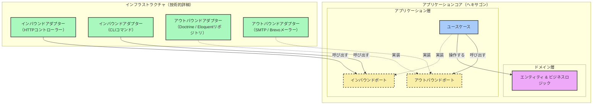

> [English Version](/posts/hexagonal-architecture) · [Version Française](/posts/hexagonal-architecture-fr)

> スライド: [SPA](https://slides.alexvolkihar.ovh/2026/hexagonal-architecture/)（フランス語のみ）
>
> <Slidev class="inline"/> [**Slidev**](https://github.com/slidevjs/slidev) で作成 - presentation slides for developers.

[[toc]]

プロジェクトの最初の数ヶ月、アーキテクチャは大抵の場合、締切に負ける。オールインワンのフレームワークを選び、機能をリリースし、そのまま前に進む。ツケは後になって回ってくる――保守コストは膨らみ、リグレッションは積み重なり、ビジネスロジックはデータベースやサードパーティライブラリ、そしてフレームワーク自体にがっちり溶接されてしまう。

**ヘキサゴナルアーキテクチャ**（*ポート＆アダプター*とも呼ばれる）は、この問題への一つの答えだ。Alistair Cockburnが2005年に提唱したもので、要はビジネスロジックがインフラの詳細に一切触れないようにアプリケーションを構造化する、という考え方だ。

以下では、密結合したコントローラーから出発し、このパターンが実際に何を要求するのかを一つずつ確認しながら、そのコントローラー層を段階的に作り直していく。

---

## 1. 出発点：密結合したコード

ユーザー登録を処理するPHPのコントローラーを見てみよう。特に変わったところはなく、おそらく皆さんが書いたことがある、あるいは引き継いだことのあるコードに近いはずだ。

```php
<?php

namespace App\Http\Controllers;

use App\Models\User;
use Illuminate\Http\Request;
use PHPMailer\PHPMailer\PHPMailer;
use PHPMailer\PHPMailer\Exception;

class RegistrationController extends Controller
{
    public function register(Request $request)
    {
        // 1. Direct HTTP validation
        $request->validate([
            'username' => 'required|string|max:255|unique:users',
            'email' => 'required|email|max:255|unique:users',
            'password' => 'required|string|min:8',
        ]);

        // 2. Business logic + Persistence (coupled Eloquent ORM)
        $user = new User();
        $user->username = $request->input('username');
        $user->email = $request->input('email');
        $user->password = password_hash($request->input('password'), PASSWORD_BCRYPT);
        $user->save(); // Direct coupling to the MySQL database via Active Record

        // 3. Email Notification (direct sending via SMTP with PHPMailer)
        $mail = new PHPMailer(true);
        try {
            // Hardcoded SMTP configuration or direct environment variables
            $mail->isSMTP();
            $mail->Host       = env('MAIL_HOST', 'smtp.mailtrap.io');
            $mail->SMTPAuth   = true;
            $mail->Username   = env('MAIL_USERNAME');
            $mail->Password   = env('MAIL_PASSWORD');
            $mail->SMTPSecure = PHPMailer::ENCRYPTION_STARTTLS;
            $mail->Port       = env('MAIL_PORT', 587);

            $mail->setFrom('no-reply@notre-application.com', 'Mon App');
            $mail->addAddress($user->email, $user->username);

            $mail->isHTML(true);
            $mail->Subject = 'Bienvenue sur notre application !';
            $mail->Body    = "<h1>Bonjour {$user->username} !</h1><p>Merci de vous être inscrit.</p>";

            $mail->send();
        } catch (Exception $e) {
            // In case of email sending error, the HTTP response is compromised
            return response()->json(['error' => "Impossible d'envoyer l'email : {$mail->ErrorInfo}"], 500);
        }

        // 4. HTTP response
        return response()->json([
            'message' => 'Utilisateur créé avec succès !',
            'user' => [
                'id' => $user->id,
                'username' => $user->username,
                'email' => $user->email,
            ]
        ], 201);
    }
}
```

### このコードが脆い理由

このコントローラーはちゃんと動く。入力を検証し、DBに保存し、ウェルカムメールを送り、JSONを返す。問題が表面化するのは、何かを変更しなければならなくなった日だ。

#### 1. SOLIDを3点で破っている

**SRP。** `RegistrationController` は、HTTPのシリアライズ、入力バリデーション、ビジネスルール（パスワードのハッシュ化）、Eloquent経由のDBアクセス、SMTP設定、レスポンスのフォーマットを一手に引き受けている。このどれか一つを変更するだけで、このクラスを編集することになる。

**OCP。** PHPMailerからMailgun、Brevo、AWS SESに乗り換えるには、クラスを開いて中身を書き換える必要がある。ユーザー管理がMySQLのテーブルから認証マイクロサービスに移る場合も同じことが起きる。

**DIP。** 「ユーザーを登録する」という高レベルの操作が、MySQL用のEloquentやSMTP用のPHPMailerといった低レベルの詳細に直接依存している。ビジネスコードはどちらの選択にも口出しできない。

#### 2. ユニットテストができない

ユーザー作成ロジックを動かすには、本物のデータベース（あるいはEloquentのクエリをインターセプトする大量のLaravelモック）に加えて、本物のSMTPサーバー、もしくはMailtrap、あるいはPHPMailerのグローバル変数を力技でモックする仕組みが必要になる。

登録ルールだけを1ミリ秒で終わるテストとして単独で実行する方法はない。結局書くことになるテストは遅く、壊れやすい。

#### 3. フレームワークに溶接されている

`Request`、`Response`、Eloquent、`env()`ヘルパー――このビジネスコードは事実上Laravelのコードだ。同じロジックをSymfonyやCLIコマンド、非同期ワーカーに移そうとしても、ほとんど何も生き残らない。

---

## 2. ヘキサゴナルアーキテクチャとは何か

目的は、ビジネスコードをそれ以外のすべてから切り離すことにある。アプリケーションは閉じたシステム、いわば「アプリケーションコア」になり、外の世界とは自分自身が定義した契約を通してのみやり取りする。

### 4つの構成要素

プロジェクトは、ドメインとアプリケーションを中心に配置された層に分割される。



#### 1. ドメイン

ヘキサゴンの中心。エンティティ、値オブジェクト、ドメインサービスがここに置かれる。

- ビジネスルールを保持する。ユーザーは有効なメールアドレスを持たなければならない、パスワードは一定の強度基準を満たさなければならない、といった具合だ。
- **外部依存を一切持たない**。フレームワーク、データベース、PHPMailer、HTTPについて何も知らない。ただのPHPオブジェクト、それ以上でもそれ以下でもない。

#### 2. アプリケーション層

制御フローが実際に生きる場所で、ユースケース（アプリケーションサービスと呼ぶ人もいる）として表現される。

- ユースケースとは、ユーザーや他のシステムが実行できる一つのアクションのことで、例えば `RegisterUser` がそれにあたる。
- リクエストを受け取り、ドメインエンティティを協調させ、外の世界にはインターフェース越しにしか触れない――DBへの保存、メール送信など。

#### 3. ポート

ポートは境界線そのものだ。コアが外部とどうやり取りするかを定めるPHPの `interface` であり、2種類に分かれる。

インバウンドポート（ドライビングポートとも呼ばれる）は、外部がコア内の何かをどうやってトリガーできるかを示す。`RegisterUserInterface` はその一例だ。アウトバウンドポート（ドリブンポート）は、コアが処理を完了するために何を必要としているかを示すが、どうやってそれを提供するかは規定しない――ユーザーを保存するための `UserRepositoryInterface`、メールを送るための `MailerInterface` などがそれにあたる。

#### 4. アダプター

アダプターはヘキサゴンの外側、インフラ層に存在し、あるテクノロジーとポートの間を橋渡しする。

インバウンドアダプターは外部からの刺激を受け取り、それをインバウンドポートへの呼び出しに変換する――LaravelのHTTPコントローラー、Symfonyのコンソールコマンド、RabbitMQのコンシューマーなどだ。アウトバウンドアダプターはアウトバウンドポートを実装し、実際の技術的な作業を行う――`UserRepositoryInterface` を実装する `EloquentUserRepository`、`MailerInterface` を実装する `BrevoMailer`、そしてテストのためだけに存在する `InMemoryUserRepository` などがそれにあたる。

---

### 依存性逆転の原則

これらすべては、たった一つの原則の上に成り立っている。

従来のレイヤードアーキテクチャでは、各層はその下の層に依存する――コントローラー、次にサービス、そしてORM経由のデータベース、という具合だ。

ここでは、インフラがコアの内側で宣言されたインターフェースに依存する。これによって、実行フローの向きと依存関係の向きが切り離される。実行時には、HTTPコントローラーがユースケースを呼び出し、ユースケースがデータベースアダプターを呼び出す。コード上では、データベースアダプターはアプリケーション層に存在する `UserRepositoryInterface` に依存している。依存は内側を向き、呼び出しは外側を向く。

> [!IMPORTANT]
> ビジネスロジックを守っているのは、まさにこの依存性逆転だ。ドメインとアプリケーションが必要とする契約を宣言し、インフラがそれを実装する。外側が内側に依存するのであって、その逆は決してない。

この後の内容は、この規則に沿ってスパゲッティコントローラーをリファクタリングしていく。

---

## 3. コア：ドメインとポート

まずは中心から始めよう。

### ドメイン

ドメインはルールだけを保持し、それ以外は何も持たない。フレームワークもデータベースもない素のPHPで、不変条件（インバリアント）が確実に守られるようにする責任を負う。

#### 1. ビジネス例外

まずは、技術的なエラーではなく機能的なエラーをモデル化する例外から始める。

```php
<?php

namespace App\Domain\Exception;

class InvalidEmailException extends \DomainException
{
    public function __construct(string $email)
    {
        parent::__construct(sprintf('The email address "%s" is not valid.', $email));
    }
}
```

```php
<?php

namespace App\Domain\Exception;

class WeakPasswordException extends \DomainException
{
    public function __construct()
    {
        parent::__construct('The password is too weak. It must contain at least 8 characters.');
    }
}
```

#### 2. `User` エンティティ

このエンティティは不変条件そのものを保有する――有効なメールアドレス、十分な強度のパスワード、そして値が保存される前に必ずハッシュ化されること。

```php
<?php

namespace App\Domain\Entity;

use App\Domain\Exception\InvalidEmailException;
use App\Domain\Exception\WeakPasswordException;

class User
{
    private string $id;
    private string $username;
    private string $email;
    private string $passwordHash;

    public function __construct(
        string $id,
        string $username,
        string $email,
        string $plainPassword
    ) {
        $this->id = $id;

        if (empty(trim($username))) {
            throw new \DomainException("Username cannot be empty.");
        }
        $this->username = $username;

        $this->setEmail($email);
        $this->setPassword($plainPassword);
    }

    public function getId(): string
    {
        return $this->id;
    }

    public function getUsername(): string
    {
        return $this->username;
    }

    public function getEmail(): string
    {
        return $this->email;
    }

    public function getPasswordHash(): string
    {
        return $this->passwordHash;
    }

    private function setEmail(string $email): void
    {
        if (!filter_var($email, FILTER_VALIDATE_EMAIL)) {
            throw new InvalidEmailException($email);
        }
        $this->email = $email;
    }

    private function setPassword(string $plainPassword): void
    {
        if (strlen($plainPassword) < 8) {
            throw new WeakPasswordException();
        }
        
        // Password hashing is an essential business security rule.
        $this->passwordHash = password_hash($plainPassword, PASSWORD_BCRYPT);
    }
}
```

---

### ポート

ポートは、ヘキサゴンがそれを通してやり取りする契約だ。ドメインまたはユースケースが必要なものを宣言し、それがどう提供されるかはどちらも知らない。

#### 1. `UserRepositoryInterface`、アウトバウンドポート

ヘキサゴンがユーザーを保存・検索するために必要なものすべて。

```php
<?php

namespace App\Domain\Repository;

use App\Domain\Entity\User;

interface UserRepositoryInterface
{
    public function save(User $user): void;
    public function findByEmail(string $email): ?User;
    public function existsByUsername(string $username): bool;
}
```

#### 2. `MailerInterface`、アウトバウンドポート

そして、登録完了後にユーザーへ通知する能力。

```php
<?php

namespace App\Domain\Gateway;

use App\Domain\Entity\User;

interface MailerInterface
{
    public function sendWelcomeEmail(User $user): void;
}
```

---

## 4. アプリケーション層

この層はユースケースを調整する。依存するのはドメインとポートのみで、それ以外には何も依存しない。

### データ転送オブジェクト（DTO）

DTOは、構造化された不変な形でデータを出入りさせる役割を持ち、アプリケーションがHTTPリクエストやフレームワーク固有の型を直接目にすることはない。

#### 1. `RegisterUserRequest`

```php
<?php

namespace App\Application\DTO;

readonly class RegisterUserRequest
{
    public function __construct(
        public string $username,
        public string $email,
        public string $password
    ) {}
}
```

#### 2. `RegisterUserResponse`

```php
<?php

namespace App\Application\DTO;

use App\Domain\Entity\User;

readonly class RegisterUserResponse
{
    public function __construct(
        public string $id,
        public string $username,
        public string $email
    ) {}

    public static function fromEntity(User $user): self
    {
        return new self(
            $user->getId(),
            $user->getUsername(),
            $user->getEmail()
        );
    }
}
```

### ユースケース：`RegisterUser`

ユーザー作成を統括するクラス。2つのポートはどちらもコンストラクタ経由で渡される。

```php
<?php

namespace App\Application\UseCase;

use App\Application\DTO\RegisterUserRequest;
use App\Application\DTO\RegisterUserResponse;
use App\Domain\Entity\User;
use App\Domain\Repository\UserRepositoryInterface;
use App\Domain\Gateway\MailerInterface;

class RegisterUser
{
    public function __construct(
        private UserRepositoryInterface $userRepository,
        private MailerInterface $mailer
    ) {}

    public function execute(RegisterUserRequest $request): RegisterUserResponse
    {
        // 1. Validation of uniqueness rules (requiring the UserRepository port)
        if ($this->userRepository->existsByUsername($request->username)) {
            throw new \DomainException("This username is already taken.");
        }

        if ($this->userRepository->findByEmail($request->email) !== null) {
            throw new \DomainException("This email address is already registered.");
        }

        // 2. Generation of a unique identifier (UUID-like)
        $id = bin2hex(random_bytes(16));

        // 3. Creation of the Domain entity (implicitly validating invariants)
        $user = new User(
            $id,
            $request->username,
            $request->email,
            $request->password
        );

        // 4. Persistence via the Port
        $this->userRepository->save($user);

        // 5. Sending the welcome email via the Port
        $this->mailer->sendWelcomeEmail($user);

        // 6. Return of the response DTO
        return RegisterUserResponse::fromEntity($user);
    }
}
```

> [!NOTE]
> **トランザクションの安全性と副作用：** この例では、保存の直後にメールを送信している。本番環境でSMTPに障害が起きると、ユーザーは既にDBに存在するにもかかわらず、ユースケース自体は例外を投げてしまう。よくある解決策は、**ドメインイベント**と**アウトボックス**パターンを組み合わせ、メール送信を非同期に切り出してリトライ可能にすることだ。

---

## 5. インフラストラクチャ層

インフラは、ポートの具体的な実装と、コアを起動するエントリーポイントを保持する。

### アウトバウンドアダプター

これらはアウトバウンドポートを、SQLやSMTPといった実際の技術に対して実装する。

#### 1. `SqlUserRepository`、PDO経由

```php
<?php

namespace App\Infrastructure\Adapter\Persistence;

use App\Domain\Entity\User;
use App\Domain\Repository\UserRepositoryInterface;
use PDO;

class SqlUserRepository implements UserRepositoryInterface
{
    public function __construct(private PDO $pdo)
    {}

    public function save(User $user): void
    {
        $stmt = $this->pdo->prepare('
            INSERT INTO users (id, username, email, password_hash)
            VALUES (:id, :username, :email, :password_hash)
        ');

        $stmt->execute([
            'id' => $user->getId(),
            'username' => $user->getUsername(),
            'email' => $user->getEmail(),
            'password_hash' => $user->getPasswordHash(),
        ]);
    }

    public function findByEmail(string $email): ?User
    {
        $stmt = $this->pdo->prepare('SELECT * FROM users WHERE email = :email LIMIT 1');
        $stmt->execute(['email' => $email]);
        $row = $stmt->fetch(PDO::FETCH_ASSOC);

        if (!$row) {
            return null;
        }

        return $this->reconstituteEntity($row);
    }

    public function existsByUsername(string $username): bool
    {
        $stmt = $this->pdo->prepare('SELECT COUNT(*) FROM users WHERE username = :username');
        $stmt->execute(['username' => $username]);
        return (int) $stmt->fetchColumn() > 0;
    }

    /**
     * Reconstitutes a User entity from database data.
     * This method bypasses password hashing and validation of the plain password.
     */
    private function reconstituteEntity(array $row): User
    {
        $reflection = new \ReflectionClass(User::class);
        $user = $reflection->newInstanceWithoutConstructor();

        $properties = [
            'id' => $row['id'],
            'username' => $row['username'],
            'email' => $row['email'],
            'passwordHash' => $row['password_hash'],
        ];

        foreach ($properties as $name => $value) {
            $property = $reflection->getProperty($name);
            $property->setAccessible(true);
            $property->setValue($user, $value);
        }

        return $user;
    }
}
```

#### 2. `SmtpMailer`、Symfony Mailer経由

```php
<?php

namespace App\Infrastructure\Adapter\Mailer;

use App\Domain\Entity\User;
use App\Domain\Gateway\MailerInterface;
use Symfony\Component\Mailer\MailerInterface as SymfonyMailerInterface;
use Symfony\Component\Mime\Email;

class SmtpMailer implements MailerInterface
{
    public function __construct(private SymfonyMailerInterface $symfonyMailer)
    {}

    public function sendWelcomeEmail(User $user): void
    {
        $email = (new Email())
            ->from('no-reply@our-application.com')
            ->to($user->getEmail())
            ->subject('Welcome to our application!')
            ->html(sprintf(
                '<h1>Hello %s!</h1><p>Thank you for registering.</p>',
                htmlspecialchars($user->getUsername(), ENT_QUOTES, 'UTF-8')
            ));

        $this->symfonyMailer->send($email);
    }
}
```

---

### インバウンドアダプター

これらは外部からの刺激を受け取り、リクエストの形を検証してからユースケースを呼び出す。

#### 1. `RegisterUserController`

HTTPリクエストをデコードし、DTOを組み立て、ユースケースを実行する。`DomainException` は `422 Unprocessable Entity` として返され、ドメイン自身のメッセージがそのまま乗る。

```php
<?php

namespace App\Infrastructure\Adapter\Http;

use App\Application\DTO\RegisterUserRequest;
use App\Application\UseCase\RegisterUser;
use Nyholm\Psr7\Response;
use Psr\Http\Message\ResponseInterface;
use Psr\Http\Message\ServerRequestInterface;

class RegisterUserController
{
    public function __construct(private RegisterUser $registerUserUseCase)
    {}

    public function __invoke(ServerRequestInterface $request): ResponseInterface
    {
        $body = json_decode((string) $request->getBody(), true) ?? [];

        // 1. HTTP request validation
        if (empty($body['username']) || empty($body['email']) || empty($body['password'])) {
            return new Response(400, ['Content-Type' => 'application/json'], json_encode([
                'error' => 'The username, email, and password fields are required.'
            ]));
        }

        try {
            // 2. DTO creation
            $useCaseRequest = new RegisterUserRequest(
                username: $body['username'],
                email: $body['email'],
                password: $body['password']
            );

            // 3. Calling the use case
            $response = $this->registerUserUseCase->execute($useCaseRequest);

            // 4. Success response
            return new Response(201, ['Content-Type' => 'application/json'], json_encode([
                'message' => 'User created successfully!',
                'user' => [
                    'id' => $response->id,
                    'username' => $response->username,
                    'email' => $response->email,
                ]
            ]));
        } catch (\DomainException $e) {
            // Domain exceptions are translated into HTTP status code 422
            return new Response(422, ['Content-Type' => 'application/json'], json_encode([
                'error' => $e->getMessage()
            ]));
        } catch (\Throwable $e) {
            // Unforeseen technical exceptions are hidden (HTTP 500)
            return new Response(500, ['Content-Type' => 'application/json'], json_encode([
                'error' => 'An internal error occurred.'
            ]));
        }
    }
}
```

#### 2. `RegisterUserCommand`

2つ目のエントリーポイントとして、今度はコンソールが同じユースケースに接続される。ビジネスコードは一行も変わらない。

```php
<?php

namespace App\Infrastructure\Adapter\Cli;

use App\Application\DTO\RegisterUserRequest;
use App\Application\UseCase\RegisterUser;
use Symfony\Component\Console\Attribute\AsCommand;
use Symfony\Component\Console\Command\Command;
use Symfony\Component\Console\Input\InputArgument;
use Symfony\Component\Console\Input\InputInterface;
use Symfony\Component\Console\Output\OutputInterface;
use Symfony\Component\Console\Style\SymfonyStyle;

#[AsCommand(name: 'app:register-user', description: 'Registers a new user.')]
class RegisterUserCommand extends Command
{
    public function __construct(private RegisterUser $registerUserUseCase)
    {
        parent::__construct();
    }

    protected function configure(): void
    {
        $this
            ->addArgument('username', InputArgument::REQUIRED, 'The username')
            ->addArgument('email', InputArgument::REQUIRED, 'The email address')
            ->addArgument('password', InputArgument::REQUIRED, 'The password');
    }

    protected function execute(InputInterface $input, OutputInterface $output): int
    {
        $io = new SymfonyStyle($input, $output);

        $username = $input->getArgument('username');
        $email = $input->getArgument('email');
        $password = $input->getArgument('password');

        try {
            $useCaseRequest = new RegisterUserRequest($username, $email, $password);
            $response = $this->registerUserUseCase->execute($useCaseRequest);

            $io->success(sprintf(
                'User created successfully! ID: %s, Name: %s, Email: %s',
                $response->id,
                $response->username,
                $response->email
            ));

            return Command::SUCCESS;
        } catch (\DomainException $e) {
            $io->error($e->getMessage());
            return Command::FAILURE;
        } catch (\Throwable $e) {
            $io->error('An unexpected error occurred: ' . $e->getMessage());
            return Command::INVALID;
        }
    }
}
```

---

## 6. ディレクトリ構成と配線

残るのは2つ――各層に対応したディレクトリ構成と、どのアダプターがどのポートに応答するかを知っているDIコンテナだ。

### ディレクトリ構成

モダンなPHPアプリケーションにおいて、各層が `src/` の中にどう配置されるかを見てみよう。

```text
src/
├── Domain/
│   ├── Entity/
│   │   └── User.php
│   ├── ValueObject/
│   │   └── Email.php (optional)
│   ├── Exception/
│   │   ├── InvalidEmailException.php
│   │   └── WeakPasswordException.php
│   ├── Repository/         <-- アウトバウンドポート（Driven Ports）
│   │   └── UserRepositoryInterface.php
│   └── Gateway/            <-- サードパーティサービス向けのアウトバウンドポート
│       └── MailerInterface.php
├── Application/
│   ├── UseCase/            <-- ヘキサゴンのユースケース
│   │   └── RegisterUser.php
│   └── DTO/                <-- データ転送オブジェクト
│       ├── RegisterUserRequest.php
│       └── RegisterUserResponse.php
└── Infrastructure/
    ├── Adapter/            <-- 具体的なアダプター
    │   ├── Http/           <-- インバウンド（Driving）：コントローラー
    │   │   └── RegisterUserController.php
    │   ├── Cli/            <-- インバウンド（Driving）：コンソールコマンド
    │   │   └── RegisterUserCommand.php
    │   ├── Persistence/    <-- アウトバウンド（Driven）：ORM、SQL、インメモリ
    │   │   ├── SqlUserRepository.php
    │   │   └── InMemoryUserRepository.php
    │   └── Mailer/         <-- アウトバウンド（Driven）：SMTP、Brevoなど
    │       └── SmtpMailer.php
    └── Share/              <-- 共有コードと横断的なユーティリティ
```

この分離は概念的なだけでなく、物理的でもある。プロジェクトを初めて開いた人でも、一行のコードも読まずに、ビジネスルールとオーケストレーションと技術的詳細を見分けられる。

### 配線

ヘキサゴンはインフラのクラスを直接インスタンス化することは決してない。インターフェースに依存し、フレームワークのDIコンテナがそれを実行時に解決する。

#### オプションA：Symfony（`services.yaml`）

Symfonyのオートワイヤリングは、クラス名が期待される型に一致していれば、ほとんどの部分を自動でやってくれる。あるインターフェースに対して特定のアダプターを選びたい場合は、明示的にバインドする。

```yaml
# config/services.yaml
services:
    # Default configuration
    _defaults:
        autowire: true      # Enables automatic injection
        autoconfigure: true # Automatically registers CLI commands, controllers, etc.

    # Make our application core and adapters available
    App\:
        resource: '../src/'
        exclude:
            - '../src/Domain/Entity/'
            - '../src/Domain/ValueObject/'
            - '../src/Domain/Exception/'
            - '../src/Application/DTO/'

    # Explicit binding of ports (interfaces) to adapters (implementations)
    App\Domain\Repository\UserRepositoryInterface:
        class: App\Infrastructure\Adapter\Persistence\SqlUserRepository

    App\Domain\Gateway\MailerInterface:
        class: App\Infrastructure\Adapter\Mailer\SmtpMailer
```

#### オプションB：Laravel（`AppServiceProvider`）

Laravelは同じバインディングをPHPで行い、サービスプロバイダー、通常は `register()` の中に書く。

```php
<?php

namespace App\Providers;

use Illuminate\Support\ServiceProvider;
use App\Domain\Repository\UserRepositoryInterface;
use App\Infrastructure\Adapter\Persistence\SqlUserRepository;
use App\Domain\Gateway\MailerInterface;
use App\Infrastructure\Adapter\Mailer\SmtpMailer;

class AppServiceProvider extends ServiceProvider
{
    /**
     * Register bindings in the container.
     */
    public function register(): void
    {
        // Bind interfaces (Ports) to concrete classes (Adapters)
        $this->app->bind(UserRepositoryInterface::class, SqlUserRepository::class);
        $this->app->bind(MailerInterface::class, SmtpMailer::class);
    }
}
```

---

## 7. さらに一歩進める

### インフラなしでテストする

コアを疎結合にすることで得られる一番のメリットは、ユースケースをネットワークもファイルシステムもデータベースもなしにテストできることだ。

モックライブラリを使う手もあるが、テストが冗長になり、内部をリファクタリングするたびに壊れやすい。ポートのインメモリ実装を書く方が、大抵の場合は安上がりだ。

#### 1. `InMemoryUserRepository`

このテスト用アダプターは、エンティティをPHPの配列に保持する。ユースケースから見れば本物のデータベースのように振る舞い、しかも用意するコストはゼロに等しい。

```php
<?php

namespace App\Infrastructure\Adapter\Persistence;

use App\Domain\Entity\User;
use App\Domain\Repository\UserRepositoryInterface;

class InMemoryUserRepository implements UserRepositoryInterface
{
    /**
     * @var array<string, User>
     */
    private array $users = [];

    public function save(User $user): void
    {
        $this->users[$user->getId()] = $user;
    }

    public function findByEmail(string $email): ?User
    {
        foreach ($this->users as $user) {
            if ($user->getEmail() === $email) {
                return $user;
            }
        }
        return null;
    }

    public function existsByUsername(string $username): bool
    {
        foreach ($this->users as $user) {
            if ($user->getUsername() === $username) {
                return true;
            }
        }
        return false;
    }
}
```

メーラーについても同じ発想だ。`InMemoryMailer` は送信を依頼された内容を記録しておき、テストが後からそれを検証できるようにする。

```php
<?php

namespace App\Infrastructure\Adapter\Mailer;

use App\Domain\Entity\User;
use App\Domain\Gateway\MailerInterface;

class InMemoryMailer implements MailerInterface
{
    /**
     * @var array<int, User>
     */
    private array $sentEmails = [];

    public function sendWelcomeEmail(User $user): void
    {
        $this->sentEmails[] = $user;
    }

    public function hasSentWelcomeEmailTo(string $email): bool
    {
        foreach ($this->sentEmails as $user) {
            if ($user->getEmail() === $email) {
                return true;
            }
        }
        return false;
    }
}
```

#### 2. PHPUnitのテスト

これで、テストはごく普通のユニットテストになる。テスト用データベースは不要だし、SMTPサーバーが落ちている朝にテストが失敗することもない。

```php
<?php

namespace App\Tests\Application\UseCase;

use App\Application\DTO\RegisterUserRequest;
use App\Application\UseCase\RegisterUser;
use App\Domain\Exception\InvalidEmailException;
use App\Infrastructure\Adapter\Persistence\InMemoryUserRepository;
use App\Infrastructure\Adapter\Mailer\InMemoryMailer;
use PHPUnit\Framework\TestCase;

class RegisterUserTest extends TestCase
{
    private InMemoryUserRepository $userRepository;
    private InMemoryMailer $mailer;
    private RegisterUser $useCase;

    protected function setUp(): void
    {
        $this->userRepository = new InMemoryUserRepository();
        $this->mailer = new InMemoryMailer();
        
        // Direct instantiation of the use case with our in-memory adapters
        $this->useCase = new RegisterUser($this->userRepository, $this->mailer);
    }

    public function testUserRegistrationSuccess(): void
    {
        // Given
        $request = new RegisterUserRequest(
            username: 'alexdev',
            email: 'alex@example.com',
            password: 'SuperSecurePassword123'
        );

        // When
        $response = $this->useCase->execute($request);

        // Then
        $this->assertNotEmpty($response->id);
        $this->assertEquals('alexdev', $response->username);
        $this->assertEquals('alex@example.com', $response->email);

        // Verification of persistence in memory
        $savedUser = $this->userRepository->findByEmail('alex@example.com');
        $this->assertNotNull($savedUser);
        $this->assertEquals('alexdev', $savedUser->getUsername());

        // Verification of email delivery
        $this->assertTrue($this->mailer->hasSentWelcomeEmailTo('alex@example.com'));
    }

    public function testRegistrationFailsWithInvalidEmail(): void
    {
        // Given
        $request = new RegisterUserRequest(
            username: 'alexdev',
            email: 'invalid-email',
            password: 'SuperSecurePassword123'
        );

        // Then
        $this->expectException(InvalidEmailException::class);

        // When
        $this->useCase->execute($request);
    }

    public function testRegistrationFailsWithDuplicateEmail(): void
    {
        // Given - Registration of an existing user with this email
        $existingUser = new \App\Domain\Entity\User(
            'existing-uuid',
            'johndoe',
            'john@example.com',
            'Password12345'
        );
        $this->userRepository->save($existingUser);

        // Registration request with the same email
        $request = new RegisterUserRequest(
            username: 'newuser',
            email: 'john@example.com',
            password: 'SuperSecurePassword123'
        );

        // Then - Expecting double email exception
        $this->expectException(\DomainException::class);
        $this->expectExceptionMessage("This email address is already registered.");

        // When
        $this->useCase->execute($request);
    }
}
```

> [!TIP]
> **実行速度：** これらのテストは1つあたり2ミリ秒以下で終わる。数百のビジネスルールを持つプロジェクトでも、数千のユニットテストが3秒以内に完走する。これこそが、TDDを実践可能にするフィードバックループだ。

---

### Deptracでルールを強制する

すべてはたった一つのルールの上に成り立っている――内側の層は決して外側の層に依存しない、というルールだ。納期のプレッシャーの下では、誰かがDoctrineのクラスやHTTPコントローラーをドメインに直接importしてしまい、コードレビューでもそれが見逃されることがある。

**Deptrac** はこれを静的に検証し、依存関係が誤った方向を向いていればビルドを失敗させてくれる。上記の構成に対応する `deptrac.yaml` は以下の通り。

```yaml
# deptrac.yaml
deptrac:
  paths:
    - src/
  layers:
    - name: Domain
      collectors:
        - type: directory
          value: src/Domain/.*
    - name: Application
      collectors:
        - type: directory
          value: src/Application/.*
    - name: Infrastructure
      collectors:
        - type: directory
          value: src/Infrastructure/.*
  ruleset:
    Domain:
      # The Domain is completely isolated: it depends on nothing else
      - ~
    Application:
      # The Application can only depend on the Domain
      - Domain
    Infrastructure:
      # The Infrastructure can depend on the Application and the Domain
      - Application
      - Domain
```

`vendor/bin/deptrac` を実行すればコードをスキャンし、間違った向きの依存関係があれば大声でエラーを出してくれる。

---

### DDDとCQRSはどこに位置づけられるか

#### ドメイン駆動設計（DDD）

ヘキサゴンはDDDなしでも使えるが、両者は相性がいい。DDDはビジネスを丁寧にモデリングすることが目的で、ヘキサゴンはそのモデルを技術的なノイズから遠ざけておく入れ物だ。エンティティ、値オブジェクト、集約、ドメインサービスはすべてドメイン層に置かれ、DDDにおけるリポジトリは、まさにアウトバウンドポートそのものだ。

#### CQRS

CQRSは読み取りと書き込みを分離する。ヘキサゴンにおいて、書き込みのパスはユースケースを経由し、ドメインエンティティを操作し、ポート経由で永続化する。

読み取りのパスは、ヘキサゴンを迂回してもよいし、多くの場合そうすべきだ。クエリはビジネスルールを一切実行せず、データを射影するだけだからだ。したがって、インバウンドアダプターは、完全なエンティティを再構築してから改めてフラット化するのではなく、よくチューニングされた一本のSQL文からビュー用のDTOを直接返す専用のクエリサービスを呼び出せばよい。

---

### 採用すべきとき、そうでないとき

ここに銀の弾丸はない。ヘキサゴンは現実の何かを手に入れる代わりに、現実のコストを払う。

得られるもの：副作用なしで動くユニットテスト、フレームワークやデータベース、サードパーティサービスを入れ替える自由、技術的なノイズに邪魔されずに読めるビジネスロジック。ポートが事前に合意されているため、あるチームがユースケースに取り組む一方で、別のチームがアダプターを書く、という分業も可能になる。

払うコスト：クラス、インターフェース、DTO、マッピングの数が大幅に増える。チーム全員が依存性逆転を本当に理解している必要がある。そしてコードを追うには、具体的な実装にたどり着く前に必ずインターフェースを一枚通り抜けなければならない。

実際に本物のビジネスロジックを持つ中規模から大規模のプロジェクト、下回るインフラがバージョンやベンダーを変えながら何年も動き続けることを前提としたアプリケーション、そしてテスト戦略が重要な意味を持つ場面では、それに見合う価値がある。

アプリケーションが純粋なCRUDであれば、見送っていい。ルールを適用せずに行をただ読み書きするだけなら、ヘキサゴンは何もない場所に組んだ足場にすぎない――フレームワークのORMを直接使えばいい。数エンドポイント程度の小さなゲートウェイ型マイクロサービスでも見送っていい。そして使い捨てのプロトタイプでも、ビジネスモデルが検証されるまではフレームワークに直接結合するのが正解であり、これも見送るべきケースだ。

---

## まとめ

ドメインとユースケースをインターフェースの背後に隔離したことで、私たちは3つのものを手に入れた。

コードはテスト可能になった――15行の `InMemoryUserRepository` がデータベースを丸ごと置き換え、モックフレームワークは一切登場しない。EloquentをDoctrineに、SMTPをMailgunに差し替えても、`RegisterUser` と `User` は無傷のままだ。書くのは新しいアダプター一つだけでいい。そしてHTTPコントローラーもコンソールコマンドも、まったく同じユースケースを実行する。

これには最初、ファイル数と規律という代償がかかる。その見返りに手に入るのは、下回るインフラより長生きするビジネス層だ。
