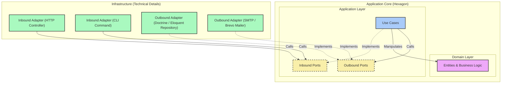

> [Version Française](/posts/hexagonal-architecture-fr)

> Slides: [SPA](https://slides.alexvolkihar.ovh/2026/hexagonal-architecture/) (French only)
>
> Made with <Slidev class="inline"/> [**Slidev**](https://github.com/slidevjs/slidev) - presentation slides for developers.

[[toc]]

Architecture usually loses to the deadline in the first months of a project. You reach for an all-in-one framework, ship features, and move on. The bill arrives later: maintenance gets expensive, regressions pile up, and the business rules end up welded to the database, to third-party libraries, and to the framework itself.

**Hexagonal Architecture** (also called *Ports & Adapters*) is one answer to that. Alistair Cockburn described it in 2005: structure the application so that the business logic never touches infrastructure details.

What follows starts from a coupled controller, works through what the pattern actually asks of you, and rebuilds that controller layer by layer.

---

## 1. The starting point: coupled code

Here is a PHP controller handling user registration. Nothing exotic, and probably close to something you have written or inherited:

```php
<?php

namespace App\Http\Controllers;

use App\Models\User;
use Illuminate\Http\Request;
use PHPMailer\PHPMailer\PHPMailer;
use PHPMailer\PHPMailer\Exception;

class RegistrationController extends Controller
{
    public function register(Request $request)
    {
        // 1. Direct HTTP validation
        $request->validate([
            'username' => 'required|string|max:255|unique:users',
            'email' => 'required|email|max:255|unique:users',
            'password' => 'required|string|min:8',
        ]);

        // 2. Business logic + Persistence (coupled Eloquent ORM)
        $user = new User();
        $user->username = $request->input('username');
        $user->email = $request->input('email');
        $user->password = password_hash($request->input('password'), PASSWORD_BCRYPT);
        $user->save(); // Direct coupling to the MySQL database via Active Record

        // 3. Email Notification (direct sending via SMTP with PHPMailer)
        $mail = new PHPMailer(true);
        try {
            // Hardcoded SMTP configuration or direct environment variables
            $mail->isSMTP();
            $mail->Host       = env('MAIL_HOST', 'smtp.mailtrap.io');
            $mail->SMTPAuth   = true;
            $mail->Username   = env('MAIL_USERNAME');
            $mail->Password   = env('MAIL_PASSWORD');
            $mail->SMTPSecure = PHPMailer::ENCRYPTION_STARTTLS;
            $mail->Port       = env('MAIL_PORT', 587);

            $mail->setFrom('no-reply@notre-application.com', 'Mon App');
            $mail->addAddress($user->email, $user->username);

            $mail->isHTML(true);
            $mail->Subject = 'Bienvenue sur notre application !';
            $mail->Body    = "<h1>Bonjour {$user->username} !</h1><p>Merci de vous être inscrit.</p>";

            $mail->send();
        } catch (Exception $e) {
            // In case of email sending error, the HTTP response is compromised
            return response()->json(['error' => "Impossible d'envoyer l'email : {$mail->ErrorInfo}"], 500);
        }

        // 4. HTTP response
        return response()->json([
            'message' => 'Utilisateur créé avec succès !',
            'user' => [
                'id' => $user->id,
                'username' => $user->username,
                'email' => $user->email,
            ]
        ], 201);
    }
}
```

### Why this code is fragile

The controller works. It validates input, saves to the database, sends a welcome email, and returns JSON. The trouble only shows up the day something has to change.

#### 1. It violates SOLID on three counts

**SRP.** `RegistrationController` handles HTTP serialization, input validation, a business rule (password hashing), database access through Eloquent, SMTP configuration, and response formatting. Any change to any of those means editing this class.

**OCP.** Switching from PHPMailer to Mailgun, Brevo, or AWS SES means opening the class and rewriting its guts. Same story if the users move behind an identity microservice instead of a MySQL table.

**DIP.** The high-level operation, registering a user, depends directly on the low-level details: Eloquent for MySQL, PHPMailer for SMTP. The business code has no say in either choice.

#### 2. You cannot unit test it

To exercise the user-creation logic you need a real database (or a pile of Laravel mocks intercepting Eloquent queries), plus a real SMTP server, or Mailtrap, or aggressive mocking of PHPMailer's globals.

There is no way to run the registration rules on their own in a test that finishes in a millisecond. The tests you do write end up slow and easy to break.

#### 3. It is welded to the framework

`Request`, `Response`, Eloquent, the `env()` helper: the business code is Laravel code. Move the same logic to Symfony, to a CLI command, or to an async worker, and almost nothing survives the move.

---

## 2. What is hexagonal architecture?

The goal is to isolate the business code from everything above. The application becomes a closed system, the "application core", and it talks to the outside world only through contracts it defines itself.

### The four parts

The project splits into layers arranged around the domain and the application:



#### 1. The domain

The centre of the hexagon: entities, value objects, domain services.

- It holds the business rules. A user must have a valid email; a password must meet a strength requirement.
- It has **no external dependencies**. It knows nothing about the framework, the database, PHPMailer, or HTTP. Plain old PHP objects, nothing more.

#### 2. The application layer

This is where the control flow lives, in use cases (some people call them application services).

- A use case is one action a user or another system can take, such as `RegisterUser`.
- It takes a request, coordinates domain entities, and reaches the outside world only through interfaces: saving to a database, sending an email.

#### 3. The ports

Ports are the boundary. They are PHP `interface` declarations that say how the core talks to everything else, and they come in two flavors.

Inbound ports (also called driving ports) say how the outside can trigger something in the core; `RegisterUserInterface` would be one. Outbound ports (driven ports) say what the core needs in order to finish its job, without saying how: `UserRepositoryInterface` to store a user, `MailerInterface` to send the email.

#### 4. The adapters

Adapters live outside the hexagon, in the infrastructure layer, and translate between a technology and a port.

Inbound adapters take a stimulus from the outside and turn it into a call on an inbound port: a Laravel HTTP controller, a Symfony console command, a RabbitMQ consumer. Outbound adapters implement the outbound ports and do the technical work: `EloquentUserRepository` implementing `UserRepositoryInterface`, `BrevoMailer` implementing `MailerInterface`, or `InMemoryUserRepository`, which exists only for tests.

---

### The dependency inversion principle

All of this rests on one principle.

In a traditional layered application, each layer depends on the one below it: controller, then service, then database through the ORM.

Here, infrastructure depends on interfaces declared inside the core. That splits the flow of execution from the direction of the dependencies. At runtime, the HTTP controller calls the use case, which calls the database adapter. In the code, the database adapter depends on `UserRepositoryInterface`, which lives in the application layer. The dependency points inward while the call points outward.

> [!IMPORTANT]
> Dependency inversion is what protects the business logic. The domain and the application declare the contracts they need. Infrastructure implements them. The outside depends on the inside, never the other way around.

The rest of the article refactors the spaghetti controller against that rule.

---

## 3. The core: domain and ports

Start at the centre.

### The domain

The domain holds the rules and nothing else. Plain PHP, no framework, no database, and it is responsible for making sure invariants hold.

#### 1. Business exceptions

Start with exceptions that model functional errors rather than technical ones.

```php
<?php

namespace App\Domain\Exception;

class InvalidEmailException extends \DomainException
{
    public function __construct(string $email)
    {
        parent::__construct(sprintf('The email address "%s" is not valid.', $email));
    }
}
```

```php
<?php

namespace App\Domain\Exception;

class WeakPasswordException extends \DomainException
{
    public function __construct()
    {
        parent::__construct('The password is too weak. It must contain at least 8 characters.');
    }
}
```

#### 2. The `User` entity

The entity owns the invariants: a valid email, a strong enough password, and hashing before the value is ever stored.

```php
<?php

namespace App\Domain\Entity;

use App\Domain\Exception\InvalidEmailException;
use App\Domain\Exception\WeakPasswordException;

class User
{
    private string $id;
    private string $username;
    private string $email;
    private string $passwordHash;

    public function __construct(
        string $id,
        string $username,
        string $email,
        string $plainPassword
    ) {
        $this->id = $id;

        if (empty(trim($username))) {
            throw new \DomainException("Username cannot be empty.");
        }
        $this->username = $username;

        $this->setEmail($email);
        $this->setPassword($plainPassword);
    }

    public function getId(): string
    {
        return $this->id;
    }

    public function getUsername(): string
    {
        return $this->username;
    }

    public function getEmail(): string
    {
        return $this->email;
    }

    public function getPasswordHash(): string
    {
        return $this->passwordHash;
    }

    private function setEmail(string $email): void
    {
        if (!filter_var($email, FILTER_VALIDATE_EMAIL)) {
            throw new InvalidEmailException($email);
        }
        $this->email = $email;
    }

    private function setPassword(string $plainPassword): void
    {
        if (strlen($plainPassword) < 8) {
            throw new WeakPasswordException();
        }
        
        // Password hashing is an essential business security rule.
        $this->passwordHash = password_hash($plainPassword, PASSWORD_BCRYPT);
    }
}
```

---

### The ports

Ports are the contracts the hexagon communicates through. The domain or the use case declares what it needs; neither knows how it will be provided.

#### 1. `UserRepositoryInterface`, an outbound port

Everything the hexagon needs in order to store and find users:

```php
<?php

namespace App\Domain\Repository;

use App\Domain\Entity\User;

interface UserRepositoryInterface
{
    public function save(User $user): void;
    public function findByEmail(string $email): ?User;
    public function existsByUsername(string $username): bool;
}
```

#### 2. `MailerInterface`, an outbound port

And the ability to notify the user once registered:

```php
<?php

namespace App\Domain\Gateway;

use App\Domain\Entity\User;

interface MailerInterface
{
    public function sendWelcomeEmail(User $user): void;
}
```

---

## 4. The application layer

This layer coordinates use cases. It depends on the domain and on the ports, and on nothing else.

### Data transfer objects

DTOs carry data in and out in a structured, immutable shape, so the application never sees an HTTP request or a framework type.

#### 1. `RegisterUserRequest`

```php
<?php

namespace App\Application\DTO;

readonly class RegisterUserRequest
{
    public function __construct(
        public string $username,
        public string $email,
        public string $password
    ) {}
}
```

#### 2. `RegisterUserResponse`

```php
<?php

namespace App\Application\DTO;

use App\Domain\Entity\User;

readonly class RegisterUserResponse
{
    public function __construct(
        public string $id,
        public string $username,
        public string $email
    ) {}

    public static function fromEntity(User $user): self
    {
        return new self(
            $user->getId(),
            $user->getUsername(),
            $user->getEmail()
        );
    }
}
```

### The use case: `RegisterUser`

The class that orchestrates user creation. Both ports arrive through the constructor:

```php
<?php

namespace App\Application\UseCase;

use App\Application\DTO\RegisterUserRequest;
use App\Application\DTO\RegisterUserResponse;
use App\Domain\Entity\User;
use App\Domain\Repository\UserRepositoryInterface;
use App\Domain\Gateway\MailerInterface;

class RegisterUser
{
    public function __construct(
        private UserRepositoryInterface $userRepository,
        private MailerInterface $mailer
    ) {}

    public function execute(RegisterUserRequest $request): RegisterUserResponse
    {
        // 1. Validation of uniqueness rules (requiring the UserRepository port)
        if ($this->userRepository->existsByUsername($request->username)) {
            throw new \DomainException("This username is already taken.");
        }

        if ($this->userRepository->findByEmail($request->email) !== null) {
            throw new \DomainException("This email address is already registered.");
        }

        // 2. Generation of a unique identifier (UUID-like)
        $id = bin2hex(random_bytes(16));

        // 3. Creation of the Domain entity (implicitly validating invariants)
        $user = new User(
            $id,
            $request->username,
            $request->email,
            $request->password
        );

        // 4. Persistence via the Port
        $this->userRepository->save($user);

        // 5. Sending the welcome email via the Port
        $this->mailer->sendWelcomeEmail($user);

        // 6. Return of the response DTO
        return RegisterUserResponse::fromEntity($user);
    }
}
```

> [!NOTE]
> **Transactional safety and side effects:** the example sends the email right after the save. In production, an SMTP outage makes the use case throw even though the user is already in the database. The usual fix is a **domain event** plus the **outbox** pattern, so the email is handed off asynchronously and retried.

---

## 5. The infrastructure layer

Infrastructure holds the concrete implementations of the ports, and the entry points that trigger the core.

### Outbound adapters

These implement the outbound ports against a real technology: SQL, SMTP.

#### 1. `SqlUserRepository`, via PDO

```php
<?php

namespace App\Infrastructure\Adapter\Persistence;

use App\Domain\Entity\User;
use App\Domain\Repository\UserRepositoryInterface;
use PDO;

class SqlUserRepository implements UserRepositoryInterface
{
    public function __construct(private PDO $pdo)
    {}

    public function save(User $user): void
    {
        $stmt = $this->pdo->prepare('
            INSERT INTO users (id, username, email, password_hash)
            VALUES (:id, :username, :email, :password_hash)
        ');

        $stmt->execute([
            'id' => $user->getId(),
            'username' => $user->getUsername(),
            'email' => $user->getEmail(),
            'password_hash' => $user->getPasswordHash(),
        ]);
    }

    public function findByEmail(string $email): ?User
    {
        $stmt = $this->pdo->prepare('SELECT * FROM users WHERE email = :email LIMIT 1');
        $stmt->execute(['email' => $email]);
        $row = $stmt->fetch(PDO::FETCH_ASSOC);

        if (!$row) {
            return null;
        }

        return $this->reconstituteEntity($row);
    }

    public function existsByUsername(string $username): bool
    {
        $stmt = $this->pdo->prepare('SELECT COUNT(*) FROM users WHERE username = :username');
        $stmt->execute(['username' => $username]);
        return (int) $stmt->fetchColumn() > 0;
    }

    /**
     * Reconstitutes a User entity from database data.
     * This method bypasses password hashing and validation of the plain password.
     */
    private function reconstituteEntity(array $row): User
    {
        $reflection = new \ReflectionClass(User::class);
        $user = $reflection->newInstanceWithoutConstructor();

        $properties = [
            'id' => $row['id'],
            'username' => $row['username'],
            'email' => $row['email'],
            'passwordHash' => $row['password_hash'],
        ];

        foreach ($properties as $name => $value) {
            $property = $reflection->getProperty($name);
            $property->setAccessible(true);
            $property->setValue($user, $value);
        }

        return $user;
    }
}
```

#### 2. `SmtpMailer`, via Symfony Mailer

```php
<?php

namespace App\Infrastructure\Adapter\Mailer;

use App\Domain\Entity\User;
use App\Domain\Gateway\MailerInterface;
use Symfony\Component\Mailer\MailerInterface as SymfonyMailerInterface;
use Symfony\Component\Mime\Email;

class SmtpMailer implements MailerInterface
{
    public function __construct(private SymfonyMailerInterface $symfonyMailer)
    {}

    public function sendWelcomeEmail(User $user): void
    {
        $email = (new Email())
            ->from('no-reply@our-application.com')
            ->to($user->getEmail())
            ->subject('Welcome to our application!')
            ->html(sprintf(
                '<h1>Hello %s!</h1><p>Thank you for registering.</p>',
                htmlspecialchars($user->getUsername(), ENT_QUOTES, 'UTF-8')
            ));

        $this->symfonyMailer->send($email);
    }
}
```

---

### Inbound adapters

These catch an external stimulus, check the shape of the request, and call the use case.

#### 1. `RegisterUserController`

It decodes the HTTP request, builds the DTO, and runs the use case. A `DomainException` comes back as `422 Unprocessable Entity` carrying the domain's own message.

```php
<?php

namespace App\Infrastructure\Adapter\Http;

use App\Application\DTO\RegisterUserRequest;
use App\Application\UseCase\RegisterUser;
use Nyholm\Psr7\Response;
use Psr\Http\Message\ResponseInterface;
use Psr\Http\Message\ServerRequestInterface;

class RegisterUserController
{
    public function __construct(private RegisterUser $registerUserUseCase)
    {}

    public function __invoke(ServerRequestInterface $request): ResponseInterface
    {
        $body = json_decode((string) $request->getBody(), true) ?? [];

        // 1. HTTP request validation
        if (empty($body['username']) || empty($body['email']) || empty($body['password'])) {
            return new Response(400, ['Content-Type' => 'application/json'], json_encode([
                'error' => 'The username, email, and password fields are required.'
            ]));
        }

        try {
            // 2. DTO creation
            $useCaseRequest = new RegisterUserRequest(
                username: $body['username'],
                email: $body['email'],
                password: $body['password']
            );

            // 3. Calling the use case
            $response = $this->registerUserUseCase->execute($useCaseRequest);

            // 4. Success response
            return new Response(201, ['Content-Type' => 'application/json'], json_encode([
                'message' => 'User created successfully!',
                'user' => [
                    'id' => $response->id,
                    'username' => $response->username,
                    'email' => $response->email,
                ]
            ]));
        } catch (\DomainException $e) {
            // Domain exceptions are translated into HTTP status code 422
            return new Response(422, ['Content-Type' => 'application/json'], json_encode([
                'error' => $e->getMessage()
            ]));
        } catch (\Throwable $e) {
            // Unforeseen technical exceptions are hidden (HTTP 500)
            return new Response(500, ['Content-Type' => 'application/json'], json_encode([
                'error' => 'An internal error occurred.'
            ]));
        }
    }
}
```

#### 2. `RegisterUserCommand`

A second entry point, this time the console, plugs into the same use case. Not one line of business code changes.

```php
<?php

namespace App\Infrastructure\Adapter\Cli;

use App\Application\DTO\RegisterUserRequest;
use App\Application\UseCase\RegisterUser;
use Symfony\Component\Console\Attribute\AsCommand;
use Symfony\Component\Console\Command\Command;
use Symfony\Component\Console\Input\InputArgument;
use Symfony\Component\Console\Input\InputInterface;
use Symfony\Component\Console\Output\OutputInterface;
use Symfony\Component\Console\Style\SymfonyStyle;

#[AsCommand(name: 'app:register-user', description: 'Registers a new user.')]
class RegisterUserCommand extends Command
{
    public function __construct(private RegisterUser $registerUserUseCase)
    {
        parent::__construct();
    }

    protected function configure(): void
    {
        $this
            ->addArgument('username', InputArgument::REQUIRED, 'The username')
            ->addArgument('email', InputArgument::REQUIRED, 'The email address')
            ->addArgument('password', InputArgument::REQUIRED, 'The password');
    }

    protected function execute(InputInterface $input, OutputInterface $output): int
    {
        $io = new SymfonyStyle($input, $output);

        $username = $input->getArgument('username');
        $email = $input->getArgument('email');
        $password = $input->getArgument('password');

        try {
            $useCaseRequest = new RegisterUserRequest($username, $email, $password);
            $response = $this->registerUserUseCase->execute($useCaseRequest);

            $io->success(sprintf(
                'User created successfully! ID: %s, Name: %s, Email: %s',
                $response->id,
                $response->username,
                $response->email
            ));

            return Command::SUCCESS;
        } catch (\DomainException $e) {
            $io->error($e->getMessage());
            return Command::FAILURE;
        } catch (\Throwable $e) {
            $io->error('An unexpected error occurred: ' . $e->getMessage());
            return Command::INVALID;
        }
    }
}
```

---

## 6. Folder structure and wiring

Two things remain: a directory layout that matches the layers, and a DI container that knows which adapter answers which port.

### Folder structure

Here is how the layers sit inside `src/` in a modern PHP application:

```text
src/
├── Domain/
│   ├── Entity/
│   │   └── User.php
│   ├── ValueObject/
│   │   └── Email.php (optional)
│   ├── Exception/
│   │   ├── InvalidEmailException.php
│   │   └── WeakPasswordException.php
│   ├── Repository/         <-- Outbound Ports (Driven Ports)
│   │   └── UserRepositoryInterface.php
│   └── Gateway/            <-- Outbound Ports for third-party services
│       └── MailerInterface.php
├── Application/
│   ├── UseCase/            <-- Hexagon Use Cases
│   │   └── RegisterUser.php
│   └── DTO/                <-- Data Transfer Objects
│       ├── RegisterUserRequest.php
│       └── RegisterUserResponse.php
└── Infrastructure/
    ├── Adapter/            <-- Concrete Adapters
    │   ├── Http/           <-- Inbound (Driving): Controllers
    │   │   └── RegisterUserController.php
    │   ├── Cli/            <-- Inbound (Driving): Console Commands
    │   │   └── RegisterUserCommand.php
    │   ├── Persistence/    <-- Outbound (Driven): ORM, SQL, In-Memory
    │   │   ├── SqlUserRepository.php
    │   │   └── InMemoryUserRepository.php
    │   └── Mailer/         <-- Outbound (Driven): SMTP, Brevo, etc.
    │       └── SmtpMailer.php
    └── Share/              <-- Shared code and cross-cutting utilities
```

The separation is physical, not just conceptual. Someone opening the project for the first time can tell the business rules from the orchestration and from the technical details without reading a line of code.

### Wiring

The hexagon never instantiates an infrastructure class. It depends on interfaces, and the framework's DI container resolves them at runtime.

#### Option A: Symfony (`services.yaml`)

Symfony's autowiring handles most of this on its own once the class name matches the expected type. To pick a specific adapter for an interface, bind it explicitly:

```yaml
# config/services.yaml
services:
    # Default configuration
    _defaults:
        autowire: true      # Enables automatic injection
        autoconfigure: true # Automatically registers CLI commands, controllers, etc.

    # Make our application core and adapters available
    App\:
        resource: '../src/'
        exclude:
            - '../src/Domain/Entity/'
            - '../src/Domain/ValueObject/'
            - '../src/Domain/Exception/'
            - '../src/Application/DTO/'

    # Explicit binding of ports (interfaces) to adapters (implementations)
    App\Domain\Repository\UserRepositoryInterface:
        class: App\Infrastructure\Adapter\Persistence\SqlUserRepository

    App\Domain\Gateway\MailerInterface:
        class: App\Infrastructure\Adapter\Mailer\SmtpMailer
```

#### Option B: Laravel (`AppServiceProvider`)

Laravel does the same binding in PHP, through a service provider, usually in `register()`:

```php
<?php

namespace App\Providers;

use Illuminate\Support\ServiceProvider;
use App\Domain\Repository\UserRepositoryInterface;
use App\Infrastructure\Adapter\Persistence\SqlUserRepository;
use App\Domain\Gateway\MailerInterface;
use App\Infrastructure\Adapter\Mailer\SmtpMailer;

class AppServiceProvider extends ServiceProvider
{
    /**
     * Register bindings in the container.
     */
    public function register(): void
    {
        // Bind interfaces (Ports) to concrete classes (Adapters)
        $this->app->bind(UserRepositoryInterface::class, SqlUserRepository::class);
        $this->app->bind(MailerInterface::class, SmtpMailer::class);
    }
}
```

---

## 7. Going further

### Testing without infrastructure

Decoupling the core buys one thing above all: you can test the use cases with no network, no filesystem, no database.

Mocking libraries would work, but they make tests verbose and they break every time you refactor internals. Writing an in-memory implementation of the port is usually cheaper.

#### 1. `InMemoryUserRepository`

This test adapter keeps entities in a PHP array. From the use case's point of view it behaves like the database, and it costs nothing to set up.

```php
<?php

namespace App\Infrastructure\Adapter\Persistence;

use App\Domain\Entity\User;
use App\Domain\Repository\UserRepositoryInterface;

class InMemoryUserRepository implements UserRepositoryInterface
{
    /**
     * @var array<string, User>
     */
    private array $users = [];

    public function save(User $user): void
    {
        $this->users[$user->getId()] = $user;
    }

    public function findByEmail(string $email): ?User
    {
        foreach ($this->users as $user) {
            if ($user->getEmail() === $email) {
                return $user;
            }
        }
        return null;
    }

    public function existsByUsername(string $username): bool
    {
        foreach ($this->users as $user) {
            if ($user->getUsername() === $username) {
                return true;
            }
        }
        return false;
    }
}
```

Same idea for the mailer. `InMemoryMailer` records what it was asked to send so the test can check it afterwards:

```php
<?php

namespace App\Infrastructure\Adapter\Mailer;

use App\Domain\Entity\User;
use App\Domain\Gateway\MailerInterface;

class InMemoryMailer implements MailerInterface
{
    /**
     * @var array<int, User>
     */
    private array $sentEmails = [];

    public function sendWelcomeEmail(User $user): void
    {
        $this->sentEmails[] = $user;
    }

    public function hasSentWelcomeEmailTo(string $email): bool
    {
        foreach ($this->sentEmails as $user) {
            if ($user->getEmail() === $email) {
                return true;
            }
        }
        return false;
    }
}
```

#### 2. The PHPUnit test

Now the test is a plain unit test. No test database, and no failure the morning the SMTP server is down.

```php
<?php

namespace App\Tests\Application\UseCase;

use App\Application\DTO\RegisterUserRequest;
use App\Application\UseCase\RegisterUser;
use App\Domain\Exception\InvalidEmailException;
use App\Infrastructure\Adapter\Persistence\InMemoryUserRepository;
use App\Infrastructure\Adapter\Mailer\InMemoryMailer;
use PHPUnit\Framework\TestCase;

class RegisterUserTest extends TestCase
{
    private InMemoryUserRepository $userRepository;
    private InMemoryMailer $mailer;
    private RegisterUser $useCase;

    protected function setUp(): void
    {
        $this->userRepository = new InMemoryUserRepository();
        $this->mailer = new InMemoryMailer();
        
        // Direct instantiation of the use case with our in-memory adapters
        $this->useCase = new RegisterUser($this->userRepository, $this->mailer);
    }

    public function testUserRegistrationSuccess(): void
    {
        // Given
        $request = new RegisterUserRequest(
            username: 'alexdev',
            email: 'alex@example.com',
            password: 'SuperSecurePassword123'
        );

        // When
        $response = $this->useCase->execute($request);

        // Then
        $this->assertNotEmpty($response->id);
        $this->assertEquals('alexdev', $response->username);
        $this->assertEquals('alex@example.com', $response->email);

        // Verification of persistence in memory
        $savedUser = $this->userRepository->findByEmail('alex@example.com');
        $this->assertNotNull($savedUser);
        $this->assertEquals('alexdev', $savedUser->getUsername());

        // Verification of email delivery
        $this->assertTrue($this->mailer->hasSentWelcomeEmailTo('alex@example.com'));
    }

    public function testRegistrationFailsWithInvalidEmail(): void
    {
        // Given
        $request = new RegisterUserRequest(
            username: 'alexdev',
            email: 'invalid-email',
            password: 'SuperSecurePassword123'
        );

        // Then
        $this->expectException(InvalidEmailException::class);

        // When
        $this->useCase->execute($request);
    }

    public function testRegistrationFailsWithDuplicateEmail(): void
    {
        // Given - Registration of an existing user with this email
        $existingUser = new \App\Domain\Entity\User(
            'existing-uuid',
            'johndoe',
            'john@example.com',
            'Password12345'
        );
        $this->userRepository->save($existingUser);

        // Registration request with the same email
        $request = new RegisterUserRequest(
            username: 'newuser',
            email: 'john@example.com',
            password: 'SuperSecurePassword123'
        );

        // Then - Expecting double email exception
        $this->expectException(\DomainException::class);
        $this->expectExceptionMessage("This email address is already registered.");

        // When
        $this->useCase->execute($request);
    }
}
```

> [!TIP]
> **Execution speed:** these tests run in under 2 milliseconds each. On a project with hundreds of business rules, thousands of unit tests finish in under 3 seconds. That is the feedback loop that makes TDD bearable.

---

### Enforcing the rule with Deptrac

The whole thing rests on one rule: inner layers never depend on outer layers. Under delivery pressure, someone will import a Doctrine class or an HTTP controller straight into the domain, and code review will miss it.

**Deptrac** checks that statically and fails the build when a dependency points the wrong way. A `deptrac.yaml` for the structure above:

```yaml
# deptrac.yaml
deptrac:
  paths:
    - src/
  layers:
    - name: Domain
      collectors:
        - type: directory
          value: src/Domain/.*
    - name: Application
      collectors:
        - type: directory
          value: src/Application/.*
    - name: Infrastructure
      collectors:
        - type: directory
          value: src/Infrastructure/.*
  ruleset:
    Domain:
      # The Domain is completely isolated: it depends on nothing else
      - ~
    Application:
      # The Application can only depend on the Domain
      - Domain
    Infrastructure:
      # The Infrastructure can depend on the Application and the Domain
      - Application
      - Domain
```

Run `vendor/bin/deptrac` and it scans the code, failing loudly on any dependency pointing the wrong way.

---

### Where DDD and CQRS fit

#### Domain-driven design

You can use the hexagon without DDD, but they fit together well. DDD is about modeling the business carefully; the hexagon is the container that keeps that model away from technical noise. Entities, value objects, aggregates, and domain services all live in the domain layer, and a DDD repository is exactly an outbound port.

#### CQRS

CQRS splits reads from writes. In a hexagon, the write path goes through a use case, works on domain entities, and persists through a port.

The read path can bypass the hexagon, and often should. A query runs no business rules; it projects data. So an inbound adapter can call a dedicated query service that returns view DTOs straight from one well-tuned SQL statement, instead of rebuilding full entities only to flatten them again.

---

### When to adopt it, and when not to

There is no silver bullet here. The hexagon buys real things and costs real things.

What you get: unit tests that run without side effects; freedom to replace the framework, the database, or a third-party service; business logic you can read without technical noise around it. It also lets one team work on use cases while another writes the adapters, since the ports are agreed upfront.

What it costs: many more classes, interfaces, DTOs, and mappings. It asks everyone on the team to actually understand dependency inversion. And navigating the code means passing through an interface before you reach anything concrete.

It is worth it on medium to large projects with real business logic, on applications meant to run for years while the infrastructure underneath them changes versions or vendors, and anywhere the test strategy matters.

Skip it when the application is pure CRUD. If you only read and write rows without applying rules, the hexagon is scaffolding around nothing; use the framework's ORM directly. Skip it for a small gateway microservice of a few endpoints. And skip it for a throwaway prototype, where coupling straight to the framework is the right call until the business model is validated.

---

## Conclusion

Isolating the domain and the use cases behind interfaces got us three things.

The code is testable: a fifteen-line `InMemoryUserRepository` replaces a database, with no mocking framework anywhere. Swapping Eloquent for Doctrine, or SMTP for Mailgun, leaves `RegisterUser` and `User` untouched; only a new adapter gets written. And the HTTP controller and the console command run the exact same use case.

That costs more files and more discipline at the start. What it buys is a business layer that outlives the infrastructure under it.
