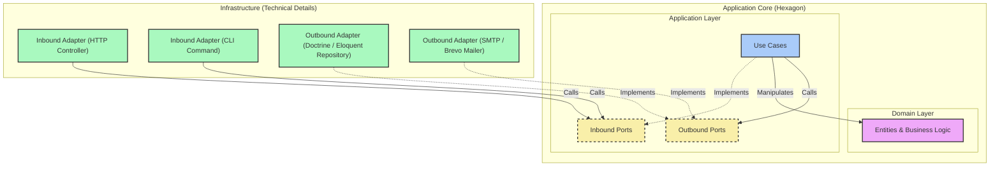

> [Version Française](/posts/hexagonal-architecture-fr)

> Slides: [SPA](https://slides.alexvolkihar.ovh/2026/hexagonal-architecture/) (French only)
>
> Made with <Slidev class="inline"/> [**Slidev**](https://github.com/slidevjs/slidev) - presentation slides for developers.

[[toc]]

Software architecture is often relegated to the background during the initial phases of a project. Delivery speed, the use of all-in-one frameworks, and rapid feature development are prioritized. However, as the application grows, maintenance costs soar, regressions multiply, and business code becomes inextricably coupled with technical details such as the database, third-party libraries, or the framework itself.

This is where **Hexagonal Architecture** (also known as *Ports & Adapters*) comes in. Theorized by Alistair Cockburn in 2005, it proposes structuring the application to isolate business logic from infrastructure details.

In this article, we will understand why traditional architecture is problematic, explore the concepts of hexagonal architecture in detail, and see how it resolves the limitations of classic coupled approaches.

---

## 1. The Starting Point – Coupled Code (Legacy Pain)

To understand the value of hexagonal architecture, let us analyze a typical legacy code example. Imagine a classic PHP controller managing user registration within a web application.

Here is the kind of code frequently found in many projects:

```php
<?php

namespace App\Http\Controllers;

use App\Models\User;
use Illuminate\Http\Request;
use PHPMailer\PHPMailer\PHPMailer;
use PHPMailer\PHPMailer\Exception;

class RegistrationController extends Controller
{
    public function register(Request $request)
    {
        // 1. Direct HTTP validation
        $request->validate([
            'username' => 'required|string|max:255|unique:users',
            'email' => 'required|email|max:255|unique:users',
            'password' => 'required|string|min:8',
        ]);

        // 2. Business logic + Persistence (coupled Eloquent ORM)
        $user = new User();
        $user->username = $request->input('username');
        $user->email = $request->input('email');
        $user->password = password_hash($request->input('password'), PASSWORD_BCRYPT);
        $user->save(); // Direct coupling to the MySQL database via Active Record

        // 3. Email Notification (direct sending via SMTP with PHPMailer)
        $mail = new PHPMailer(true);
        try {
            // Hardcoded SMTP configuration or direct environment variables
            $mail->isSMTP();
            $mail->Host       = env('MAIL_HOST', 'smtp.mailtrap.io');
            $mail->SMTPAuth   = true;
            $mail->Username   = env('MAIL_USERNAME');
            $mail->Password   = env('MAIL_PASSWORD');
            $mail->SMTPSecure = PHPMailer::ENCRYPTION_STARTTLS;
            $mail->Port       = env('MAIL_PORT', 587);

            $mail->setFrom('no-reply@notre-application.com', 'Mon App');
            $mail->addAddress($user->email, $user->username);

            $mail->isHTML(true);
            $mail->Subject = 'Bienvenue sur notre application !';
            $mail->Body    = "<h1>Bonjour {$user->username} !</h1><p>Merci de vous être inscrit.</p>";

            $mail->send();
        } catch (Exception $e) {
            // In case of email sending error, the HTTP response is compromised
            return response()->json(['error' => "Impossible d'envoyer l'email : {$mail->ErrorInfo}"], 500);
        }

        // 4. HTTP response
        return response()->json([
            'message' => 'Utilisateur créé avec succès !',
            'user' => [
                'id' => $user->id,
                'username' => $user->username,
                'email' => $user->email,
            ]
        ], 201);
    }
}
```

### Why is this code fragile and problematic?

At first glance, this controller works perfectly. It fulfills its role: it validates inputs, saves to the database, sends a welcome email, and returns a JSON response.

However, from an architectural standpoint, it is a ticking time bomb. Here is why:

#### 1. Flagrant violation of SOLID principles
- **SRP (Single Responsibility Principle)**: The `RegistrationController` class has far too many responsibilities. It handles HTTP serialization/deserialization, input validation, business logic implementation (password hashing), database access (Eloquent `save()`), email delivery (SMTP configuration and PHPMailer), and response formatting. If any of these steps change, we must modify this controller.
- **OCP (Open/Closed Principle)**: If tomorrow we want to switch from PHPMailer (SMTP) to a third-party API service like Mailgun, Brevo, or AWS SES, we have to open this class and modify its internal code. The same applies if we want to change the storage type (for example, calling an identity management microservice).
- **DIP (Dependency Inversion Principle)**: High-level logic (user registration) depends directly on low-level details: the Eloquent ORM for MySQL and the PHPMailer library for SMTP transport. The business code is a slave to the chosen technologies.

#### 2. Untestable Code
To test the user creation logic, you are forced to configure and run:
- A real database (or use complex Laravel mocks that intercept Eloquent queries).
- A real SMTP server or a tool like Mailtrap to intercept PHPMailer email delivery, or aggressively mock global PHPMailer objects.

It is impossible to test only the business logic in isolation in a pure unit test that runs in milliseconds. Tests become slow, fragile, and complex to write.

#### 3. Complete Framework Dependency (Vendor Lock-in)
The business code is intimately linked to Laravel (`Request` and `Response` classes, Eloquent ORM, helpers like `env()`). If tomorrow you decide to migrate your project to Symfony or move this specific logic to a CLI or an asynchronous script, you will have to rewrite almost all of the code because the business logic is welded to the framework.

---

## 2. What is Hexagonal Architecture? (Ports & Adapters)

The objective of Hexagonal Architecture is simple: **isolate the business code** from all these external constraints. The application should be considered a closed and autonomous system, the "Application Core", which communicates with the outside world only through well-defined contracts.

### The 4 Pillars of the Hexagon

In this architecture, we divide our project into several distinct layers, structured around the Domain and the Application:



#### 1. The Domain (Domain)
This is the core of the hexagon. It contains **Entities**, **Value Objects**, and **Domain Services**.
- It defines pure business logic (e.g., a user must have a valid email, their password must meet certain strength criteria, etc.).
- It has **no external dependencies**. It knows nothing of the framework, database, PHPMailer, or even the HTTP protocol. It is pure native PHP code (Plain Old PHP Objects - POPO).

#### 2. The Application (Use Cases)
This layer orchestrates the control flow. It contains the **Use Cases** (or application services).
- A Use Case represents a user or system action (e.g., `RegisterUser`).
- It retrieves requests from the outside world, coordinates Domain entities, and uses abstract interfaces (Ports) to interact with the outside (saving to a database, sending an email).

#### 3. The Ports
Ports are the boundaries of our hexagon. They are **interfaces** (in the PHP `interface` sense) that define how the application core interacts with the outside world. There are two types of ports:
- **Inbound Ports (Driving Ports)**: They define how the outside can trigger an action in the core. They are the entry point to our hexagon (e.g., a `RegisterUserInterface` interface).
- **Outbound Ports (Driven Ports)**: They define what the application core needs to accomplish its task, without specifying how it will be done (e.g., `UserRepositoryInterface` to store the user, `MailerInterface` to send the email).

#### 4. The Adapters (Adapters)
Adapters live outside the hexagon (in the Infrastructure layer). They represent the concrete implementation of our interactions with the outside world. They translate technical aspects into calls understandable by the ports, and vice versa:
- **Inbound Adapters (Driving Adapters)**: They take a stimulus from the outside world and convert it into a call to an Inbound Port. Examples: A Laravel HTTP controller, a Symfony CLI console command, a RabbitMQ message consumer.
- **Outbound Adapters (Driven Adapters)**: They implement the interfaces of the Outbound Ports to perform the technical action. Examples: `EloquentUserRepository` (which implements `UserRepositoryInterface`), `BrevoMailer` (which implements `MailerInterface`), or `InMemoryUserRepository` (used specifically for unit testing).

---

### The Secret: The Dependency Inversion Principle (DIP)

The fundamental turning point in understanding hexagonal architecture lies in using the **Dependency Inversion Principle**. 

In a traditional layered architecture, the upper layer depends on the lower layer:
`Controller -> Service -> Database (ORM)`

Here, the Infrastructure layer depends on the interfaces (Ports) defined inside the Application Core. Thus, **the execution flow and the direction of dependencies are decoupled**:
- **At runtime (Runtime)**: The HTTP controller calls the application (Use Case), which in turn calls the database adapter. The flow goes from left to right.
- **At compile time (Compile-time / Code)**: The database adapter (in the Infrastructure) depends on the `UserRepositoryInterface` interface (defined in the Application). The dependency points inward.

> [!IMPORTANT]
> It is dependency inversion that guarantees the protection of the business logic. The Domain and Application define the contracts they need. The Infrastructure complies by implementing them. The outside depends on the inside, never the other way around.

In this article, we will put these concepts into practice by refactoring our spaghetti controller into a clean, modular, and 100% testable architecture.

---

## 3. The Practice: The Core Application (Domain & Ports)

For this refactoring, we will structure our project to clearly separate each layer of our hexagon. Let's start with the core: the Domain and its boundaries (Ports).

### The Domain: Absolute Isolation of Business Logic

The Domain is the nerve center of our application. It contains only pure native PHP code (Plain Old PHP Objects), free from any dependency on a framework or database. It ensures that business rules and invariants are always respected.

#### 1. Business Exceptions (Invariants)

We start by defining specific exceptions that model functional errors related to business rules.

```php
<?php

namespace App\Domain\Exception;

class InvalidEmailException extends \DomainException
{
    public function __construct(string $email)
    {
        parent::__construct(sprintf('The email address "%s" is not valid.', $email));
    }
}
```

```php
<?php

namespace App\Domain\Exception;

class WeakPasswordException extends \DomainException
{
    public function __construct()
    {
        parent::__construct('The password is too weak. It must contain at least 8 characters.');
    }
}
```

#### 2. The `User` Domain Entity

This entity encapsulates the invariants of our user concept: validation of email validity, password strength, and secure password hashing.

```php
<?php

namespace App\Domain\Entity;

use App\Domain\Exception\InvalidEmailException;
use App\Domain\Exception\WeakPasswordException;

class User
{
    private string $id;
    private string $username;
    private string $email;
    private string $passwordHash;

    public function __construct(
        string $id,
        string $username,
        string $email,
        string $plainPassword
    ) {
        $this->id = $id;

        if (empty(trim($username))) {
            throw new \DomainException("Username cannot be empty.");
        }
        $this->username = $username;

        $this->setEmail($email);
        $this->setPassword($plainPassword);
    }

    public function getId(): string
    {
        return $this->id;
    }

    public function getUsername(): string
    {
        return $this->username;
    }

    public function getEmail(): string
    {
        return $this->email;
    }

    public function getPasswordHash(): string
    {
        return $this->passwordHash;
    }

    private function setEmail(string $email): void
    {
        if (!filter_var($email, FILTER_VALIDATE_EMAIL)) {
            throw new InvalidEmailException($email);
        }
        $this->email = $email;
    }

    private function setPassword(string $plainPassword): void
    {
        if (strlen($plainPassword) < 8) {
            throw new WeakPasswordException();
        }
        
        // Password hashing is an essential business security rule.
        $this->passwordHash = password_hash($plainPassword, PASSWORD_BCRYPT);
    }
}
```

---

### The Ports: Defining the Boundaries

Ports are the contracts (interfaces) defining how the Hexagon communicates with the outside world. The Domain or Use Cases declare these needs, without knowing how they will be implemented.

#### 1. The Repository Port: `UserRepositoryInterface` (Outbound Port)

This port defines the needs of our hexagon for user persistence and retrieval.

```php
<?php

namespace App\Domain\Repository;

use App\Domain\Entity\User;

interface UserRepositoryInterface
{
    public function save(User $user): void;
    public function findByEmail(string $email): ?User;
    public function existsByUsername(string $username): bool;
}
```

#### 2. The Notification Port: `MailerInterface` (Outbound Port)

This port defines the ability to notify the user upon registration.

```php
<?php

namespace App\Domain\Gateway;

use App\Domain\Entity\User;

interface MailerInterface
{
    public function sendWelcomeEmail(User $user): void;
}
```

---

## 4. The Application Layer (Use Cases & DTOs)

The Application layer coordinates the execution of use cases. It depends solely on the Domain and interfaces (Ports).

### Data Transfer Objects (DTO)

DTOs allow data to flow in a structured and immutable way without coupling the application to HTTP requests or framework native types.

#### 1. The Request DTO: `RegisterUserRequest`

```php
<?php

namespace App\Application\DTO;

readonly class RegisterUserRequest
{
    public function __construct(
        public string $username,
        public string $email,
        public string $password
    ) {}
}
```

#### 2. The Response DTO: `RegisterUserResponse`

```php
<?php

namespace App\Application\DTO;

use App\Domain\Entity\User;

readonly class RegisterUserResponse
{
    public function __construct(
        public string $id,
        public string $username,
        public string $email
    ) {}

    public static function fromEntity(User $user): self
    {
        return new self(
            $user->getId(),
            $user->getUsername(),
            $user->getEmail()
        );
    }
}
```

### The Application Service (Use Case): `RegisterUser`

Here is the class that orchestrates user creation. Notice the dependency injection via the constructor of the `UserRepositoryInterface` and `MailerInterface` ports.

```php
<?php

namespace App\Application\UseCase;

use App\Application\DTO\RegisterUserRequest;
use App\Application\DTO\RegisterUserResponse;
use App\Domain\Entity\User;
use App\Domain\Repository\UserRepositoryInterface;
use App\Domain\Gateway\MailerInterface;

class RegisterUser
{
    public function __construct(
        private UserRepositoryInterface $userRepository,
        private MailerInterface $mailer
    ) {}

    public function execute(RegisterUserRequest $request): RegisterUserResponse
    {
        // 1. Validation of uniqueness rules (requiring the UserRepository port)
        if ($this->userRepository->existsByUsername($request->username)) {
            throw new \DomainException("This username is already taken.");
        }

        if ($this->userRepository->findByEmail($request->email) !== null) {
            throw new \DomainException("This email address is already registered.");
        }

        // 2. Generation of a unique identifier (UUID-like)
        $id = bin2hex(random_bytes(16));

        // 3. Creation of the Domain entity (implicitly validating invariants)
        $user = new User(
            $id,
            $request->username,
            $request->email,
            $request->password
        );

        // 4. Persistence via the Port
        $this->userRepository->save($user);

        // 5. Sending the welcome email via the Port
        $this->mailer->sendWelcomeEmail($user);

        // 6. Return of the response DTO
        return RegisterUserResponse::fromEntity($user);
    }
}
```

> [!NOTE]
> **Transactional safety and side effects:** In this simplified example, the email is sent immediately after saving to the database. In production, if email delivery fails (SMTP server down), the use case will fail and throw an error, even though the user might have already been registered in the database. To guarantee transactional consistency, developers generally use **Domain Events** combined with the **Outbox** pattern to delegate email sending asynchronously and reliably.

---

## 5. The Infrastructure Layer (Adapters)

Infrastructure contains the concrete implementations of our interfaces (outbound adapters) as well as the triggering mechanisms (inbound adapters).

### Outbound Adapters

These classes implement outbound ports by handling specific technical details (SQL, SMTP).

#### 1. SQL Persistence: `SqlUserRepository` (via PDO)

```php
<?php

namespace App\Infrastructure\Adapter\Persistence;

use App\Domain\Entity\User;
use App\Domain\Repository\UserRepositoryInterface;
use PDO;

class SqlUserRepository implements UserRepositoryInterface
{
    public function __construct(private PDO $pdo)
    {}

    public function save(User $user): void
    {
        $stmt = $this->pdo->prepare('
            INSERT INTO users (id, username, email, password_hash)
            VALUES (:id, :username, :email, :password_hash)
        ');

        $stmt->execute([
            'id' => $user->getId(),
            'username' => $user->getUsername(),
            'email' => $user->getEmail(),
            'password_hash' => $user->getPasswordHash(),
        ]);
    }

    public function findByEmail(string $email): ?User
    {
        $stmt = $this->pdo->prepare('SELECT * FROM users WHERE email = :email LIMIT 1');
        $stmt->execute(['email' => $email]);
        $row = $stmt->fetch(PDO::FETCH_ASSOC);

        if (!$row) {
            return null;
        }

        return $this->reconstituteEntity($row);
    }

    public function existsByUsername(string $username): bool
    {
        $stmt = $this->pdo->prepare('SELECT COUNT(*) FROM users WHERE username = :username');
        $stmt->execute(['username' => $username]);
        return (int) $stmt->fetchColumn() > 0;
    }

    /**
     * Reconstitutes a User entity from database data.
     * This method bypasses password hashing and validation of the plain password.
     */
    private function reconstituteEntity(array $row): User
    {
        $reflection = new \ReflectionClass(User::class);
        $user = $reflection->newInstanceWithoutConstructor();

        $properties = [
            'id' => $row['id'],
            'username' => $row['username'],
            'email' => $row['email'],
            'passwordHash' => $row['password_hash'],
        ];

        foreach ($properties as $name => $value) {
            $property = $reflection->getProperty($name);
            $property->setAccessible(true);
            $property->setValue($user, $value);
        }

        return $user;
    }
}
```

#### 2. Email Delivery: `SmtpMailer` (via Symfony Mailer)

```php
<?php

namespace App\Infrastructure\Adapter\Mailer;

use App\Domain\Entity\User;
use App\Domain\Gateway\MailerInterface;
use Symfony\Component\Mailer\MailerInterface as SymfonyMailerInterface;
use Symfony\Component\Mime\Email;

class SmtpMailer implements MailerInterface
{
    public function __construct(private SymfonyMailerInterface $symfonyMailer)
    {}

    public function sendWelcomeEmail(User $user): void
    {
        $email = (new Email())
            ->from('no-reply@our-application.com')
            ->to($user->getEmail())
            ->subject('Welcome to our application!')
            ->html(sprintf(
                '<h1>Hello %s!</h1><p>Thank you for registering.</p>',
                htmlspecialchars($user->getUsername(), ENT_QUOTES, 'UTF-8')
            ));

        $this->symfonyMailer->send($email);
    }
}
```

---

### Inbound Adapters

These classes capture an external stimulus, validate the request format, and invoke our use case.

#### 1. The HTTP Controller: `RegisterUserController`

This controller receives an HTTP request, decodes it, instantiates the DTO, and starts execution. In case of a `DomainException`, it returns a `422 Unprocessable Entity` error with the appropriate message.

```php
<?php

namespace App\Infrastructure\Adapter\Http;

use App\Application\DTO\RegisterUserRequest;
use App\Application\UseCase\RegisterUser;
use Nyholm\Psr7\Response;
use Psr\Http\Message\ResponseInterface;
use Psr\Http\Message\ServerRequestInterface;

class RegisterUserController
{
    public function __construct(private RegisterUser $registerUserUseCase)
    {}

    public function __invoke(ServerRequestInterface $request): ResponseInterface
    {
        $body = json_decode((string) $request->getBody(), true) ?? [];

        // 1. HTTP request validation
        if (empty($body['username']) || empty($body['email']) || empty($body['password'])) {
            return new Response(400, ['Content-Type' => 'application/json'], json_encode([
                'error' => 'The username, email, and password fields are required.'
            ]));
        }

        try {
            // 2. DTO creation
            $useCaseRequest = new RegisterUserRequest(
                username: $body['username'],
                email: $body['email'],
                password: $body['password']
            );

            // 3. Calling the use case
            $response = $this->registerUserUseCase->execute($useCaseRequest);

            // 4. Success response
            return new Response(201, ['Content-Type' => 'application/json'], json_encode([
                'message' => 'User created successfully!',
                'user' => [
                    'id' => $response->id,
                    'username' => $response->username,
                    'email' => $response->email,
                ]
            ]));
        } catch (\DomainException $e) {
            // Domain exceptions are translated into HTTP status code 422
            return new Response(422, ['Content-Type' => 'application/json'], json_encode([
                'error' => $e->getMessage()
            ]));
        } catch (\Throwable $e) {
            // Unforeseen technical exceptions are hidden (HTTP 500)
            return new Response(500, ['Content-Type' => 'application/json'], json_encode([
                'error' => 'An internal error occurred.'
            ]));
        }
    }
}
```

#### 2. The CLI Console Command: `RegisterUserCommand`

We can easily plug a second input channel (the CLI) into the same application scenario. The business code remains completely unchanged, demonstrating the flexibility of our decoupling.

```php
<?php

namespace App\Infrastructure\Adapter\Cli;

use App\Application\DTO\RegisterUserRequest;
use App\Application\UseCase\RegisterUser;
use Symfony\Component\Console\Attribute\AsCommand;
use Symfony\Component\Console\Command\Command;
use Symfony\Component\Console\Input\InputArgument;
use Symfony\Component\Console\Input\InputInterface;
use Symfony\Component\Console\Output\OutputInterface;
use Symfony\Component\Console\Style\SymfonyStyle;

#[AsCommand(name: 'app:register-user', description: 'Registers a new user.')]
class RegisterUserCommand extends Command
{
    public function __construct(private RegisterUser $registerUserUseCase)
    {
        parent::__construct();
    }

    protected function configure(): void
    {
        $this
            ->addArgument('username', InputArgument::REQUIRED, 'The username')
            ->addArgument('email', InputArgument::REQUIRED, 'The email address')
            ->addArgument('password', InputArgument::REQUIRED, 'The password');
    }

    protected function execute(InputInterface $input, OutputInterface $output): int
    {
        $io = new SymfonyStyle($input, $output);

        $username = $input->getArgument('username');
        $email = $input->getArgument('email');
        $password = $input->getArgument('password');

        try {
            $useCaseRequest = new RegisterUserRequest($username, $email, $password);
            $response = $this->registerUserUseCase->execute($useCaseRequest);

            $io->success(sprintf(
                'User created successfully! ID: %s, Name: %s, Email: %s',
                $response->id,
                $response->username,
                $response->email
            ));

            return Command::SUCCESS;
        } catch (\DomainException $e) {
            $io->error($e->getMessage());
            return Command::FAILURE;
        } catch (\Throwable $e) {
            $io->error('An unexpected error occurred: ' . $e->getMessage());
            return Command::INVALID;
        }
    }
}
```

---

## 6. Putting It Into Practice: Folder Structure and Wiring

To implement hexagonal architecture in a concrete project, it is crucial to define a clear directory structure and teach the Dependency Injection (DI) container how to bind our ports (interfaces) to our adapters (concrete implementations).

### Folder Structure (Directory Tree)

Here is the recommended folder structure to organize our hexagon's layers within the `src/` directory of a modern PHP application:

```text
src/
├── Domain/
│   ├── Entity/
│   │   └── User.php
│   ├── ValueObject/
│   │   └── Email.php (optional)
│   ├── Exception/
│   │   ├── InvalidEmailException.php
│   │   └── WeakPasswordException.php
│   ├── Repository/         <-- Outbound Ports (Driven Ports)
│   │   └── UserRepositoryInterface.php
│   └── Gateway/            <-- Outbound Ports for third-party services
│       └── MailerInterface.php
├── Application/
│   ├── UseCase/            <-- Hexagon Use Cases
│   │   └── RegisterUser.php
│   └── DTO/                <-- Data Transfer Objects
│       ├── RegisterUserRequest.php
│       └── RegisterUserResponse.php
└── Infrastructure/
    ├── Adapter/            <-- Concrete Adapters
    │   ├── Http/           <-- Inbound (Driving): Controllers
    │   │   └── RegisterUserController.php
    │   ├── Cli/            <-- Inbound (Driving): Console Commands
    │   │   └── RegisterUserCommand.php
    │   ├── Persistence/    <-- Outbound (Driven): ORM, SQL, In-Memory
    │   │   ├── SqlUserRepository.php
    │   │   └── InMemoryUserRepository.php
    │   └── Mailer/         <-- Outbound (Driven): SMTP, Brevo, etc.
    │       └── SmtpMailer.php
    └── Share/              <-- Shared code and cross-cutting utilities
```

This structure guarantees immediate visual and physical separation. A developer opening the project can immediately distinguish business rules (the Domain) from flow orchestration (the Application) and technological implementation details (the Infrastructure).

### Dependency Wiring

The core of the application (the hexagon) is not allowed to directly instantiate Infrastructure classes. It depends on interfaces. It is the role of the framework and its Dependency Injection (DI) container to resolve these abstractions at runtime.

Here is how to configure this wiring in the two most popular PHP frameworks.

#### Option A: Configuration in Symfony (`services.yaml`)

In Symfony, the autowiring system automatically handles most injections if the class name matches the expected type. To inject a specific adapter when an interface is requested, we configure explicit bindings in `config/services.yaml`:

```yaml
# config/services.yaml
services:
    # Default configuration
    _defaults:
        autowire: true      # Enables automatic injection
        autoconfigure: true # Automatically registers CLI commands, controllers, etc.

    # Make our application core and adapters available
    App\:
        resource: '../src/'
        exclude:
            - '../src/Domain/Entity/'
            - '../src/Domain/ValueObject/'
            - '../src/Domain/Exception/'
            - '../src/Application/DTO/'

    # Explicit binding of ports (interfaces) to adapters (implementations)
    App\Domain\Repository\UserRepositoryInterface:
        class: App\Infrastructure\Adapter\Persistence\SqlUserRepository

    App\Domain\Gateway\MailerInterface:
        class: App\Infrastructure\Adapter\Mailer\SmtpMailer
```

#### Option B: Configuration in Laravel (`AppServiceProvider`)

In Laravel, binding interfaces to implementations is done directly in PHP via Service Providers, typically in the `register` method of `AppServiceProvider`:

```php
<?php

namespace App\Providers;

use Illuminate\Support\ServiceProvider;
use App\Domain\Repository\UserRepositoryInterface;
use App\Infrastructure\Adapter\Persistence\SqlUserRepository;
use App\Domain\Gateway\MailerInterface;
use App\Infrastructure\Adapter\Mailer\SmtpMailer;

class AppServiceProvider extends ServiceProvider
{
    /**
     * Register bindings in the container.
     */
    public function register(): void
    {
        // Bind interfaces (Ports) to concrete classes (Adapters)
        $this->app->bind(UserRepositoryInterface::class, SqlUserRepository::class);
        $this->app->bind(MailerInterface::class, SmtpMailer::class);
    }
}
```

---

## 7. Mastering Hexagonal Architecture (Advanced Concepts)

Once the foundations are laid, hexagonal architecture unleashes its full potential through advanced practices that maximize code quality, reduce test execution time, and guarantee the integrity of the architecture over the long term.

### The Ultimate Testing Strategy

One of the greatest advantages of decoupling the business core from the infrastructure is the ability to test use cases (Use Cases) in a purely unit fashion, without any network, filesystem, or database dependencies.

Rather than using complex mocking tools (which make tests verbose and fragile in the face of internal refactorings), we can implement an in-memory version of our ports.

#### 1. The In-Memory Implementation: `InMemoryUserRepository`

This test adapter keeps entities in memory in a simple PHP array. It faithfully reproduces database behavior without suffering from its slowness or configuration constraints.

```php
<?php

namespace App\Infrastructure\Adapter\Persistence;

use App\Domain\Entity\User;
use App\Domain\Repository\UserRepositoryInterface;

class InMemoryUserRepository implements UserRepositoryInterface
{
    /**
     * @var array<string, User>
     */
    private array $users = [];

    public function save(User $user): void
    {
        $this->users[$user->getId()] = $user;
    }

    public function findByEmail(string $email): ?User
    {
        foreach ($this->users as $user) {
            if ($user->getEmail() === $email) {
                return $user;
            }
        }
        return null;
    }

    public function existsByUsername(string $username): bool
    {
        foreach ($this->users as $user) {
            if ($user->getUsername() === $username) {
                return true;
            }
        }
        return false;
    }
}
```

For the mailer, we can do the same by creating an `InMemoryMailer` that records the sent notifications for later verification:

```php
<?php

namespace App\Infrastructure\Adapter\Mailer;

use App\Domain\Entity\User;
use App\Domain\Gateway\MailerInterface;

class InMemoryMailer implements MailerInterface
{
    /**
     * @var array<int, User>
     */
    private array $sentEmails = [];

    public function sendWelcomeEmail(User $user): void
    {
        $this->sentEmails[] = $user;
    }

    public function hasSentWelcomeEmailTo(string $email): bool
    {
        foreach ($this->sentEmails as $user) {
            if ($user->getEmail() === $email) {
                return true;
            }
        }
        return false;
    }
}
```

#### 2. The PHPUnit Test: `RegisterUserTest`

We can now write a pure unit test. It runs in a fraction of a millisecond, requires no test database, and will never throw an error in case of an unavailable SMTP server.

```php
<?php

namespace App\Tests\Application\UseCase;

use App\Application\DTO\RegisterUserRequest;
use App\Application\UseCase\RegisterUser;
use App\Domain\Exception\InvalidEmailException;
use App\Infrastructure\Adapter\Persistence\InMemoryUserRepository;
use App\Infrastructure\Adapter\Mailer\InMemoryMailer;
use PHPUnit\Framework\TestCase;

class RegisterUserTest extends TestCase
{
    private InMemoryUserRepository $userRepository;
    private InMemoryMailer $mailer;
    private RegisterUser $useCase;

    protected function setUp(): void
    {
        $this->userRepository = new InMemoryUserRepository();
        $this->mailer = new InMemoryMailer();
        
        // Direct instantiation of the use case with our in-memory adapters
        $this->useCase = new RegisterUser($this->userRepository, $this->mailer);
    }

    public function testUserRegistrationSuccess(): void
    {
        // Given
        $request = new RegisterUserRequest(
            username: 'alexdev',
            email: 'alex@example.com',
            password: 'SuperSecurePassword123'
        );

        // When
        $response = $this->useCase->execute($request);

        // Then
        $this->assertNotEmpty($response->id);
        $this->assertEquals('alexdev', $response->username);
        $this->assertEquals('alex@example.com', $response->email);

        // Verification of persistence in memory
        $savedUser = $this->userRepository->findByEmail('alex@example.com');
        $this->assertNotNull($savedUser);
        $this->assertEquals('alexdev', $savedUser->getUsername());

        // Verification of email delivery
        $this->assertTrue($this->mailer->hasSentWelcomeEmailTo('alex@example.com'));
    }

    public function testRegistrationFailsWithInvalidEmail(): void
    {
        // Given
        $request = new RegisterUserRequest(
            username: 'alexdev',
            email: 'invalid-email',
            password: 'SuperSecurePassword123'
        );

        // Then
        $this->expectException(InvalidEmailException::class);

        // When
        $this->useCase->execute($request);
    }

    public function testRegistrationFailsWithDuplicateEmail(): void
    {
        // Given - Registration of an existing user with this email
        $existingUser = new \App\Domain\Entity\User(
            'existing-uuid',
            'johndoe',
            'john@example.com',
            'Password12345'
        );
        $this->userRepository->save($existingUser);

        // Registration request with the same email
        $request = new RegisterUserRequest(
            username: 'newuser',
            email: 'john@example.com',
            password: 'SuperSecurePassword123'
        );

        // Then - Expecting double email exception
        $this->expectException(\DomainException::class);
        $this->expectExceptionMessage("This email address is already registered.");

        // When
        $this->useCase->execute($request);
    }
}
```

> [!TIP]
> **Execution speed:** These tests run in less than 2 milliseconds each. In a large project containing hundreds of business rules, you can run thousands of unit tests in less than 3 seconds, encouraging an ultra-fast feedback loop and the confident adoption of TDD (Test-Driven Development) without the constraints of a database.

---

### Controlling Architecture with Deptrac

Hexagonal architecture relies on an absolute rule: **internal layers must never depend on external layers**. However, faced with delivery pressures and inattention, a developer can easily introduce a forbidden import (for example, importing an HTTP controller or a Doctrine class directly into the Domain).

To prevent these drifts, we use a static dependency analysis tool called **Deptrac**. It allows defining strict architectural rules and failing the CI in case of violation.

Here is an example of a `deptrac.yaml` file for our structure:

```yaml
# deptrac.yaml
deptrac:
  paths:
    - src/
  layers:
    - name: Domain
      collectors:
        - type: directory
          value: src/Domain/.*
    - name: Application
      collectors:
        - type: directory
          value: src/Application/.*
    - name: Infrastructure
      collectors:
        - type: directory
          value: src/Infrastructure/.*
  ruleset:
    Domain:
      # The Domain is completely isolated: it depends on nothing else
      - ~
    Application:
      # The Application can only depend on the Domain
      - Domain
    Infrastructure:
      # The Infrastructure can depend on the Application and the Domain
      - Application
      - Domain
```

By running the `vendor/bin/deptrac` command, the tool scans all your code and raises a blocking error if a dependency points in the wrong direction.

---

### Connections to Domain-Driven Design (DDD) and CQRS

Hexagonal Architecture is often associated with other architectural approaches and software methodologies:

#### 1. Domain-Driven Design (DDD)
Although hexagonal architecture can be used without DDD, it is its ideal receptacle. DDD emphasizes the rigorous modeling of business logic. The hexagon provides the protective technical setting for this modeling. The DDD concepts of **Entities**, **Value Objects**, **Aggregates**, and **Domain Services** integrate naturally inside the Domain of the hexagon, while DDD **Repositories** correspond exactly to outbound ports.

#### 2. CQRS (Command Query Responsibility Segregation)
The CQRS pattern separates read (Queries) and write (Commands) operations to optimize performance and code clarity. 
In a hexagon:
- **The write path (Command)** goes through the Application Use Cases, manipulates Domain entities, and persists state via persistence ports.
- **The read path (Query)** can sometimes pragmatically bypass the hexagon. Since reading does not execute complex business rules but merely projects data, an inbound adapter (e.g., controller) can call an optimized query service to directly obtain view DTOs in a single high-performance SQL query, thus avoiding the cost of reconstructing complex business entities.

---

### Trade-offs: When to adopt it and when to avoid it

There is no silver bullet in software architecture. Hexagonal architecture brings great benefits but also introduces undeniable accidental complexity.

#### Advantages
* **Maximum testability**: Ultra-fast unit tests without side effects.
* **Technological independence**: Ease of updating or replacing infrastructure (framework, database, third-party services).
* **Protected business code**: Absolute clarity of business logic, cleaned of technical details.
* **Work parallelization**: One team can work on the Use Cases while another develops the concrete Infrastructure adapters.

#### Disadvantages
* **Verbosity and file overhead**: Proliferation of classes, interfaces, DTOs, and mappings.
* **Learning curve**: Requires a good understanding of dependency inversion and layer separation.
* **Cost of indirection**: Navigating the code requires going through interfaces before reaching concrete implementations.

#### When to use it?
* Medium to large projects with rich, complex, and evolving business logic.
* Applications designed to last for several years (where the framework or databases will likely change versions or technology).
* Systems requiring extensive automated testing strategies.

#### When to avoid it?
* **Pure CRUD applications**: If your application only reads and writes to a database without applying complex business rules, hexagonal architecture will be an unnecessary over-engineering. Use a classic framework with its native ORM (e.g., active Laravel Eloquent).
* **Ultra-specialized microservices**: For a small microservice of a few endpoints that acts as a technical gateway or simple proxy.
* **Prototypes and disposable MVPs**: Prioritize time-to-market speed with direct coupling, with the option to refactor into a hexagon once the business model is validated.

---

## Conclusion

By isolating the core of the application (Domain and Use Cases) from technical details via interfaces (Ports), we have achieved:
1. **Highly testable code**: We can now write extremely fast unit tests by providing an ultra-simple `InMemoryUserRepository` implementation, without having to configure mocks or real databases.
2. **Technological independence**: Changing the ORM (Eloquent to Doctrine) or email service (SMTP to Mailgun) requires no changes to the business code in `RegisterUser` or `User`. Only new adapters need to be written in the Infrastructure layer.
3. **Increased flexibility**: HTTP and CLI share exactly the same application use case.

Hexagonal Architecture requires more files and greater decoupling rigor at the start, but it guarantees the durability of your business logic in the face of obsolescence and changing technological infrastructures.
